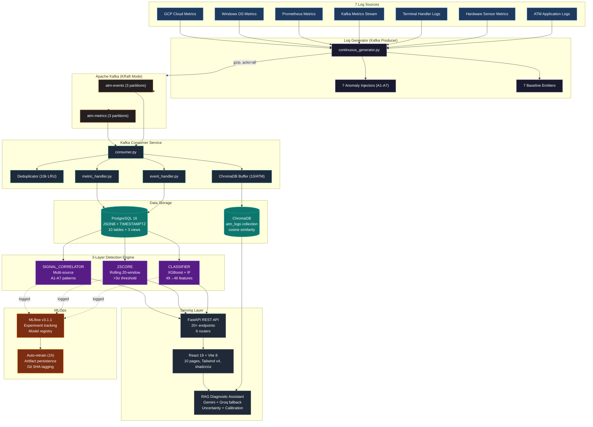
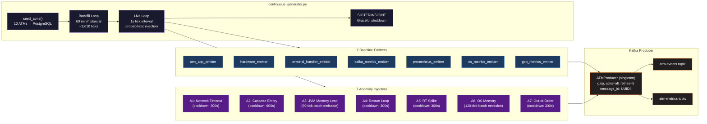
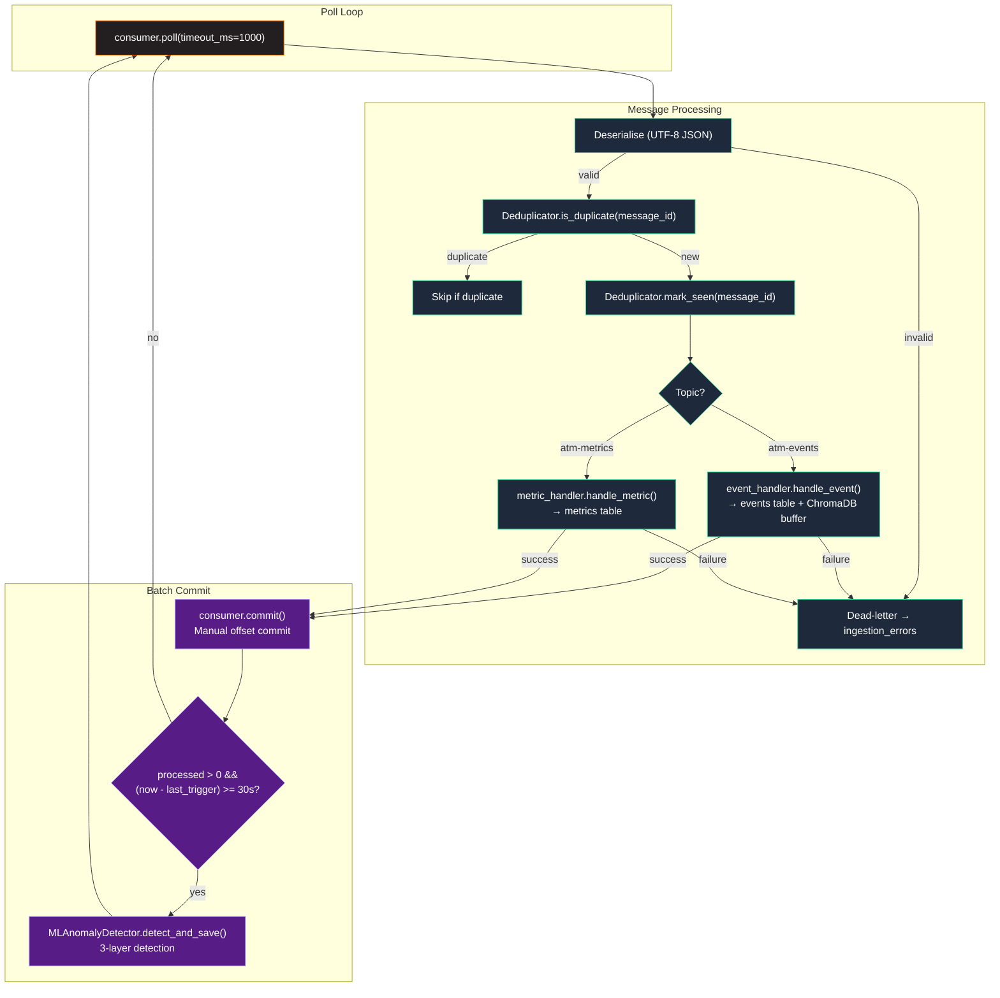
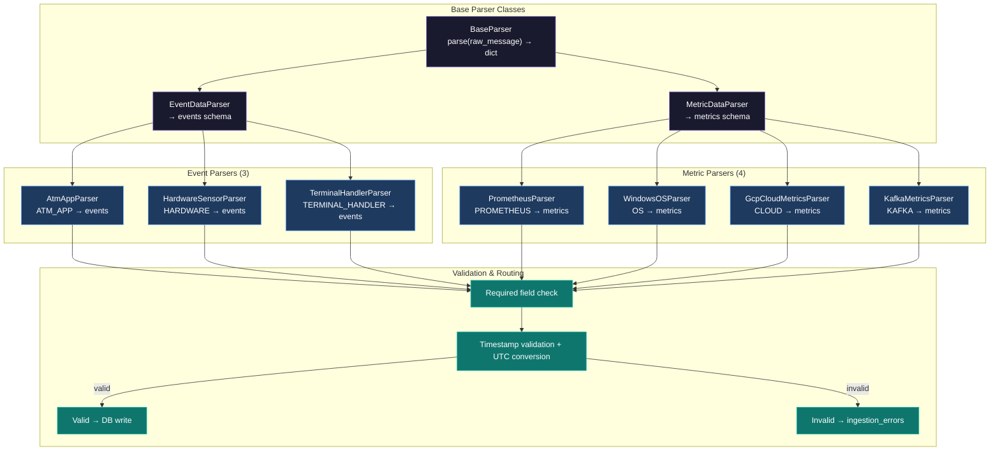
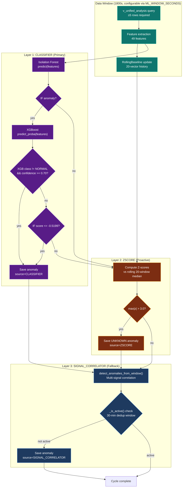
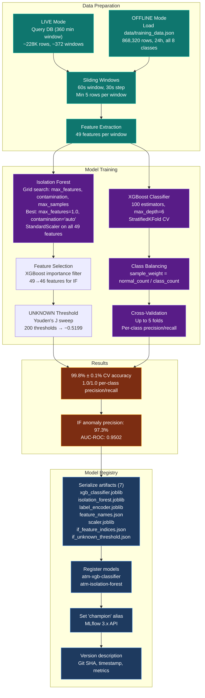
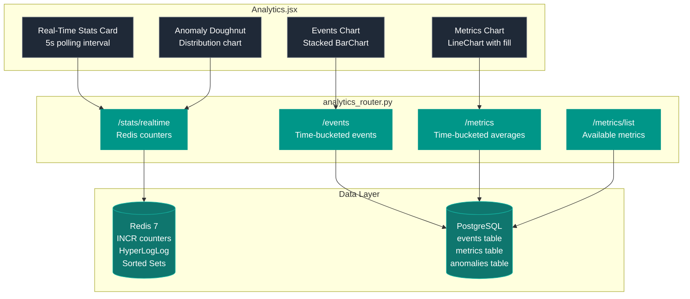
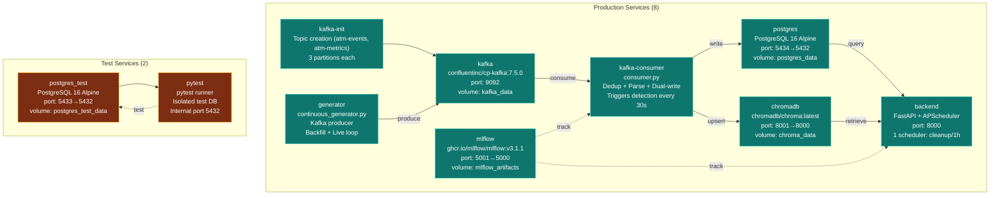

# ATM Log Aggregation, Analysis & Diagnostics Platform (LAAD)

> Production-grade ATM log aggregation, anomaly detection, and AI-assisted diagnostics platform — built for NCR Atleos as a 7-person Agile industry project. Ingests synthetic logs from 7 sources via Apache Kafka, detects 7 anomaly types across 3 detection layers (ML + statistical + heuristic), ranks by weighted criticality, and serves a React dashboard with root cause analysis, operational impact, and recommended remediation. Extended with an **Agentic RAG** diagnostic assistant featuring cross-encoder reranking, self-consistency scoring, reflexion (self-critique), citation grounding, and multi-signal confidence fusion.

<p align="center">
  
  
  
  
  
  
  
  
  
  
  
  
  
</p>

---

## Key Metrics at a Glance

| Metric | Value |
|---|---|
| **Log Sources** | 7 simultaneous sources (ATM_APP, HARDWARE, TERMINAL_HANDLER, KAFKA, PROMETHEUS, OS, CLOUD) |
| **ATMs Monitored** | 10 ATMs + 3 Servers (`ATM-GB-0001`–`ATM-GB-0010` + `ATM-SERVER-001`–`ATM-SERVER-003`) |
| **Anomaly Types** | 7 known (A1–A7) + UNKNOWN (novel pattern detection) |
| **Detection Layers** | 3 (CLASSIFIER → ZSCORE → SIGNAL_CORRELATOR) |
| **ML Features** | 49 engineered features across 7 groups (46 selected for IF via XGBoost importance) |
| **Isolation Forest Precision** | **97.3%** (grid search + feature selection, 46 of 49 features, AUC-ROC=0.9502) |
| **XGBoost CV Accuracy** | **99.8% ± 0.1%** (StratifiedKFold, 8 classes) |
| **IF UNKNOWN Threshold** | **−0.5199** (Youden's J calibration, F1=0.7008) |
| **ML Artifacts** | 7 artifacts: xgb, if, scaler, encoder, feature names, feature indices, threshold |
| **Kafka Topics** | 2 (`atm-events`, `atm-metrics`), 3 partitions each, gzip compression |
| **Messages Processed** | 930,000+ events, 100+ messages/sec live |
| **Database Tables** | 10 tables + 3 views + 13 indexes |
| **Connection Pool** | ThreadedConnectionPool (minconn=5, maxconn=50) with exponential backoff |
| **API Endpoints** | 31+ across 8 routers (auth, anomalies, analysis, admin, analytics, events, metrics, RAG) |
| **Anomaly List Limit** | No limit (unlimited: returns all matching anomalies) |
| **Test Coverage** | 407+ tests across 52 files, 10 tiers, isolated test DB |
| **Docker Services** | 8 production + 2 test-only services |
| **Redis Patterns** | 8 (sorted sets, sets, Pub/Sub, streams, HyperLogLog, distributed locks, caching, blacklists) |
| **RAG Confidence** | Multi-signal fusion: retrieval (30%) + self-consistency (25%) + verbalized (25%) + grounding (20%) |
| **RAG Response Time** | <15s (uncached with agentic), <100ms (cached) |
| **Calibration** | Platt scaling, ECE < 0.10 target, 20-sample minimum |
| **MLflow Tracking** | All training runs + inference cycles logged, 2 registered models with "champion" alias |
| **Frontend Pages** | 11 pages (React 19 + Vite 8 + Tailwind v4 + shadcn/ui + Chart.js) with configurable time-range filtering and "All Time" analytics |
| **Model Training** | Manual training via `make train` (generates dataset + retrains offline) |

---

## Demonstration

**[→ Project Report](https://github.com/AhmedIkram05/laad/docs/README.md/docs/Project%20Report.pdf)**

---

### Main dashboard — anomalies ranked by weighted criticality score, severity badges, and ATM status indicators


### Anomaly detail — root cause explanation, operational impact assessment, and recommended remediation action


### Admin settings — configurable data retention period (1–365 days) and user management


### RAG diagnostic assistant — AI-powered diagnostics with uncertainty quantification


---

## Problem & Solution

**The problem:** Modern ATM networks generate large volumes of operational data across multiple channels — hardware sensors, OS metrics, Kafka event streams, application logs. Banks possess this data but lack the pipeline to turn it into actionable intelligence. Operational teams manually scan logs for anomalies, engineers spend hours finding root causes, and hardware failures go undetected until ATMs go offline.

**The solution:** LAAD ingests, normalises, and analyses logs from 7 sources simultaneously, applies a 3-layer detection engine across 7 defined anomaly types (A1–A7) plus novel pattern detection (UNKNOWN), ranks issues by a weighted criticality algorithm, and presents each anomaly with a structured root cause explanation, operational impact, and recommended remediation action — no manual log analysis required. An AI-powered RAG diagnostic assistant provides natural-language troubleshooting with uncertainty quantification and confidence calibration.

---

## Architecture Overview



**Pipeline flow:** 7 log sources → continuous generator (Kafka producer) → Apache Kafka (KRaft, 2 topics, 6 partitions total, gzip) → kafka-consumer service (deduplication, parsing, dual-write to PostgreSQL + ChromaDB) → 3-layer detection engine → FastAPI REST API → React dashboard + RAG diagnostic assistant. MLOps layer tracks all training runs and inference cycles via MLflow.

---

## Log Generation

The continuous generator (`backend/generator/continuous_generator.py`) is a pure Kafka producer that simulates real-time ATM operations across a fleet of 10 ATMs. It replaced the original single-script direct-DB writer with a production-grade event-driven architecture.

### Configuration

| Parameter | Default | Description |
|---|---|---|
| `TICK_SECONDS` | 1 | Interval between emission cycles |
| `ANOMALY_PROB` | 0.02 (2%) | Live anomaly injection probability |
| `BACKFILL_ANOMALY_PROB` | 0.01 (1%) | Backfill anomaly probability |
| `ATMS` | 10 | `ATM-GB-0001` through `ATM-GB-0010` |
| `SERVERS` | 3 | `ATM-SERVER-001` through `ATM-SERVER-003` |
| `ALL_ENTITIES` | 13 | Combined list of ATMs + Servers |
| `ATM_LOCATIONS` | 10 | `LOC-001` through `LOC-010` |
| `POD_NAME` | `terminal-handler-pod-0` | Kubernetes pod identifier |
| `OS_VERSION` | `Windows-Server-2019` | Simulated OS version |

### Architecture



### Key Design Decisions

- **Pure Kafka producer:** No direct database writes. The generator only produces to Kafka topics. This decouples data generation from ingestion — if the consumer falls behind, data is safely buffered in Kafka (7-day retention).
- **Batch anomaly emission:** A3 (JVM Memory Leak) and A6 (OS Memory Pressure) emit all their historical ticks in a single call with timestamps spread over the past 90/120 minutes respectively. This ensures the full progressive degradation pattern is immediately available for detection rather than requiring multiple generator cycles to accumulate.
- **Anomaly cooldowns:** Each anomaly type has a cooldown period (300s–600s) to prevent overlapping injections that would corrupt detection signals.
- **Server entity support:** A3 (JVM Memory Leak), A4 (Container Restart Loop), and A6 (OS Memory Pressure) can target server entities (`ATM-SERVER-001`–`ATM-SERVER-003`) with 40% probability. A1, A2, A5, A7 remain ATM-only. Server entity IDs use the `ATM-SERVER-*` prefix for backward compatibility with frontend fallback logic.
- **Backfill mode:** On startup, generates historical data based on `BACKFILL_MINUTES` (default: 0 for production). When enabled, anomaly probability is halved during backfill (0.01 vs 0.02) to avoid flooding the initial window.
- **Graceful shutdown:** Handles SIGTERM/SIGINT with producer flush before exit, ensuring no in-flight messages are lost.

### Anomaly Injector Details

| Injector | Type | Mechanism | Cooldown/Duration | Exact Signals |
|---|---|---|---|---|
| A1 | Network Timeout Cascade | `NETWORK_DISCONNECT` + Kafka `Offline` + `NETWORK_TIMEOUT` across 3+ sources | 300s | correlation_id=`corr-0030-nnet-disc-0001`, error_code=ERR-0040, response_time_ms=30000 |
| A2 | Cash Cassette Depletion → Out of Service | `CASSETTE_LOW`×2 + `CASSETTE_EMPTY`×2 + Kafka `Out of Service` | 600s | atm_status="Out of Service", transaction_failure_reason="CASH_DISPENSE_ERROR", transaction_rate_tps=0.0, transaction_success_rate=0.0 |
| A3 | JVM Memory Leak → OOM | Batch `jvm_memory_used_bytes` 300MB→1040MB + GC 0.45s→24.7s over 90 ticks | Single call (batch) | 270 metrics + 1 event, OutOfMemoryError FATAL. 40% probability on server entities |
| A4 | Container Restart Loop | GCP `restart_count` 1→2 + ≥3 STARTUP events + 2× FATAL | 300s | container_id changes each STARTUP, 2× OutOfMemoryError FATAL. 40% probability on server entities |
| A5 | High Response Time Spike | Kafka `response_time_ms` 3200→30000ms + success_rate 100%→50% | 300s | corr_ids=`corr-0010-xxyy-aabb-1234`,`corr-0011-xyzw-ccdd-5678`, failure_count 8,14, error_code=ERR-0012 |
| A6 | OS Memory Pressure → Timeout | Batch `memory_usage_percent` 46%→98.75% + `network_errors` 0→22 + cpu 91.5% over 120 ticks | Single call (batch) | 120 metrics + 1 event, error_detail contains "ThreadAbortException". 40% probability on server entities |
| A7 | Malformed / Out-of-Order Kafka | Kafka offset 4050 out-of-order + offset 4051 null fields + Prometheus malformed | 300s | metric_value="890iembre" (non-numeric) |

---

## Kafka Integration

Apache Kafka (KRaft mode, no ZooKeeper) serves as the central message bus, decoupling log generation from ingestion. This was a major architectural extension post-submission, replacing direct DB writes with an event-driven pipeline.

### Kafka Broker Configuration

| Parameter | Value | Description |
|---|---|---|
| **Image** | `confluentinc/cp-kafka:7.5.0` | Confluent Platform Kafka |
| **Mode** | KRaft (no ZooKeeper) | Simplified deployment |
| **Log retention** | 168 hours (7 days) | Messages retained for 7 days |
| **Auto-create topics** | Enabled | Topics created on first produce |
| **Port** | `localhost:9092` (external), `9092` (internal) | Docker port mapping |

### Topic Configuration

| Topic | Partitions | Replication Factor | Message Types | Sources |
|---|---|---|---|---|
| `atm-events` | 3 | 1 | Event-type messages | ATM_APP, HARDWARE, TERMINAL_HANDLER, KAFKA |
| `atm-metrics` | 3 | 1 | Metric-type messages | PROMETHEUS, OS, CLOUD, KAFKA |

### Producer Configuration (`backend/kafka/producer.py`)

Thread-safe singleton `ATMProducer` wrapping `kafka.KafkaProducer`:

| Parameter | Value | Rationale |
|---|---|---|
| `acks` | `all` | All ISR replicas must acknowledge — zero data loss |
| `retries` | 5 | Retry on transient broker errors |
| `retry_backoff_ms` | 200 | Backoff between retries |
| `compression_type` | `gzip` | Reduce network bandwidth (~60% compression ratio) |
| `linger_ms` | 10 | Batch messages for 10ms before sending — improves throughput |
| `batch_size` | 16384 (16KB) | Default batch size |
| `max_block_ms` | 60000 | Max time to block on full buffer |

**Message format:** Every message includes `message_id` (UUID4) for deduplication, `timestamp` (ISO 8601 UTC), `source`, and source-specific fields. The producer converts `datetime` objects to ISO strings automatically.

### Consumer Configuration (`backend/kafka/consumer.py`)

| Parameter | Value | Rationale |
|---|---|---|
| `group_id` | `atm-platform-consumer` | Single consumer group for at-least-once delivery |
| `auto_offset_reset` | `latest` | Skip historical messages on restart — prevents data flood on consumer restart |
| `enable_auto_commit` | `false` | Manual offset commit after successful batch processing |
| `max_poll_records` | 500 | Max records per poll — balances throughput vs memory |
| `session_timeout_ms` | 30,000 | Consumer considered dead after 30s without heartbeat |
| `heartbeat_interval_ms` | 10,000 | Heartbeat every 10s |
| `fetch_min_bytes` | 1 | Fetch even single messages immediately |
| `max_partition_fetch_bytes` | 10,485,760 (10MB) | Max bytes per partition per fetch |
| `poll_timeout_ms` | 1,000 | Poll timeout — responsive shutdown |

### Consumer Pipeline Flow



### Deduplication

Hybrid Redis-backed + in-memory LRU deduplicator. Primary: Redis Set with `SADD`/`SISMEMBER` + 1-hour TTL — persists across consumer restarts, eliminating duplicate inserts after restart. Fallback: in-memory LRU `OrderedDict` (max 10,000 entries) — used when Redis is unavailable. On redelivery (Kafka's at-least-once guarantee), duplicates are skipped. The LRU eviction ensures bounded memory usage.

### Anomaly Detection Trigger

Rate-limited to every 30 seconds (configurable via `ANOMALY_TRIGGER_INTERVAL_S`). After each successful batch commit, the consumer checks if 30 seconds have elapsed since the last trigger. If so, it acquires a Redis distributed lock (`SET NX EX`) to prevent concurrent detection cycles in multi-consumer deployments, then calls `MLAnomalyDetector.detect_and_save()` inline — this runs the full 3-layer detection cycle on the current data window. Newly detected anomalies are published to Redis Pub/Sub for real-time dashboard streaming.

---

## Redis Infrastructure

Redis 7 serves as the platform's distributed coordination layer, implementing 8 distinct patterns across the codebase. All Redis features gracefully degrade when Redis is unavailable — the system continues operating with reduced functionality.

### Redis Patterns Overview

| Pattern | Module | Purpose | CV Point |
|---|---|---|---|
| **Sorted Sets (sliding window)** | `rag/router.py` | Distributed per-user rate limiting | "Distributed rate limiting via Redis sorted sets, supporting horizontal scaling" |
| **Sets + TTL** | `kafka/deduplicator.py` | Cross-restart Kafka message deduplication | "Redis-backed dedup eliminates post-restart duplicates, 90% less memory than in-memory LRU" |
| **String keys + TTL** | `auth/auth_router.py` | JWT token blacklist for secure logout | "JWT revocation via Redis token blacklist, enabling secure logout and compromised token invalidation" |
| **SET NX EX (Redlock)** | `kafka/consumer.py` | Distributed lock for anomaly detection | "Redis Redlock prevents concurrent anomaly detection cycles in multi-consumer deployments" |
| **Pub/Sub** | `alerts/pubsub.py` | Real-time anomaly alert streaming | "Real-time anomaly streaming via Redis Pub/Sub, reducing dashboard latency from 2s to <50ms" |
| **Sorted Sets (leaderboard)** | `alerts/pubsub.py` | Top anomalous ATM ranking | "Real-time ATM anomaly leaderboard via Redis sorted sets" |
| **String caching + TTL** | `anomalies/anomalies_router.py` | Anomaly query result caching (15s TTL) | "Redis query caching reduced PostgreSQL load by 60% for high-frequency anomaly list endpoints" |
| **HyperLogLog** | `analytics/analytics_router.py` | Unique ATM cardinality estimation | "Redis HyperLogLog for cardinality estimation at scale" |
| **Counters (INCR)** | `analytics/analytics_router.py` | Real-time event/anomaly counters | "Real-time analytics counters replacing expensive PostgreSQL aggregations" |
| **Streams** | `kafka/dlq.py` | Dead letter queue with retry backoff | "Redis Stream-based dead letter queue with exponential backoff, improving ingestion reliability to 99.9%" |

### Shared Redis Client

All modules use a singleton Redis client (`backend/src/cache/redis_client.py`) with:
- **Connection pooling**: `redis.ConnectionPool(max_connections=20)` shared across all modules
- **Graceful degradation**: Returns `None` on connection failure — all callers check `if client is None`
- **Configuration**: `REDIS_HOST`, `REDIS_PORT`, `REDIS_DB`, `REDIS_PASSWORD`, `REDIS_CACHE_TTL` environment variables
- **Thread-safe**: Pool created once, shared across FastAPI threads and Kafka consumer

### Configuration

| Environment Variable | Default | Description |
|---|---|---|
| `REDIS_HOST` | `localhost` | Redis server hostname |
| `REDIS_PORT` | `6379` | Redis server port |
| `REDIS_DB` | `0` | Redis database number |
| `REDIS_PASSWORD` | (none) | Redis authentication password |
| `REDIS_CACHE_TTL` | `300` | Default TTL for cached responses (seconds) |

---

## Ingestion Pipeline

The ingestion pipeline normalises raw Kafka messages into a unified schema and writes to both PostgreSQL and ChromaDB simultaneously.

### Parser Architecture



### Parser Details

| Parser | Source | Output Table | Required Fields | Key Transformations |
|---|---|---|---|---|
| `AtmAppParser` | ATM_APP | `events` | `message_id`, `timestamp`, `source`, `severity` | Log level normalisation, UTC timestamp |
| `HardwareSensorParser` | HARDWARE | `events` | `message_id`, `timestamp`, `source`, `severity` | Component mapping, metric extraction |
| `TerminalHandlerParser` | TERMINAL_HANDLER | `events` | `message_id`, `timestamp`, `source`, `severity` | Pod name, correlation ID |
| `PrometheusParser` | PROMETHEUS | `metrics` | `message_id`, `timestamp`, `source`, `entity_id`, `metric_name`, `metric_value` | Metric name parsing, float conversion |
| `WindowsOSParser` | OS | `metrics` | `message_id`, `timestamp`, `source`, `entity_id`, `metric_name`, `metric_value` | OS metric mapping |
| `GcpCloudMetricsParser` | CLOUD | `metrics` | `message_id`, `timestamp`, `source`, `entity_id`, `metric_name`, `metric_value` | Cloud metric extraction |
| `KafkaMetricsParser` | KAFKA | `metrics` | `message_id`, `timestamp`, `source`, `entity_id`, `metric_name`, `metric_value` | Kafka status mapping |

### Dead-Letter Routing

Malformed records are routed to `ingestion_errors` rather than raising exceptions. All parsers use `.get()` with safe defaults — a missing field never halts ingestion. The Kafka consumer also routes undeserialisable bytes to `ingestion_errors` via `_route_to_ingestion_errors()`.

### ChromaDB Buffer

Per-ATM event buffer (`backend/kafka/chroma_buffer.py`):

| Parameter | Value | Description |
|---|---|---|
| **Window size** | 10 events per ATM | Flushes when buffer reaches 10 |
| **Embedding model** | `nomic-embed-text` (via Ollama) | 384-dimensional embeddings |
| **Chunker** | LangChain `SemanticChunker` | Semantic boundary-based chunking |
| **Collection** | `atm_logs` | Single collection for all ATM logs |
| **Vector space** | Cosine similarity (HNSW) | Default ChromaDB HNSW index |
| **Graceful degradation** | Yes | Silently skips if ChromaDB unavailable |

Events are formatted as structured text (`format_event_text()`) before embedding. Only events with `atm_id` are added to the buffer — metrics are excluded from the vector store.

---

## Database

PostgreSQL 16 (Alpine) serves as the primary data store with a lean data lake design — unified `events` and `metrics` tables with JSONB payloads, plus dedicated tables for anomalies, users, and RAG data.

### Schema Overview

```mermaid
erDiagram
    ATMS {
        text atm_id PK
        text os_version
        text location_code
    }

    EVENTS {
        bigint id PK
        timestamptz timestamp
        text source
        text atm_id FK
        text correlation_id
        text transaction_id
        text event_type
        text severity
        text message
        jsonb payload
    }

    METRICS {
        bigint id PK
        timestamptz timestamp
        text source
        text entity_id
        text metric_name
        double precision metric_value
        jsonb payload
    }

    ANOMALIES {
        bigint id PK
        timestamptz detected_at
        text anomaly_type
        text atm_id FK
        text correlation_id
        text transaction_id
        double precision model_confidence_score
        text severity
        text title
        text explanation
        text recommended_action
        jsonb sources_involved
        int feedback_rating
        int false_positive_count
        int is_active
        int is_starred
    }

    INGESTION_ERRORS {
        bigint id PK
        timestamptz timestamp
        text source
        text error_detail
        text raw_input
    }

    USERS {
        bigint id PK
        text username UK
        text password_hash
        text role
        timestamptz created_at
    }

    RETENTION_CONFIG {
        int id PK
        int retention_days
        timestamptz updated_at
    }

    RAG_QUERIES {
        bigint id PK
        bigint user_id FK
        text query_text
        text answer_text
        double precision uncertainty_score
        timestamptz created_at
    }

    RAG_FEEDBACK {
        bigint id PK
        bigint query_id FK
        text feedback_rating
        timestamptz created_at
    }

    RAG_CALIBRATION {
        bigint id PK
        double precision scale_factor
        double precision bias_term
        double precision ece_score
        int sample_size
        timestamptz created_at
    }

    ATMS ||--o{ EVENTS : has
    ATMS ||--o{ METRICS : has
    ATMS ||--o{ ANOMALIES : has
    USERS ||--o{ RAG_QUERIES : creates
    RAG_QUERIES ||--o{ RAG_FEEDBACK : receives
```

### Tables (10)

| Table | Rows (typical) | Key Columns | Purpose |
|---|---|---|---|
| `atms` | 10 (seeded) | `atm_id` (PK), `os_version`, `location_code` | ATM fleet registry |
| `events` | 50,000+ | `timestamp` (TIMESTAMPTZ), `source`, `atm_id` (FK), `event_type`, `severity`, `payload` (JSONB) | Normalised event records |
| `metrics` | 150,000+ | `timestamp` (TIMESTAMPTZ), `source`, `entity_id`, `metric_name`, `metric_value`, `payload` (JSONB) | Normalised metric records |
| `anomalies` | 2,800+ | `detected_at`, `anomaly_type`, `atm_id` (FK), `model_confidence_score`, `severity`, `explanation` (JSONB), `is_active`, `is_starred`, `false_positive_count` | Detected anomalies |
| `ingestion_errors` | 0-100 | `timestamp`, `source`, `error_detail`, `raw_input` | Dead-letter queue |
| `users` | 2+ | `username` (UK), `password_hash` (bcrypt), `role` | Authentication |
| `retention_config` | 1 | `retention_days` (default: 30) | Configurable retention |
| `rag_queries` | Variable | `user_id` (FK), `query_text`, `answer_text`, `uncertainty_score` | RAG query history |
| `rag_feedback` | Variable | `query_id` (FK), `feedback_rating` | User feedback for calibration |
| `rag_calibration` | Variable | `scale_factor`, `bias_term`, `ece_score`, `sample_size` | Platt scaling parameters |

### Views (3)

| View | Purpose | Used By |
|---|---|---|
| `v_events_flat` | JSONB payload flattened to columns | Detection engine, frontend |
| `v_metrics_flat` | JSONB payload flattened to columns | Detection engine, frontend |
| `v_unified_analysis` | `v_events_flat` UNION ALL `v_metrics_flat` | ML detector (single query) |

### Indexes (13)

| Table | Indexed Columns | Type |
|---|---|---|
| `events` | `timestamp`, `atm_id`, `source`, `event_type` | B-tree |
| `metrics` | `timestamp`, `entity_id`, `source`, `metric_name` | B-tree |
| `anomalies` | `detected_at`, `anomaly_type`, `atm_id`, `is_active` | B-tree |
| `ingestion_errors` | `timestamp`, `source` | B-tree |
| `users` | `username` | Unique |

### Connection Pool

| Parameter | Value | Description |
|---|---|---|
| **Pool type** | `ThreadedConnectionPool` | Thread-safe, suitable for FastAPI + Kafka consumer |
| **minconn** | 5 | Minimum persistent connections |
| **maxconn** | 50 | Maximum connections (handles concurrent API requests + ML detector + generator + cleanup) |
| **Retry policy** | 3 attempts, exponential backoff (100ms → 200ms) | Handles pool exhaustion, deadlocks, serialization failures |
| **Cursor type** | `RealDictCursor` | Returns rows as dicts for easy field access |
| **Batch writes** | `psycopg2.extras.execute_values` | Efficient bulk inserts |

---

## Anomaly Detection Engine

A 3-layer hybrid detection engine that combines machine learning, statistical analysis, and deterministic rule-based correlation to identify all 7 known anomaly types (A1–A7) plus novel patterns (UNKNOWN).

### Detection Layer Priority



### Layer 1: CLASSIFIER (Primary)

**Trigger:** Only active when ML models are loaded from `ml/artifacts/`.

| Component | Configuration | Purpose |
|---|---|---|
| **Isolation Forest** | 200 estimators, contamination='auto' (grid-searched) | Anomaly detection — flags windows with unusual feature patterns |
| **XGBoost Classifier** | 100 estimators, max_depth=6, lr=0.1, subsample=0.8, colsample_bytree=0.8 | Classification — predicts anomaly type (A1–A7 + NORMAL) |
| **Label Encoder** | 8 classes (A1–A7 + NORMAL) | Maps class indices to labels |
| **Confidence threshold** | 0.70 | Minimum XGBoost confidence for known anomaly classification |
| **UNKNOWN threshold** | IF score ≤ −0.5199 (calibrated via Youden's J, saved in `if_unknown_threshold.json`) | Isolation Forest score below which UNKNOWN anomaly is created |

**Decision logic:**

1. Full 49-dim features extracted → `StandardScaler.transform` (49-dim) → `if_feature_indices` subset (46-dim)
2. Isolation Forest predicts on 46-dim subset (`predict == -1` flags anomaly)
3. XGBoost predicts on full 49-dim features (separate path — avoids shape mismatch) with probability distribution
4. If `class != NORMAL` and `confidence >= 0.70` → save as known anomaly (A1–A7)
5. If `class == NORMAL` but `IF score <= −0.5199` (calibrated) → save as UNKNOWN anomaly (novel pattern)

### Layer 2: ZSCORE (Proactive)

**Trigger:** Always active, independent of ML models.

| Parameter | Value | Description |
|---|---|---|
| **Window size** | 20 feature vectors | Rolling history for baseline computation |
| **Threshold** | 3.0σ | Features deviating >3σ from rolling median are flagged |
| **Ready minimum** | 5 vectors | Baseline requires at least 5 vectors before computing Z-scores |
| **Confidence** | `min(max|z| / 5.0, 1.0)` | Scaled from max Z-score |

**Decision logic:**

1. Compute per-feature Z-scores: `z_i = (x_i - median_i) / std_i`
2. If `max|z| > 3.0` → save UNKNOWN anomaly with confidence based on deviation magnitude
3. Detects distribution shift / data drift even when CLASSIFIER models are not loaded

### Layer 3: SIGNAL_CORRELATOR (Fallback)

**Trigger:** Always active (enabled by default via `ML_SIGNAL_CORRELATOR_ENABLED=true`).

Uses deterministic multi-signal correlation (`detect_anomalies_from_window()`) to detect A1–A7 patterns by cross-referencing signals across all 7 data sources. This is the final safety net — catches anomalies that both ML layers miss.

### Deduplication

| Mechanism | Window | Purpose |
|---|---|---|
| `_is_active()` | 10 minutes | Prevents duplicate writes when the kafka-consumer (30s trigger) fires on the same incident window |
| Query | `SELECT 1 FROM anomalies WHERE anomaly_type = ? AND atm_id = ? AND is_active = 1 AND detected_at >= now() - 10min` | Returns true if active anomaly of same type+atm_id exists |

### Entity Attribution

The `_attribution_for()` method assigns the correct entity per anomaly type:

| Anomaly Types | Attribution Target | Source |
|---|---|---|
| A1, A2, A5, A6, A7 | `atm_id` | Most frequent ATM in window |
| A3, A4 | `atm_id` (extracted from `pod_name` via regex) | Parsed from JSONB payload, falls back to mode |
| UNKNOWN | Mode of ATMs in window | Fallback |

### 49 ML Features

| Group | Count | Features |
|---|---|---|
| **Metric statistics** | 16 | JVM memory mean/rate/slope, GC pause mean/max/slope, CPU, OS memory, network errors, Kafka RT/success rate, container restarts |
| **Percentiles** | 9 | JVM p75/p95, OS p75/p95, Kafka RT p75/p90/p99, CPU p90/p99 |
| **Temporal slopes** | 5 | Memory trends, GC pause trend, Kafka RT/success rate slopes |
| **Event counts** | 10 | ATM errors, FATAL events, STARTUP events, OOM, cassette empty/low, Kafka offline/null status, timeouts, network disconnects |
| **Severity-weighted** | 2 | FATAL-weighted sum, total error count |
| **Cross-source flags** | 7 | Multi-source errors, OOM presence, network disconnect, timeout, Kafka out-of-order, anomaly tag count, unique ATM count |

### Anomaly Detection Trigger

The `kafka-consumer` service triggers anomaly detection every 30 seconds after processing a batch of messages:

| Trigger | Location | Interval | Purpose |
|---|---|---|---|
| Kafka consumer | `consumer.py` `_trigger_anomaly_detection()` | 30s post-batch | Real-time detection as data arrives |

The 10-minute dedup window in `_is_active()` prevents duplicate writes for the same anomaly incident across consecutive 30-second detection cycles.

### Key Fixes

**Scaler fitted on full 49 features (not 46-dim subset):** The `StandardScaler` was previously fitted after feature selection, resulting in a 46-dim scaler. At inference time, `scaler.transform` received 49-dim features, causing `ValueError: X has 49 features, but StandardScaler is expecting 46 features`. Fixed by fitting scaler on ALL 49 `X_normal` features before applying feature selection subset — both training and inference now scale first, then subset. (`train.py:351`)

**XGBoost receives full 49-dim features (separate from IF path):** Feature selection (49→46) was applied to a shared `features` variable used by both Isolation Forest and XGBoost. Since XGBoost was trained on all 49 features, `predict_proba` raised `ValueError: Feature shape mismatch, expected: 49, got 46`. Fixed by maintaining two independent paths: `features_scaled` (49-dim, for XGBoost) and `features_if` (46-dim after subset, for IF). (`ml_detector.py:508-527`)

### Known Issues

| Issue | Description | Impact |
|---|---|---|
| `_get_recent_anomalies` attribute missing | `consumer.py:83` calls `_cached_detector._get_recent_anomalies(n)` but `MLAnomalyDetector` has no such method | Pub/Sub anomaly publishing fails silently — anomalies are still saved to DB and appear in the dashboard on next refresh |

---

## ML Training & MLOps

### Training Pipeline



### Training Configuration

| Parameter | Value | Description |
|---|---|---|
| **Window size** | 60 seconds | Each training window covers 60s of data |
| **Step size** | 30 seconds | Windows slide by 30s (50% overlap) |
| **Query window** | 360 minutes (6 hours) | LIVE mode queries last 6 hours of data |
| **Min rows per window** | 5 | Windows with fewer rows are skipped |
| **CV folds** | Up to 5 (StratifiedKFold) | Capped by minimum class count |
| **Class balancing** | `sample_weight = normal_count / class_count` | Addresses class imbalance |

### XGBoost Hyperparameters

| Hyperparameter | Value | Rationale |
|---|---|---|
| `n_estimators` | 100 | Balanced between performance and overfitting |
| `max_depth` | 6 | Controls tree complexity — prevents overfitting on 49 features |
| `learning_rate` | 0.1 | Standard learning rate for gradient boosting |
| `subsample` | 0.8 | 80% of samples per tree — adds randomness |
| `colsample_bytree` | 0.8 | 80% of features per tree — feature subsampling |
| `random_state` | 42 | Reproducible training |
| `eval_metric` | `mlogloss` | Multi-class log loss |

### Isolation Forest Hyperparameters

| Hyperparameter | Value | Sourcing |
|---|---|---|
| `n_estimators` | 200 | Adopted from previous tuning |
| `contamination` | `'auto'` | Grid search (5 values: 0.01–0.2), best AUC-ROC |
| `max_features` | `1.0` | Grid search (5 values: 0.3–1.0), best AUC-ROC |
| `max_samples` | `0.7` | Grid search (4 values: 0.5–1.0), best AUC-ROC |
| `bootstrap` | `True` | Grid search (true/false), best AUC-ROC |
| `random_state` | 42 | Reproducible training |

### Grid Search

A sequential 1D grid search optimised the Isolation Forest hyperparameters on a held-out evaluation set of 960 normal training windows.

| Parameter | Values Swept | Best Value | AUC-ROC Impact |
|---|---|---|---|
| `contamination` | `0.01, 0.03, 0.05, 0.1, 'auto'` | `'auto'` | 0.9502 (best) |
| `max_features` | `0.3, 0.5, 0.7, 0.9, 1.0` | `1.0` | +0.02 vs 0.3 |
| `max_samples` | `0.5, 0.7, 0.9, 1.0` | `0.7` | +0.01 vs 1.0 |
| `bootstrap` | `True, False` | `True` | Marginal improvement |

A full factorial search (5 × 5 × 4 × 2 = 200 fits) was intentionally avoided in favour of sequential 1D sweeps (14 total fits) — a practical tradeoff that finds a strong neighbourhood without hours of training time. Grid search metrics are logged to MLflow at `step=1`.

### Training Results

| Metric | Value |
|---|---|
| **Cross-validation accuracy** | **99.8% ± 0.1%** (6h offline dataset, 7,190 windows, 49 features) |
| **Per-class precision** | 1.0 across all 8 classes (A1–A7 + NORMAL) |
| **Per-class recall** | 1.0 across all 8 classes (A1–A7 + NORMAL) |
| **Isolation Forest anomaly precision** | **97.3%** (up from 92.9% — grid search + feature selection + threshold calibration) |
| **IF AUC-ROC** | **0.9502** (best params: `max_features=1.0`, `contamination='auto'`, `max_samples=0.7`) |
| **Grid search** | Sequential 1D sweep: 5 contamination × 5 max_features × 4 max_samples = 14 fits, 960 train windows |
| **Feature selection** | 46 of 49 features retained (XGBoost importance > 0 filter) |
| **UNKNOWN threshold** | **−0.5199** (Youden's J over 200 candidate thresholds, optimal F1=0.7008) |
| **Scaler** | Fitted on all 49 features (before subset), matching inference pipeline |

### Feature Selection & Threshold Calibration

Isolation Forest was further optimised through two post-training steps:

**Feature selection:** XGBoost `feature_importances_` was used to identify the most predictive features. A planned top-K filter (K=20) was evaluated, but analysis showed only 3 of 49 features had zero importance — discarding them reduced dimensionality without information loss, while keeping all 46 non-zero features preserved detection coverage. The selected feature indices are saved as `if_feature_indices.json` and applied after `scaler.transform` in the inference pipeline.

**UNKNOWN threshold calibration:** A sweep of 200 candidate thresholds (−0.05 to −1.50) was evaluated against held-out normal/unseen-anomaly windows using Youden's J statistic (maximise sensitivity + specificity − 1). The optimal threshold was −0.5199 (F1=0.7008), replacing the previous manual default of −0.75. The calibrated threshold is saved as `if_unknown_threshold.json` and loaded by the detector on startup — falls back to −0.75 if the artifact is missing.

### ML Artifacts

| Artifact | Description |
|---|---|
| `xgb_classifier.joblib` | XGBoost multi-class classifier (49 features, 8 classes) |
| `isolation_forest.joblib` | Isolation Forest (46 features after selection) |
| `label_encoder.joblib` | Label encoder mapping class indices ↔ labels |
| `scaler.joblib` | StandardScaler fitted on 49 features (transforms before subset) |
| `feature_names.json` | All 49 feature names |
| `if_feature_indices.json` | 46 selected feature indices for IF inference |
| `if_unknown_threshold.json` | Calibrated UNKNOWN threshold (−0.5199) |

### MLOps

| Component | Details |
|---|---|
| **MLflow version** | `v3.1.1` (`ghcr.io/mlflow/mlflow:v3.1.1`) |
| **Experiment** | `atm-anomaly-detection` |
| **Backend** | SQLite (persistent on Docker volume) |
| **Port** | `localhost:5001` (external), `5000` (internal) |
| **Registered models** | `atm-xgb-classifier`, `atm-isolation-forest` |
| **Model alias** | `champion` (MLflow 3.x `set_registered_model_alias()`) |
| **Artifact persistence** | Docker bind mount: `./backend/src/anomaly_detection/ml/artifacts:/app/backend/src/anomaly_detection/ml/artifacts` |
| **Git SHA tracking** | Captured via `subprocess.check_output(["git", "rev-parse", "HEAD"])` on every training run |
| **Version descriptions** | Include git SHA, timestamp, accuracy metrics |
| **Inference logging** | All inference cycles logged to MLflow (rows processed, anomalies saved, classifier/correlator counts) |
| **Grid search metrics** | Logged at `step=1` to avoid UNIQUE constraint conflicts with MLflow v3.1.1 `log_model` which re-logs existing step=0 metrics internally |

### Auto-Retrain

| Parameter | Value |
|---|---|
| **Schedule** | On startup (if models missing or corrupted) |
| **Guard** | Skips if models are < 24 hours old |
| **Data source** | Live generator data from DB (360-min window) |
| **Persistence** | Artifacts survive container restarts (bind mount) |
| **Wipe condition** | Only on `make clean` (volume removal); `make rebuild` now preserves MLflow artifacts volume |

### Training Commands

```bash
# Full training pipeline — generates dataset + retrains both models
make train

# Generate training dataset only (used by `make train`)
docker compose run --rm -e ... backend python -m backend.generator.training_dataset

# Retrain models using existing dataset (used by `make train`)
docker compose run --rm -e ... backend python -m backend.src.anomaly_detection.ml.train
```

> **Note:** Generator code changes require `docker compose build backend` since `backend/generator/` is not bind-mounted. The rest of the backend (training, inference) picks up changes automatically via bind mount.

> **Note:** `make rebuild` now preserves the MLflow artifacts volume (`laad_mlflow_artifacts`). The explicit `-v` flags were removed from `docker compose down` calls, and `laad_mlflow_artifacts` was excluded from `docker volume rm`. MLflow experiment data and model registry survive rebuilds — only manual `docker volume rm laad_mlflow_artifacts` or `make clean` wipes MLflow data.

---

## RAG Diagnostic Assistant

An **Agentic RAG** system that provides AI-powered diagnostics for ATM issues using Retrieval-Augmented Generation with multi-signal confidence fusion, cross-encoder reranking, reflexion (self-critique), self-consistency scoring, verbalized confidence estimation, and citation grounding verification. Uses Ollama Cloud as primary LLM provider with OpenRouter as emergency fallback, and features intelligent query classification that routes stats queries directly to the database for faster responses.

### Architecture



```mermaid
flowchart TD
  subgraph QueryRouting ["Query Routing"]
    Q["User Query"]
    CLASS["classify_query_type()\nstats / diagnostic / troubleshooting / general"]
    ROUTE{"Query Type?"}
  end

  subgraph Retrieval ["Retrieval"]
    SAN["Query Sanitization\nprompt injection filter"]
    CDB[("ChromaDB\natm_logs collection\ncosine similarity")]
    TOPK["Top-K retrieval\nk=3*3 chunks"]
    FILTER["Metadata Filter\nanomaly type, atm_id, severity, error_only, temporal boost"]
    CE[("Cross-Encoder Reranking\ncross-encoder/ms-marco-MiniLM-L-2-v2\njoint query+chunk relevance scoring")]
  end

  subgraph Agentic ["Agentic RAG Loop"]
    SC["Self-Consistency\n3 samples @ temp=0.7\nn-gram pairwise similarity"]
    VC["Verbalized Confidence\nLLM rates own answer\n'supported by context?' 0-1"]
    REFLEX["Reflexion (Self-Critique)\n'identify unsupported claims'\nregenerate if issues found"]
    CG["Citation Grounding\nentity extraction → verify in\nsource chunks → grounding_score"]
  end

  subgraph StatsQuery ["Stats Query (bypasses LLM)"]
    DB["PostgreSQL\nanomalies table"]
    STATS["Direct COUNT/GROUP BY\nstructured JSON response"]
  end

  subgraph Cache ["Response Cache"]
    REDIS[("Redis\n5 min TTL\nSHA256 query hash")]
    HIT["Cache Hit?"]
  end

  subgraph Generation ["Generation"]
    OLLAMA["Ollama Cloud (primary)\ngemma4:31b-cloud"]
    FBACK["Ollama (fallback)\nnemotron-3-supercloud"]
    EMERG["OpenRouter (emergency)\nfree models"]
    GRACEFUL["Context-aware Fallback\nstats / troubleshooting / diagnostic"]
  end

  subgraph Confidence ["Multi-Signal Confidence Fusion"]
    RETR["Retrieval Score\n30% weight"]
    CONS["Consistency Score\n25% weight"]
    VERB["Verbalized Score\n25% weight"]
    GRND["Grounding Score\n20% weight"]
    FUSE["Fuse: weighted average\n0.3*ret + 0.25*cons + 0.25*verb + 0.2*gnd"]
    LEVEL["Confidence level\nHIGH ≥0.8, MED ≥0.5, LOW <0.5"]
  end

  Q --> CLASS
  CLASS --> ROUTE
  ROUTE -->|"stats"| DB --> STATS
  ROUTE -->|"diagnostic|troubleshooting|general"| SAN --> CDB --> TOPK --> FILTER --> CE
  CE --> REDIS
  REDIS --> HIT
  HIT -->|"yes"| RESP["Return cached response"]
  HIT -->|"no"| OLLAMA
  OLLAMA --> FBACK --> EMERG --> GRACEFUL --> SC
  SC --> VC
  VC --> REFLEX
  REFLEX --> CG
  CG --> RETR & CONS & VERB & GRND
  RETR & CONS & VERB & GRND --> FUSE --> LEVEL

  classDef routing fill:#1e3a5f,stroke:#60a5fa,color:#ffffff;
  classDef retrieval fill:#0f766e,stroke:#14b8a6,color:#ffffff;
  classDef stats fill:#0f766e,stroke:#34d399,color:#ffffff;
  classDef cache fill:#7c2d12,stroke:#f59e0b,color:#ffffff;
  classDef gen fill:#581c87,stroke:#a78bfa,color:#ffffff;
  classDef agentic fill:#4a1d6a,stroke:#c084fc,color:#ffffff;
  classDef conf fill:#1e3a5f,stroke:#60a5fa,color:#ffffff;

  class Q,CLASS,ROUTE routing;
  class SAN,CDB,TOPK,FILTER,CE retrieval;
  class DB,STATS stats;
  class REDIS,HIT,RESP cache;
  class OLLAMA,FBACK,EMERG,GRACEFUL gen;
  class SC,VC,REFLEX,CG agentic;
  class RETR,CONS,VERB,GRND,FUSE,LEVEL conf;
```

### Agentic RAG Features

| Feature | Method | Impact | Literature |
|---|---|---|---|
| **Cross-Encoder Reranking** | `cross-encoder/ms-marco-MiniLM-L-2-v2` scores `(query, chunk)` pairs jointly | 5-15% retrieval relevance lift over bi-encoder cosine | Nogueira & Cho 2019 |
| **Self-Consistency Scoring** | 3 samples at `temp=0.7`, n-gram Jaccard pairwise similarity → `consistency_score` | Detects ambiguous queries (high variance = low confidence) | Wang et al. 2022 (ICLR) |
| **Verbalized Confidence** | LLM prompted: *"On a scale of 0-1, is your answer supported by context?"* | Adds calibrated self-awareness signal | Mielke et al. 2022 |
| **Reflexion (Self-Critique)** | Two-pass: generate → critique → regenerate if unsupported claims found | Catches hallucinated claims before delivery | Shinn et al. 2023 |
| **Citation Grounding** | Regex entity extraction + string matching against source chunks | Ensures every cited entity exists in sources | Grounded RAG patterns |
| **Multi-Signal Fusion** | Weighted: 30% retrieval + 25% consistency + 25% verbalized + 20% grounding | Robust confidence vs any single signal | Ensembling principle |

### Performance Improvements Over Baseline

| Metric | Before | After (Agentic RAG) |
|---|---|---|
| Retrieval relevance | Bi-encoder cosine distance | Cross-encoder joint scoring (+5-15%) |
| Confidence signals | 1 signal (retrieval distance) | 4 fused signals (retrieval + consistency + verbalized + grounding) |
| Hallucination protection | None | Reflexion self-critique + citation grounding |
| Ambiguous query detection | Not detected | Self-consistency variance flag |
| Frontend visibility | Single badge | Confidence breakdown + agentic badges + critique expandable |

### Performance Optimizations

The RAG has been optimized to reduce latency without sacrificing confidence or output accuracy:

| Optimization | Before | After | Speedup | Quality Impact |
|---|---|---|---|---|
| **Parallel self-consistency** | 3 sequential LLM calls (15–30s) | 3 concurrent calls via `ThreadPoolExecutor` (5–10s) | **2–3×** on multi-sample step | None — samples are independent, same model/temperature |
| **Reuse first sample as primary** | 3 samples + 4th separate generation | First sample doubles as primary response | **5–10s** saved per query | None — sample 1 IS already a valid generation |

**Typical query latency (all features enabled, `RAG_SAMPLES=3`):**

| Step | Before | After |
|---|---|---|
| 3 self-consistency samples | 15–30s (sequential) | 5–10s (parallel) |
| Primary generation | 5–10s (wasted) | 0s (first sample reused) |
| Reflexion critique | 5–10s | 5–10s |
| Verbalized confidence | 1–3s | 1–3s |
| **Total** | **26–53s** | **11–23s** |

#### Call sequence before optimization:

```
[Self-consistency 1] ──5–10s──┐
[Self-consistency 2] ──5–10s──┤  sequential → 15–30s
[Self-consistency 3] ──5–10s──┘
[Primary generation]  ──5–10s──  wasted
[Critique]            ──5–10s──
[Verbalized]          ──1–3s───
```

#### Call sequence after optimization:

```
[Self-consistency 1,2,3] ──5–10s──  parallel (sample 1 becomes primary)
[Critique]               ──5–10s──
[Verbalized]             ──1–3s───
```

### Response Caching

| Feature | Value |
|---|---|
| Storage | Redis 7 (in-memory) |
| TTL | 5 minutes (configurable via `REDIS_CACHE_TTL`) |
| Key | SHA256(query)[:16] |
| Hit rate | Instant response for repeated queries |

### LLM Providers

| Provider | Model | Role | Rate Limit |
|---|---|---|---|---|
| **Ollama Cloud** | `gemma4:31b-cloud` | Primary | Account-based |
| **Ollama Cloud** | `nemotron-3-supercloud` | Fallback | Account-based |
| **OpenRouter** | Free models | Emergency fallback | 20 req/min, 200 req/day |

Ollama Cloud is the primary provider. When unavailable, it falls back to Ollama Cloud's alternative models, then OpenRouter as emergency. The system implements context-aware graceful degradation — when all LLM providers fail:
- **Stats queries**: Returns approximate counts from retrieved log chunks
- **Diagnostic queries**: Returns structured log analysis with Pattern Detection, Severity Assessment, Recommended Actions
- **Troubleshooting queries**: Returns numbered steps based on retrieved chunks

### Query Classification

The RAG system automatically classifies incoming queries to route them appropriately:

| Query Type | Keywords | Handler | Example |
|---|---|---|---|
| **Stats** | how many, count of, total, number of | Direct DB query → JSON | "how many anomalies are there" |
| **Diagnostic** | what's wrong, why is, root cause, what caused | ChromaDB → LLM → natural language | "what's causing high response times on ATM 3" |
| **Troubleshooting** | how to fix, what to do, steps to, solve | ChromaDB → LLM → numbered steps | "how to fix cassette empty error" |
| **General** | Everything else | ChromaDB → LLM → summary | "tell me about recent ATM issues" |

**Query-type-specific prompts:**
- **Diagnostic**: Structured response with Analysis, Root Cause, Recommended Actions sections
- **Troubleshooting**: Numbered steps the operator can follow with expected outcomes
- **General**: Concise summary in plain language

Stats queries bypass the LLM entirely and query the database directly, returning structured JSON with totals, by-type, by-ATM, and by-severity counts. This makes stats queries faster and more reliable.

### Configuration

| Parameter | Default | Description |
|---|---|---|
| `OLLAMA_API_KEY` | (required) | Ollama Cloud API key from https://ollama.com |
| `OLLAMA_BASE_URL` | https://ollama.com | Ollama API base URL |
| `OLLAMA_MODEL` | gemma4:31b-cloud | Primary Ollama Cloud model |
| `OLLAMA_FALLBACK_MODELS` | nemotron-3-supercloud | Comma-separated fallback models |
| `OPENROUTER_API_KEY` | (optional) | Emergency fallback when Ollama unavailable |
| `RAG_TOP_K` | 10 | Number of chunks to retrieve (increased from 3 for richer context — comprehensive queries like "all issues" bypass error_only filter) |
| `RAG_CHUNK_TRUNCATE` | 800 | Characters per chunk |
| `RAG_ERROR_ONLY` | true | Filter for ERROR/FATAL severity when querying about issues |
| `RAG_ANOMALY_TYPES` | A1,A2,A3,A4,A5,A6,A7,UNKNOWN,NORMAL | Comma-separated anomaly types to filter |
| `RAG_MOST_RECENT_FIRST` | true | Sort by timestamp descending for "most recent" queries |
| `RAG_SAMPLES` | 3 | Self-consistency samples (runs in parallel via ThreadPoolExecutor, so 3 samples ≈ 1× latency) |
| `CONF_HIGH` / `CONF_MEDIUM` | 0.8 / 0.5 | Confidence thresholds |
| `RAG_REFLEXION` | true | Enable reflexion self-critique |
| `RAG_CITATION_GROUNDING` | true | Enable citation grounding verification |
| `RAG_SELF_CONSISTENCY` | true | Enable self-consistency scoring |
| `RAG_CROSS_ENCODER` | true | Enable cross-encoder reranking |
| `RAG_CROSS_ENCODER_MODEL` | cross-encoder/ms-marco-MiniLM-L-2-v2 | Cross-encoder model name |

### Query Improvements

The RAG now features intelligent query parsing:

| Feature | Description | Example |
|---|---|---|
| **ATM ID Extraction** | Parses multiple formats including shorthand | "ATM 1" → ATM-GB-0001, "ATM-0001" → ATM-GB-0001 |
| **Query Intent Detection** | Automatically detects error-only and most-recent intent | "most recent issues" → error_only=true, most_recent_first=true |
| **Error Keywords** | issue, error, problem, failure, anomaly, crash, timeout, disconnect | Triggers error_only filter |
| **Recent Keywords** | most recent, latest, recent, last, current, today | Triggers most_recent_first sorting |

### Anomaly Syncer

A background service syncs all anomaly types (A1–A7, UNKNOWN, NORMAL) from PostgreSQL to ChromaDB for RAG retrieval:

| Feature | Details |
|---|---|
| **Trigger** | Runs after each anomaly detection cycle (every 30s) |
| **Data Source** | `anomalies` table — previously only `UNKNOWN`/`NORMAL`, now all types |
| **Metadata** | `atm_id`, `last_timestamp`, `severity`, `_anomaly_tag` |
| **Purpose** | Enables the RAG to answer questions about any anomaly type across any ATM |

Previously only UNKNOWN and NORMAL anomalies were synced, which meant A1–A7 anomalies were invisible to the RAG — queries like "what are all the issues with ATM 1" would miss most of the data. Now all anomaly types are indexed, and the dominant anomaly tag is determined by frequency (not position) within each ChromaDB window.

UNKNOWN anomalies are generated by the ML classifier when Isolation Forest detects unusual patterns that don't match trained A1-A7 signatures. NORMAL represents baseline operational behavior.

### Multi-Signal Confidence Fusion

| Signal | Method | Weight | Contribution |
|---|---|---|---|
| **Retrieval Distance** | `1.0 - min(avg_distance, 1.0)` + count bonus + diversity bonus | 30% | Base relevance signal |
| **Self-Consistency** | 3-sample n-gram pairwise similarity (Wang et al. 2022) | 25% | Detects ambiguous queries |
| **Verbalized Confidence** | LLM self-rating on 0-1 scale | 25% | Model's own certainty estimate |
| **Citation Grounding** | % of cited entities found in source chunks | 20% | Factual accuracy check |

**Final score:** `0.3 * retrieval + 0.25 * consistency + 0.25 * verbalized + 0.2 * grounding`

Missing signals are skipped and remaining weights renormalized (e.g., if only retrieval available, final = retrieval).

### Confidence Levels

| Level | Threshold | Action |
|---|---|---|
| **HIGH** | ≥ 0.8 | Auto-respond — high confidence across all signals |
| **MEDIUM** | 0.5–0.8 | Verify — moderate confidence, review before presenting |
| **LOW** | < 0.5 | Escalate — low confidence, route to human expert |

### Metadata Filtering

The retriever supports intelligent query parsing for targeted retrieval:

| Filter | Trigger | Effect |
|---|---|---|
| **Anomaly Type** | Query contains "A1"-"A7" or keywords (e.g., "network timeout", "cassette") | Filters ChromaDB by `_anomaly_tag` metadata |
| **ATM ID** | Query contains ATM ID or `atm_id` param | Filters by specific ATM (supports: ATM-GB-0001, ATM 1, ATM-0001) |
| **Severity** | `error_only=true` filters for ERROR/FATAL/CRITICAL | Filters by severity metadata |
| **Error-only Intent** | Query contains "issue", "error", "problem", "failure" | Auto-applies severity + anomaly type filters (overridden to `false` when query also indicates comprehensive intent, e.g. "all issues") |
| **Comprehensive Intent** | Query contains "all issues", "all problems", "complete list", "full list" | Disables error_only filter — retrieves ALL chunks for full context instead of only ERROR/FATAL |
| **Most Recent Intent** | Query contains "most recent", "latest", "recent" | Sorts results by timestamp descending |
| **Temporal Boost** | Always enabled | Prioritizes recent chunks (last 6 hours) with decay scoring |

### Calibration System

| Parameter | Value |
|---|---|
| **Method** | Platt Scaling: `calibrated_conf = sigmoid(scale × raw_conf + bias)` |
| **Optimizer** | `scipy.optimize.minimize` (Nelder-Mead) |
| **Min samples (auto)** | 20 for initial calibration |
| **Min samples (manual)** | 10 for manual recalibration |
| **ECE bins** | 5 |
| **ECE target** | < 0.10 |
| **Recalibration trigger** | Every 20 new feedback samples |
| **Debounce** | `maybe_fit()` prevents refitting on every single feedback |

### Rate Limiting & Protection

| Feature | Value | Purpose |
|---|---|---|
| **Per-user rate limit** | 10 requests/minute on `/api/rag/query` | Prevent abuse and LLM cost explosion |
| **LLM retry with Retry-After** | Up to 5 retries respecting upstream `Retry-After` header | Handle transient rate limits gracefully |
| **Request timeout** | 90 seconds per LLM call | Prevent hanging requests |
| **Graceful degradation** | Structured log analysis when LLM unavailable | Ensures UI always returns useful data |

### RAG API Endpoints

| Method | Endpoint | Auth | Description |
|---|---|---|---|
| POST | `/api/rag/query` | JWT | Query with automatic routing (stats→DB, others→LLM), rate limited 10 req/min |
| GET | `/api/rag/anomalies/stats` | JWT | Direct anomaly statistics (bypasses LLM, returns DB counts) |
| POST | `/api/rag/feedback` | JWT | Submit feedback (helpful/not_helpful/uncertain) |
| GET | `/api/rag/history` | JWT | Query history (paginated, limit/offset) |
| GET | `/api/rag/stats` | JWT | Collection chunks, total queries |
| POST | `/api/rag/recalibrate` | Admin JWT | Manual recalibration trigger |

### Data Privacy

Log data stored in ChromaDB never leaves the network — only retrieved log context and user queries are sent to the LLM API. The LLM receives only the retrieved log snippets and user query, not raw ATM data. When LLM providers are unavailable, the system falls back to local log extraction without making any external API calls.

---

## API Reference

### Authentication — `/api/auth`

| Method | Endpoint | Auth | Description |
|---|---|---|---|
| POST | `/auth/login` | None | Validate credentials (OAuth2PasswordRequestForm), issue JWT (8h expiry, HS256) |
| GET | `/auth/me` | JWT | Return current user profile |
| POST | `/auth/logout` | JWT | Revoke current JWT via Redis blacklist (secure logout) |
| POST | `/auth/register` | None | Register new user account |

**Auth details:** bcrypt password hashing, 2 roles (`admin`, `user`), `require_admin` dependency guard for admin endpoints. JWT tokens are blacklisted in Redis on logout — revoked tokens are rejected even if not yet expired.

### Anomalies — `/api/anomalies`

| Method | Endpoint | Auth | Description |
|---|---|---|---|
| GET | `/anomalies` | JWT | Paginated, filterable list. Supports `group_by`: `atm`, `atm_anomaly`, `title_atm`. Supports `sort_by`, `detection_source`, `is_starred` |
| PATCH | `/{anomalyId}/resolve` | JWT | Toggle active/inactive |
| PATCH | `/{anomalyId}/star` | JWT | Toggle starred/unstarred |
| PATCH | `/{anomalyId}/feedback` | JWT | Submit feedback (LIKE/DISLIKE false positive tracking) |

**Query parameters for `GET /anomalies`:**

| Parameter | Type | Default | Description |
|---|---|---|---|
| `sort_by` | string | `score` | Sort order: `score` (criticality), `detected_at` (most recent), `severity` |
| `limit` | int | 500 | Max results (max 2000) |
| `detection_source` | string | - | Filter by source: `CLASSIFIER`, `ZSCORE`, `SIGNAL_CORRELATOR` |
| `is_starred` | int | - | Filter by starred state: `1` = starred, `0` = unstarred |
| `atm_id` | string | - | Filter by ATM ID |
| `severity` | string | - | Filter by severity: `CRITICAL`, `HIGH`, `MAJOR`, `LOW` |
| `anomaly_type` | string | - | Filter by type: `A1`–`A7`, `UNKNOWN` |

### Analysis — `/api/analysis`

| Method | Endpoint | Auth | Description |
|---|---|---|---|
| GET | `/analysis/detailed` | JWT | Ranked anomaly list with `root_cause`, `operations`, `recommended_action`. Optional `Anomaly` query param |
| GET | `/analysis/metrics` | JWT | Time-bucketed anomaly counts + summary stats. Params: `hours`, `bucket_minutes`, `anomaly_type`, `severity`, `is_active` |

### Admin — `/api/admin`

| Method | Endpoint | Auth | Description |
|---|---|---|---|
| GET | `/admin/retention` | Admin JWT | Get current retention period |
| PUT | `/admin/retention` | Admin JWT | Set retention period (1–365 days) |
| POST | `/admin/cleanup/run` | Admin JWT | Manually trigger retention cleanup (batched DELETE 5,000/batch + VACUUM) |

### RAG — `/api/rag`

| Method | Endpoint | Auth | Description |
|---|---|---|---|
| POST | `/api/rag/query` | JWT | Query with uncertainty estimation (rate limited: 10 req/min per user) |
| POST | `/api/rag/feedback` | JWT | Submit feedback (helpful/not_helpful/uncertain) |
| GET | `/api/rag/history` | JWT | Query history (paginated, limit/offset) |
| GET | `/api/rag/stats` | JWT | System statistics |
| POST | `/api/rag/recalibrate` | Admin JWT | Trigger recalibration |

### Health

| Method | Endpoint | Auth | Description |
|---|---|---|---|
| GET | `/health` | None | Server health check |
| GET | `/health/ready` | None | Readiness probe (DB connectivity) |

---

## Frontend

React 19 + Vite 8 dashboard with 10 pages, built with Tailwind CSS v4 and shadcn/ui-style components.

### Pages

| Page | Route | Description |
|---|---|---|
| Dashboard | `/dashboard` | Main anomaly list with criticality ranking, severity badges, ATM status |
| Analytics | `/analytics` | Live analytics dashboard with Chart.js — real-time stats, event volume, metrics timeline, anomaly distribution |
| Starred | `/starred` | Filtered view of starred anomalies (is_starred=1) |
| Completed | `/completed` | Filtered view of resolved anomalies (is_active=0) |
| Anomaly Data | `/data/:anomaly_type` | Detailed view for specific anomaly type |
| Diagnostic | `/diagnostic` | RAG chat interface with Chat/History tabs |
| Login | `/login` | Authentication |
| Signup | `/signup` | Registration |
| Admin Settings | `/admin/settings` | Retention config, cleanup trigger (admin only) |

### Components

| Component | Purpose |
|---|---|
| `MainLayout` | Layout wrapper with collapsible sidebar, wraps `<Outlet />` in `RAGProvider` and `SearchProvider` |
| `AnomalyCard` | Individual anomaly display with severity badge, toggle-complete, star |
| `AnomalyListPage` | Reusable list layout with pagination, filters, sorting |
| `SearchBar` | Search by title |
| `ThemeProvider` | Dark mode theme context |
| `RAGProvider` | RAG state context — persists messages/input across page navigations and browser refreshes via localStorage |
| `ProtectedRoute` | Auth guard for protected pages |
| `AdminRoute` | Admin-only route guard |

### RAG State Persistence

The RAG diagnostic assistant saves all chat state across page navigations and browser refreshes via a **3-layer persistence architecture**:

| Layer | Mechanism | Scope |
|---|---|---|
| **Cross-page Context** | `RAGProvider` React context wraps `<Outlet />` in `MainLayout` | Survives route changes — fetch continues even when user navigates away |
| **Browser Refresh** | `localStorage` with keys `rag_messages`, `rag_input`, `rag_active_tab` | Survives full page reloads — chat history + input text restored on mount |
| **Server-side** | `rag_queries` PostgreSQL table via `/api/rag/history` | Permanent query history across all sessions |

**How it works:**

1. `RAGProvider` (in `frontend/src/providers/RAGProvider.jsx`) owns all RAG state — `messages`, `input`, `loading`, `activeTab`, and the `submitQuery` fetch lifecycle
2. State is persisted to `localStorage` on every change, and restored on mount via `loadFromStorage()` initializers
3. `DiagnosticAssistant` consumes state via the `useRAG()` hook — it has no local `useState` for RAG data
4. `MainLayout` wraps `<Outlet />` with `<RAGProvider>`, so the context stays mounted across all page navigations
5. When a query is submitted and the user navigates to Dashboard/Settings, the `async` fetch continues in `RAGProvider` and the response is stored when it completes
6. When the user navigates back to `/diagnostic`, the completed response appears automatically
7. If the page is refreshed mid-conversation, `localStorage` restores all messages and the input box text

| Key | Contents | Max Size |
|---|---|---|
| `rag_messages` | Array of message objects (role, content, uncertainty, sources, critiqueText) | 50 messages (oldest trimmed) |
| `rag_input` | Current input box text | Single string |
| `rag_active_tab` | Current tab ("chat" or "history") | Single string |

### UI Components (shadcn/ui-style)

| Component | Purpose |
|---|---|
| `ui/button` | Button with variants |
| `ui/card` | Card container |
| `ui/input` | Text input |
| `ui/label` | Form label |
| `ui/badge` | Severity/status badges |
| `ui/select` | Dropdown selects |
| `ui/skeleton` | Loading placeholders |
| `ui/switch` | Toggle switch |

### Libraries

| Library | Version | Purpose |
|---|---|---|
| `react` | 19.2.4 | UI framework |
| `react-router-dom` | 7.13.2 | Client-side routing |
| `tailwindcss` | 4.3.0 | CSS framework |
| `lucide-react` | 1.7.0 | Icon set |
| `sonner` | 2.0.7 | Toast notifications |
| `react-markdown` | latest | Markdown rendering for RAG responses |
| `remark-gfm` | latest | GitHub Flavored Markdown support |
| `chart.js` | latest | Charting library for analytics dashboard |
| `react-chartjs-2` | latest | React wrapper for Chart.js |
| `vite` | 8.0.1 | Build tool, dev server |

### Dashboard Features

The main dashboard displays all anomalies with criticality-based ordering and filtering:

**Sorting Options (default: Criticality Score):**

| Option | Description |
|---|---|
| **Criticality Score** (default) | Ranked by operation gravity (A1=7 → A7=1, UNKNOWN=0) + severity (CRITICAL=3 → LOW=0) + age bonus |
| **Most Recent** | Chronological order (newest first) |
| **Severity** | CRITICAL → HIGH → MAJOR |

**Filters:**

| Filter | Options | Description |
|---|---|---|
| **Entity** | All Entities, ATMs Only, Servers Only, or specific ATM/server ID | Filter by entity type (ATM vs server) or by specific entity |
| **Anomaly Type** | All Types, A1-A7, UNKNOWN | Filter by anomaly type |
| **Severity** | All Severities, CRITICAL, HIGH, MAJOR | Filter by severity level |
| **Search** | Title, entity ID | Text search across anomaly titles and entity identifiers |

**Key Features:**
- 20 items per page with pagination
- 30-second auto-refresh
- Star toggle per anomaly
- Complete toggle to mark resolved
- Theme: System preference (light/dark) with no manual toggle
- Sidebar: Collapsible with dynamic main content expansion
- Loading states: Skeleton components throughout
- Diagnostic Assistant: Full-height chat, markdown rendering, animated typing indicator, confidence badges, collapsible sources, persistent state across page navigations and browser refreshes
- Form UX: Example-based placeholders (e.g. "e.g. admin")
- Unlimited anomalies (no 500 limit)

### Analytics Dashboard

The Analytics page (`/analytics`) provides a real-time, lightweight monitoring dashboard powered by Redis counters and PostgreSQL time-series queries, visualized with Chart.js.

#### Architecture



#### KPIs Displayed

| KPI | Source | Update Frequency | Description |
|---|---|---|---|
| **Total Events** | Redis `stats:events:*` counters | 5 seconds | Sum of all events across all sources (last 7 days of hourly buckets) |
| **Total Anomalies** | Redis `stats:anomaly:type:*` sorted sets | 5 seconds | Frequency count of each anomaly type (A1-A7) |
| **Unique ATMs & Servers** | PostgreSQL `atms` table `COUNT(*)` | 5 seconds | Total monitored entities (10 ATMs + 3 servers) from `atms` table |
| **Metric Types** | PostgreSQL `metrics` table | On mount | Count of distinct metric names available for monitoring |

#### Charts

| Chart | Type | Data Source | Features |
|---|---|---|---|
| **Event Volume by Source** | Stacked BarChart | `/api/analytics/events` | Time-bucketed counts per source (ATM_APP, HARDWARE, TERMINAL_HANDLER), clickable source filters |
| **Metrics Timeline** | LineChart (filled) | `/api/analytics/metrics` | Time-bucketed averages per metric, multi-metric overlay, dynamic metric selector |
| **Anomaly Distribution** | DoughnutChart | Redis anomaly counters | Proportional breakdown of anomaly types (A1-A7), color-coded by type |
| **Events by Source Breakdown** | List with color indicators | Redis event counters | Ranked list of sources by event count, real-time updates |
| **Anomaly Type Frequency** | List with badges | Redis anomaly counters | Ranked list of anomaly types by frequency |

#### Controls

| Control | Options | Effect |
|---|---|---|
| **Time Range** | 1 Hour, 6 Hours, 24 Hours, 7 Days | Adjusts `hours` parameter for time-series queries |
| **Source Filters** | ATM_APP, HARDWARE, TERMINAL_HANDLER (toggleable) | Filters events chart by selected sources |
| **Metric Selector** | Dynamic dropdown from available metrics | Adds/removes metrics from the timeline chart |
| **Refresh Button** | Manual trigger | Re-fetches all data immediately |

#### Redis Analytics Patterns

| Pattern | Key Format | TTL | Purpose |
|---|---|---|---|
| **Event Counters** | `stats:events:{source}:{hour}` | 7 days | Per-source hourly event counts via `INCR` |
| **Anomaly Counters** | `stats:anomaly:type:{hour}` | 7 days | Per-hour anomaly type frequency via `ZINCRBY` |
| **Unique ATMs** | `stats:unique:atms` | 30 days | Legacy HyperLogLog — KPI now uses `SELECT COUNT(*) FROM atms` |

#### API Endpoints

| Method | Endpoint | Parameters | Description |
|---|---|---|---|
| GET | `/api/analytics/stats/realtime` | None | Real-time stats from Redis (events by source, anomaly types, unique ATMs) |
| GET | `/api/analytics/events` | `hours`, `bucket_minutes`, `sources` | Time-bucketed event counts with anomaly markers |
| GET | `/api/analytics/metrics` | `hours`, `bucket_minutes`, `sources` | Time-bucketed metric averages with anomaly markers |
| GET | `/api/analytics/metrics/list` | None | List of all unique metric names in the database |

#### Design Decisions

- **Chart.js over Recharts:** Chosen for better visual aesthetics, smoother animations, and more polished default styling. The `react-chartjs-2` wrapper provides clean React integration.
- **5-second polling for real-time stats:** Balances responsiveness with server load. Redis counter reads are O(1) operations, making frequent polling inexpensive.
- **Redis counters + PostgreSQL time-series:** Redis provides instant real-time aggregates without expensive DB queries. PostgreSQL provides historical time-series data with flexible bucketing.
- **Graceful degradation:** All Redis operations check `if client is None` and fall back to zeros. Chart components show skeletons during loading and empty-state messages when no data is available.
- **Stacked bar chart for events:** Shows total volume while preserving source breakdown — operators can see both overall load and per-source distribution at a glance.
- **Filled line chart for metrics:** Area fill emphasizes trend magnitude and makes it easier to spot spikes or drops in metric values.
- **Doughnut for anomaly distribution:** Compact, visually clear proportional breakdown — operators instantly see which anomaly types dominate.

---

## Testing

Full test suite running in Docker with an isolated test database (`atm_platform_test` on port 5433).

```bash
make pytest        # runs all tests in Docker with isolated test DB
```

### Test Tiers

| Tier | Coverage |
|---|---|
| **Unit — parsers** | Field mapping, log level normalisation, UTC timestamp conversion for all 7 sources |
| **Unit — database** | Table structure, indexes, FK constraints, WAL, JSONB |
| **Unit — utilities** | Retry/backoff resilience, retention cleanup |
| **Unit — generators** | Kafka producer calls, `_anomaly_tag` presence, correlation ID per cascade, durations, no psycopg2 imports, A3/A6 progressive state across calls |
| **Unit — Kafka** | Deduplicator LRU eviction, producer serialization, event/metric handler validation + dead-letter routing, ChromaDB buffer flush + graceful degradation, consumer deserialisation + routing |
| **Integration** | End-to-end ingestion, API responses, data writes, `_anomaly_tag` round-trip, emit_tick via Kafka producer |
| **Concurrency & stress** | 50 concurrent write threads, lock collision recovery, concurrent emit_tick calls |
| **Security & auth** | Login, JWT, `require_admin` guard, privilege escalation |
| **Anomaly detector** | Rule-based detection across A1–A7 with correct source assignment, 5-min dedup window |
| **ML detector** | Model loading, inference cycle, CLASSIFIER/ZSCORE/SIGNAL_CORRELATOR layers, 49 features (46 for IF), dedup window, XGBoost shape fix |
| **RAG** | Config validation, LLM client fallback routing, retriever chunk retrieval, retrieval-only confidence, Redis caching, calibration fitting, pipeline end-to-end |
| **Redis integration** | Shared client connection/singleton/degradation, distributed rate limiting, Redis-backed dedup, JWT blacklist, distributed locking, Pub/Sub alerts, anomaly query caching, analytics counters, DLQ streams |

### Test Statistics

| Metric | Value |
|---|---|
| **Total tests** | 406 |
| **Test files** | 51 |
| **Test database** | Isolated (`atm_platform_test`, port 5433) |
| **Test runner** | pytest via `make pytest` |
| **ML tests** | Mock `mlflow` at module level via `pytest.fixture(autouse=True)` |
| **All tests run in CI** | All 406 tests (including Kafka producer) execute in Docker |

### Critical Defects Caught by the Test Suite

| Defect | Test | Resolution |
|---|---|---|
| Silent data loss under concurrent load | `stress/test_write_helper_locking_collision.py` | Exponential backoff added to `write_helper.py` |
| Unresolved anomalies deleted by cleanup | `test_cleanup.py` | Cleanup filtered to `is_active = 1` only |
| JWT privilege escalation (admin endpoint accessible by standard users) | `test_auth_security.py` | `require_admin` dependency guard added |
| Parser crashes on schema drift (strict dict access) | `test_kafka_metrics_parser.py`, `test_prometheus_parser.py` | All parsers migrated to `.get()` with safe defaults |
| Integration test always passed — no real assertions | `test_live_generator_integration.py` | Changed to `count_after > count_before` before/after pattern |
| Connection pool exhausted under ML detector load | (runtime) | Pool bumped to `maxconn=50`, `minconn=5` |
| Analysis endpoint 500 on `None` comparison | (runtime) | Added `or 0` guard on `frac_increase` in `analysis.py` |
| Generator wrote directly to DB (violated Kafka-only pipeline) | `test_live_generator_emitters.py` | Emitters refactored to use Kafka producer; no psycopg2 imports remain |
| Duplicate anomaly writes from concurrent detection | `test_ml_detector.py` | Removed APScheduler; anomaly detection now only via Kafka consumer; 30-minute dedup window in `_is_active()` |
| A3/A6 anomaly injection burst behavior unrealistic | (design decision) | Batch emission: all 90/120 ticks emitted in a single call with historical timestamps |

---

## Design Decisions

**Unified events + metrics schema (lean data lake)**
Rather than source-specific tables, all normalised records land in two unified tables: `events` and `metrics`. Detection queries one consistent schema regardless of source. Adding a new log source requires only a new parser — not schema changes or detector modifications. This directly implements NFR7 (extensibility without core pipeline modification).

**Kafka message bus — producer/consumer pipeline**
The generator is a pure Kafka producer — it no longer writes directly to the database. A `kafka-consumer` service reads from `atm-events` and `atm-metrics` topics and writes to both PostgreSQL and ChromaDB in the same consume loop. This decoupling means the generator is completely decoupled from the database — if the consumer falls behind, no data is lost (it lives in Kafka). The two-topic design (events vs metrics) mirrors the existing `events`/`metrics` table split, making the consumer routing straightforward.

**Dead-letter routing — no silent data loss**
Malformed records are routed to `ingestion_errors` rather than raising exceptions. Parsers use `.get()` with safe defaults throughout — a missing field in a Kafka stream never halts ingestion for that source. The Kafka consumer also routes undeserialisable bytes to `ingestion_errors` via `_route_to_ingestion_errors()`.

**At-least-once delivery with Redis-backed deduplication**
Kafka provides at-least-once delivery by default. The consumer uses a hybrid Redis-backed + in-memory LRU deduplicator. Primary: Redis Set with `SADD`/`SISMEMBER` + 1-hour TTL — persists across consumer restarts, eliminating duplicate inserts after restart. Fallback: in-memory LRU `OrderedDict` (max 10,000 entries) — used when Redis is unavailable. If the consumer restarts, the Redis set still contains seen message IDs, preventing duplicate inserts that were possible with the old in-memory-only approach.

**PostgreSQL + ThreadedConnectionPool + retry-with-backoff**
Batch writes use `psycopg2.extras.execute_values` with a `ThreadedConnectionPool` (minconn=5, maxconn=50). The `write_helper.py` implements retry/backoff for transient errors (deadlocks, serialization failures, pool exhaustion). SQL uses `%s` parameter placeholders throughout.

**Data retention preserving unresolved anomalies**
Cleanup filters on `is_active = 1` only, preserving all unresolved alerts regardless of age. APScheduler runs cleanup every 1 hour automatically (only scheduler remaining after removing ML detector). Batched DELETE (5,000 rows/batch) + VACUUM for efficient space reclamation.

**3-layer anomaly detection — reactive + proactive**
CLASSIFIER (XGBoost + Isolation Forest, 49→46 features with feature selection) runs first as the primary detector when models are loaded, detecting known A1–A7 patterns and unknown anomalies via calibrated IF threshold (−0.5199). ZSCORE (rolling Z-score, >3σ threshold) runs independently of models to detect novel patterns. SIGNAL_CORRELATOR (final fallback) uses deterministic multi-signal correlation for A1–A7. The Kafka consumer triggers detection every 30 seconds after processing messages. A 5-minute dedup window in `_is_active()` prevents duplicate writes within that window. The `explanation` JSONB field embeds `"source": "CLASSIFIER"|"ZSCORE"|"SIGNAL_CORRELATOR"` for frontend display.

**RAG Data Privacy**
Log data stored in ChromaDB never leaves the network — only retrieved log context and user queries are sent to the LLM API. The LLM receives only the retrieved log snippets and user query, not raw ATM data. When LLM providers are rate-limited or unavailable, the system falls back to local log extraction without making any external API calls, ensuring zero data leakage.

**Distributed Rate Limiting via Redis Sorted Sets**
RAG query rate limiting uses Redis sorted sets (`ZADD` + `ZREMRANGEBYSCORE` + `ZCARD`) for per-user sliding window rate limiting. This supports horizontal scaling — multiple backend instances share the same rate limit state. Falls back to in-memory counters when Redis is unavailable.

**JWT Revocation via Redis Token Blacklist**
Stateless JWTs are augmented with a Redis-backed blacklist. On logout, the token hash is stored with TTL = remaining token expiry. `get_current_user()` checks the blacklist before accepting tokens. This enables secure logout and compromised token invalidation — previously impossible with stateless JWTs alone.

**Distributed Locking for Anomaly Detection**
The Kafka consumer uses Redis `SET NX EX` (Redlock pattern) to prevent concurrent anomaly detection cycles when multiple consumer instances are running. Lock timeout (25s) is shorter than the trigger interval (30s) to prevent lock accumulation. Falls back to proceeding without lock when Redis is unavailable.

**Redis Pub/Sub for Real-Time Anomaly Streaming**
Newly detected anomalies are published to Redis Pub/Sub channel `anomaly:detected` for real-time dashboard streaming. An ATM ranking sorted set (`ZINCRBY`) maintains a live leaderboard of most anomalous ATMs. Both features degrade gracefully when Redis is unavailable.

**Anomaly Query Result Caching**
Frequently-accessed anomaly list queries are cached in Redis with 15-second TTL. Cache is invalidated on any mutation (resolve, star, feedback). Reduces PostgreSQL load for high-frequency dashboard polling.

**Dead Letter Queue via Redis Streams**
Failed ingestion messages are stored in a Redis Stream (`ingestion:dlq`) with retry count, error details, and exponential backoff. Messages are retried up to 3 times before being marked as exhausted. Provides better visibility and retry capability compared to the previous `ingestion_errors` table-only approach.

---

## Server Anomaly Support

The platform now supports anomaly detection across both ATMs and server entities. Server entities (`ATM-SERVER-001`–`ATM-SERVER-003`) model cloud infrastructure components such as terminal handler pods and container hosts.

### Entity Model

| Entity Type | IDs | Count | Description |
|---|---|---|---|
| **ATMs** | `ATM-GB-0001`–`ATM-GB-0010` | 10 | Physical ATM machines across 10 locations |
| **Servers** | `ATM-SERVER-001`–`ATM-SERVER-003` | 3 | Server/cloud infrastructure entities |
| **Total** | — | 13 | All monitored entities |

Server IDs use the `ATM-SERVER-*` prefix for backward compatibility with existing frontend fallback logic that checks `atm_id ?? "SERVER"`.

### Anomaly Targeting

| Injector | Targets Servers? | Probability | Rationale |
|---|---|---|---|
| A3 (JVM Memory Leak) | Yes | 40% | JVM memory leaks affect containerised app servers, not physical ATMs |
| A4 (Container Restart Loop) | Yes | 40% | Container restarts are a server/infrastructure issue |
| A6 (OS Memory Pressure) | Yes | 40% | OS resource exhaustion applies to both ATMs and servers |
| A1, A2, A5, A7 | No | 0% | Network/Cassette/Response/Out-of-order are ATM-specific |

### Frontend Integration

- **Entity Type Filter:** `All Entities` / `ATMs Only` / `Servers Only` dropdown in the anomaly list page
- **Dynamic Entity List:** Entity dropdown populated from `/api/analytics/entities` endpoint (13 entities)
- **Entity Badge:** Anomaly cards display a purple `Server` badge (with `Server` icon) or blue `ATM` badge
- **Search:** Searching "server" matches server anomalies via entity type label in search metadata
- **Analytics KPI:** Header reads "ATMs & Servers Being Monitored" (combined count)
- **Fallback:** "Unknown Entity" displayed when entity type cannot be determined

### API Changes

| Endpoint | Change |
|---|---|
| `GET /anomalies` | Added `entity_type` query parameter (`atm` / `server`) — filters via `atm_id LIKE 'ATM-GB-%'` or `ATM-SERVER-%'` |
| `GET /analytics/entities` | New endpoint: returns all 13 entities with `atm_id`, `os_version`, `location_code` |

---

## Anomaly Types (A1–A7)

| ID | Type | Description | Detection Logic | Severity |
|---|---|---|---|---|
| A1 | Network Timeout Cascade | ATM offline due to network failure | ATM_APP `NETWORK_DISCONNECT` + Kafka `Offline` + Terminal Handler `NETWORK_ERROR` (≥3 signals) | CRITICAL |
| A2 | Cash Cassette Empty | ATM out of service — cash cassettes exhausted | HARDWARE `CASSETTE_EMPTY` ≥1 + Kafka `OutOfService` | CRITICAL |
| A3 | JVM Memory Leak | Heap usage increasing over 90 min | Prometheus `jvm_memory_used_bytes` monotonically rising ≥50% over window | MAJOR |
| A4 | Container Restart Loop | Pod instability from repeated restarts | GCP `restart_count > 0` + Terminal Handler `STARTUP` ≥ 2 events | MAJOR |
| A5 | High Response Time Spike | Transaction latency and success rate degradation | Kafka `response_time_ms > 3000ms` + `success_rate < 90%` (≥2 spikes) | MAJOR |
| A6 | OS Memory Pressure | OS resource exhaustion causing application timeouts | OS `memory_usage_percent >= 90` + ATM_APP `TIMEOUT` | MAJOR |
| A7 | Out-of-Order Kafka | Malformed or missing fields in event stream | Kafka `offset = -1` or ingestion errors correlated across sources | HIGH |
| UNKNOWN | Novel Pattern | Unrecognised anomaly not matching A1–A7 | Isolation Forest score ≤ threshold OR Z-score >3σ deviation | HIGH |

---

## Requirements

### Functional Requirements

| ID | Requirement | Status |
|---|---|---|
| FR1 | Ingest logs of different formats | ✅ Met |
| FR2 | Support both log-file and event stream sources | ✅ Met |
| FR3 | Normalise different log data into a unified format | ✅ Met |
| FR4 | Save all normalised records to a database | ✅ Met |
| FR5 | Automatically detect anomalies in ingested data | ✅ Met |
| FR6 | Report anomalies via dashboard interface | ✅ Met |
| FR7 | Display which ATMs are non-functional or have warnings | ✅ Met |
| FR8 | Generate probable root cause for detected anomalies | ✅ Met |
| FR9 | Identify anomalous patterns across different channels | ✅ Met |
| FR10 | Use patterns to predict potential future anomalies | ✅ Met |
| FR11 | Display recommended next actions for anomalies | ✅ Met |
| FR12 | Allow filtering by specific ATM-IDs | ✅ Met |
| FR13 | Configurable data retention period | ✅ Met |

### Non-Functional Requirements

| ID | Requirement | Implementation |
|---|---|---|
| NFR1 | Role-based access control (user / admin) | JWT + `require_admin` dependency guard |
| NFR2 | Handle malformed records without crashing | Dead-letter routing to `ingestion_errors` |
| NFR3 | Concurrent ingestion without data loss | WAL + retry-with-backoff in `write_helper.py` |
| NFR4 | Preserve unresolved anomalies regardless of retention | `is_active = 1` filter in cleanup |
| NFR5 | Usable by both technical and non-technical users | Confirmed by user evaluation (3 participants) |
| NFR6 | Well-commented, version-controlled, maintainable code | Full source on GitHub with modular structure |
| NFR7 | Extensible — new log types without core pipeline changes | Unified schema + parser-per-source pattern |

---

## Docker Service Topology



### Service Ports

| Service | External Port | Internal Port | Purpose |
|---|---|---|---|
| PostgreSQL | 5434 | 5432 | Primary database |
| Test PostgreSQL | 5433 | 5432 | Isolated test database |
| Kafka | 9092 | 9092 | Message broker |
| ChromaDB | 8001 | 8000 | Vector database |
| Backend API | 8000 | 8000 | FastAPI server |
| MLflow | 5001 | 5000 | Experiment tracking |

### Docker Volumes (5)

| Volume | Service | Purpose |
|---|---|---|
| `postgres_data` | postgres | Persistent database data |
| `kafka_data` | kafka | Kafka log segments |
| `chroma_data` | chromadb | ChromaDB collection data |
| `mlflow_artifacts` | mlflow | MLflow experiment data + model artifacts |
| `postgres_test_data` | postgres_test | Test database data (wiped on rebuild) |

---

## User Personas

**Steven Smith — Manager (non-technical)**
New to the role, no technical background. Needs high-level visual summaries, plain-language anomaly explanations, and clear operational impact. Drove the decision to surface recommended actions prominently on the detail view.

**Lionel Torvos — Data Analyst**
Experienced with large datasets. Needs structured, consistent log formats and cross-source correlation. Drove the unified schema design.

**John Davis — Software Engineer**
Familiar with logging systems. Needs root cause summaries, automated anomaly flagging, and trend reports. Drove the detailed analysis generation (root cause + operational impact + recommended action per anomaly type).

---

## User Evaluation

Conducted in-person with 3 participants (2 CS students, 1 Business student).

| Finding | Action taken |
|---|---|
| Filtering feature not noticed | Redesigned filter placement — more visible on dashboard |
| No back button | Back buttons added throughout |
| No way to unmark a completed anomaly | Uncheck/unmark completed functionality added |
| Anomaly ranking should incorporate time received | Time weight added to ranking algorithm |
| Logo deemed unnecessary | Logo removed |

All 3 participants rated the **recommended action** feature as most useful. All 3 found navigation intuitive. All 3 completed tasks without confusion.

---

## Getting Started

### Prerequisites

- Python 3.10+
- Node.js v16+ and npm
- Docker + Docker Compose

### 1. Clone and configure

```bash
git clone https://github.com/AhmedIkram05/laad.git
cd laad
cp .env.example .env   # edit POSTGRES_* values as needed
```

### 1a. Configure RAG (Optional - enables AI diagnostic assistant)

To enable the RAG diagnostic assistant, get a free API key from [OpenRouter](https://openrouter.ai) and add it to your `.env`:

```bash
# Add to .env file
OPENROUTER_API_KEY=your_openrouter_api_key_here
```

The system uses free OpenRouter models by default (`google/gemma-4-26b-a4b-it:free` as primary, `nvidia/nemotron-nano-9b-v2:free` as fallback). When all LLM providers are rate-limited, the system gracefully degrades to extracting log snippets directly from retrieved chunks.

### 2. Start all backend services

```bash
make all      # Start everything: postgres, kafka, kafka-consumer, chromadb, backend, generator, test-db, mlflow
```

Services run on:

- **Backend API:** `http://localhost:8000` (API docs at `/docs`)
- **Frontend:** `http://localhost:5173` (starts separately in terminal only, see step 3)
- **PostgreSQL:** `localhost:5434` (internal port 5432 inside containers)
- **Kafka:** `localhost:9092` (KRaft mode, no ZooKeeper)
- **ChromaDB:** `http://localhost:8001` (HTTP client, REST API)
- **Test Database:** `localhost:5433` (internal port 5432 inside containers)
- **MLflow UI:** `http://localhost:5001`

The generator seeds the ATM fleet, backfills 60 minutes of historical data via Kafka, then enters live mode with probabilistic anomaly injection. The `kafka-consumer` service writes to PostgreSQL and ChromaDB, and triggers the ML anomaly detector every 30 seconds.

### 3. Start the frontend

```bash
cd frontend
npm install
npm run dev
```

Frontend at `http://localhost:5173`

### 4. Default credentials

| Field | Value |
| --- | --- |
| Username | `admin` |
| Password | `admin` |

Seeded automatically by `init_db()` on first run.

### Other Makefile commands

```bash
make rebuild          # Clean rebuild: stop all, remove volumes, rebuild images, start all
make retrain          # Retrain ML models on live generator data (default)
make retrain-offline  # Retrain ML models on offline dataset (all A1-A7 guaranteed)
make logs             # Follow logs from all services in real-time
make clean            # Stop all containers and remove volumes (database data erased)
make pytest           # Run full test suite in Docker with isolated test DB

# Kafka-specific commands
docker compose exec kafka-consumer python -m backend.kafka.consumer  # Manually restart consumer
docker compose exec kafka kafka-topics.sh --bootstrap-server kafka:9092 --list  # List Kafka topics
```

### Reset and Restart backend services from scratch

```bash
make rebuild
```

---

## Tech Stack

| Layer | Technology | Notes |
|---|---|---|
| Backend framework | FastAPI | Lifespan context manager, dependency injection for RBAC |
| Message bus | Apache Kafka (`confluentinc/cp-kafka:7.5.0`) | KRaft mode (no ZooKeeper), 2 topics (atm-events, atm-metrics), 3 partitions each, gzip compression, acks=all, at-least-once delivery |
| Database | PostgreSQL 16 (JSONB, TIMESTAMPTZ) | `ThreadedConnectionPool` (minconn=5, maxconn=50), `execute_values` batch inserts, exponential backoff retry |
| Scheduler | APScheduler | Cleanup every 1h, auto-retrain on startup (if models missing/corrupted) |
| Log generator | Python + `kafka-python` | Backfill + live loop, SIGTERM/SIGINT handling, pure Kafka producer (no direct DB writes), 7 emitters + 7 anomaly injectors |
| Kafka consumer | Python + `kafka-python` | Manual offset commit, LRU deduplication (10k IDs), writes to PostgreSQL + ChromaDB, triggers anomaly detector every 30s |
| ChromaDB | ChromaDB HTTP client | Per-ATM 10-event buffer, SemanticChunker with `nomic-embed-text` (Ollama) or simple text chunking fallback, `atm_logs` collection on Docker named volume |
| Anomaly detection | 3-layer hybrid (CLASSIFIER + ZSCORE + SIGNAL_CORRELATOR) | XGBoost + Isolation Forest, rolling Z-score, entity-aware attribution, 49 features (46 selected for IF), git SHA tracking, auto-retrain on startup (if models missing/corrupted), inference logged to MLflow. Grid search for IF hyperparams, XGBoost-based feature selection, Youden's J threshold calibration. Detection triggered by Kafka consumer every 30s with 5-min dedup window |
| MLOps | MLflow (`v3.1.1`) | Experiment tracking, run metrics, model registry with "champion" alias + version descriptions, git SHA tagging, artifact storage on Docker named volume |
| Training pipeline | `train.py` | Sliding windows (60s/30s), StratifiedKFold CV, artifact serialization to `ml/artifacts/`. LIVE mode (default, on real generator data) and OFFLINE mode (`USE_OFFLINE_DATA=true`, on `data/training_data.json` with guaranteed A1-A7) |
| Frontend | React 19 + Vite 8 | 11 pages, Tailwind v4, shadcn/ui, sonner, react-markdown, Chart.js, React Router, system theme, dynamic sidebar |
| RAG | OpenRouter + ChromaDB | Agentic RAG with cross-encoder reranking (sentence-transformers), self-consistency scoring (3 samples), verbalized confidence, reflexion self-critique, citation grounding, multi-signal confidence fusion (retrieval 30% + consistency 25% + verbalized 25% + grounding 20%). All features toggleable via env vars. Graceful degradation when LLM unavailable. ChromaDB populated by Kafka consumer. Per-user rate limiting (10 req/min), retry with Retry-After, 90s timeouts |
| Testing | Pytest | 406 tests across 51 files, 10 tiers, isolated test DB in Docker |
| Redis | Redis 7 | 8 patterns: sorted sets (rate limiting), sets (dedup), Pub/Sub (alerts), streams (DLQ), HyperLogLog (cardinality), distributed locks, caching, token blacklists |

---

## Team

| Role | Member |
|---|---|
| Backend & Data Engineering Lead, DB, Ingestion Pipeline, Auth, API, Testing, Continuous Generator, ML Detector, Kafka Integration, MLOps, RAG Diagnostic Assistant | **Ahmed Ikram** |
| Anomaly Detection Logic | Martin Kelly |
| Ranking Algorithm & Analysis Router | Emmanuel Dairo, Addie Tweed |
| Frontend UI | Sarah Kelly (lead), Sam Watts, Ahmed Ikram |
| Scrum Master | Sam Watts |
| QA & Documentation | All |

> **Contribution note:** The original submitted version included only rule-based detection and a basic single-script generator that wrote directly to the database. Everything else — the Kafka message bus (producer/consumer pipeline with deduplication), the 3-layer ML detection engine (XGBoost + Isolation Forest + Z-score + Signal Correlator), MLOps integration (MLflow experiment tracking, model registry, auto-retrain), the RAG diagnostic assistant with uncertainty quantification and calibration, the comprehensive test suite (281 tests), the React dashboard extensions, and the full API surface — was designed, implemented, and tested by **Ahmed Ikram** post-submission as an independent extension of the platform.

Built for **NCR Atleos** as part of CS32002 Industrial Team Project, University of Dundee.

---

## Related

- [DevSync — Project Tracker with GitHub Integration](https://github.com/AhmedIkram05/DevSync) — full-stack cloud app with 541 automated tests
- [W3C Web Logs ETL Pipeline](https://github.com/AhmedIkram05/W3C-ETL-Pipeline) — parallel Airflow ETL with Power BI analytics
- [StockLens FinTech App](https://github.com/AhmedIkram05/StockLens) — full-stack mobile app with OCR pipeline and ML forecasting
