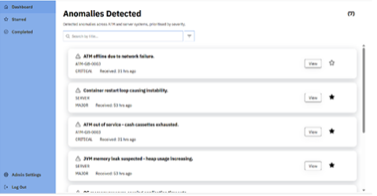
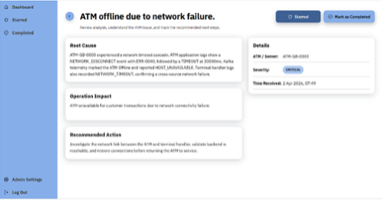
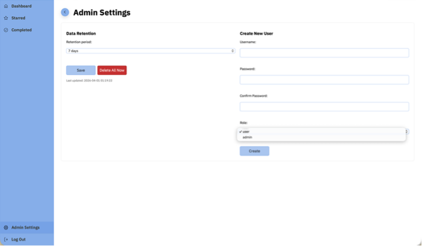
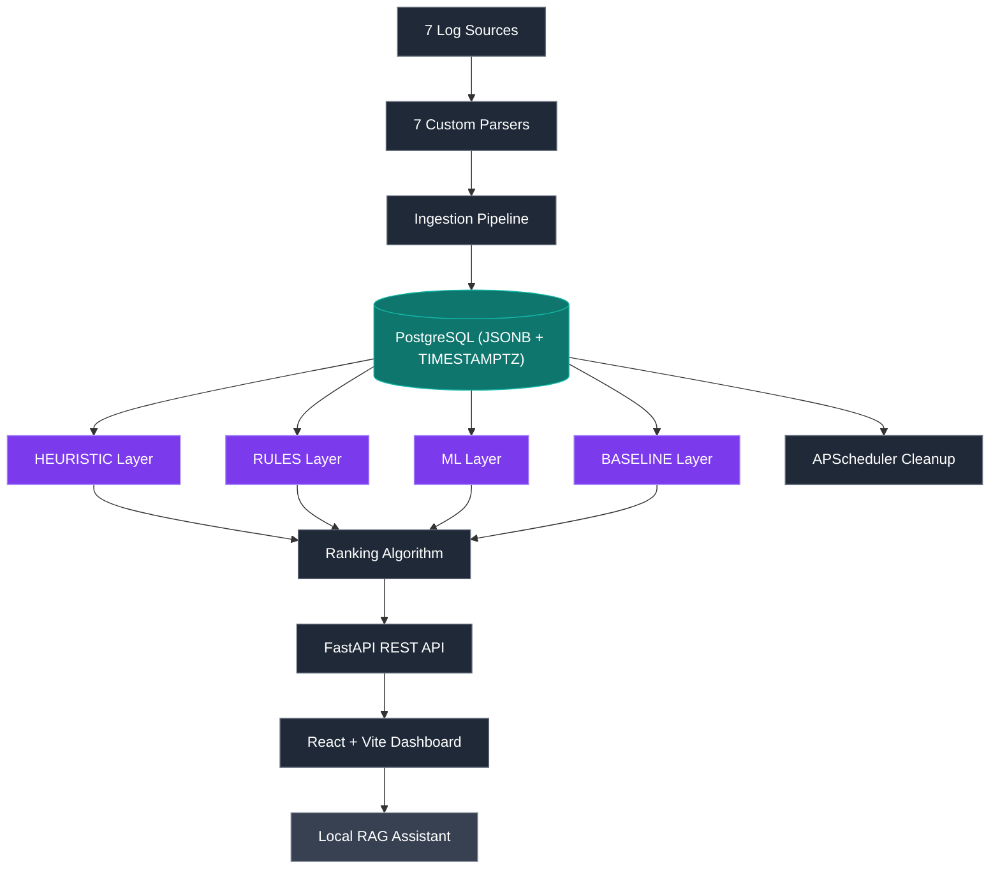

# ATM Log Aggregation, Analysis & Diagnostics Platform (LAAD)

> Production-grade ATM log aggregation, anomaly detection, and AI-assisted diagnostics platform — built for NCR Atleos as a 7-person Agile industry project. Ingests synthetic logs from 7 sources, detects 7 anomaly types, ranks by weighted criticality, and serves a React dashboard with root cause analysis, operational impact, and recommended remediation. Extended with a fully local RAG-based diagnostic assistant.

<p align="center">
  
  
  
  
  
  
</p>

---

## Demonstration

**[→ Project Report](https://github.com/AhmedIkram05/laad/docs/README.md/docs/Project%20Report.pdf)**

---

### Main dashboard — anomalies ranked by weighted criticality score, severity badges, and ATM status indicators



### Anomaly detail — root cause explanation, operational impact assessment, and recommended remediation action



### Admin settings — configurable data retention period (1–365 days) and user management



### RAG diagnostic assistant — natural language querying of ATM log history, served entirely locally


---

## Problem & Solution

**The problem:** Modern ATM networks generate large volumes of operational data across multiple channels — hardware sensors, OS metrics, Kafka event streams, application logs. Banks possess this data but lack the pipeline to turn it into actionable intelligence. Operational teams manually scan logs for anomalies, engineers spend hours finding root causes, and hardware failures go undetected until ATMs go offline.

**The solution:** LAAD ingests, normalises, and analyses logs from 7 sources simultaneously, applies a rule-based detection engine across 7 defined anomaly types, ranks issues by a weighted criticality algorithm, and presents each anomaly with a structured root cause explanation, operational impact, and recommended remediation action — no manual log analysis required.

---

## Architecture



**Sources:** ATM application logs, hardware sensor metrics, Kafka event streams, Prometheus OS metrics, Windows OS metrics, GCP cloud metrics, and terminal handler logs.

**Generation & Ingestion:** The continuous generator (`backend/generator/continuous_generator.py`) emits baseline events every tick with probabilistic anomaly injection (A1–A7). On startup it backfills historical data, then enters a live loop. A `ThreadedConnectionPool` (minconn=5, maxconn=20) handles concurrent writes with retry/backoff. All records normalise into shared `events` and `metrics` tables.

**Detection:** A 4-layer detection engine identifies A1–A7 anomaly types. HEURISTIC (primary, multi-signal correlation) and RULES (secondary, tag-reader) layers fire on the current 300-second window every 10 seconds with entity-aware ATM attribution. ML (Isolation Forest + XGBoost, 47 features, trained on 360-minute windows with class balancing) and BASELINE (rolling 20-window Z-score, novel pattern detection) activate when trained models are loaded. Detection auto-retrains once per UTC day and falls back to a wider 600-second window on low-traffic periods. All inference cycles are logged to MLflow. Retrain with `docker compose exec backend python -m backend.src.anomaly_detection.ml.train`.

**Serving layer:** FastAPI exposes `/auth`, `/anomalies`, `/analysis/detailed`, and `/admin` routes, served by the React + Vite dashboard.

**Extension:** A fully local RAG diagnostic assistant runs with LangChain, ChromaDB, and Ollama (`llama3.1:8b`).

---

## Design Decisions

**Unified events + metrics schema (lean data lake)**
Rather than source-specific tables, all normalised records land in two unified tables: `events` and `metrics`. Detection queries one consistent schema regardless of source. Adding a new log source requires only a new parser — not schema changes or detector modifications. This directly implements NFR7 (extensibility without core pipeline modification).

**Dead-letter routing — no silent data loss**
Malformed records are routed to `ingestion_errors` rather than raising exceptions. Parsers use `.get()` with safe defaults throughout — a missing field in a Kafka stream never halts ingestion for that source.

**PostgreSQL + ThreadedConnectionPool + retry-with-backoff**
Batch writes use `psycopg2.extras.execute_values` with a `ThreadedConnectionPool` (minconn=5, maxconn=20). The `write_helper.py` implements retry/backoff for transient errors (deadlocks, serialization failures, pool exhaustion). SQL uses `%s` parameter placeholders throughout.

**Data retention preserving unresolved anomalies**
Cleanup filters on `is_active = 1` only, preserving all unresolved alerts regardless of age. APScheduler runs cleanup every 1 hour automatically.

**4-layer anomaly detection — reactive + proactive**
HEURISTIC (primary) and RULES (secondary) layers fire on the current 300-second window every 10 seconds. ML (Isolation Forest + XGBoost, 47 features) and BASELINE (rolling Z-score, >3σ threshold) activate when trained models are loaded, providing proactive detection of novel patterns. The `explanation` JSONB field embeds `"source": "HEURISTIC"|"RULES"|"ML"|"BASELINE"` for frontend display. Deduplication prevents duplicate anomalies for the same `(anomaly_type, atm_id)` pair. All inference cycles are logged to MLflow for observability.

**Air-gapped RAG architecture**
No log data leaves the network. LangChain's `SemanticChunker` with `nomic-embed-text` embeddings feeds ChromaDB, with `llama3.1:8b` via Ollama. Evaluated with an LLM-as-judge pipeline scoring relevance, faithfulness, and answer completeness.

---

## Anomaly Types (A1–A7)

| ID | Type | Description | Detection Logic | Severity |
|---|---|---|---|---|
| A1 | Network Timeout Cascade | ATM offline due to network failure | ATM_APP `NETWORK_DISCONNECT` + Kafka `Offline` + Terminal Handler `NETWORK_ERROR` | CRITICAL |
| A2 | Cash Cassette Empty | ATM out of service — cash cassettes exhausted | HARDWARE `CASSETTE_EMPTY` + Kafka `OutOfService` | CRITICAL |
| A3 | JVM Memory Leak | Heap usage increasing over 90 min | Prometheus `jvm_memory_used_bytes` monotonically rising | MAJOR |
| A4 | Container Restart Loop | Pod instability from repeated restarts | GCP `restart_count > 0` + Terminal Handler `STARTUP` × 2 | MAJOR |
| A5 | High Response Time Spike | Transaction latency and success rate degradation | Kafka `response_time_ms > 3000ms` + `success_rate < 90%` | MAJOR |
| A6 | OS Memory Pressure | OS resource exhaustion causing application timeouts | OS `memory_usage_percent >= 90` + ATM_APP `TIMEOUT` | MAJOR |
| A7 | Out-of-Order Kafka | Malformed or missing fields in event stream | Kafka `offset = -1` or `_anomaly_tag = A7_OUT_OF_ORDER` | HIGH |

---

## Requirements

### Functional Requirements

| ID | Requirement | Status |
|---|---|---|
| FR1 | Ingest logs of different formats | ✅ Met |
| FR2 | Support both log-file and event stream sources | ✅ Met |
| FR3 | Normalise different log data into a unified format | ✅ Met |
| FR4 | Save all normalised records to a database | ✅ Met |
| FR5 | Automatically detect anomalies in ingested data | ✅ Met |
| FR6 | Report anomalies via dashboard interface | ✅ Met |
| FR7 | Display which ATMs are non-functional or have warnings | ✅ Met |
| FR8 | Generate probable root cause for detected anomalies | ✅ Met |
| FR9 | Identify anomalous patterns across different channels | ✅ Met |
| FR10 | Use patterns to predict potential future anomalies | ✅ Met |
| FR11 | Display recommended next actions for anomalies | ✅ Met |
| FR12 | Allow filtering by specific ATM-IDs | ✅ Met |
| FR13 | Configurable data retention period | ✅ Met |

### Non-Functional Requirements

| ID | Requirement | Implementation |
|---|---|---|
| NFR1 | Role-based access control (user / admin) | JWT + `require_admin` dependency guard |
| NFR2 | Handle malformed records without crashing | Dead-letter routing to `ingestion_errors` |
| NFR3 | Concurrent ingestion without data loss | WAL + retry-with-backoff in `write_helper.py` |
| NFR4 | Preserve unresolved anomalies regardless of retention | `is_active = 1` filter in cleanup |
| NFR5 | Usable by both technical and non-technical users | Confirmed by user evaluation (3 participants) |
| NFR6 | Well-commented, version-controlled, maintainable code | Full source on GitHub with modular structure |
| NFR7 | Extensible — new log types without core pipeline changes | Unified schema + parser-per-source pattern |

---

## Database Schema

```mermaid
erDiagram
    ATMS {
        text atm_id PK
        text os_version
        text location_code
    }

    EVENTS {
        bigint id PK
        timestamptz timestamp
        text source
        text atm_id FK
        text correlation_id
        text transaction_id
        text event_type
        text severity
        text message
        jsonb payload
    }

    METRICS {
        bigint id PK
        timestamptz timestamp
        text source
        text entity_id
        text metric_name
        double precision metric_value
        jsonb payload
    }

    ANOMALIES {
        bigint id PK
        timestamptz detected_at
        text anomaly_type
        text atm_id FK
        text correlation_id
        text transaction_id
        double precision model_confidence_score
        text severity
        text title
        text explanation
        text recommended_action
        jsonb sources_involved
        text feedback_rating
        int is_active
        int is_starred
    }

    INGESTION_ERRORS {
        bigint id PK
        timestamptz timestamp
        text source
        text error_detail
        text raw_input
    }

    USERS {
        bigint id PK
        text username UK
        text password_hash
        text role
        timestamptz created_at
    }

    RETENTION_CONFIG {
        int id PK
        int retention_days
        timestamptz updated_at
    }

    ATMS ||--o{ EVENTS : has
    ATMS ||--o{ METRICS : has
    ATMS ||--o{ ANOMALIES : has
```

> **Note:** `recommended_action`, `explanation`, and `feedback_rating` are embedded directly in the `anomalies` table (lean data lake pattern). `recommendations` and `feedback` tables from the original plan were consolidated to reduce query complexity.

**Key views:** `v_events_flat`, `v_metrics_flat`, and `v_unified_analysis` abstract JSONB payloads into flat columnar format for the detection engine and frontend.

---

## API Reference

### Authentication — `/api/auth`

| Method | Endpoint | Auth | Description |
|---|---|---|---|
| POST | `/auth/login` | None | Validate credentials (OAuth2PasswordRequestForm), issue JWT (8h expiry) |
| GET | `/auth/me` | JWT | Return current user profile |
| POST | `/auth/register` | None | Register new user account |

### Anomalies — `/api/anomalies`

| Method | Endpoint | Auth | Description |
|---|---|---|---|
| GET | `/anomalies` | JWT | Paginated, filterable list. Supports `group_by`: `atm`, `atm_anomaly`, `title_atm` |
| PATCH | `/{anomalyId}/resolve` | JWT | Toggle active/inactive |
| PATCH | `/{anomalyId}/star` | JWT | Toggle starred/unstarred |

### Analysis — `/api/analysis`

| Method | Endpoint | Auth | Description |
|---|---|---|---|
| GET | `/analysis/detailed` | JWT | Ranked anomaly list with `root_cause`, `operations`, `recommended_action`. Optional `Anomaly` query param |

### Admin — `/api/admin`

| Method | Endpoint | Auth | Description |
|---|---|---|---|
| GET | `/admin/retention` | Admin JWT | Get current retention period |
| PUT | `/admin/retention` | Admin JWT | Set retention period (1–365 days) |
| POST | `/admin/cleanup/run` | Admin JWT | Manually trigger retention cleanup |

---

## Testing

150+ passing tests across 7 tiers:

```bash
make pytest        # runs all tests in Docker with isolated test DB
```

| Tier | Coverage |
|---|---|
| Unit — parsers | Field mapping, log level normalisation, UTC timestamp conversion for all 7 sources |
| Unit — database | Table structure, indexes, FK constraints, WAL, JSONB |
| Unit — utilities | Retry/backoff resilience, retention cleanup |
| Unit — generators | `_anomaly_tag` presence, correlation ID per cascade, durations, SQL parameterisation |
| Integration | End-to-end ingestion, API responses, data writes, `_anomaly_tag` round-trip |
| Concurrency & stress | 50 concurrent write threads, lock collision recovery |
| Security & auth | Login, JWT, `require_admin` guard, privilege escalation |
| Anomaly detector | Rule-based detection across A1–A7 with correct source assignment |

### Critical defects caught by the test suite

| Defect | Test | Resolution |
|---|---|---|
| Silent data loss under concurrent load | `stress/test_write_helper_locking_collision.py` | Exponential backoff added to `write_helper.py` |
| Unresolved anomalies deleted by cleanup | `test_cleanup.py` | Cleanup filtered to `is_active = 1` only |
| JWT privilege escalation (admin endpoint accessible by standard users) | `test_auth_security.py` | `require_admin` dependency guard added |
| Parser crashes on schema drift (strict dict access) | `test_kafka_metrics_parser.py`, `test_prometheus_parser.py` | All parsers migrated to `.get()` with safe defaults |
| Integration test always passed — no real assertions | `test_live_generator_integration.py` | Changed to `count_after > count_before` before/after pattern |
| Connection pool exhausted under ML detector load | (runtime) | Pool bumped to `maxconn=20`, `minconn=5` |
| Analysis endpoint 500 on `None` comparison | (runtime) | Added `or 0` guard on `frac_increase` in `analysis.py` |

---

## User Personas

**Steven Smith — Manager (non-technical)**
New to the role, no technical background. Needs high-level visual summaries, plain-language anomaly explanations, and clear operational impact. Drove the decision to surface recommended actions prominently on the detail view.

**Lionel Torvos — Data Analyst**
Experienced with large datasets. Needs structured, consistent log formats and cross-source correlation. Drove the unified schema design.

**John Davis — Software Engineer**
Familiar with logging systems. Needs root cause summaries, automated anomaly flagging, and trend reports. Drove the detailed analysis generation (root cause + operational impact + recommended action per anomaly type).

---

## User Evaluation

Conducted in-person with 3 participants (2 CS students, 1 Business student).

| Finding | Action taken |
|---|---|
| Filtering feature not noticed | Redesigned filter placement — more visible on dashboard |
| No back button | Back buttons added throughout |
| No way to unmark a completed anomaly | Uncheck/unmark completed functionality added |
| Anomaly ranking should incorporate time received | Time weight added to ranking algorithm |
| Logo deemed unnecessary | Logo removed |

All 3 participants rated the **recommended action** feature as most useful. All 3 found navigation intuitive. All 3 completed tasks without confusion.

---

## Getting Started

### Prerequisites

- Python 3.10+
- Node.js v16+ and npm
- Docker + Docker Compose

### 1. Clone and configure

```bash
git clone https://github.com/AhmedIkram05/laad.git
cd laad
cp .env.example .env   # edit POSTGRES_* values as needed
```

### 2. Start all backend services

```bash
make all      # Start everything: postgres, backend, generator, test-db, mlflow
```

Services run on:

- **Backend API:** `http://localhost:8000` (API docs at `/docs`)
- **Frontend:** `http://localhost:5173` (starts separately in terminal only, see step 3)
- **PostgreSQL:** `localhost:5432`
- **Test Database:** `localhost:5433`
- **MLflow UI:** `http://localhost:5001`

The generator backfills 60 minutes of historical data on first boot, then enters live mode with probabilistic anomaly injection.

### 3. Start the frontend

```bash
cd frontend
npm install
npm run dev
```

Frontend at `http://localhost:5173`

### 4. Default credentials

| Field | Value |
| --- | --- |
| Username | `admin` |
| Password | `admin` |

Seeded automatically by `init_db()` on first run.

### Other Makefile commands

```bash
make rebuild  # Clean rebuild: stop all, remove volumes, rebuild images, start all
make logs     # Follow logs from all services in real-time
make clean    # Stop all containers and remove volumes (database data erased)
```

### Reset from scratch

```bash
make rebuild
```

---

## Tech Stack

| Layer | Technology | Notes |
|---|---|---|
| Backend framework | FastAPI | Lifespan context manager, dependency injection for RBAC |
| Database | PostgreSQL 16 (JSONB, TIMESTAMPTZ) | `ThreadedConnectionPool` (minconn=5, maxconn=20), `execute_values` batch inserts |
| Scheduler | APScheduler | Cleanup every 1h, ML detector every 10s |
| Continuous generator | Python + psycopg2 | Backfill + live loop, SIGTERM/SIGINT handling, exponential backoff |
| Anomaly detection | 4-layer hybrid (HEURISTIC + RULES + ML + BASELINE) | Isolation Forest + XGBoost, rolling Z-score baseline, entity-aware attribution, 47 features, 360-min windows, class balancing, auto-retrain daily, inference logged to MLflow |
| MLOps | MLflow (`v3.1.1`) | Experiment tracking, run metrics, model artifact storage |
| Training pipeline | `train.py` | Sliding windows (300s), StratifiedKFold CV, artifact serialization to `ml/artifacts/` |
| Frontend | React + Vite | Dashboard, anomaly detail, admin views |
| RAG | LangChain + ChromaDB + Ollama | `nomic-embed-text`, `llama3.1:8b`, SemanticChunker |
| Testing | Pytest | Isolated test DB on port 5433 via `docker-compose.test.yml` |

---

## Team

| Role | Member |
|---|---|
| Backend & Data Engineering Lead, DB, Ingestion Pipeline, Auth, API, Testing, Continuous Generator, ML Detector | **Ahmed Ikram** |
| Anomaly Detection Logic | Martin Kelly |
| Ranking Algorithm & Analysis Router | Emmanuel Dairo, Addie Tweed |
| Frontend UI | Sarah Kelly (lead), Sam Watts, Ahmed Ikram |
| Scrum Master | Sam Watts |
| QA & Documentation | All |

Built for **NCR Atleos** as part of CS32002 Industrial Team Project, University of Dundee.

---

## Related

- [DevSync — Project Tracker with GitHub Integration](https://github.com/AhmedIkram05/DevSync) — full-stack cloud app with 541 automated tests
- [W3C Web Logs ETL Pipeline](https://github.com/AhmedIkram05/W3C-ETL-Pipeline) — parallel Airflow ETL with Power BI analytics
- [StockLens FinTech App](https://github.com/AhmedIkram05/StockLens) — full-stack mobile app with OCR pipeline and ML forecasting
