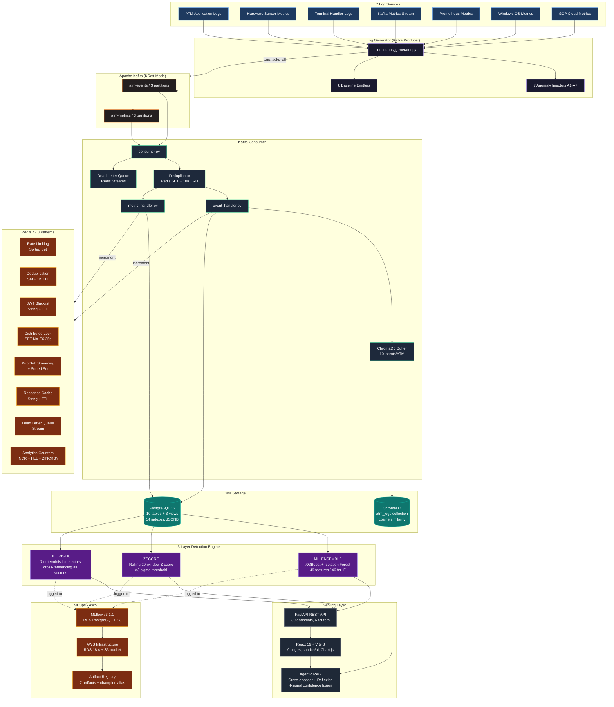
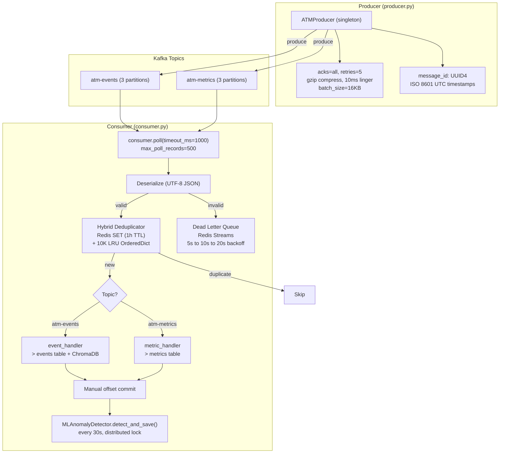
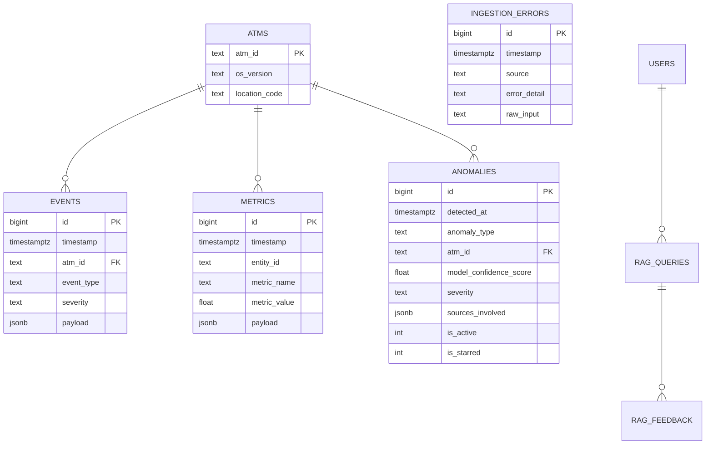
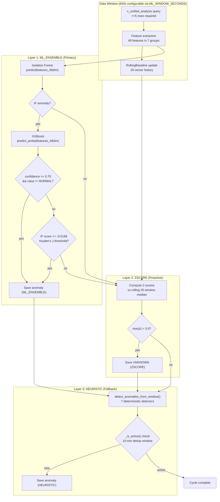
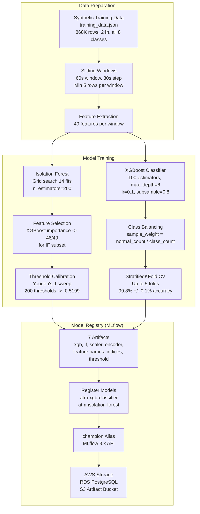
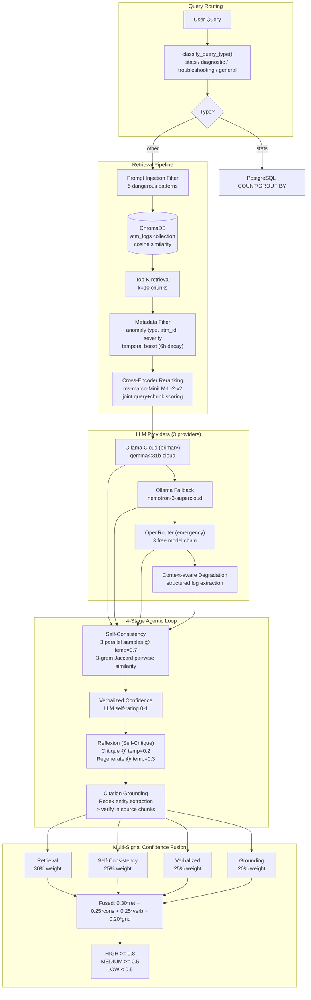
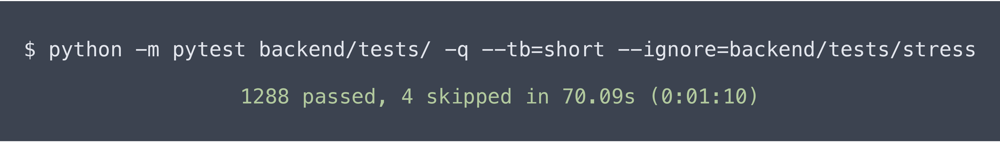
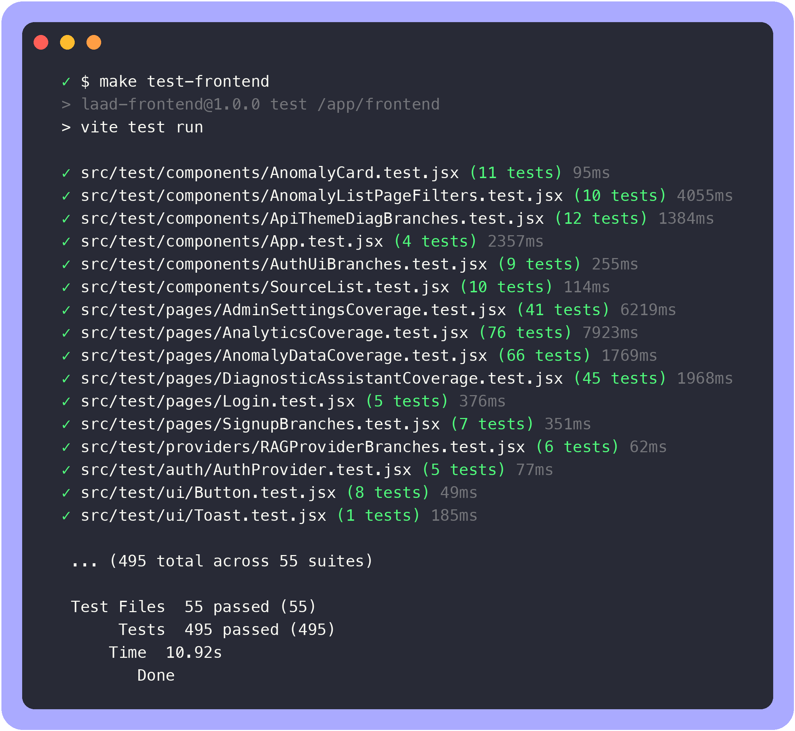

# ATM Log Aggregation, Analysis & Diagnostics Platform (LAAD)

Production-grade ATM log aggregation, anomaly detection, and AI-assisted diagnostics platform. Ingests synthetic logs from 7 sources via Apache Kafka, detects 7 anomaly types across 3 detection layers (ML + statistical + heuristic), ranks by weighted criticality, and serves a React dashboard with root cause analysis, operational impact, and recommended remediation. Extended with an Agentic RAG diagnostic assistant featuring cross-encoder reranking, self-consistency scoring, reflexion (self-critique), citation grounding, and multi-signal confidence fusion. MLOps via MLflow (RDS PostgreSQL + S3 on AWS).

<p align="center">


</p>

---

## Table of Contents

- [Architecture Overview](#system-architecture)
- [Engineering Highlights](#engineering-highlights)
- [Key Metrics at a Glance](#key-metrics-at-a-glance)
- [Demos](#demos)
- [Component Deep Dives](#component-deep-dives)
  - [Kafka Message Bus](#kafka-message-bus)
  - [Database Design](#database-design)
  - [3-Layer Anomaly Detection Engine](#3-layer-anomaly-detection-engine)
  - [ML Training & MLOps](#ml-training--mlops)
  - [Agentic RAG Diagnostic Assistant](#agentic-rag-diagnostic-assistant)
  - [Redis Infrastructure](#redis-infrastructure-8-patterns)
  - [Frontend Architecture](#frontend-architecture)
- [Infrastructure & AWS](#infrastructure--aws)
- [Testing](#testing)
- [Getting Started](#getting-started)
  - [Prerequisites](#prerequisites)
  - [Quick Start](#quick-start)
- [Team](#team)
- [Related Projects](#related)

---

## System Architecture



**Pipeline flow:** 7 log sources → continuous Kafka producer (gzip, acks=all) → 2 topics (3 partitions each) → consumer deduplicates (Redis SET + 10K LRU), parses via 7 source-specific parsers, dual-writes to PostgreSQL + ChromaDB, routes failures to Redis Stream DLQ with exponential backoff. A 3-layer detection engine runs every 30s against time-windowed data. FastAPI serves 30 endpoints consumed by the React dashboard and Agentic RAG assistant.

---

## Engineering Highlights

| Area | Decision | Why |
|---|---|---|
| **Anomaly Detection** | 3-layer ensemble: XGBoost + Isolation Forest + Z-Score + Heuristic | Defense in depth - ML catches 8-class patterns at 99.8%, Z-Score detects drift without models, Heuristic is the always-on safety net |
| **Messaging** | Apache Kafka (KRaft) with gzip, acks=all, 7-day retention | Decouples ingestion from processing - zero data loss on restart, offset replay for backfill |
| **RAG Pipeline** | LangChain + ChromaDB + cross-encoder reranking + 4-signal confidence fusion | Self-hosted vector store keeps data private; 4-signal fusion prevents hallucinated responses |
| **MLOps** | MLflow v3 on AWS (RDS + S3) with champion aliases | Full experiment lineage, auto-retrain on corruption, 7 artifacts tracked per MLflow 3.x API |
| **Data Storage** | PostgreSQL 16 with JSONB + unified events/metrics tables | Adding a log source = new parser - no schema changes, no detector modifications |
| **Distributed Coordination** | 8 Redis patterns from a single connection pool | Rate limiting, dedup, locking, Pub/Sub, caching, DLQ, analytics - all gracefully degrade |
| **Container Strategy** | Multi-stage Docker + health check cascading | 10 services, 7 named volumes, profile-based separation, frontend in ~25MB nginx image |
| **Testing** | pytest with 10 test tiers + isolated test DB | 670 tests (521 backend + 149 frontend) across all layers |

---

## Key Metrics at a Glance

| Category | Metric | Value |
|---|---|---|
| **Scale** | Log sources | 7 simultaneous |
| | ATMs monitored | 10 ATMs + 3 Servers |
| | Messages processed | 930K+ events, 100+ msgs/sec live |
| | Tables / Views / Indexes | 10 + 3 + 14 |
| | Docker services | 10 production + 3 test |
| **ML & Detection** | Anomaly types | 7 known (A1-A7) + UNKNOWN |
| | Detection layers | 3 (ML_ENSEMBLE + ZSCORE + HEURISTIC) |
| | ML features | 49 engineered (46 for IF) |
| | XGBoost CV accuracy | 99.8% +/- 0.1% |
| | Isolation Forest precision | 97.3% (F1=0.7008 at -0.5199) |
| | RAG confidence fusion | 4 signals with Platt calibration |
| **Infrastructure** | API endpoints | 30 across 6 routers |
| | Frontend pages | 9 (React 19 + Vite 8 + Tailwind v4) |
| | Redis patterns | 8 distinct |
| | LLM providers | 3 (Ollama Cloud → Fallback → OpenRouter) |
| | Tests | 670 (521 backend + 149 frontend) |

---

## Demos

## Architecture Overview - log generation, Kafka ingestion, 3-layer detection, dashboard rendering

> Shows the LAAD system end-to-end: 8 log emitters (ATM events, hardware sensors, GCP Cloud Metrics, etc.) emitting into Kafka (KRaft) topics, the kafka-consumer service ingesting into PostgreSQL and ChromaDB, the detection engine scoring anomalies and publishing to Redis Pub/Sub, and the React dashboard displaying real-time analytics with auto-refresh.


## AWS MLflow - RDS-tracked experiments, S3 artifact store, champion model aliases

> Demonstrates the MLflow integration on AWS infrastructure: experiments are tracked against a dedicated RDS PostgreSQL 18.4 instance with model artifacts (pickled XGBoost/Isolation Forest, feature importance plots, classification reports) stored in S3. The demo cycles through experiment runs, showing logged metrics (CV accuracy, IF precision) and the model registry with `champion` alias promotion.


## 3-Layer Detection - real-time anomaly filtering by source, criticality ranking

> Walks through the 3-layer detection pipeline (ML_ENSEMBLE -> ZSCORE -> HEURISTIC): the demo highlights how each scored anomaly appears in the UI with its type label (A1-A7 or UNKNOWN), assigned severity (CRITICAL/HIGH/MAJOR), detector origin, model confidence score, and structured explanation. Shows filtering by anomaly type and severity across the paginated list view.


## Agentic RAG - confidence breakdown, reflexion critique, citation grounding

> Covers an end-to-end diagnostic conversation with the AI assistant: the user asks about a specific anomaly, the RAG pipeline retrieves relevant ChromaDB chunks, generates a response with verbalized confidence (HIGH/MEDIUM/LOW), applies reflexion (self-critique of the draft answer), and renders the final markdown answer with source citations. The chat history persists across sessions via PostgreSQL.


## Real-Time Analytics - Chart.js dashboard, 5s polling, metric source toggles

> Showcases the real-time analytics dashboard: 4 KPI cards (Total Events, Total Anomalies, ATMs & Servers, Metric Types) polling every 5 seconds, the Bar chart for event volume by source with clickable source badges to filter, the Doughnut chart for anomaly type distribution, and the Line chart for metric timelines with a metric selector. 5 time range options (1h/6h/24h/7d/All Time) adapt bucket resolution automatically.


## Kafka Pipeline - deduplication, DLQ retry, distributed lock acquisition

> Demonstrates the resilient Kafka ingestion pipeline: messages arrive on `atm-events` and `atm-metrics` topics (gzip-compressed, acks=all), go through a hybrid deduplicator (Redis SET + in-memory 10K LRU) that rejects duplicates within a 1-hour TTL window, then the kafka-consumer processes batches with manual offset commits and `max.poll.records=500`. Failed messages retry up to 3 times before landing on a Redis-backed DLQ for manual replay.


---

## Component Deep Dives

### Kafka Message Bus

Apache Kafka (KRaft mode, no ZooKeeper) serves as the central message bus, decoupling log generation from ingestion.



**Why Kafka over Redis PubSub?** Kafka persists to disk with configurable retention (7 days) and offset replay for backfill. Redis PubSub loses messages with no active subscriber. 3 partitions/topic enable parallel consumption with ordering. At-least-once delivery via manual offset commits + hybrid dedup = zero data loss on restart.

**Key implementation details:** Redis Set + 1h TTL for cross-restart dedup (LRU OrderedDict failover). Redis SET NX EX 25s lock prevents concurrent detection. Redis Stream DLQ with exponential backoff (5s→10s→20s, max 3 retries). 7 specialized parsers all use `.get()` safe defaults - no crash on schema drift. ChromaDB buffer: per-ATM window=10, LangChain SemanticChunker + Ollama `nomic-embed-text` (768-dim).

---

### Database Design

PostgreSQL 16 (Alpine) with a lean data lake design - unified `events` and `metrics` tables with JSONB payloads, plus dedicated tables for anomalies, RAG data, and calibration.



**Schema highlights:** New source = new parser only - no schema changes, no detector modifications. `v_unified_analysis` view merges both tables via `COALESCE` field normalization as a single ML query target. 14 B-tree indexes (6 composite) on `(timestamp, entity)` and `(type, timestamp)` patterns. `ThreadedConnectionPool` (min=5, max=50) with 3-retry backoff. Batched retention cleanup (5K rows/batch) preserves unresolved anomalies.

---

### 3-Layer Anomaly Detection Engine

The core detection system combines ML, statistical analysis, and deterministic rules to identify all 7 known anomaly types (A1-A7) plus novel UNKNOWN patterns. Runs every 30 seconds against configurable time-windowed data (default 600s).



**Why 3 layers?** Defense in depth - each layer has independent failure modes. ML_ENSEMBLE catches known/novel patterns when models are loaded (99.8% CV accuracy). ZSCORE detects statistical distribution shifts without any model dependency. HEURISTIC is the always-active safety net using deterministic multi-source correlation. No single point of failure: if ML models are corrupted, ZSCORE + HEURISTIC still catch anomalies.

**Layer 1 - ML_ENSEMBLE (Primary):** Two independent feature paths (XGBoost: 49-dim, IF: 46-dim). Decision: IF anomaly → XGBoost predict_proba → known if `class != NORMAL` and `confidence >= 0.70`; UNKNOWN if `class == NORMAL` but `IF score <= -0.5199`. First 20 cycles suppress UNKNOWN to avoid cold-start flood.

**Layer 2 - ZSCORE (Proactive):** Rolling 20-vector per-feature median/std baseline, independent of ML models. `z_i = (x_i - median_i) / std_i` - features >3 sigma flagged, confidence = `min(|z|/5.0, 1.0)`. Min 5 vectors required.

**Layer 3 - HEURISTIC (Fallback):** 7 deterministic detectors, always active. Cross-layer dedup via `(anomaly_type, atm_id)` pairs. 10-min dedup window prevents repeated saves across 30s cycles.

## 7 anomaly types

A1 (CRITICAL) - Network Timeout Cascade: >=3 of NETWORK_DISCONNECT + Kafka Offline + TIMEOUT. A2 (CRITICAL) - Cash Cassette Empty: CASSETTE_EMPTY + Kafka OutOfService + 0 TPS. A3 (MAJOR) - JVM Memory Leak: rising heap >=50% + OOM, 40% server. A4 (MAJOR) - Container Restart Loop: restart>0 + >=2 STARTUP/FATAL, 40% server. A5 (MAJOR) - Response Time Spike: >=2 Kafka RT>3000ms + success<90%. A6 (MAJOR) - OS Memory Pressure: memory>=90% OR >30% increase + ThreadAbortException, 40% server. A7 (HIGH) - Out-of-Order Kafka: offset gaps + null fields + malformed values. UNKNOWN (HIGH): IF score <= -0.5199 OR Z>3 sigma.

---

### ML Training & MLOps



**Training results:** 99.8% +/- 0.1% CV accuracy (StratifiedKFold, 7,190 windows, 49 features). Per-class precision/recall of 1.0 across all 8 classes (A1-A7 + NORMAL). Isolation Forest 97.3%, AUC-ROC 0.9502. Threshold calibration: Youden's J sweep of 200 thresholds, optimal F1=0.7008 at -0.5199.

**7 MLflow artifacts:** `xgb_classifier.joblib`, `isolation_forest.joblib`, `label_encoder.joblib`, `scaler.joblib`, `feature_names.json`, `if_feature_indices.json`, `if_unknown_threshold.json`.

**MLflow MLOps:** Champion alias on both models via MLflow 3.x API. RDS PostgreSQL 18.4 + S3 artifact bucket. Custom Docker image (psycopg2-binary + boto3). Auto-retrain on artifact corruption. Git SHA tagging.


---

### Agentic RAG Diagnostic Assistant

An agentic RAG system with 4-stage reasoning (self-consistency, reflexion, citation grounding, verbalized confidence) and multi-signal confidence fusion. Uses Ollama Cloud as primary LLM provider with OpenRouter emergency fallback.



**Why ChromaDB over Pinecone?** Self-hosted in Docker - no per-vector API costs, 50K+ docs fit in RAM, log data never leaves the network. Local Ollama embedding (`nomic-embed-text`, 768-dim) eliminates network round-trip.

**4 agentic features:** Cross-Encoder Reranking (`ms-marco-MiniLM-L-2-v2`, +5-15% relevance), Self-Consistency (3 parallel samples @ temp=0.7, 3-gram Jaccard), Reflexion (generate → critique @ temp=0.2 → regenerate if unsupported), Citation Grounding (regex entity extraction → source chunk verification).

**Multi-signal fusion:** Retrieval (30%) + self-consistency (25%) + verbalized (25%) + grounding (20%). Missing signals renormalized. Final: HIGH ≥0.8 / MEDIUM ≥0.5 / LOW <0.5. Platt scaling auto-recalibrates every 20 feedback samples (ECE <0.10).

**Latency:** 11-23s uncached (ThreadPoolExecutor parallelized self-consistency, first sample reused as primary response), <100ms cached.

**Query routing:** Stats queries → direct PostgreSQL (bypasses LLM). Diagnostic → full RAG with Analysis + Root Cause + Actions. 5-pattern prompt injection filter. **LLM chain:** Ollama Cloud → Ollama Fallback → OpenRouter (3 models) → local degradation.

---

### Redis Infrastructure (8 Patterns)

Shared Redis client singleton with connection pooling (max 20, 2s timeout). Every operation has a graceful degradation fallback.

| Pattern | Data Structure | Use Case | Degradation |
|---|---|---|---|
| Rate Limiting | Sorted Set (ZADD + ZREMRANGEBYSCORE + ZCARD) | 10 req/min per user sliding window | In-memory counters |
| Message Dedup | Set + 1h TTL (SADD + SISMEMBER) | Cross-restart Kafka dedup | LRU OrderedDict (10K) |
| JWT Blacklist | String + TTL (SETEX) | Secure logout, token invalidation | In-memory set |
| Distributed Lock | SET NX EX 25s | Prevent concurrent anomaly detection | Proceed without lock |
| Real-Time Streaming | Pub/Sub + Sorted Set | Anomaly alerts to dashboard | Silently skip |
| Response Caching | String + TTL (GET + SETEX) | RAG (300s) + anomaly list (15s) | Return None, fresh query |
| Dead Letter Queue | Stream (XADD/XREAD/XDEL) | Failed message retry + backoff | Skip DLQ processing |
| Analytics Counters | INCR + HyperLogLog + ZINCRBY | Real-time event counts, unique ATMs | Return zeros |

---

### Frontend Architecture

- **React 19 + Vite 8 + Tailwind CSS v4** - 9 pages with skeleton loading, auto-refresh (5s analytics, 30s anomalies)
- **6-filter anomaly list**: sort by criticality/recent/severity, filter by entity/type/severity/source/text - 20/page
- **Analytics dashboard**: 3 Chart.js visualizations + KPI cards, 5 time ranges, adaptive buckets
- **3-layer persistence**: React context + localStorage (max 50) + PostgreSQL (`/api/rag/history`)
- **Auth**: JWT + bcrypt, `require_admin` guard, Redis token blacklist for secure logout

---

## Infrastructure & AWS

| Service | Technology | Purpose |
|---|---|---|
| PostgreSQL | 16 Alpine | Primary database, health-checked with `pg_isready` |
| Apache Kafka | confluentinc/cp-kafka:7.5.0 | KRaft mode (no ZooKeeper), 7-day retention |
| Kafka Consumer | Python + kafka-python | Dedup + parse + dual-write + 30s detection trigger |
| ChromaDB | chromadb/chroma | Vector database for RAG retrieval |
| Ollama | ollama/ollama | Local `nomic-embed-text` for semantic chunking |
| Backend API | FastAPI + Uvicorn (4 workers) | 30 endpoints, 6 routers, APScheduler cleanup |
| Log Generator | Python + kafka-python | Pure Kafka producer (no direct DB writes) |
| MLflow | custom Dockerfile | Experiment tracking + model registry (psycopg2+boto3 for AWS) |
| Redis | 7 Alpine | 8 distributed patterns, shared connection pool |
| Frontend | nginx alpine | Multi-stage build: Node.js → nginx, ~25MB final image |
| AWS RDS | PostgreSQL 18.4 | MLflow tracking backend |
| AWS S3 | Standard bucket | MLflow artifact store |

**Key decisions:** 10 production services + 3 test services with health check cascading, 7 named volumes, profile-based Compose for `ml`/`test`, auto-retrain on startup, hourly batched retention cleanup (5K rows/batch); VACUUM left to DBA.

---

## Testing

All tests run in Docker with isolated PostgreSQL on port 5433.

```bash
make test              #   Full test suite (670 tests)
make test-backend      #   Backend: 521 (pytest + pytest-cov)
make test-frontend     #   Frontend: 149 (vitest 4 + @testing-library/react 16)
```

| Metric | Value |
|---|---|
| Test DB | Isolated (`atm_platform_test`, port 5433) |
| Test tiers | 10 (unit, integration, stress, security, ML, RAG, Redis, Kafka, generators, parsers) |

## Backend Test Suite - 521 passing pytest tests across 10 tiers

> Shows the complete backend test run: 521 pytest tests passing across 60 test files organized into 10 tiers (unit, integration, stress, security, ML, RAG, Redis, Kafka, generators, parsers). Tests run inside Docker with an isolated PostgreSQL 16 test database on port 5433 (`atm_platform_test`). The output displays the pytest progress bar, per-file results with durations, and coverage summary across `backend/src`, `backend/generator`, and `backend/kafka` modules.



## Frontend Test Suite - 149 passing vitest tests (36 suites)

> Shows the full frontend test suite run with vitest v4 and @testing-library/react v16: 149 tests across 36 suite files covering all 9 pages, auth flows, API client, RAG chat, theme switching, admin settings, and 10 shadcn/ui components (Button, Card, Input, Label, Badge, Skeleton, Switch, Select, Pagination, Toast). Tests use jsdom environment with mocked localStorage and scrollIntoView for consistent CI runs.



---

## Getting Started

### Prerequisites

- Python 3.10+ (runtime only, all services run in Docker)
- Docker + Docker Compose
- Node.js v16+ and npm (for frontend dev)

### Quick Start

```bash
git clone https://github.com/AhmedIkram05/laad.git
cd laad
cp .env.example .env
make all                           # Start ALL services (frontend + backend)
```

Default credentials: username=`admin`, password=`admin`

**Production-like frontend deployment:** Multi-stage Docker build (Node.js builder → nginx alpine, no Node.js at runtime), all assets minified + hashed filenames, nginx reverse proxy replicates Vite's `/api/*` rewrite logic.

Services run on:

- Frontend UI: `http://localhost:5173` (nginx)
- Backend API: `http://localhost:8000` (docs at `/docs`)
- MLflow UI: `http://localhost:5001`
- PostgreSQL: `localhost:5434`

---

## Team

| Role | Member |
|---|---|
| Backend & Data Engineering Lead - DB, Ingestion Pipeline, Auth, API, Testing, Continuous Log Generator eventually extending with ML Detector, Kafka Integration, MLOps, RAG Diagnostic Assistant | **Ahmed Ikram** |
| Heuristic Anomaly Detection Logic | Martin Kelly |
| Ranking Algorithm & Analysis Router | Emmanuel Dairo, Addie Tweed |
| Frontend UI | Sarah Kelly (lead), Sam Watts, Ahmed Ikram |
| Scrum Master | Sam Watts |

Built for **NCR Atleos** as part of CS32002 Industrial Team Project, University of Dundee.

> **Contribution note:** The original submitted version included only rule-based detection and a basic single-script generator that wrote directly to the database. The Kafka message bus (producer/consumer pipeline with deduplication), 3-layer ML detection engine (XGBoost + Isolation Forest + Z-score + Signal Correlator), MLOps integration (MLflow experiment tracking, model registry with champion alias), the RAG diagnostic assistant with 4-signal confidence fusion and calibration, the comprehensive test suite (670 tests), and the full API surface were designed, implemented, and tested by **Ahmed Ikram** as an independent post-submission extension.

---

## Related

- [DevSync - Project Tracker with GitHub Integration](https://github.com/AhmedIkram05/DevSync) - full-stack cloud app with 541 automated tests
- [W3C Web Logs ETL Pipeline](https://github.com/AhmedIkram05/W3C-ETL-Pipeline) - parallel Airflow ETL with Power BI analytics
- [StockLens FinTech App](https://github.com/AhmedIkram05/StockLens) - full-stack mobile app with OCR pipeline and ML forecasting
