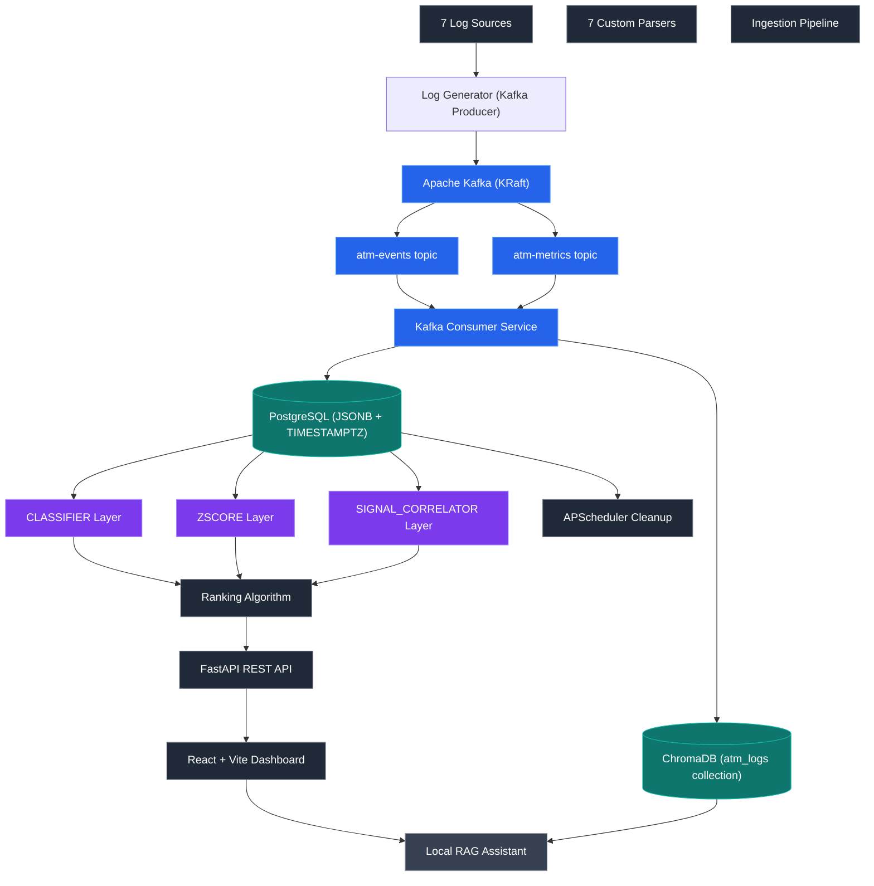

# ATM Log Aggregation, Analysis & Diagnostics Platform (LAAD)

> Production-grade ATM log aggregation, anomaly detection, and AI-assisted diagnostics platform — built for NCR Atleos as a 7-person Agile industry project. Ingests synthetic logs from 7 sources, detects 7 anomaly types, ranks by weighted criticality, and serves a React dashboard with root cause analysis, operational impact, and recommended remediation. Extended with a fully local RAG-based diagnostic assistant.

<p align="center">
  
  
  
  
  
  
</p>

---

## Demonstration

**[→ Project Report](https://github.com/AhmedIkram05/laad/docs/README.md/docs/Project%20Report.pdf)**

---

### Main dashboard — anomalies ranked by weighted criticality score, severity badges, and ATM status indicators


### Anomaly detail — root cause explanation, operational impact assessment, and recommended remediation action


### Admin settings — configurable data retention period (1–365 days) and user management


### RAG diagnostic assistant — natural language querying of ATM log history, served entirely locally


---

## Problem & Solution

**The problem:** Modern ATM networks generate large volumes of operational data across multiple channels — hardware sensors, OS metrics, Kafka event streams, application logs. Banks possess this data but lack the pipeline to turn it into actionable intelligence. Operational teams manually scan logs for anomalies, engineers spend hours finding root causes, and hardware failures go undetected until ATMs go offline.

**The solution:** LAAD ingests, normalises, and analyses logs from 7 sources simultaneously, applies a rule-based detection engine across 7 defined anomaly types, ranks issues by a weighted criticality algorithm, and presents each anomaly with a structured root cause explanation, operational impact, and recommended remediation action — no manual log analysis required.

---

## Architecture



**Sources:** ATM application logs, hardware sensor metrics, Kafka event streams, Prometheus OS metrics, Windows OS metrics, GCP cloud metrics, and terminal handler logs.

**Kafka message bus:** All generator data flows through Apache Kafka (KRaft mode, `confluentinc/cp-kafka:7.5.0`, no ZooKeeper). Two topics:

- `atm-events` — event-type messages (sources: ATM_APP, HARDWARE, TERMINAL_HANDLER, KAFKA). 3 partitions.
- `atm-metrics` — metric-type messages (sources: PROMETHEUS, OS, CLOUD, KAFKA). 3 partitions.

The log generator is now a pure Kafka producer — no direct database writes. A separate `kafka-consumer` service consumes from both topics and writes to PostgreSQL and ChromaDB simultaneously. The `atm-events` topic feeds the ChromaDB RAG buffer (10-event window per ATM, SemanticChunker with `nomic-embed-text`). The Kafka consumer also triggers the ML anomaly detector inline after each batch, rate-limited to every 30 seconds (matching the backend APScheduler interval).

**Generation & Ingestion:** The continuous generator (`backend/generator/continuous_generator.py`) emits baseline events every tick with probabilistic anomaly injection (A1–A7). On startup it seeds the ATM fleet (FK constraint for anomalies table), backfills historical data via Kafka, then enters a live loop. All events carry `message_id` (UUID4) for consumer-side deduplication. Anomaly injectors A3 and A6 use state-based progressive emission — one message per invocation, producing the full 90/120-message cascade over as many ticks, faithfully simulating real-time behavior.

**Detection:** A 3-layer detection engine identifies A1–A7 anomaly types. Both the `kafka-consumer` service (every 30s, post-batch) and the backend APScheduler (every 30s) independently trigger `MLAnomalyDetector.detect_and_save()`. A 5-minute dedup window in `_is_active()` prevents duplicate writes when both fire on the same incident window. CLASSIFIER (primary, XGBoost + Isolation Forest, 47 features, 97.0% CV accuracy) runs first when models are loaded. ZSCORE (rolling 20-window Z-score, novel pattern detection) runs independently. SIGNAL_CORRELATOR (multi-signal correlation) is the final fallback. Detection auto-retrains once per hour and falls back to a wider window on low-traffic periods. Models are registered in MLflow with "champion" alias for production serving. All training runs and inference cycles are logged to MLflow.

**Serving layer:** FastAPI exposes `/auth`, `/anomalies`, `/analysis/detailed`, and `/admin` routes, served by the React + Vite dashboard.

**Extension:** A fully local RAG diagnostic assistant runs with LangChain, ChromaDB, and Ollama (`llama3.1:8b`). ChromaDB is populated by the Kafka consumer — events are buffered per ATM (10-event window) and upserted using SemanticChunker with `nomic-embed-text` embeddings into the `atm_logs` collection.

---

## Design Decisions

**Unified events + metrics schema (lean data lake)**
Rather than source-specific tables, all normalised records land in two unified tables: `events` and `metrics`. Detection queries one consistent schema regardless of source. Adding a new log source requires only a new parser — not schema changes or detector modifications. This directly implements NFR7 (extensibility without core pipeline modification).

**Kafka message bus — producer/consumer pipeline**
The generator is a pure Kafka producer — it no longer writes directly to the database. A `kafka-consumer` service reads from `atm-events` and `atm-metrics` topics and writes to both PostgreSQL and ChromaDB in the same consume loop. This decoupling means the generator is completely decoupled from the database — if the consumer falls behind, no data is lost (it lives in Kafka). The two-topic design (events vs metrics) mirrors the existing `events`/`metrics` table split, making the consumer routing straightforward.

**Dead-letter routing — no silent data loss**
Malformed records are routed to `ingestion_errors` rather than raising exceptions. Parsers use `.get()` with safe defaults throughout — a missing field in a Kafka stream never halts ingestion for that source. The Kafka consumer also routes undeserialisable bytes to `ingestion_errors` via `_route_to_ingestion_errors()`.

**At-least-once delivery with in-process deduplication**
Kafka provides at-least-once delivery by default. The consumer uses an in-memory LRU set (10,000 `message_id` entries) to skip duplicates on redelivery. If the consumer restarts, the LRU set is reset — duplicates are possible immediately after restart, which is acceptable for at-least-once delivery.

**PostgreSQL + ThreadedConnectionPool + retry-with-backoff**
Batch writes use `psycopg2.extras.execute_values` with a `ThreadedConnectionPool` (minconn=5, maxconn=20). The `write_helper.py` implements retry/backoff for transient errors (deadlocks, serialization failures, pool exhaustion). SQL uses `%s` parameter placeholders throughout.

**Data retention preserving unresolved anomalies**
Cleanup filters on `is_active = 1` only, preserving all unresolved alerts regardless of age. APScheduler runs cleanup every 1 hour automatically.

**3-layer anomaly detection — reactive + proactive**
CLASSIFIER (XGBoost + Isolation Forest, 47 features) runs first as the primary detector when models are loaded, detecting known A1–A7 patterns and unknown anomalies via IF threshold. ZSCORE (rolling Z-score, >3σ threshold) runs independently of models to detect novel patterns. SIGNAL_CORRELATOR (final fallback) uses deterministic multi-signal correlation for A1–A7. The Kafka consumer and the backend APScheduler independently trigger detection every 30 seconds each. A 5-minute dedup window in `_is_active()` prevents duplicate writes when both fire on the same incident window. The `explanation` JSONB field embeds `"source": "CLASSIFIER"|"ZSCORE"|"SIGNAL_CORRELATOR"` for frontend display.

**Air-gapped RAG architecture**
No log data leaves the network. ChromaDB receives events from the Kafka consumer via a per-ATM buffer (10-event window). LangChain's `SemanticChunker` with `nomic-embed-text` embeddings chunks buffered events before upsert. The `llama3.1:8b` model via Ollama serves RAG queries from the `atm_logs` ChromaDB collection.

---

## Anomaly Types (A1–A7)

| ID | Type | Description | Detection Logic | Severity |
|---|---|---|---|---|
| A1 | Network Timeout Cascade | ATM offline due to network failure | ATM_APP `NETWORK_DISCONNECT` + Kafka `Offline` + Terminal Handler `NETWORK_ERROR` | CRITICAL |
| A2 | Cash Cassette Empty | ATM out of service — cash cassettes exhausted | HARDWARE `CASSETTE_EMPTY` + Kafka `OutOfService` | CRITICAL |
| A3 | JVM Memory Leak | Heap usage increasing over 90 min | Prometheus `jvm_memory_used_bytes` monotonically rising | MAJOR |
| A4 | Container Restart Loop | Pod instability from repeated restarts | GCP `restart_count > 0` + Terminal Handler `STARTUP` × 2 | MAJOR |
| A5 | High Response Time Spike | Transaction latency and success rate degradation | Kafka `response_time_ms > 3000ms` + `success_rate < 90%` | MAJOR |
| A6 | OS Memory Pressure | OS resource exhaustion causing application timeouts | OS `memory_usage_percent >= 90` + ATM_APP `TIMEOUT` | MAJOR |
| A7 | Out-of-Order Kafka | Malformed or missing fields in event stream | Kafka `offset = -1` or `_anomaly_tag = A7_OUT_OF_ORDER` | HIGH |

---

## ML Anomaly Detection

A production-grade 3-layer hybrid engine detecting all 7 anomaly types (A1–A7) across 7 simultaneous log sources, combining statistical detection with machine learning. Models are versioned with git SHA, registered in MLflow with "champion" alias, and include version descriptions for traceability.

### Training Results — 99.1% Cross-Validation Accuracy

| Metric | Value |
|---|---|
| **Cross-validation accuracy** | **99.1% ± 0.2%** (offline dataset) |
| **Per-class precision/recall** | 1.0 / 1.0 across all 8 classes (A1–A7 + NORMAL) |
| **Isolation Forest anomaly precision** | 89.1% |
| **Training datasets** | **LIVE**: real generator data (228K rows, ~372 windows) · **OFFLINE**: 868,320 rows, 24h synthetic with all A1–A7 |
| **Top features** | `kafka_out_of_order`, `fatal_critical_weighted_sum`, `hardware_cassette_low_count`, `kafka_rt_max/mean`, `terminal_handler_startup_count`, `container_restart_max`, `jvm_mem_rate` |
| **Champion models registered** | `atm-xgb-classifier` · `atm-isolation-forest` — both with MLflow "champion" alias + version descriptions with git SHA |

### Training & Auto-Retrain

- **`make retrain`**: Trains on live generator data from DB (recommended for production continuous learning)
- **`make retrain-offline`**: Trains on pre-generated offline dataset (recommended for initial setup with balanced classes)
- **`make training-data`**: Generates offline training dataset (24h, all A1-A7 guaranteed)
- **Auto-retrain**: Scheduled every 1 hour via APScheduler; skips if models are < 24h old; persists across restarts (bind mount); only wiped on `make rebuild`

### 3 Detection Layers

| Layer | Type | Trigger | Always Active? |
|---|---|---|---|
| `CLASSIFIER` | **Primary** | XGBoost + Isolation Forest (47 features). Detects A1–A7 (trained) + UNKNOWN (IF threshold) | Only when models exist |
| `ZSCORE` | **Proactive** | Rolling 20-window Z-score (>3σ deviation) detects novel patterns | Yes (independent of models) |
| `SIGNAL_CORRELATOR` | **Fallback** | Multi-source signal correlation for A1–A7 | Yes |

CLASSIFIER runs first as primary detector. ZSCORE detects unknown patterns independently of models. SIGNAL_CORRELATOR is the final safety net.

**Unknown anomaly detection:** The Isolation Forest component detects patterns that don't match any trained A1–A7 class, creating `UNKNOWN` anomalies when the anomaly score falls below the threshold. This catches novel failure modes the XGBoost classifier was never trained on.

### 47 ML Features

- **Metric statistics (14):** JVM memory mean/rate/slope, GC pause, CPU, OS memory, Kafka RT/success rate
- **Percentiles (9):** JVM p75/p95, OS p75/p95, Kafka RT p75/p90/p99, CPU p90/p99
- **Temporal slopes (5):** memory trends, Kafka RT/success rate slopes
- **Event counts (10):** ATM errors, FATAL events, STARTUP events, OOM, cassette empty/low, Kafka offline/null status, timeouts, network disconnects
- **Severity-weighted (2):** FATAL-weighted sum, total error count
- **Cross-source flags (7):** multi-source errors, OOM presence, network disconnect, timeout, Kafka out-of-order, anomaly tag count, unique ATM count

### MLOps

- **Experiment tracking:** Every training run (LIVE + OFFLINE) and all inference cycles logged to MLflow with full metrics, parameters, feature importance, run IDs, and git SHA for traceability
- **Model registry:** Two registered models — `atm-xgb-classifier` and `atm-isolation-forest` — with MLflow "champion" alias and version descriptions
- **Artifact persistence:** Model files (`xgb_classifier.joblib`, `isolation_forest.joblib`, `label_encoder.joblib`, `feature_names.json`) stored on a Docker named volume mount, surviving container restarts
- **Data drift detection:** ZSCORE layer computes rolling 20-window baseline; when features deviate >3σ from historical median, triggers `UNKNOWN` anomaly for proactive alerting on distribution shift
- **Auto-retrain:** APScheduler triggers retraining every 1 hour on live generator data; guards against retraining if models are < 24 hours old

### Training Commands

```bash
make retrain               # Train on live generator data (production default)
make retrain-offline       # Train on offline dataset (guaranteed all A1-A7 + NORMAL, triggers IF training)
make generate-training-data # Generate 24h offline dataset (one-time setup, ~260MB)
```

Training uses non-overlapping 60-second windows sliding at 30-second steps. LIVE mode queries real generator data from the DB; OFFLINE mode loads the pre-generated `data/training_data.json` which guarantees all 8 classes. Both modes use identical 47-feature engineering and the same XGBoost + Isolation Forest pipeline.

---

## Requirements

### Functional Requirements

| ID | Requirement | Status |
|---|---|---|
| FR1 | Ingest logs of different formats | ✅ Met |
| FR2 | Support both log-file and event stream sources | ✅ Met |
| FR3 | Normalise different log data into a unified format | ✅ Met |
| FR4 | Save all normalised records to a database | ✅ Met |
| FR5 | Automatically detect anomalies in ingested data | ✅ Met |
| FR6 | Report anomalies via dashboard interface | ✅ Met |
| FR7 | Display which ATMs are non-functional or have warnings | ✅ Met |
| FR8 | Generate probable root cause for detected anomalies | ✅ Met |
| FR9 | Identify anomalous patterns across different channels | ✅ Met |
| FR10 | Use patterns to predict potential future anomalies | ✅ Met |
| FR11 | Display recommended next actions for anomalies | ✅ Met |
| FR12 | Allow filtering by specific ATM-IDs | ✅ Met |
| FR13 | Configurable data retention period | ✅ Met |

### Non-Functional Requirements

| ID | Requirement | Implementation |
|---|---|---|
| NFR1 | Role-based access control (user / admin) | JWT + `require_admin` dependency guard |
| NFR2 | Handle malformed records without crashing | Dead-letter routing to `ingestion_errors` |
| NFR3 | Concurrent ingestion without data loss | WAL + retry-with-backoff in `write_helper.py` |
| NFR4 | Preserve unresolved anomalies regardless of retention | `is_active = 1` filter in cleanup |
| NFR5 | Usable by both technical and non-technical users | Confirmed by user evaluation (3 participants) |
| NFR6 | Well-commented, version-controlled, maintainable code | Full source on GitHub with modular structure |
| NFR7 | Extensible — new log types without core pipeline changes | Unified schema + parser-per-source pattern |

---

## Database Schema

```mermaid
erDiagram
    ATMS {
        text atm_id PK
        text os_version
        text location_code
    }

    EVENTS {
        bigint id PK
        timestamptz timestamp
        text source
        text atm_id FK
        text correlation_id
        text transaction_id
        text event_type
        text severity
        text message
        jsonb payload
    }

    METRICS {
        bigint id PK
        timestamptz timestamp
        text source
        text entity_id
        text metric_name
        double precision metric_value
        jsonb payload
    }

    ANOMALIES {
        bigint id PK
        timestamptz detected_at
        text anomaly_type
        text atm_id FK
        text correlation_id
        text transaction_id
        double precision model_confidence_score
        text severity
        text title
        text explanation
        text recommended_action
        jsonb sources_involved
        text feedback_rating
        int is_active
        int is_starred
    }

    INGESTION_ERRORS {
        bigint id PK
        timestamptz timestamp
        text source
        text error_detail
        text raw_input
    }

    USERS {
        bigint id PK
        text username UK
        text password_hash
        text role
        timestamptz created_at
    }

    RETENTION_CONFIG {
        int id PK
        int retention_days
        timestamptz updated_at
    }

    ATMS ||--o{ EVENTS : has
    ATMS ||--o{ METRICS : has
    ATMS ||--o{ ANOMALIES : has
```

> **Note:** `recommended_action`, `explanation`, and `feedback_rating` are embedded directly in the `anomalies` table (lean data lake pattern). `recommendations` and `feedback` tables from the original plan were consolidated to reduce query complexity.

**Key views:** `v_events_flat`, `v_metrics_flat`, and `v_unified_analysis` abstract JSONB payloads into flat columnar format for the detection engine and frontend.

---

## API Reference

### Authentication — `/api/auth`

| Method | Endpoint | Auth | Description |
|---|---|---|---|
| POST | `/auth/login` | None | Validate credentials (OAuth2PasswordRequestForm), issue JWT (8h expiry) |
| GET | `/auth/me` | JWT | Return current user profile |
| POST | `/auth/register` | None | Register new user account |

### Anomalies — `/api/anomalies`

| Method | Endpoint | Auth | Description |
|---|---|---|---|
| GET | `/anomalies` | JWT | Paginated, filterable list. Supports `group_by`: `atm`, `atm_anomaly`, `title_atm` |
| PATCH | `/{anomalyId}/resolve` | JWT | Toggle active/inactive |
| PATCH | `/{anomalyId}/star` | JWT | Toggle starred/unstarred |

### Analysis — `/api/analysis`

| Method | Endpoint | Auth | Description |
|---|---|---|---|
| GET | `/analysis/detailed` | JWT | Ranked anomaly list with `root_cause`, `operations`, `recommended_action`. Optional `Anomaly` query param |
| GET | `/analysis/metrics` | JWT | Time-bucketed anomaly counts + summary stats for dashboard. Params: `hours`, `bucket_minutes`, `anomaly_type`, `severity`, `is_active` |

### Admin — `/api/admin`

| Method | Endpoint | Auth | Description |
|---|---|---|---|
| GET | `/admin/retention` | Admin JWT | Get current retention period |
| PUT | `/admin/retention` | Admin JWT | Set retention period (1–365 days) |
| POST | `/admin/cleanup/run` | Admin JWT | Manually trigger retention cleanup |

---

## Testing

**Full test suite passing** across 7 tiers, running in Docker with an isolated test database:

```bash
make pytest        # runs all tests in Docker with isolated test DB
```

> **Note:** When Airflow is running (uses port 5432), LAAD postgres runs on `localhost:5434` internally and `localhost:5432` is Airflow's PostgreSQL. The test database runs on `localhost:5433` externally. All internal container-to-container communication uses Docker service names on their respective internal ports (5432).

| Tier | Coverage |
|---|---|
| Unit — parsers | Field mapping, log level normalisation, UTC timestamp conversion for all 7 sources |
| Unit — database | Table structure, indexes, FK constraints, WAL, JSONB |
| Unit — utilities | Retry/backoff resilience, retention cleanup |
| Unit — generators | Kafka producer calls, `_anomaly_tag` presence, correlation ID per cascade, durations, no psycopg2 imports, A3/A6 progressive state across calls |
| Unit — Kafka | Deduplicator LRU eviction, producer serialization, event/metric handler validation + dead-letter routing, ChromaDB buffer flush + graceful degradation, consumer deserialisation + routing |
| Integration | End-to-end ingestion, API responses, data writes, `_anomaly_tag` round-trip, emit_tick via Kafka producer |
| Concurrency & stress | 50 concurrent write threads, lock collision recovery, concurrent emit_tick calls |
| Security & auth | Login, JWT, `require_admin` guard, privilege escalation |
| Anomaly detector | Rule-based detection across A1–A7 with correct source assignment, 5-min dedup window |

### New tests added for Kafka integration

| Test file | Coverage |
|---|---|
| `test_kafka_deduplicator.py` | LRU eviction, move-to-end on revisit, edge cases (empty ID, max_size=0) |
| `test_kafka_producer.py` | Singleton, message_id injection, topic routing (events/metrics), datetime conversion, flush/close, KafkaError handling |
| `test_kafka_event_handler.py` | Valid event write, all fields, missing required field, invalid timestamp, DB error, no-atm-id chroma skip, null payload, naive timestamp UTC assignment |
| `test_kafka_metric_handler.py` | Valid metric write, all fields, missing required field, non-numeric metric_value, invalid timestamp, DB error, null payload, integer-to-float conversion |
| `test_kafka_chroma_buffer.py` | Init failure graceful, init success, accumulation, flush at window size, flush_all, empty buffer, upsert error recovery, format_event_text |
| `test_kafka_consumer.py` | Deserialise, anomaly trigger, import/runtime error handling, SIGTERM handler, consumer graceful shutdown |
| `test_live_generator_emitters.py` (updated) | All emitters use (producer, timestamp) signature, no psycopg2 imports, Kafka topic routing |
| `test_live_generator_anomalies.py` (updated) | All injectors use (producer, timestamp) signature, A3/A6 progressive state, no psycopg2 imports, all 7 anomaly tags present |
| `test_live_generator_integration.py` (updated) | emit_tick calls producers, flush after tick, backfill mode skips anomaly injection, no direct DB writes |
| `test_generator_concurrent_writes.py` (updated) | Concurrent emit_tick via Kafka producer |

### Critical defects caught by the test suite

| Defect | Test | Resolution |
|---|---|---|
| Silent data loss under concurrent load | `stress/test_write_helper_locking_collision.py` | Exponential backoff added to `write_helper.py` |
| Unresolved anomalies deleted by cleanup | `test_cleanup.py` | Cleanup filtered to `is_active = 1` only |
| JWT privilege escalation (admin endpoint accessible by standard users) | `test_auth_security.py` | `require_admin` dependency guard added |
| Parser crashes on schema drift (strict dict access) | `test_kafka_metrics_parser.py`, `test_prometheus_parser.py` | All parsers migrated to `.get()` with safe defaults |
| Integration test always passed — no real assertions | `test_live_generator_integration.py` | Changed to `count_after > count_before` before/after pattern |
| Connection pool exhausted under ML detector load | (runtime) | Pool bumped to `maxconn=20`, `minconn=5` |
| Analysis endpoint 500 on `None` comparison | (runtime) | Added `or 0` guard on `frac_increase` in `analysis.py` |
| Generator wrote directly to DB (violated Kafka-only pipeline) | `test_live_generator_emitters.py` | Emitters refactored to use Kafka producer; no psycopg2 imports remain |
| Dual-trigger duplicate anomaly writes | `test_ml_detector.py` | 5-minute dedup window added to `_is_active()` |
| A3/A6 anomaly injection burst behavior unrealistic | (design decision) | State-based progressive emission: one message per tick over 90/120 ticks |

---

## User Personas

**Steven Smith — Manager (non-technical)**
New to the role, no technical background. Needs high-level visual summaries, plain-language anomaly explanations, and clear operational impact. Drove the decision to surface recommended actions prominently on the detail view.

**Lionel Torvos — Data Analyst**
Experienced with large datasets. Needs structured, consistent log formats and cross-source correlation. Drove the unified schema design.

**John Davis — Software Engineer**
Familiar with logging systems. Needs root cause summaries, automated anomaly flagging, and trend reports. Drove the detailed analysis generation (root cause + operational impact + recommended action per anomaly type).

---

## User Evaluation

Conducted in-person with 3 participants (2 CS students, 1 Business student).

| Finding | Action taken |
|---|---|
| Filtering feature not noticed | Redesigned filter placement — more visible on dashboard |
| No back button | Back buttons added throughout |
| No way to unmark a completed anomaly | Uncheck/unmark completed functionality added |
| Anomaly ranking should incorporate time received | Time weight added to ranking algorithm |
| Logo deemed unnecessary | Logo removed |

All 3 participants rated the **recommended action** feature as most useful. All 3 found navigation intuitive. All 3 completed tasks without confusion.

---

## Getting Started

### Prerequisites

- Python 3.10+
- Node.js v16+ and npm
- Docker + Docker Compose

### 1. Clone and configure

```bash
git clone https://github.com/AhmedIkram05/laad.git
cd laad
cp .env.example .env   # edit POSTGRES_* values as needed
```

### 2. Start all backend services

```bash
make all      # Start everything: postgres, kafka, kafka-consumer, chromadb, backend, generator, test-db, mlflow
```

Services run on:

- **Backend API:** `http://localhost:8000` (API docs at `/docs`)
- **Frontend:** `http://localhost:5173` (starts separately in terminal only, see step 3)
- **PostgreSQL:** `localhost:5434` (internal port 5432 inside containers)
- **Kafka:** `localhost:9092` (KRaft mode, no ZooKeeper)
- **ChromaDB:** `http://localhost:8001` (HTTP client, REST API)
- **Test Database:** `localhost:5433` (internal port 5432 inside containers)
- **MLflow UI:** `http://localhost:5001`
- **Airflow:** `http://localhost:8080` (optional, separate project)

The generator seeds the ATM fleet, backfills 60 minutes of historical data via Kafka, then enters live mode with probabilistic anomaly injection. The `kafka-consumer` service writes to PostgreSQL and ChromaDB, and triggers the ML anomaly detector every 30 seconds.

### 3. Start the frontend

```bash
cd frontend
npm install
npm run dev
```

Frontend at `http://localhost:5173`

### 4. Default credentials

| Field | Value |
| --- | --- |
| Username | `admin` |
| Password | `admin` |

Seeded automatically by `init_db()` on first run.

### Other Makefile commands

```bash
make rebuild          # Clean rebuild: stop all, remove volumes, rebuild images, start all
make retrain         # Retrain ML models on live generator data (default)
make retrain-offline # Retrain ML models on offline dataset (all A1-A7 guaranteed)
make logs            # Follow logs from all services in real-time
make clean           # Stop all containers and remove volumes (database data erased)

# Kafka-specific commands
docker compose exec kafka-consumer python -m backend.kafka.consumer  # Manually restart consumer
docker compose exec kafka kafka-topics.sh --bootstrap-server kafka:9092 --list  # List Kafka topics
```

### Reset and Restart backend services from scratch

```bash
make rebuild
```

---

## Tech Stack

| Layer | Technology | Notes |
|---|---|---|
| Backend framework | FastAPI | Lifespan context manager, dependency injection for RBAC |
| Message bus | Apache Kafka (`confluentinc/cp-kafka:7.5.0`) | KRaft mode (no ZooKeeper), 2 topics (atm-events, atm-metrics), 3 partitions each, gzip compression, at-least-once delivery |
| Database | PostgreSQL 16 (JSONB, TIMESTAMPTZ) | `ThreadedConnectionPool` (minconn=5, maxconn=20), `execute_values` batch inserts |
| Scheduler | APScheduler | Cleanup every 1h, ML detector every 30s, auto-retrain every 1h |
| Log generator | Python + `kafka-python` | Backfill + live loop, SIGTERM/SIGINT handling, pure Kafka producer (no direct DB writes) |
| Kafka consumer | Python + `kafka-python` | Manual offset commit, LRU deduplication (10k IDs), writes to PostgreSQL + ChromaDB, triggers anomaly detector every 30s |
| ChromaDB | ChromaDB HTTP client | Per-ATM 10-event buffer, SemanticChunker with `nomic-embed-text`, `atm_logs` collection on Docker named volume |
| Anomaly detection | 3-layer hybrid (CLASSIFIER + ZSCORE + SIGNAL_CORRELATOR) | XGBoost + Isolation Forest, rolling Z-score, entity-aware attribution, 47 features, git SHA tracking, auto-retrain every 1h, inference logged to MLflow. Independent dual-detection (consumer + backend APScheduler each at 30s interval) with 5-min dedup window |
| MLOps | MLflow (`v3.1.1`) | Experiment tracking, run metrics, model registry with "champion" alias + version descriptions, git SHA tagging, artifact storage on Docker named volume |
| Training pipeline | `train.py` | Sliding windows (60s/30s), StratifiedKFold CV, artifact serialization to `ml/artifacts/`. LIVE mode (default, on real generator data) and OFFLINE mode (`USE_OFFLINE_DATA=true`, on `data/training_data.json` with guaranteed A1-A7) |
| Frontend | React + Vite | Dashboard, anomaly detail, admin views |
| RAG | LangChain + ChromaDB + Ollama | `nomic-embed-text`, `llama3.1:8b`, SemanticChunker. ChromaDB populated by Kafka consumer |
| Testing | Pytest | Full test suite in Docker with isolated test DB (internal port 5432, external port 5433) |

### New Kafka-related files

| File | Purpose |
|---|---|
| `backend/kafka/producer.py` | Thread-safe singleton `ATMProducer` wrapping `KafkaProducer`. Routes ATM_APP/HARDWARE/TERMINAL_HANDLER/KAFKA events to `atm-events`, all metrics to `atm-metrics`. Injects `message_id` (UUID4) and converts `datetime` timestamps to ISO strings. |
| `backend/kafka/deduplicator.py` | Fixed-size LRU set (default 10,000) tracking `message_id` to prevent duplicate inserts on Kafka redelivery. |
| `backend/kafka/chroma_buffer.py` | Per-ATM event buffer. Flushes to ChromaDB `atm_logs` collection when window reaches 10 events. Uses LangChain `SemanticChunker` with `nomic-embed-text`. Gracefully degrades if ChromaDB is unavailable. |
| `backend/kafka/handlers/event_handler.py` | Validates `atm-events` messages (required: `message_id`, `timestamp`, `source`, `severity`). Writes to `events` table. Adds ATM events to ChromaDB buffer. Routes malformed messages to `ingestion_errors`. |
| `backend/kafka/handlers/metric_handler.py` | Validates `atm-metrics` messages (required: `message_id`, `timestamp`, `source`, `entity_id`, `metric_name`, `metric_value`). Writes to `metrics` table. Routes malformed messages to `ingestion_errors`. |
| `backend/kafka/consumer.py` | Main consumer loop. Subscribes to both topics. Manual offset commit after each batch. Rate-limited anomaly detection trigger (30s). SIGTERM gracefully flushes ChromaDB buffer before exit. |

---

## Team

| Role | Member |
|---|---|
| Backend & Data Engineering Lead, DB, Ingestion Pipeline, Auth, API, Testing, Continuous Generator, ML Detector | **Ahmed Ikram** |
| Anomaly Detection Logic | Martin Kelly |
| Ranking Algorithm & Analysis Router | Emmanuel Dairo, Addie Tweed |
| Frontend UI | Sarah Kelly (lead), Sam Watts, Ahmed Ikram |
| Scrum Master | Sam Watts |
| QA & Documentation | All |

Built for **NCR Atleos** as part of CS32002 Industrial Team Project, University of Dundee.

---

## Related

- [DevSync — Project Tracker with GitHub Integration](https://github.com/AhmedIkram05/DevSync) — full-stack cloud app with 541 automated tests
- [W3C Web Logs ETL Pipeline](https://github.com/AhmedIkram05/W3C-ETL-Pipeline) — parallel Airflow ETL with Power BI analytics
- [StockLens FinTech App](https://github.com/AhmedIkram05/StockLens) — full-stack mobile app with OCR pipeline and ML forecasting
