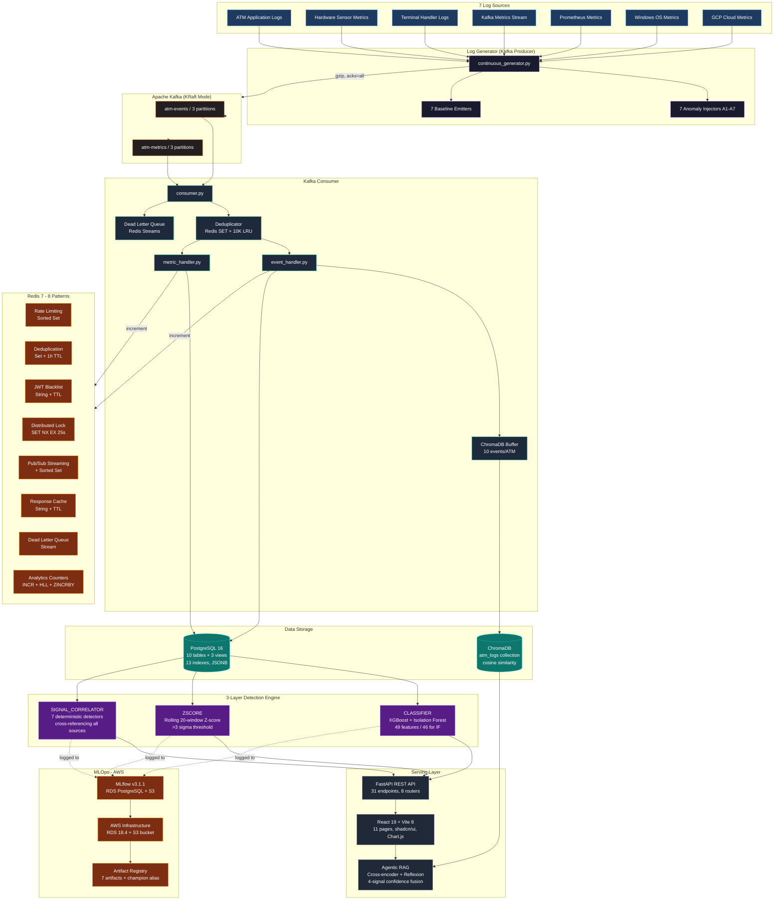
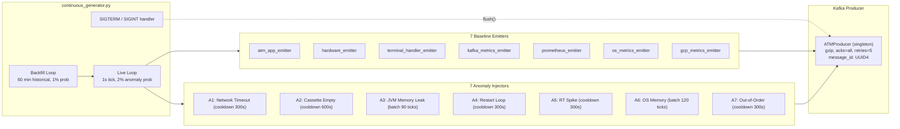
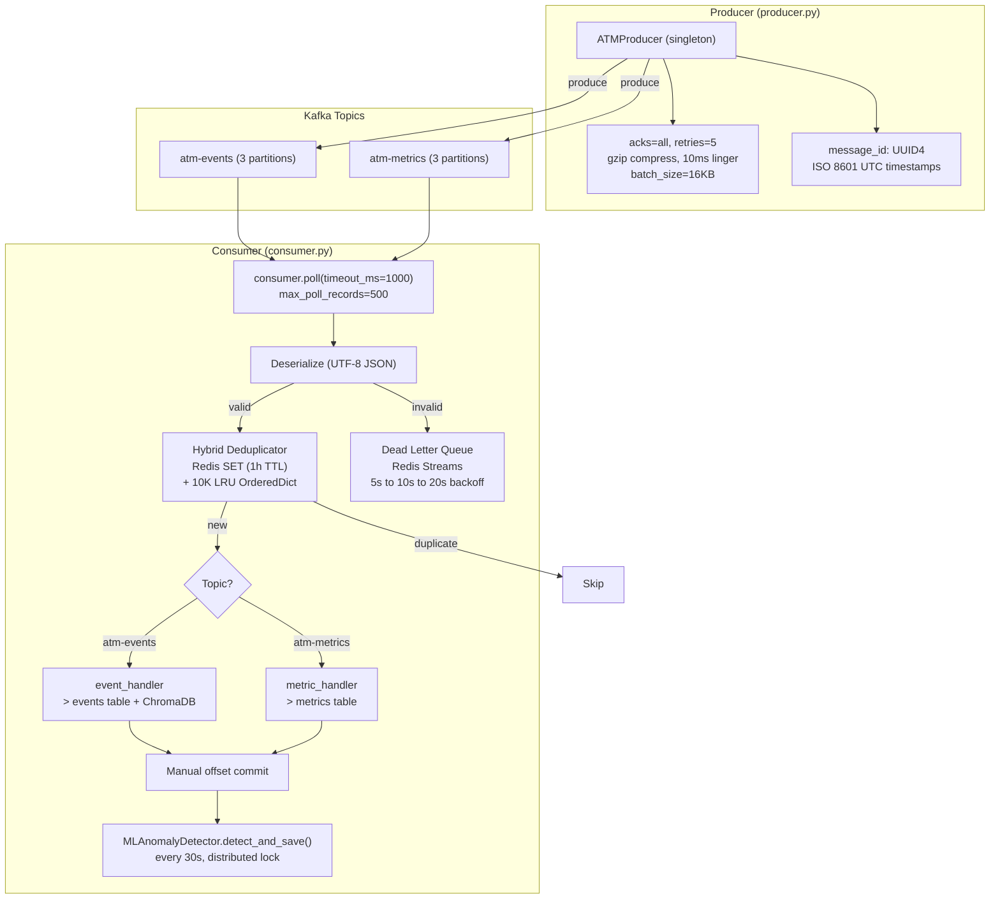
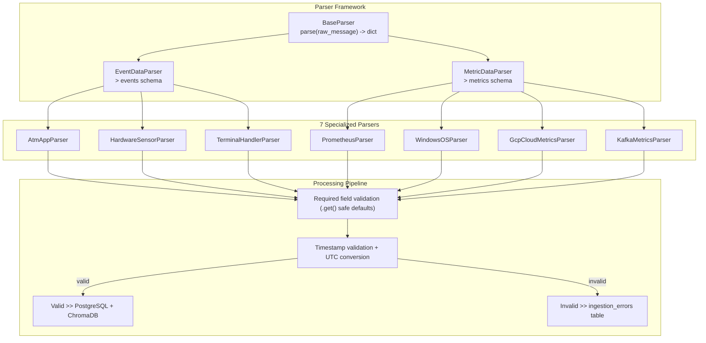
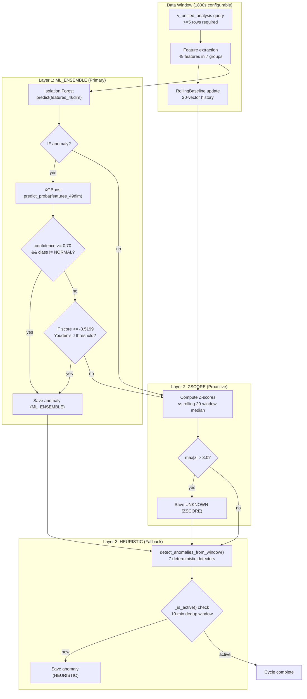
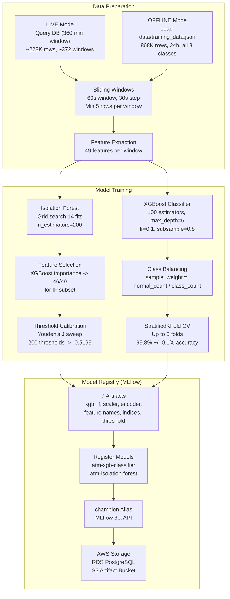

# ATM Log Aggregation, Analysis & Diagnostics Platform (LAAD)

Production-grade ATM log aggregation, anomaly detection, and AI-assisted diagnostics platform. Ingests synthetic logs from 7 sources via Apache Kafka, detects 7 anomaly types across 3 detection layers (ML + statistical + heuristic), ranks by weighted criticality, and serves a React dashboard with root cause analysis, operational impact, and recommended remediation. Extended with an Agentic RAG diagnostic assistant featuring cross-encoder reranking, self-consistency scoring, reflexion (self-critique), citation grounding, and multi-signal confidence fusion. MLOps via MLflow (RDS PostgreSQL + S3 on AWS).

<p align="center">
  
  
  
  
  
  
  
  
  
  
  
  
  
</p>

---

## System Architecture



**Pipeline flow:** 7 log sources generate data via continuous Kafka producer (gzip, acks=all) into 2 topics (3 partitions each). Consumer deduplicates (Redis SET + 10K LRU), parses via 7 source-specific parsers, dual-writes to PostgreSQL + ChromaDB, and routes failures to a Redis Stream dead-letter queue with exponential backoff. A 3-layer detection engine (ML_ENSEMBLE + ZSCORE + HEURISTIC) runs every 30s against time-windowed data. FastAPI serves 31 endpoints consumed by the React dashboard and Agentic RAG assistant. MLflow on AWS (RDS + S3) tracks all training and inference cycles.

---

## Key Metrics at a Glance

| Metric | Value |
|---|---|
| Log Sources | 7 simultaneous (ATM_APP, HARDWARE, TERMINAL_HANDLER, KAFKA, PROMETHEUS, OS, CLOUD) |
| ATMs Monitored | 10 ATMs + 3 Servers |
| Anomaly Types | 7 known (A1-A7) + UNKNOWN (novel pattern detection) |
| Detection Layers | 3 (ML_ENSEMBLE, ZSCORE, HEURISTIC) |
| ML Features | 49 engineered features across 7 groups (46 selected for IF) |
| XGBoost CV Accuracy | 99.8% +/- 0.1% (StratifiedKFold, 8 classes) |
| Isolation Forest Precision | 97.3% (grid search + feature selection + threshold calibration) |
| IF UNKNOWN Threshold | -0.5199 (Youden's J calibration, F1=0.7008) |
| Messages Processed | 930,000+ events, 100+ messages/sec live |
| Database Tables | 10 tables + 3 views + 13 indexes |
| API Endpoints | 31 across 8 routers |
| Tests | 654 (523 backend + 131 frontend), 70 test files |
| Docker Services | 9 production (frontend + 8 backend) + 2 test |
| Redis Patterns | 8 distinct (sorted sets, sets, Pub/Sub, streams, HyperLogLog, distributed locks, caching, blacklists) |
| RAG Confidence | Multi-signal fusion: retrieval (30%) + self-consistency (25%) + verbalized (25%) + grounding (20%) |
| RAG Response Time | 11-23s (uncached), <100ms (cached) |
| MLflow | RDS PostgreSQL backend + S3 artifact store, 2 registered models with "champion" alias |
| Frontend Pages | 11 pages (React 19 + Vite 8 + Tailwind v4 + Chart.js) |
| LLM Providers | 4 (Ollama Cloud primary, OpenRouter emergency) with 3 fallback models |
| Kafka Topics | 2 (atm-events, atm-metrics), 3 partitions each, gzip, 7-day retention |

---

## Demonstration

<p align="center">
  
  <br>
  <em>End-to-end pipeline walkthrough: log generation, Kafka ingestion, 3-layer detection, dashboard rendering</em>
</p>

<table>
  <tr>
    <td width="50%">
      
      <br>
      <b>AWS MLflow</b> — browsing RDS-tracked experiments, S3 artifact store, champion model aliases (atm-xgb-classifier, atm-isolation-forest)
    </td>
    <td width="50%">
      
      <br>
      <b>3-Layer Detection</b> — real-time anomaly appearance on dashboard, filtering by detection source (ML_ENSEMBLE / ZSCORE / HEURISTIC), criticality ranking
    </td>
  </tr>
  <tr>
    <td width="50%">
      
      <br>
      <b>Agentic RAG</b> — submitting a diagnostic query, watching the 4-signal confidence breakdown animate, expanding the reflexion critique, and inspecting citation-grounded sources
    </td>
    <td width="50%">
      
      <br>
      <b>Real-Time Analytics</b> — Chart.js dashboard with 5s polling, toggling metric sources on the stacked bar chart, sliding time-range selector (1h to All Time)
    </td>
  </tr>
  <tr>
    <td width="50%">
      
      <br>
      <b>Kafka Pipeline</b> — docker compose logs showing deduplication skipping redelivered messages, DLQ retry with exponential backoff, distributed lock acquisition for anomaly detection
    </td>
    <td width="50%">
      
      <br>
      <b>Redis Patterns</b> — rate limiting blocking requests beyond 10 req/min, Pub/Sub streaming anomalies to dashboard, HyperLogLog cardinality estimation, sorted set anomaly leaderboard
    </td>
  </tr>
</table>

### Recording GIFs

Use QuickTime Player (macOS) to record screen regions, then convert with ffmpeg:

```bash
# Trim, resize to 800px wide, and optimize palette for smooth GIFs
ffmpeg -i input.mov -vf "fps=10,scale=800:-1:flags=lanczos,palettegen" palette.png
ffmpeg -i input.mov -i palette.png -vf "fps=10,scale=800:-1:flags=lanczos" -loop 0 output.gif
```

Suggested recording targets per GIF:

| GIF | What to Record | Duration |
|---|---|---|
| `architecture-overview.gif` | `make all` startup, docker compose ps, brief tour of each service log | 30s |
| `aws-mlflow.gif` | MLflow UI (localhost:5001), experiments page, model registry with champion aliases | 20s |
| `detection-engine.gif` | Dashboard anomaly list, toggle detection source filter, watch new anomaly appear on auto-refresh | 25s |
| `rag-assistant.gif` | Submit "what's causing high response times on ATM 3", watch confidence bars + critique expand | 20s |
| `analytics-dashboard.gif` | Analytics page, toggle time range from 1h to 7d, click source filters, switch metrics | 25s |
| `kafka-pipeline.gif` | `docker compose logs kafka-consumer --tail 50 -f` showing dedup + detection trigger | 20s |
| `redis-patterns.gif` | `docker compose exec redis redis-cli` showing sorted set rate limiting, Pub/Sub, HLL | 20s |

---

## Component Deep Dives

### Log Generation Pipeline



**Key implementation details:**

- **Pure Kafka producer** — no direct database writes. The generator only produces to Kafka topics. If the consumer falls behind, data is safely buffered in Kafka (7-day retention). This replaced the original single-script direct-DB writer architecture entirely.
- **Batch anomaly emission** — A3 (JVM Memory Leak) and A6 (OS Memory Pressure) emit all 90/120 historical ticks in a single call with timestamps spread over the past 90/120 minutes. This ensures the full progressive degradation pattern (300MB to 1040MB JVM heap) is immediately available for detection rather than requiring multiple 1s generator cycles to accumulate.
- **Probabilistic server targeting** — A3, A4, and A6 target server entities (`ATM-SERVER-001` to `ATM-SERVER-003`) with 40% probability. Anomaly injectors select entity type then specific ID, enabling server-side anomaly detection alongside ATM monitoring.
- **Anomaly cooldown system** — each injector enforces a cooldown period (300s for A1/A4/A5/A7, 600s for A2) using `time.monotonic()` tracking to prevent overlapping injections that would corrupt detection signals.

Anomaly injector mechanisms and exact signals:

| Injector | Mechanism | Duration | Exact Signals |
|---|---|---|---|
| A1 | `NETWORK_DISCONNECT` + Kafka `Offline` + `NETWORK_TIMEOUT` across 3+ sources | 300s cooldown | error_code=ERR-0040, response_time_ms=30000 |
| A2 | `CASSETTE_LOW`x2 + `CASSETTE_EMPTY`x2 + Kafka `Out of Service` | 600s cooldown | atm_status="Out of Service", transaction_rate_tps=0.0 |
| A3 | Batch `jvm_memory_used_bytes` 300MB to 1040MB + GC 0.45s to 24.7s | 90 ticks (batch) | OutOfMemoryError FATAL, 40% server prob |
| A4 | GCP `restart_count` 1 to 2 + >=3 STARTUP events + 2x FATAL | 300s cooldown | container_id changes each STARTUP, 40% server prob |
| A5 | Kafka `response_time_ms` 3200 to 30000ms + success_rate 100% to 50% | 300s cooldown | failure_count 8 then 14, ERR-0012 |
| A6 | Batch `memory_usage_percent` 46% to 98.75% + network_errors 0 to 22 | 120 ticks (batch) | ThreadAbortException, 40% server prob |
| A7 | Kafka offset 4050 out-of-order + offset 4051 null fields + Prometheus malformed | 300s cooldown | metric_value="890iembre" (non-numeric) |

---

### Kafka Message Bus

Apache Kafka (KRaft mode, no ZooKeeper) serves as the central message bus, decoupling log generation from ingestion. This was a major architectural extension replacing direct DB writes with an event-driven pipeline.



**Hybrid deduplication** (`backend/kafka/deduplicator.py:1-86`):
- Primary: Redis Set with `SADD`/`SISMEMBER` + 1-hour TTL — persists across consumer restarts, eliminating duplicate inserts after restart
- Fallback: in-memory LRU `OrderedDict` (max 10,000 entries) — auto-evicts oldest when full
- Lazy Redis availability check: if Redis fails mid-operation, permanently switches to in-memory to avoid repeated `try/except` overhead

**Distributed detection lock** (`backend/kafka/consumer.py:92-128`):
- Redis `SET NX EX` key `lock:anomaly_detection` with 25s timeout (5s buffer before 30s trigger interval)
- Prevents concurrent detection cycles in multi-consumer deployments
- Falls back to `True` (proceed without lock) when Redis is unavailable

**Dead letter queue** (`backend/kafka/dlq.py:1-134`):
- Redis Stream `ingestion:dlq` with `retry_count`, `created_at`, `status` metadata
- Exponential backoff: `BASE_BACKOFF * (2^retry_count)` = 5s to 10s to 20s
- Max 3 retries, then marked as `exhausted`
- Batch processing of 10 messages per cycle

**Consumer configuration:**
- Manual offset commit after batch processing (at-least-once delivery)
- `auto_offset_reset=latest` — skip historical messages on restarts to prevent data flood
- `max_poll_records=500` — balances throughput vs memory per cycle
- Rate-limited anomaly detection trigger every 30s with Redis distributed lock

---

### Ingestion & Parser Architecture



**Implementation highlights:**

- **Safe defaults everywhere** — every parser uses `.get()` on raw message dicts. A missing field in a Kafka stream never halts ingestion for that source. Previously used strict dict access (`message["field"]`) which crashed on schema drift.
- **`_datetime_safe_json_dumps()`** (`backend/src/anomaly_detection/anomaly_detector.py:23-25`) — custom JSON serializer used across 9 anomaly detection paths to prevent `"Object of type datetime is not JSON serializable"` crashes when writing to PostgreSQL JSONB columns.
- **Dead-letter routing** — malformed records route to `ingestion_errors` table rather than raising exceptions. The consumer also routes undeserializable bytes via `_route_to_ingestion_errors()`.

**ChromaDB buffer** (`backend/kafka/chroma_buffer.py:1-181`):
- Per-ATM event buffer with window size 10 events
- LangChain `SemanticChunker` with `nomic-embed-text` (Ollama) for 384-dim embeddings, falling back to word-based chunking at 500-char max
- Severity dominance logic with priority: `FATAL=5 > CRITICAL=4 > ERROR=3 > WARNING=2 > INFO=1`
- Anomaly tag via majority vote across buffered events
- IDs formatted as `{atm_id}_{uuid4()}` for upsert idempotency
- Graceful degradation: silently skips if ChromaDB is unavailable

---

### Database Design

PostgreSQL 16 (Alpine) with a lean data lake design — unified `events` and `metrics` tables with JSONB payloads, plus dedicated tables for anomalies, RAG data, and calibration.

```mermaid
erDiagram
    ATMS {
        text atm_id PK
        text os_version
        text location_code
    }
    EVENTS {
        bigint id PK
        timestamptz timestamp
        text atm_id FK
        text event_type
        text severity
        jsonb payload
    }
    METRICS {
        bigint id PK
        timestamptz timestamp
        text entity_id
        text metric_name
        double precision metric_value
        jsonb payload
    }
    ANOMALIES {
        bigint id PK
        timestamptz detected_at
        text anomaly_type
        text atm_id FK
        double precision model_confidence_score
        text severity
        jsonb sources_involved
        int is_active
        int is_starred
    }
    INGESTION_ERRORS {
        bigint id PK
        timestamptz timestamp
        text source
        text error_detail
        text raw_input
    }
    USERS ||--o{ RAG_QUERIES : ""
    RAG_QUERIES ||--o{ RAG_FEEDBACK : ""
    ATMS ||--o{ EVENTS : ""
    ATMS ||--o{ METRICS : ""
    ATMS ||--o{ ANOMALIES : ""
```

**Schema highlights:**

| Feature | Implementation | Purpose |
|---|---|---|
| **Unified events + metrics** | 2 tables with JSONB payload. Adding a new source = new parser, no schema changes | NFR7 extensibility |
| **v_unified_analysis view** | `UNION ALL` of `v_events_flat` and `v_metrics_flat` with `COALESCE` for cross-source field normalization | Single query for ML feature engineering |
| **13 B-tree indexes** | Composite indexes on `(timestamp, entity, type)` for events, metrics, anomalies | Query performance under 930K+ rows |
| **JSONB payloads** | Source-specific fields stored as JSONB, flattened via views | Schema flexibility without migration overhead |
| **Connection pool** | `ThreadedConnectionPool` (min=5, max=50) with 3-retry exponential backoff | Handles concurrent API + ML detector + generator + cleanup |
| **Batched retention cleanup** | 5,000 rows/batch DELETE + VACUUM, filters on `is_active = 1` | Preserves unresolved anomalies regardless of age |
| **Thread-safe cursor** | `RealDictCursor` returns rows as dicts | Easy field access across FastAPI and Kafka consumer threads |

---

### 3-Layer Anomaly Detection Engine

The core detection system combines machine learning, statistical analysis, and deterministic rule-based correlation to identify all 7 known anomaly types (A1-A7) plus novel patterns (UNKNOWN). Runs every 30 seconds against time-windowed data from the kafka-consumer service.



#### Layer 1: ML_ENSEMBLE (Primary)

Active only when ML models are loaded from `ml/artifacts/`. The most technically intricate layer:

- **Two independent feature paths** (`backend/src/anomaly_detection/ml/ml_detector.py:508-527`): XGBoost receives the full 49-dim feature vector (matching its training), while Isolation Forest receives a 46-dim subset after feature selection. This avoids `ValueError: Feature shape mismatch` that occurred when a shared feature path was used for both models.
- **Scaler fitted on 49 features**: `StandardScaler` transforms all 49 features before the feature selection subset is applied. Previously the scaler was fitted on 46 features, causing inference-time shape mismatches.
- **Decision logic**: IF anomaly flag -> XGBoost `predict_proba` with class probability distribution. Known anomalies saved when `class != NORMAL` and `confidence >= 0.70`. Unknown anomalies saved when `class == NORMAL` but `IF score <= -0.5199` (Youden's J calibrated threshold).

#### Layer 2: ZSCORE (Proactive)

Always active, independent of ML models:

- Rolling 20-vector history maintains per-feature median and std
- `z_i = (x_i - median_i) / std_i` — features deviating >3 sigma from rolling median are flagged
- Confidence scaled: `min(max|z| / 5.0, 1.0)`
- Requires minimum 5 vectors before computing baseline
- Detects distribution shift and data drift even when ML classifiers are not loaded

#### Layer 3: HEURISTIC (Fallback)

Always active safety net (`backend/src/anomaly_detection/anomaly_detector.py:100-753`):

- 7 deterministic detectors cross-reference signals across all data sources
- A1: Requires >=3 of 4 signals (network_disconnect, timeout, kafka_offline, terminal_network_error) for same ATM
- A2: Hardware `CASSETTE_EMPTY` + Kafka `OutOfService` + dispense errors with 0 TPS
- A3: 90-minute lookback window, >=20% relative increase in JVM memory AND OOM event
- A4: >=1 restart + >=2 STARTUP or >=2 FATAL events, regex-extracts ATM IDs from pod names
- A5: >=2 Kafka response_time_ms >=3000 + ATM_APP TIMEOUT with ERR-0012
- A6: OS memory >=90% OR >30% increase over 3+ samples + ThreadAbortException
- A7: Out-of-order offsets (60s threshold), null fields, Prometheus malformed values, paired ingestion errors within 5-min window

#### Deduplication and Attribution

- **Cross-layer dedup**: `set[tuple[str, str | None]]` tracks `(anomaly_type, atm_id)` pairs from ML_ENSEMBLE, so HEURISTIC skips duplicates
- **10-min dedup window**: `_is_active()` checks `SELECT 1 FROM anomalies WHERE ... detected_at >= now() - 10min` to prevent repeated saves across consecutive 30-second cycles
- **Auto-expanding window**: if fewer than 5 rows in primary 60s window, automatically expands to 120s fallback
- **Entity attribution**: `_attribution_for()` assigns entity per anomaly type — A1/A2/A5/A6/A7 use most frequent ATM, A3/A4 parse from `pod_name` via regex

#### 49 ML Features

| Group | Count | Features |
|---|---|---|
| Metric statistics | 16 | JVM memory mean/max/rate, GC pause mean/max/slope, CPU usage mean/max, OS memory mean/max/rate, network errors max, Kafka RT mean/max, success rate min, container restarts max |
| Percentiles | 9 | JVM p75/p95, OS memory p75/p95, Kafka RT p75/p90/p99, CPU p90/p99 |
| Temporal slopes | 5 | Linear regression slopes for JVM memory, OS memory, Kafka RT, success rate, CPU usage |
| Event counts | 10 | ERROR, FATAL, STARTUP, OOM, cassette empty/low, Kafka offline/null, timeouts, disconnects |
| Severity-weighted | 2 | FATAL-weighted sum (FATAL*3 + ERROR*2), total error count |
| Cross-source flags | 7 | Unique sources with errors, boolean flags for OOM/NETWORK_DISCONNECT/TIMEOUT, Kafka out-of-order count, anomaly tag count, unique ATMs in window |

---

### ML Training & MLOps



**Training results:**

| Metric | Value |
|---|---|
| Cross-validation accuracy | 99.8% +/- 0.1% (StratifiedKFold, 7,190 windows, 49 features) |
| Per-class precision/recall | 1.0 across all 8 classes (A1-A7 + NORMAL) |
| Isolation Forest anomaly precision | 97.3% (up from 92.9% baseline) |
| IF AUC-ROC | 0.9502 |
| Grid search | Sequential 1D sweep: 14 total fits (not 200), evaluating contamination, max_features, max_samples |
| Feature selection | 46 of 49 features retained (XGBoost importance > 0 filter) |
| UNKNOWN threshold | -0.5199 (Youden's J over 200 candidate thresholds, optimal F1=0.7008) |

**Threshold calibration** (`train.py:135-164`):
- Sweeps 200 candidate IF score thresholds across the range -0.05 to -1.50 against held-out normal and unseen anomaly windows
- Maximizes Youden's J statistic (`sensitivity + specificity - 1`)
- Optimal F1=0.7008 at threshold -0.5199, replacing the previous manual default of -0.75
- Calibrated threshold saved as `if_unknown_threshold.json`, loaded by detector on startup with fallback to -0.75

**MLflow MLOps** (`train.py:444-467`):
- Registered model aliases via `set_registered_model_alias("champion")` for both `atm-xgb-classifier` and `atm-isolation-forest`
- RDS PostgreSQL 18.4 backend store + S3 artifact bucket (`s3://laad-mlflow-artifacts`)
- Custom MLflow Docker image (`mlflow/Dockerfile`) adds `psycopg2-binary` (RDS driver) and `boto3` (S3 SDK) — not included in the official MLflow image
- Auto-retrain on startup if model artifacts are missing, corrupted, or scikit-learn version-skewed
- Git SHA tagging: checks `GIT_COMMIT_SHA` env var first, falls back to `git rev-parse HEAD`

**7 ML artifacts:**

| Artifact | Description |
|---|---|
| `xgb_classifier.joblib` | XGBoost multi-class (49 features, 8 classes) |
| `isolation_forest.joblib` | Isolation Forest (46 features) |
| `label_encoder.joblib` | Class index to label mapping |
| `scaler.joblib` | StandardScaler (49 features, transforms before subset) |
| `feature_names.json` | All 49 feature names |
| `if_feature_indices.json` | 46 selected feature indices for IF |
| `if_unknown_threshold.json` | Calibrated UNKNOWN threshold (-0.5199) |

---

### Agentic RAG Diagnostic Assistant

An agentic RAG system with 4-stage reasoning (self-consistency, reflexion, citation grounding, verbalized confidence) and multi-signal confidence fusion. Uses Ollama Cloud as primary LLM provider with OpenRouter as emergency fallback. Features intelligent query classification that routes stats queries directly to the database.


**4 agentic features:**

| Feature | Method | Impact | Literature |
|---|---|---|---|
| Cross-Encoder Reranking | `cross-encoder/ms-marco-MiniLM-L-2-v2` scores (query, chunk) pairs jointly | +5-15% retrieval relevance over bi-encoder cosine | Nogueira & Cho 2019 |
| Self-Consistency | 3 parallel samples at temp=0.7 via `ThreadPoolExecutor`, character 3-gram Jaccard pairwise similarity | Detects ambiguous queries (high variance = low confidence) | Wang et al. 2022 (ICLR) |
| Reflexion | Two-pass: generate -> critique (temp=0.2) -> regenerate (temp=0.3) if unsupported claims found. `NO_ISSUES_FOUND` guard skips regeneration | Catches hallucinated claims before delivery | Shinn et al. 2023 |
| Citation Grounding | Regex extraction of ATM IDs, error codes (ERR-XXXX), anomaly types (A1-A7), correlation IDs -> string matching against source chunks | Ensures every cited entity exists in retrieved sources | Grounded RAG patterns |

**Multi-signal confidence fusion** (`backend/src/rag/uncertainty.py:85-137`):

| Signal | Weight | Method |
|---|---|---|
| Retrieval distance | 30% | `1.0 - min(avg_distance, 1.0)` + count bonus + diversity bonus |
| Self-consistency | 25% | 3-sample pairwise 3-gram Jaccard similarity |
| Verbalized confidence | 25% | LLM self-rating on 0-1 scale prompted: "is your answer supported by context?" |
| Citation grounding | 20% | Fraction of extracted entities verified in source chunks |

Missing signals are skipped and remaining weights renormalized. Final confidence assigned as HIGH (>=0.8), MEDIUM (>=0.5), or LOW (<0.5).

**Latency optimization** (sequential 26-53s -> parallel 11-23s):

| Optimization | Before | After | Speedup |
|---|---|---|---|
| Self-consistency | 3 sequential LLM calls (15-30s) | 3 concurrent calls via ThreadPoolExecutor (5-10s) | 2-3x |
| First sample reuse | 3 samples + 4th separate generation | First sample doubles as primary response | 5-10s saved |

**Query classification** (`backend/src/rag/utils.py:29-62`):
- Stats queries ("how many anomalies") -> direct PostgreSQL COUNT/GROUP BY, bypasses LLM entirely
- Diagnostic queries ("what's causing...") -> full RAG pipeline with structured Analysis + Root Cause + Actions
- Troubleshooting queries ("how to fix...") -> numbered steps with expected outcomes
- Intent detection: error_only, comprehensive ("all issues" overrides error_only), most_recent_first

**Prompt injection protection** (`backend/src/rag/utils.py:111-125`):
Filters 5 dangerous patterns: `ignore previous instructions`, `system:`, `<system>`, `you are now`, `forget everything`

**Calibration** (Platt scaling):
- `calibrated_conf = sigmoid(scale * raw_conf + bias)` via `scipy.optimize.minimize` (Nelder-Mead)
- Auto-recalibrates every 20 feedback samples
- ECE target < 0.10 using 5 bins

**LLM provider chain:**
1. Ollama Cloud (`gemma4:31b-cloud`) -- primary
2. Ollama Fallback (`nemotron-3-supercloud`)
3. OpenRouter chain: DeepSeek V3 -> Llama 4 Maverick -> Qwen 3 -> DeepSeek R1
4. Context-aware graceful degradation (structured log extraction without LLM)

---

### Redis Infrastructure (8 Patterns)

All modules use a shared Redis client singleton (`backend/src/cache/redis_client.py`) with connection pooling (max 20 connections, 2s timeouts). Every pattern has a graceful degradation path when Redis is unavailable.

| Pattern | Data Structure | Location | Use Case | Degradation |
|---|---|---|---|---|
| Rate Limiting | Sorted Set (ZADD + ZREMRANGEBYSCORE + ZCARD) | `rag/router.py:46-66` | 10 requests/min per user sliding window | Falls back to in-memory counters |
| Message Dedup | Set + 1h TTL (SADD + SISMEMBER) | `kafka/deduplicator.py:56-86` | Cross-restart Kafka dedup | Falls back to LRU OrderedDict |
| JWT Blacklist | String + TTL (SETEX) | `auth/auth_router.py` | Secure logout, compromised token invalidation | Falls back to in-memory set |
| Distributed Lock | SET NX EX 25s | `kafka/consumer.py:92-128` | Prevent concurrent anomaly detection | Proceeds without lock (returns True) |
| Real-Time Streaming | Pub/Sub + Sorted Set (PUBLISH + ZINCRBY) | `alerts/pubsub.py:31-55` | Anomaly alerts to dashboard | Silently skips |
| Response Caching | String + TTL (GET + SETEX) | `rag/cache.py:21-47`, `anomalies_router.py:41-67` | RAG (300s) + anomaly list (15s) caching | Returns None, caller proceeds with fresh query |
| Dead Letter Queue | Stream (XADD + XREAD + XDEL) | `kafka/dlq.py:33-134` | Failed message retry with exponential backoff | Skips DLQ processing |
| Analytics Counters | INCR + HyperLogLog + ZINCRBY | `analytics_analytics_router.py:265-309` | Real-time event counts, unique ATMs, anomaly type frequency | Returns zeros |

---

### Frontend Architecture

- **React 19 + Vite 8 + Tailwind CSS v4 + Chart.js + shadcn/ui-style components** -- 11 pages, all with skeleton loading states and 30s/5s auto-refresh
- **RAGProvider 3-layer persistence** (`frontend/src/providers/RAGProvider.jsx`): React context (survives route changes) + localStorage (survives full page reloads, max 50 messages) + PostgreSQL (permanent query history via `/api/rag/history`)
- **Smart proxy rewriting** (`frontend/vite.config.js`): `/api/insights/*` rewritten to `/api/analytics/*` for backward compatibility, `/api/*` strips prefix and forwards to backend
- **6-filter anomaly list**: sort (criticality/recent/severity), entity type (ATM/server), anomaly type, severity, detection source, text search -- 20 items/page
- **Analytics dashboard**: 4 simultaneous Chart.js visualizations (stacked bar, line with fill, doughnut, KPI cards), 5 time ranges with adaptive bucket sizes (5min to 1440min), metric selector, source toggle badges, 5s polling
- **Entity-aware badges**: purple `Server` badge with server icon vs blue `ATM` badge, entity type filter in sidebar, dynamic entity list from `/api/analytics/entities`
- **Auth**: JWT-based with bcrypt password hashing, `require_admin` guard, Redis token blacklist for secure logout

---

### Infrastructure & AWS

| Service | Technology | Purpose |
|---|---|---|
| PostgreSQL | 16 Alpine | Primary database, health-checked with `pg_isready` |
| Apache Kafka | confluentinc/cp-kafka:7.5.0 | KRaft mode (no ZooKeeper), 7-day retention |
| Kafka Consumer | Python + kafka-python | Dedup + parse + dual-write + 30s detection trigger |
| ChromaDB | chromadb/chroma | Vector database for RAG retrieval |
| Backend API | FastAPI + Uvicorn (4 workers) | 31 endpoints, 8 routers, APScheduler cleanup |
| Log Generator | Python + kafka-python | Pure Kafka producer (no direct DB writes) |
| MLflow | custom Dockerfile | Experiment tracking + model registry, psycopg2+boto3 for AWS |
| Redis | 7 Alpine | 8 distributed patterns, shared connection pool |
| Frontend | nginx alpine | Multi-stage build: Node.js builder → nginx, proxy rewrites /api/* |
| AWS RDS | PostgreSQL 18.4 | MLflow tracking backend (`laad-mlflow-postgres`) |
| AWS S3 | Standard bucket | MLflow artifact store (`s3://laad-mlflow-artifacts`) |

**Key infrastructure decisions:**
- **9 Docker services + 2 test services** with health check cascading (postgres -> kafka -> backend/consumer/generator -> frontend)
- **6 named volumes** for data persistence across restarts
- **Profile-based Docker Compose**: `ml` and `test` profiles keep optional services separate
- **Auto-retrain on startup**: FastAPI lifespan event checks `xgb_classifier.joblib` existence and loadability; triggers retrain if missing, corrupted, or scikit-learn version-skewed
- **Hourly retention cleanup** via APScheduler with batched DELETE (5,000 rows/batch) + VACUUM
- **Production-like frontend**: Multi-stage Docker build (node builder → nginx alpine, ~25MB final image) with no Node.js runtime, all assets minified

---

## Testing

All tests run in Docker with isolated test infrastructure (separate PostgreSQL instance on port 5433).

```bash
make test              # Full test suite (backend + frontend)
make test-backend      #   Backend only (523 tests)
make test-frontend     #   Frontend only (149 tests)
```

### Backend

- **Framework:** pytest 9 + pytest-cov 7
- **Coverage:** runs with `--cov=backend/src --cov=backend/generator --cov=backend/kafka`
- **Test DB:** isolated `atm_platform_test` on port 5433, auto-initialized via `init_db(force=True)`
- **Coverage config:** `.coveragerc` at project root

### Frontend

- **Framework:** vitest 4 + @testing-library/react 16
- **Coverage:** runs with `--coverage` via `@vitest/coverage-v8`
- **DOM:** jsdom 29 with localStorage polyfill + `scrollIntoView` stub
- **Config:** `frontend/vitest.config.js`, glob patterns `src/test/**/*.test.{js,jsx}`

| Metric | Value |
|---|---|
| Backend tests | 523 passing (35 test files) |
| Frontend tests | 149 passing (36 test files) |
| Test database | Isolated (`atm_platform_test`, port 5433) |
| Test tiers | 10 (unit, integration, stress, security, ML, RAG, Redis, Kafka, generators, parsers) |

**Critical defects caught by the test suite:**

| Defect | Resolution |
|---|---|
| Silent data loss under 50 concurrent writes | Exponential backoff added to `write_helper.py` |
| JWT privilege escalation (admin endpoint accessible by standard users) | `require_admin` dependency guard added |
| Parser crashes on schema drift (strict dict access) | All parsers migrated to `.get()` with safe defaults |
| Unresolved anomalies deleted by retention cleanup | Cleanup filtered to `is_active = 1` only |
| Integration test always passed (no real assertions) | Changed to `count_after > count_before` pattern |
| Generator wrote directly to DB (violated Kafka-only architecture) | Emitters refactored to use Kafka producer exclusively |
| Duplicate anomaly writes from concurrent detection cycles | Removed APScheduler; only Kafka consumer triggers detection; 10-min dedup window |

---

## Design Decisions

**Lean data lake schema.** Rather than source-specific tables, all records land in two unified tables (`events` + `metrics`) with JSONB payloads. Adding a new log source requires only a new parser -- no schema changes or detector modifications. The `v_unified_analysis` view provides a single query target for the ML pipeline by merging both tables with COALESCE-based field normalization.

**At-least-once Kafka delivery with Redis-backed deduplication.** Kafka provides at-least-once delivery by default. The hybrid deduplicator (Redis SET + 10K LRU) eliminates duplicate inserts after consumer restarts, which the previous in-memory-only approach could not prevent. Manual offset commits ensure the consume-dedup-write-commit cycle is transactional.

**3-layer defense in depth.** ML_ENSEMBLE catches known patterns and calibrated novel anomalies when ML models are loaded. ZSCORE operates independently of models to detect statistical distribution shifts. HEURISTIC is the always-active safety net using deterministic multi-source correlation. Each layer has a different failure mode, so no single point of failure exists. All layers are permanently enabled (no user-configurable toggles).

**Distributed coordination via Redis.** Rather than a separate coordination service, 8 Redis patterns provide rate limiting, dedup, locking, streaming, caching, analytics, and dead-letter queuing through a single shared client with connection pooling. Every operation has a graceful degradation fallback -- the system never hard-depends on Redis availability.

**Data privacy in RAG.** Log data in ChromaDB never leaves the network. Only retrieved snippets and user queries are sent to the LLM API. When all providers are unavailable, the system falls back to local structured log extraction with no external calls.

**JWT + Redis blacklist for auth.** Stateless JWTs are augmented with a Redis-backed blacklist for secure logout. Token hashes stored with TTL = remaining token expiry. Previously impossible with pure stateless JWTs alone.

---

## Reference

### Anomaly Types (A1-A7)

| ID | Type | Severity | Detection Logic |
|---|---|---|---|
| A1 | Network Timeout Cascade | CRITICAL | >=3 of NETWORK_DISCONNECT + Kafka Offline + TIMEOUT + NETWORK_ERROR |
| A2 | Cash Cassette Empty | CRITICAL | CASSETTE_EMPTY >=1 + Kafka OutOfService + dispense error + 0 TPS |
| A3 | JVM Memory Leak | MAJOR | Monotonically rising JVM heap >=50% + OOM event, 90-min lookback |
| A4 | Container Restart Loop | MAJOR | restart_count > 0 + >=2 STARTUP or >=2 FATAL events |
| A5 | Response Time Spike | MAJOR | >=2 Kafka response_time_ms > 3000 + success_rate < 90% |
| A6 | OS Memory Pressure | MAJOR | OS memory >= 90% OR >30% increase + ThreadAbortException |
| A7 | Out-of-Order Kafka | HIGH | Out-of-order offsets + null fields + malformed Prometheus values |
| UNKNOWN | Novel Pattern | HIGH | IF score <= -0.5199 OR Z-score > 3 sigma |

### Server Entity Support

| Entity Type | IDs | Count |
|---|---|---|
| ATMs | `ATM-GB-0001` to `ATM-GB-0010` | 10 |
| Servers | `ATM-SERVER-001` to `ATM-SERVER-003` | 3 |

A3 (JVM Memory Leak), A4 (Container Restart Loop), and A6 (OS Memory Pressure) can target server entities with 40% probability. A1, A2, A5, A7 are ATM-only.

---

## Getting Started

### Prerequisites

- Python 3.10+ (runtime only, all services run in Docker)
- Docker + Docker Compose
- Node.js v16+ and npm (for frontend dev)

### Quick Start

```bash
git clone https://github.com/AhmedIkram05/laad.git
cd laad
cp .env.example .env
make all                           # Start ALL services (frontend + backend)
```

Default credentials: username=`admin`, password=`admin`

**Production-like frontend deployment:**
- Multi-stage Docker build: Node.js builder → nginx alpine (no Node.js at runtime)
- All assets minified + hashed filenames
- nginx reverse proxy replicates Vite's `/api/*` rewrite logic
- Same origin for frontend and API calls

Services run on:
- Frontend UI: `http://localhost:5173` (nginx)
- Backend API: `http://localhost:8000` (docs at `/docs`)
- MLflow UI: `http://localhost:5001`
- PostgreSQL: `localhost:5434`

### Makefile Commands

| Command | Description |
|---|---|
| `make all` | Start ALL services (frontend + backend) |
| `make rebuild` | Clean rebuild: stop, remove volumes, rebuild, start |
| `make rebuild-frontend` | Rebuild only the frontend service |
| `make rebuild-backend` | Rebuild only the backend service |
| `make train` | Full training pipeline (synthetic dataset build + model training) |
| `make test` | Run full test suite (backend + frontend) |
| `make test-backend` | Run backend tests with coverage |
| `make test-frontend` | Run frontend tests with coverage |
| `make clean` | Stop all containers and remove volumes |
| `make logs` | Follow logs from all services |

---

## Team

| Role | Member |
|---|---|
| Backend & Data Engineering Lead, DB, Ingestion Pipeline, Auth, API, Testing, Continuous Generator, ML Detector, Kafka Integration, MLOps, RAG Diagnostic Assistant | **Ahmed Ikram** |
| Anomaly Detection Logic | Martin Kelly |
| Ranking Algorithm & Analysis Router | Emmanuel Dairo, Addie Tweed |
| Frontend UI | Sarah Kelly (lead), Sam Watts, Ahmed Ikram |
| Scrum Master | Sam Watts |

Built for **NCR Atleos** as part of CS32002 Industrial Team Project, University of Dundee.

> **Contribution note:** The original submitted version included only rule-based detection and a basic single-script generator that wrote directly to the database. The Kafka message bus (producer/consumer pipeline with deduplication), 3-layer ML detection engine (XGBoost + Isolation Forest + Z-score + Signal Correlator), MLOps integration (MLflow experiment tracking, model registry with champion alias), the RAG diagnostic assistant with 4-signal confidence fusion and calibration, the comprehensive test suite (406 tests), and the full API surface were designed, implemented, and tested by **Ahmed Ikram** as an independent post-submission extension.

---

## Related

- [DevSync -- Project Tracker with GitHub Integration](https://github.com/AhmedIkram05/DevSync) -- full-stack cloud app with 541 automated tests
- [W3C Web Logs ETL Pipeline](https://github.com/AhmedIkram05/W3C-ETL-Pipeline) -- parallel Airflow ETL with Power BI analytics
- [StockLens FinTech App](https://github.com/AhmedIkram05/StockLens) -- full-stack mobile app with OCR pipeline and ML forecasting

---

## Further Documentation

- [API Reference](docs/api-reference.md) -- all 31 endpoints with parameters
- [AWS Setup](docs/aws-setup.md) -- production MLflow with RDS + S3
- [Configuration Reference](docs/configuration.md) -- all environment variables and parameters
- [Known Issues](docs/known-issues.md) -- current known issues and mitigations
- [Architecture Fixes](docs/architecture-fixes.md) -- resolved architectural issues