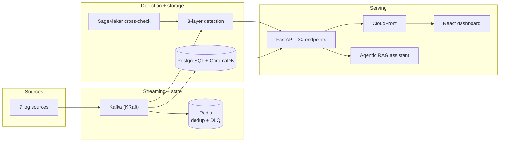
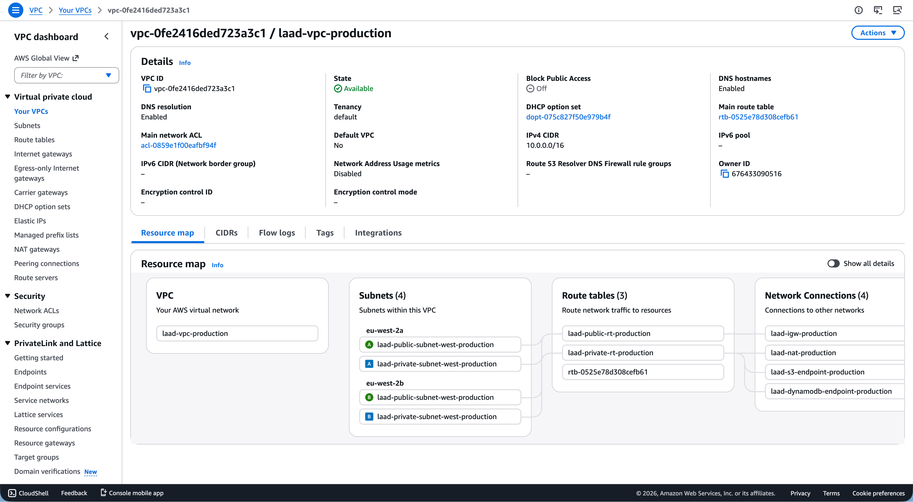
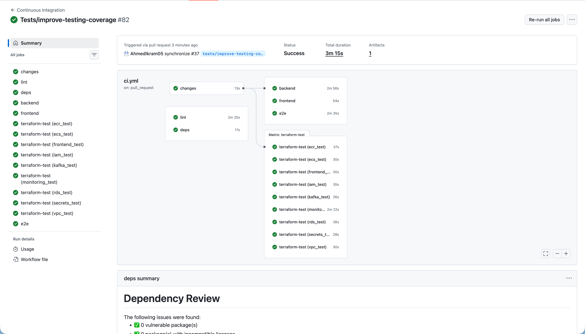

# ATM Log Aggregation, Anomaly Detection & Diagnostics Platform (LAAD)

> An ATM log platform: Kafka ingestion → 3-layer anomaly detection → FastAPI → React dashboard, plus an agentic RAG diagnostic assistant - deployed on AWS ECS Fargate with SageMaker inference.

<p align="center">
<a href="https://www.python.org/"></a>
<a href="https://fastapi.tiangolo.com/"></a>
<a href="https://www.langchain.com/"></a>
<a href="https://www.langchain.com/langgraph"></a>
<a href="https://modelcontextprotocol.io/"></a>
<a href="https://www.postgresql.org/"></a>
<a href="https://kafka.apache.org/"></a>
<a href="https://redis.io/"></a>
<a href="https://www.chromadb.com/"></a>
<a href="https://docs.ragas.io/"></a>
<a href="https://nginx.org/"></a>
<a href="https://xgboost.ai/"></a>
<a href="https://scikit-learn.org/"></a>
<a href="https://pandas.pydata.org/"></a>
<a href="https://ollama.ai/"></a>
<a href="https://aws.amazon.com/sagemaker/"></a>
<a href="https://mlflow.org/"></a>
<a href="https://react.dev/"></a>
<a href="https://vite.dev/"></a>
<a href="https://tailwindcss.com/"></a>
<a href="https://www.chartjs.org/"></a>
<a href="https://www.docker.com/"></a>
<a href="https://www.terraform.io/"></a>
<a href="https://github.com/features/actions"></a>
<a href="https://aws.amazon.com/"></a>
</p>

<p align="center">
<a href="https://github.com/AhmedIkram05/laad/actions/workflows/ci.yml"></a>
<a href="https://github.com/AhmedIkram05/laad/actions/workflows/cd.yml"></a>
<a href="https://github.com/AhmedIkram05/laad/actions/workflows/terraform.yml"></a>
<a href="https://github.com/AhmedIkram05/laad/actions/workflows/eval-gate.yml"></a>
<a href="https://codecov.io/gh/AhmedIkram05/laad"></a>
</p>


## How It Fits Together



7 log sources → Kafka (gzip, acks=all) → deduplicated, parsed, dual-written to PostgreSQL + ChromaDB. A 3-layer detector runs every 30s with live SageMaker cross-check; FastAPI serves the dashboard and the RAG assistant. Full 30-node topology: [System Architecture](docs/README-full.md#system-architecture).

## Every Piece, in One Line

| Component | What it does |
| --- | --- |
| **7 log sources** | ATM application logs, hardware-sensor metrics, terminal-handler logs, and Kafka/Prometheus/Windows/GCP metrics stream from a single generator - pure Kafka producers (gzip, `acks=all`), no direct DB writes |
| **Kafka (KRaft)** | 2 topics × 3 partitions (`atm-events`, `atm-metrics`), 7-day retention; the consumer deduplicates (Redis SET + LRU), parses via 7 source-specific parsers, dual-writes to PostgreSQL + ChromaDB, and routes failures to a Redis Stream DLQ |
| **Detection engine** | 3 layers - XGBoost + Isolation Forest ensemble, rolling 20-window Z-score, 7 deterministic heuristics - running every 30s, cross-checked against the live SageMaker endpoint |
| **PostgreSQL 16** | Unified events/metrics schema: 10 tables, 3 views, 14 indexes, JSONB; adding a source = new parser, zero schema change |
| **ChromaDB** | `atm_logs` collection with 768-dim `nomic-embed-text` embeddings generated locally by Ollama - the RAG assistant's vector memory |
| **FastAPI** | 30 endpoints across 6 routers (auth, anomalies, entities, analysis, admin, RAG) - the one API every consumer hits |
| **React dashboard** | 9 pages, KPI cards polling every 5s, Chart.js analytics, served via CloudFront in production |
| **Agentic RAG** | LangGraph assistant with 12 MCP tools and 4-stage reasoning over the same unified data |
| **SageMaker** | `laad-xgb-champion` (XGBoost 1.7-1, `ml.t2.medium`): 8-class softmax in ~100ms, live-validating detector output |

## Why It's Interesting

| Highlight | Why It Matters |
| --- | --- |
| **Effectively-once Kafka, without Kafka transactions** | Manual offset commits + a 10K-LRU idempotency filter keyed by `message_id` give at-least-once delivery with effectively-once semantics inside the window. [Deep dive](docs/README-full.md#kafka-message-bus) |
| **A confidence system that knows when it's wrong** | Four signals fused and Platt-calibrated; when calibration error drifts above ECE 0.10 it auto-triggers recalibration - the assistant degrades gracefully instead of faking certainty. [Deep dive](docs/README-full.md#agentic-hybrid-rag-diagnostic-assistant-1) |
| **Two models that answer two different questions** | XGBoost classifies the 8 known anomaly classes; the Isolation Forest sidecar separately flags "something is off, but it's not one of the known shapes" - a distinction most anomaly projects skip. [Deep dive](docs/README-full.md#3-layer-anomaly-detection-engine-1) |
| **SageMaker as a cross-check, not a crutch** | Local inference in ~30ms keeps detection independent of the cloud; SageMaker (~100ms) adds an external second opinion per prediction without ever becoming a hard dependency. |

## Key Metrics

| Metric | Value |
| --- | --- |
| Anomaly detection | XGBoost 8-class CV **99.8%** (±0.1%, 868K rows) · Isolation Forest **97.3%** precision, F1 0.70 |
| RAG quality (RAGAS) | faithfulness **0.940** · precision **0.874** · relevancy **0.801** |
| Throughput | **~100 msgs/sec** sustained on one consumer · **2.5M+** events processed |
| API surface | **30 endpoints** across 6 routers |
| Tests gating every PR | **1,438** (959 pytest · 394 vitest · 10 Playwright · 75 Terraform) + 26 security checks |
| Infrastructure | **10 Terraform modules / 118 resources** on AWS: ECS Fargate, RDS, SageMaker, CloudFront, VPC |
| Inference latency | local ~30ms · SageMaker cross-check ~100ms |

## AI - detection & diagnostics

- **3-layer detector** - XGBoost 8-class classifier at **99.8% CV (±0.1%, 868K rows)** plus an Isolation Forest sidecar (**97.3% precision, F1 0.70**) for out-of-class novelty, Z-score drift detection, and always-on heuristics. SageMaker (`ml.t2.medium`) validates predictions live. [Deep dive](docs/README-full.md#3-layer-anomaly-detection-engine-1)
- **Agentic Hybrid RAG** - LangGraph with 12 MCP tools, 4-stage reasoning, cross-encoder reranking, and 4-signal confidence fusion with Platt calibration. RAGAS-evaluated: **faithfulness 0.940, precision 0.874, relevancy 0.801**. [Deep dive](docs/README-full.md#agentic-hybrid-rag-diagnostic-assistant-1) · [Evaluation data](docs/eval/)

  

- **MLOps** - MLflow on AWS (RDS + S3), 7 artifacts per run, champion aliases, auto-retrain when artifacts go missing or corrupt. [Deep dive](docs/README-full.md#ml-training--mlops)

  

## Data engineering - the spine

- **Kafka pipeline** - **~100 msgs/sec sustained** on a single consumer, **2.5M+ events** through the live pipeline: KRaft broker, 2 topics × 3 partitions, 7 source-specific parsers, Redis-SET deduplication, **manual offset commits** (at-least-once, effectively-once within the LRU window), failures routed to a Redis Stream DLQ with retry + backoff. [Deep dive](docs/README-full.md#kafka-message-bus)

  
- **PostgreSQL 16** - unified events/metrics schema with JSONB, 14 indexes, and a `v_unified_analysis` view for time-window semantics. Adding a log source = new parser, zero schema change. [Deep dive](docs/README-full.md#database-design)
- **Redis** - 8 patterns (rate limiting, dedup, locking, Pub/Sub, caching, DLQ, analytics) off one connection pool, each degrading gracefully. [Deep dive](docs/README-full.md#redis-infrastructure-8-patterns)

## IaC - the estate

- **Terraform** - 10 modules, 118 resources: VPC across 2 AZs, ECS Fargate, RDS, SageMaker, CloudFront, Secrets Manager, least-privilege IAM. State locked in DynamoDB + versioned in S3; CI auth via OIDC - no long-lived credentials. [Deep dive](docs/README-full.md#aws-deployment--infrastructure)

  

**What's actually running:**

| Layer | Deployment detail |
| --- | --- |
| Network | VPC `10.0.0.0/16` in eu-west-2, 2 AZs: public subnets host only the ALB + NAT; all application traffic in private subnets, outbound via NAT |
| Compute | ECS Fargate: API service (2 tasks, 2 vCPU / 4GB, Uvicorn ×4) + Consumer service (2 tasks: Kafka ingest + detection engine), rolling updates |
| Broker node | One EC2 in a private subnet hosts Kafka (KRaft), Redis 7, ChromaDB, and Ollama - no network egress, models stay local |
| Databases | App PostgreSQL 16 beside Kafka on the EC2 node (deliberate cost call); MLflow tracking on managed RDS 18.4 with automated backups |
| Storage | 3 S3 buckets - React assets (served via CloudFront), MLflow artifacts (model binaries), Terraform state (versioned + DynamoDB-locked) |
| ML inference | SageMaker endpoint deployed from the MLflow `champion` alias - model saved as JSON for the XGBoost 1.7-1 container |
| Secrets & IAM | Secrets Manager injected straight into ECS task definitions (no `.env` files); least-privilege role per service; GitHub → AWS via OIDC, zero long-lived keys |

- **Quality gates** - **1,438 tests** gating every PR (959 pytest: 955 passed + 4 skipped, across 10 tiers · 394 vitest · 10 Playwright E2E · 75 Terraform assertions), plus 26 security checks. [Deep dive](docs/README-full.md#testing--quality)

  
- **Frontend** - React 19 + Vite + Tailwind v4: 9 pages, KPI cards polling every 5s, Chart.js analytics, shipped as a ~25MB nginx image. [Deep dive](docs/README-full.md#frontend-architecture)

  

## Trade-offs That Mattered

| Decision | Alternative | Why it won |
| --- | --- | --- |
| **3 detection layers, not ML-only** | ML-only, heuristic-only | Independent failure modes: ML catches the 8 known classes, Z-score catches drift, heuristics are the always-on net |
| **XGBoost + Isolation Forest ensemble** | Single XGBoost, LSTM | XGBoost scores the 8 known classes; the unsupervised sidecar catches novelty outside them - "known anomaly" vs "something's wrong" |
| **4-signal confidence fusion + Platt calibration** | LLM verbalised or retrieval-only confidence | Any single signal misleads; fusion with calibration degrades gracefully and resists hallucination |
| **Kafka (KRaft) + manual offset commits** | Redis Pub/Sub, auto-commit | Disk persistence and offset replay; auto-commit risks message loss on crash |
| **Self-hosted ChromaDB + local embeddings** | Pinecone, Weaviate | No per-vector API costs, log data never leaves the network, 768-dim embeddings via local Ollama |
| **Unified PostgreSQL (no TimescaleDB)** | TimescaleDB for metrics | 100+ msg/s under 100ms queries without extension lock-in; `PARTITION BY RANGE` is one DDL away if throughput grows 10× |
| **Entire AWS estate in Terraform** | Console/manual provisioning | Rebuildable in one run, state locked + versioned, 75 assertions in CI |

All 11 recorded decisions with the full reasoning: [Design Decisions](docs/README-full.md#design-decisions)

## Quick Start

```bash
git clone https://github.com/AhmedIkram05/laad.git && cd laad
cp .env.example .env
make all   # everything in Docker: frontend, API, Kafka, detection, RAG
```

Frontend on `:5173` · API on `:8000/docs` · MLflow on `:5001` · Postgres on `:5434`. Default login `admin`/`admin`. [Configuration reference](docs/configuration.md)

## Documentation

- **Everything, in full** - the complete 1,425-line document, preserved verbatim: [docs/README-full.md](docs/README-full.md)
- [API reference](docs/api-reference.md) · [Configuration](docs/configuration.md) · [Anomaly detection guide](docs/anomaly_detection_guide.md) · [RAG evaluation](docs/eval/) · [Demos & media](docs/README-full.md#demos) · [Data dictionary](docs/Data%20Dictionary/) · [Academic project report](docs/Project-Report.pdf)

## About This Project

Started as the CS32002 Industrial Team Project at the University of Dundee, built for **NCR Atleos** (team foundation: rule-based detection and a single-script generator). The Kafka pipeline, 3-layer ML detection, MLOps, the agentic RAG assistant, the 1,438-test suite, the 30-endpoint API, and the entire AWS estate above were designed, built, and deployed by **Ahmed Ikram** as an independent post-submission extension. [Team breakdown](docs/README-full.md#team)

## Related Projects

- [DevSync](https://github.com/AhmedIkram05/DevSync) - full-stack project tracker with real-time collaboration and GitHub OAuth integration
- [W3C-ETL-Pipeline](https://github.com/AhmedIkram05/W3C-ETL-Pipeline) - serverless Azure ETL: W3C web logs through Databricks DLT → dbt → Power BI
- [StockLens](https://github.com/AhmedIkram05/StockLens) - FinTech mobile app: OCR receipt scanning, portfolio analytics, LSTM forecasting, self-built MCP server
