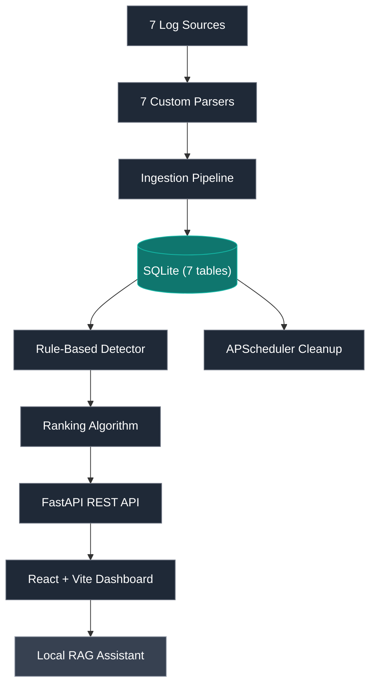
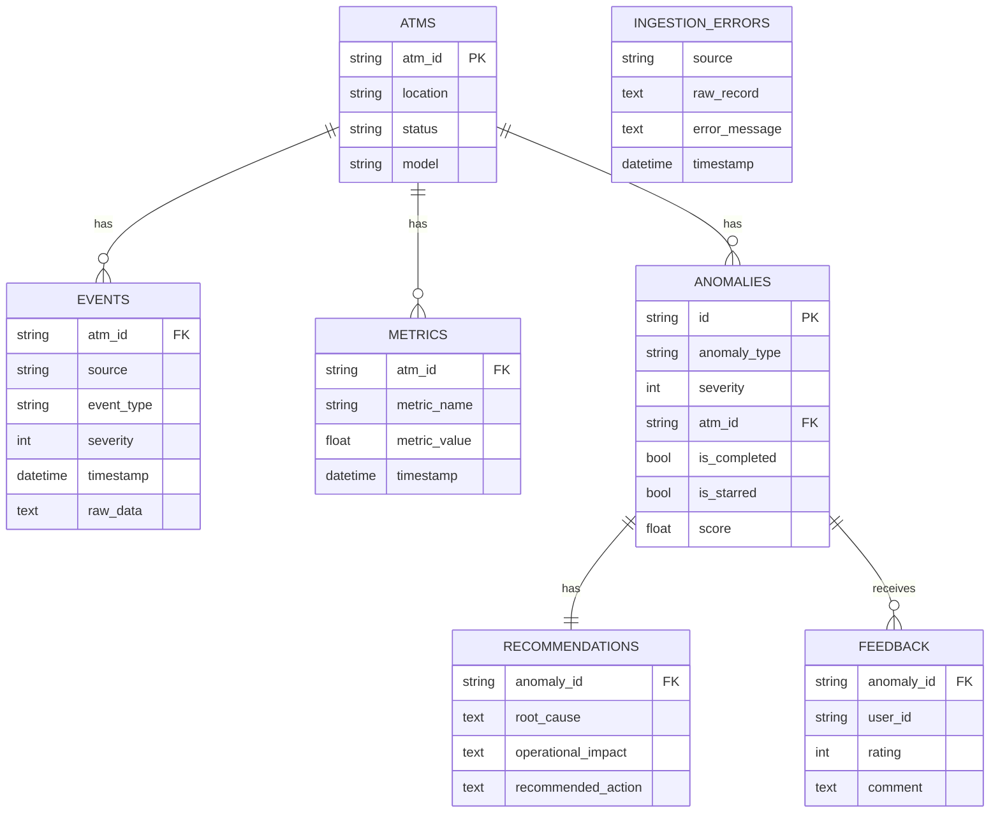

# ATM Log Aggregation, Analysis & Diagnostics Platform (LAAD)

> Production-grade ATM log aggregation, anomaly detection, and AI-assisted diagnostics platform - built for NCR Atleos as a 7-person Agile industry project. Ingests synthetic logs from 7 sources, detects 7 anomaly types, ranks by weighted criticality, and serves a React dashboard with root cause analysis, operational impact, and recommended remediation. Extended with a fully local RAG-based diagnostic assistant.

<p align="center">
  
  
  
  
  
  
</p>

---

## Demonstration

**[→ Project Report](https://github.com/AhmedIkram05/laad/docs/README.md/docs/Project%20Report.pdf)**

---

### Main dashboard - anomalies ranked by weighted criticality score, severity badges, and ATM status indicators


### Anomaly detail - root cause explanation, operational impact assessment, and recommended remediation action


### Admin settings - configurable data retention period (1–365 days) and user management
 

### RAG diagnostic assistant - natural language querying of ATM log history, served entirely locally


---

## Problem & Solution

**The problem:** Modern ATM networks generate large volumes of operational data across multiple channels — hardware sensors, OS metrics, Kafka event streams, application logs. Banks possess this data but lack the pipeline to turn it into actionable intelligence. Operational teams manually scan logs for anomalies, engineers spend hours finding root causes, and hardware failures go undetected until ATMs go offline.

**The solution:** LAAD ingests, normalises, and analyses logs from 7 sources simultaneously, applies a rule-based detection engine across 7 defined anomaly types, ranks issues by a weighted criticality algorithm, and presents each anomaly with a structured root cause explanation, operational impact, and recommended remediation action — no manual log analysis required.

---

## Architecture



**Sources:** ATM application logs, hardware sensor metrics, Kafka event streams, Prometheus OS metrics, Windows OS metrics, GCP cloud metrics, and terminal handler logs.

**Ingestion:** 7 custom parsers feed a unified ingestion pipeline with dead-letter routing to `ingestion_errors`, retry-with-backoff, WAL mode, and schema normalisation into shared events and metrics tables.

**Detection:** A rule-based detector identifies A1-A7 anomaly types, then a ranking algorithm prioritises them using severity, anomaly type, time, and transaction weight. APScheduler handles retention cleanup while preserving unresolved records.

**Serving layer:** FastAPI exposes `analysis`, `anomalies`, `admin`, and `auth` routes, and the React + Vite dashboard provides dashboard, detail, starred, completed, and admin views.

**Extension:** A fully local, air-gapped RAG diagnostic assistant runs with LangChain, ChromaDB, and Ollama (`llama3.1:8b`).

## Design Decisions

**Unified events + metrics schema (lean data lake)**
Rather than source-specific tables (one per log type), all normalised records land in two unified tables: `events` and `metrics`. This means the detection engine queries one consistent schema regardless of source, and adding a new log source requires only a new parser — not schema changes or detector modifications. This directly implements NFR7 (extensibility without core pipeline modification).

**Dead-letter routing — no silent data loss**
Malformed records are routed to `ingestion_errors` rather than raising exceptions. Parsers use `.get()` with safe defaults throughout — a missing field in a Kafka stream never halts ingestion for that source. This was validated by deliberate malformed payload injection during testing, which revealed that strict dictionary access (`payload['field']`) crashed the entire pipeline for that source.

**WAL journal mode + retry-with-backoff**
SQLite allows only one writer at a time. With 7 ingestion sources running concurrently, lock collisions are guaranteed under load. WAL mode allows concurrent reads during writes. The `write_helper.py` batch writer implements exponential backoff on `sqlite3.OperationalError: database is locked` — stress tests with 50 concurrent write threads confirmed zero data loss. Without this, the system operates on an incomplete log dataset.

**Data retention preserving unresolved anomalies**
A naïve age-based cleanup would silently delete active, unresolved anomalies — a critical hardware failure logged 32 days ago that hasn't been addressed would disappear from the dashboard. The cleanup routine filters on `is_completed = false`, preserving all unresolved alerts regardless of age. This implements NFR4 directly and was caught by `test_cleanup.py` before release.

**Rule-based detection over ML**
ML models require training data, validation, and ongoing maintenance — inappropriate for a 3-week delivery timeline with synthetic log data. A rule-based engine produces predictable, auditable results and allows the client (NCR Atleos) to inspect and modify detection logic directly. The 7 anomaly types (A1–A7) are each encapsulated in their own function, making individual rules testable in isolation.

**Weighted criticality ranking algorithm**
Anomalies are not displayed in arrival order. A weighted scoring function combines: anomaly type (operational impact weight), severity (CRITICAL > WARNING), time received (older unresolved issues weighted higher), and transaction awareness (active transaction failures prioritised). This required iterative calibration — naive time weighting caused old low-severity anomalies to dominate the dashboard, resolved by conditional rather than linear time scoring.

**RBAC at the dependency injection layer**
JWT privilege escalation was caught during testing: the admin retention endpoint (`PUT /admin/retention`) was validating token presence but not the role claim. A standard user with a valid token could reduce the retention window to purge the database. The `require_admin` guard was added at the FastAPI dependency injection layer — applied once, enforced on every route that depends on it, with no per-endpoint duplication.

**Air-gapped RAG architecture**
The RAG diagnostic assistant (LangChain, ChromaDB, Ollama) runs entirely locally — no log data leaves the network. This is a deliberate design constraint aligned with banking-grade data privacy requirements: ATM operational logs contain transaction identifiers and system credentials that must not be transmitted to external APIs. Semantic chunking (LangChain's SemanticChunker) with nomic-embed-text embeddings feeds ChromaDB, with llama3.1:8b serving inference via Ollama. Evaluated with an LLM-as-judge pipeline scoring relevance, faithfulness, and answer completeness.

---

## Requirements

### Functional Requirements

| ID | Requirement | Status |
|---|---|---|
| FR1 | Ingest logs of different formats | ✅ Met |
| FR2 | Support both log-file and event stream sources | ✅ Met |
| FR3 | Normalise different log data into a unified format | ✅ Met |
| FR4 | Save all normalised records to a database | ✅ Met |
| FR5 | Automatically detect anomalies in ingested data | ✅ Met |
| FR6 | Report anomalies via dashboard interface | ✅ Met |
| FR7 | Display which ATMs are non-functional or have warnings | ✅ Met |
| FR8 | Generate probable root cause for detected anomalies | ✅ Met |
| FR9 | Identify anomalous patterns across different channels | ✅ Met |
| FR10 | Use patterns to predict potential future anomalies | 🟡 Partial |
| FR11 | Display recommended next actions for anomalies | ✅ Met |
| FR12 | Allow filtering by specific ATM-IDs | ✅ Met |
| FR13 | Configurable data retention period | ✅ Met |

### Non-Functional Requirements

| ID | Requirement | Implementation |
|---|---|---|
| NFR1 | Role-based access control (user / admin) | JWT + `require_admin` dependency guard |
| NFR2 | Handle malformed records without crashing | Dead-letter routing to `ingestion_errors` |
| NFR3 | Concurrent ingestion without data loss | WAL + retry-with-backoff in `write_helper.py` |
| NFR4 | Preserve unresolved anomalies regardless of retention | `is_completed = false` filter in cleanup |
| NFR5 | Usable by both technical and non-technical users | Confirmed by user evaluation (3 participants) |
| NFR6 | Well-commented, version-controlled, maintainable code | Full source on GitHub with modular structure |
| NFR7 | Extensible — new log types without core pipeline changes | Unified schema + parser-per-source pattern |

---

## Database Schema



---

## API Reference

### Authentication — `/api/auth`

| Method | Endpoint | Auth | Description |
|---|---|---|---|
| POST | `/auth/login` | None | Validate credentials, issue JWT |
| GET | `/auth/me` | JWT | Return current user profile |
| POST | `/auth/register` | JWT | Register new user account |

### Anomalies — `/api/anomalies`

| Method | Endpoint | Auth | Description |
|---|---|---|---|
| GET | `/anomalies` | JWT | Paginated, filterable anomaly list (supports `group_by`) |
| PUT | `/anomalies/{id}/resolve` | JWT | Toggle resolved/unresolved |
| PUT | `/anomalies/{id}/star` | JWT | Toggle starred/unstarred |

### Analysis — `/api/analysis`

| Method | Endpoint | Auth | Description |
|---|---|---|---|
| GET | `/detailed` | JWT | Full ranked anomaly list with root cause, impact, and recommended action attached |

### Admin — `/api/admin`

| Method | Endpoint | Auth | Description |
|---|---|---|---|
| GET/PUT | `/admin/retention` | Admin JWT | Get or set data retention period (1–365 days) |
| DELETE | `/admin/cleanup/wipe` | Admin JWT | Wipe all tables and run VACUUM |
| POST | `/admin/users` | Admin JWT | Create new user (including other admins) |

---

## Testing

48 passing tests across 5 tiers:

```bash
pytest          # runs all 48 tests
```

| Tier | Modules | What's covered |
|---|---|---|
| **Unit — parsers** | `test_atm_app_parser.py`, `test_hardware_sensor_parser.py`, `test_kafka_parser.py`, `test_prometheus_parser.py`, `test_windows_os_parser.py`, `test_gcp_cloud_metrics_parser.py`, `test_terminal_handler.py` | Field mapping to unified schema, log level normalisation, UTC ISO 8601 timestamp conversion |
| **Unit — database** | `test_db_schema.py`, `test_db_connection_pragmas.py` | Table structure, indexes, FK constraints, WAL mode, busy_timeout, FK enforcement |
| **Unit — utilities** | `test_write_helper_retry.py`, `test_cleanup.py` | Retry-with-backoff resilience, retention cleanup preserving unresolved anomalies |
| **Integration** | `test_ingestion_integration.py`, `test_anomalies_endpoints.py`, `test_analysis_endpoints.py`, `test_admin_retention_endpoints.py` | End-to-end ingestion pipeline, API endpoints against in-memory test DB |
| **Concurrency & stress** | `test_concurrent_writes.py`, `stress/test_write_helper_locking_collision.py` | 50 concurrent write threads, lock collision recovery, zero data loss under load |
| **Security & auth** | `test_auth_endpoints.py`, `test_auth_security.py` | Login flow, JWT generation, invalid claims, privilege escalation, malformed payloads |
| **Data generation** | `test_generator_scenarios.py` | Synthetic generator produces statistically consistent anomaly distributions (A1–A7), correct cross-source correlation via `correlation_id`, threaded `transaction_id` values |

### Critical defects caught by the test suite

| Defect | Test | Resolution |
|---|---|---|
| Silent data loss under concurrent load | `stress/test_write_helper_locking_collision.py` | Exponential backoff added to `write_helper.py` |
| Unresolved anomalies deleted by cleanup | `test_cleanup.py` | Cleanup filtered to `is_completed = true` only |
| JWT privilege escalation (admin endpoint accessible by standard users) | `test_auth_security.py` | `require_admin` dependency guard added |
| Parser crashes on schema drift (strict dict access) | `test_kafka_metrics_parser.py`, `test_prometheus_parser.py` | All parsers migrated to `.get()` with safe defaults |
| `anomaly_code` / `anomaly_type` field mismatch (frontend broke silently) | `test_anomalies_endpoints.py` | Field name corrected in API response |

---

## User Personas

Three primary personas informed design decisions throughout:

**Steven Smith — Manager (non-technical)**
New to the role, no technical background. Needs high-level visual summaries, plain-language anomaly explanations, and clear operational impact — not raw log data. Drove the decision to surface recommended actions prominently on the detail view.

**Lionel Torvos — Data Analyst**
Experienced with large datasets and data pipelines. Needs structured, consistent log formats and cross-source correlation. Drove the unified schema design — logs from all 7 sources normalised before reaching the analyst.

**John Davis — Software Engineer**
Familiar with logging systems. Needs root cause summaries, automated anomaly flagging, and trend reports — not manual log scanning. Drove the detailed analysis generation (root cause + operational impact + recommended action per anomaly type).

---

## User Evaluation

Conducted in-person with 3 participants (2 CS students, 1 Business student). Key findings:

| Finding | Action taken |
|---|---|
| Filtering feature not noticed by any participant | Redesigned filter placement — more visible on dashboard |
| No back button — users relied on browser navigation | Back buttons added throughout |
| No way to unmark a completed anomaly | Uncheck/unmark completed functionality added |
| Anomaly ranking should incorporate time received | Time weight added to ranking algorithm |
| Logo deemed unnecessary | Logo removed |
| Password policies absent | Not implemented (out of scope given timeline) |

All 3 participants rated the **recommended action** feature as most useful. All 3 found navigation intuitive. All 3 were able to complete tasks without confusion.

---

## Currently Extending

- **Event-driven ingestion** — migrating from file-based batch ingestion to Kafka/Redis Streams with async worker horizontal scaling
- **Real-time observability** — Prometheus/Grafana monitoring layer
- **RAG diagnostic assistant** — semantic chunking via LangChain's SemanticChunker, nomic-embed-text embeddings, ChromaDB vector store, llama3.1:8b inference via Ollama. Evaluated with LLM-as-judge pipeline (relevance, faithfulness, answer completeness)

---

## Getting Started

### Prerequisites

- Python 3.8+
- Node.js v16+ and npm
- pip

### 1. Clone

```bash
git clone https://github.com/AhmedIkram05/laad.git
cd laad
```

### 2. Backend setup

```bash
python -m venv .venv
source .venv/bin/activate  # Windows: .venv\Scripts\activate
pip install -r backend/requirements.txt
```

### 3. Run the pipeline

Initialises the database, generates 24h of synthetic log data across all 7 sources, and ingests everything:

```bash
# Run from the backend directory
python main.py
```

### 4. Start the API server

```bash
# Run from the repo root (after pipeline has populated the database)
uvicorn backend.src.api.server:app --reload --port 8000
```

API docs available at `http://localhost:8000/docs`

### 5. Frontend setup

```bash
cd frontend
npm install
npm run dev
```

Frontend runs at `http://localhost:5173`. Requires the backend API running at `http://localhost:8000`.

### Default admin account

Seeded automatically on first `python main.py` run:

| Field | Value |
|---|---|
| Username | `admin` |
| Password | `admin` |

### Running tests

```bash
pytest          # all 48 tests from repo root
```

---

## Tech Stack

| Layer | Technology | Rationale |
|---|---|---|
| Backend framework | FastAPI | Automatic API docs, built-in dependency injection for RBAC guards, APScheduler integration |
| Database | SQLite + WAL | No external server required; WAL mode enables concurrent reads; retry-with-backoff handles write locks |
| Ingestion scheduling | APScheduler | Background task management for data retention cleanup and periodic ingestion |
| Frontend | React + Vite | Beginner-accessible with large community; Vite for fast dev server |
| LLM integration | LangChain + ChromaDB + Ollama | Fully local — no external API calls, aligned with banking-grade privacy requirements |
| Testing | Pytest | 48 tests across 5 tiers; FastAPI TestClient for in-memory endpoint testing |

---

## Team

| Role | Member |
|---|---|
| Backend & Data Engineering Lead, DB, Ingestion Pipeline, Auth, API, Testing | **Ahmed Ikram** |
| Anomaly Detection Logic | Martin Kelly |
| Ranking Algorithm & Analysis Router | Emmanuel Dairo, Addie Tweed |
| Frontend UI | Sarah Kelly (lead), Sam Watts, Ahmed Ikram |
| Scrum Master | Sam Watts |
| QA & Documentation | All |

Built for **NCR Atleos** as part of CS32002 Industrial Team Project, University of Dundee.

---

## Related

- [DevSync — Project Tracker with GitHub Integration](https://github.com/AhmedIkram05/DevSync) — full-stack cloud app with 541 automated tests
- [W3C Web Logs ETL Pipeline](https://github.com/AhmedIkram05/W3C-ETL-Pipeline) — parallel Airflow ETL with Power BI analytics
- [StockLens FinTech App](https://github.com/AhmedIkram05/StockLens) — full-stack mobile app with OCR pipeline and ML forecasting
