# ATM Log Aggregation, Anomaly Detection & Diagnostics Platform (LAAD)

> A production-grade ATM log aggregation, multi-layer anomaly detection, and AI-assisted diagnostics platform - from Kafka ingestion through 3-layer ML/statistical/heuristic detection to a React dashboard and Agentic RAG assistant - deployed on AWS ECS Fargate with SageMaker inference.

<p align="center">
<a href="https://www.python.org/"></a>
<a href="https://fastapi.tiangolo.com/"></a>
<a href="https://www.langchain.com/"></a>
<a href="https://www.postgresql.org/"></a>
<a href="https://kafka.apache.org/"></a>
<a href="https://redis.io/"></a>
<a href="https://www.chromadb.com/"></a>
<a href="https://nginx.org/"></a>
<a href="https://xgboost.ai/"></a>
<a href="https://scikit-learn.org/"></a>
<a href="https://pandas.pydata.org/"></a>
<a href="https://ollama.ai/"></a>
<a href="https://aws.amazon.com/sagemaker/"></a>
<a href="https://mlflow.org/"></a>
<a href="https://react.dev/"></a>
<a href="https://vite.dev/"></a>
<a href="https://tailwindcss.com/"></a>
<a href="https://www.chartjs.org/"></a>
<a href="https://www.docker.com/"></a>
<a href="https://www.terraform.io/"></a>
<a href="https://github.com/features/actions"></a>
<a href="https://aws.amazon.com/"></a>
</p>

<p align="center">
<a href="https://github.com/AhmedIkram05/laad/actions/workflows/ci.yml"></a>
<a href="https://github.com/AhmedIkram05/laad/actions/workflows/cd.yml"></a>
<a href="https://github.com/AhmedIkram05/laad/actions/workflows/terraform.yml"></a>
<a href="https://codecov.io/gh/AhmedIkram05/laad"></a>
</p>

---

<details>
<summary><b>Table of Contents</b> (click to expand)</summary>

- [System Architecture](#system-architecture)
- [Engineering Highlights](#engineering-highlights)
- [Key Metrics at a Glance](#key-metrics-at-a-glance)
- [Demos](#demos)
- [Component Deep Dives](#component-deep-dives)
  - [Kafka Message Bus](#kafka-message-bus)
  - [Database Design](#database-design)
  - [3-Layer Anomaly Detection Engine](#3-layer-anomaly-detection-engine)
  - [ML Training & MLOps](#ml-training--mlops)
  - [Agentic RAG Diagnostic Assistant](#agentic-rag-diagnostic-assistant)
  - [Redis Infrastructure](#redis-infrastructure-8-patterns)
  - [Frontend Architecture](#frontend-architecture)
- [AWS Deployment & Infrastructure](#aws-deployment--infrastructure)
- [Testing & Quality](#testing--quality)
- [Getting Started](#getting-started)
- [Team](#team)
- [Related Projects](#related)

</details>

---

## System Architecture

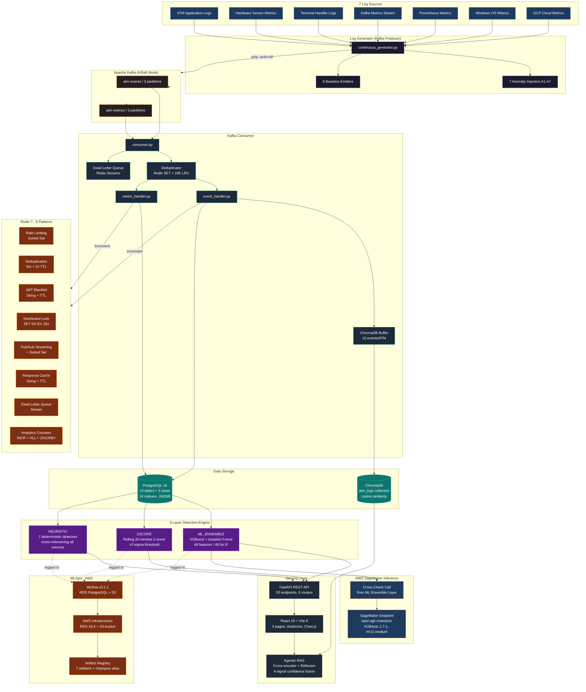
```mermaid
flowchart TD
  subgraph Sources ["7 Log Sources"]
    S1["ATM Application Logs"]
    S2["Hardware Sensor Metrics"]
    S3["Terminal Handler Logs"]
    S4["Kafka Metrics Stream"]
    S5["Prometheus Metrics"]
    S6["Windows OS Metrics"]
    S7["GCP Cloud Metrics"]
  end

  subgraph Generator ["Log Generator (Kafka Producer)"]
    G["continuous_generator.py"]
    AI["7 Anomaly Injectors A1-A7"]
    EM["8 Baseline Emitters"]
    G --> AI
    G --> EM
  end

  subgraph Kafka ["Apache Kafka (KRaft Mode)"]
    KT["atm-events / 3 partitions"]
    KM["atm-metrics / 3 partitions"]
  end

  subgraph Consumer ["Kafka Consumer"]
    C["consumer.py"]
    DED["Deduplicator<br/>Redis SET + 10K LRU"]
    EH["event_handler.py"]
    MH["metric_handler.py"]
    CB["ChromaDB Buffer<br/>10 events/ATM"]
    DLQ["Dead Letter Queue<br/>Redis Streams"]
    C --> DED
    C --> DLQ
    DED --> EH
    DED --> MH
    EH --> CB
  end

  subgraph Storage ["Data Storage"]
    PG[("PostgreSQL 16<br/>10 tables + 3 views<br/>14 indexes, JSONB")]
    CDB[("ChromaDB<br/>atm_logs collection<br/>cosine similarity")]
  end

  subgraph Redis ["Redis 7 - 8 Patterns"]
    R1["Rate Limiting<br/>Sorted Set"]
    R2["Deduplication<br/>Set + 1h TTL"]
    R3["JWT Blacklist<br/>String + TTL"]
    R4["Distributed Lock<br/>SET NX EX 25s"]
    R5["Pub/Sub Streaming<br/>+ Sorted Set"]
    R6["Response Cache<br/>String + TTL"]
    R7["Dead Letter Queue<br/>Stream"]
    R8["Analytics Counters<br/>INCR + HLL + ZINCRBY"]
  end

  subgraph Detection ["3-Layer Detection Engine"]
    CLS["ML_ENSEMBLE<br/>XGBoost + Isolation Forest<br/>49 features / 46 for IF"]
    ZSC["ZSCORE<br/>Rolling 20-window Z-score<br/>>3 sigma threshold"]
    SCC["HEURISTIC<br/>7 deterministic detectors<br/>cross-referencing all sources"]
  end

  subgraph Serving ["Serving Layer"]
    API["FastAPI REST API<br/>30 endpoints, 6 routers"]
    UI["React 19 + Vite 8<br/>9 pages, shadcn/ui, Chart.js"]
    RAG["Agentic RAG<br/>Cross-encoder + Reflexion<br/>4-signal confidence fusion"]
  end

  subgraph MLOps ["MLOps - AWS"]
    MLF["MLflow v3.1.1<br/>RDS PostgreSQL + S3"]
    AWS["AWS Infrastructure<br/>RDS 18.4 + S3 bucket"]
    ARC["Artifact Registry<br/>7 artifacts + champion alias"]
  end

  subgraph SageMaker ["AWS SageMaker Inference"]
    SM["SageMaker Endpoint<br/>laad-xgb-champion<br/>XGBoost 1.7-1, ml.t2.medium"]
    CC["Cross-Check Call<br/>from ML Ensemble Layer"]
  end

  S1 & S2 & S3 & S4 & S5 & S6 & S7 --> G
  G -->|"gzip, acks=all"| Kafka
  Kafka --> KT
  Kafka --> KM
  KT --> C
  KM --> C
  EH --> PG
  MH --> PG
  CB --> CDB
  EH -->|"increment"| Redis
  MH -->|"increment"| Redis
  PG --> CLS
  PG --> ZSC
  PG --> SCC
  CLS --> API
  CLS --> CC
  CC --> SM
  ZSC --> API
  SCC --> API
  API --> UI
  CDB --> RAG
  UI --> RAG
  CLS -.->|"logged to"| MLF
  ZSC -.->|"logged to"| MLF
  SCC -.->|"logged to"| MLF
  MLF --> AWS
  AWS --> ARC

  classDef source fill:#1e3a5f,stroke:#60a5fa,color:#ffffff;
  classDef gen fill:#1a1a2e,stroke:#a78bfa,color:#ffffff;
  classDef kafka fill:#231f20,stroke:#f97316,color:#ffffff;
  classDef consumer fill:#1e293b,stroke:#34d399,color:#ffffff;
  classDef storage fill:#0f766e,stroke:#14b8a6,color:#ffffff;
  classDef redis fill:#7c2d12,stroke:#f59e0b,color:#ffffff;
  classDef detect fill:#581c87,stroke:#a78bfa,color:#ffffff;
  classDef serve fill:#1f2937,stroke:#6b7280,color:#ffffff;
  classDef mlops fill:#7c2d12,stroke:#f59e0b,color:#ffffff;
  classDef sagemaker fill:#1e3a5f,stroke:#ff9900,color:#ffffff;

  class S1,S2,S3,S4,S5,S6,S7 source;
  class G,AI,EM gen;
  class KT,KM kafka;
  class C,DED,EH,MH,CB,DLQ consumer;
  class PG,CDB storage;
  class R1,R2,R3,R4,R5,R6,R7,R8 redis;
  class CLS,ZSC,SCC detect;
  class API,UI,RAG serve;
  class MLF,AWS,ARC mlops;
  class SM,CC sagemaker;
```

**Pipeline flow:** 7 log sources → continuous Kafka producer (gzip, acks=all) → 2 topics (3 partitions each) → consumer deduplicates (Redis SET + 10K LRU), parses via 7 source-specific parsers, dual-writes to PostgreSQL + ChromaDB, routes failures to Redis Stream DLQ with exponential backoff. A 3-layer detection engine runs every 30s against time-windowed data. FastAPI serves 30 endpoints consumed by the React dashboard and Agentic RAG assistant. An XGBoost model deployed on AWS SageMaker provides live cross-check inference.

---

## Engineering Highlights

| Area | Decision | Why |
|---|---|---|
| **Anomaly Detection** | 3-layer ensemble: XGBoost + Isolation Forest + Z-Score + Heuristic + SageMaker cross-check | Defense in depth - ML catches 8-class patterns at 99.8%, Z-Score detects drift without models, Heuristic is the always-on safety net, SageMaker validates predictions live |
| **Messaging** | Apache Kafka (KRaft) with gzip, acks=all, 7-day retention | Decouples ingestion from processing - zero data loss on restart, offset replay for backfill |
| **RAG Pipeline** | LangChain + ChromaDB + cross-encoder reranking + 4-signal confidence fusion | Self-hosted vector store keeps data private; 4-signal fusion prevents hallucinated responses |
| **MLOps** | MLflow v3 on AWS (RDS + S3) with champion aliases | Full experiment lineage, auto-retrain on corruption, 7 artifacts tracked per MLflow 3.x API |
| **Deployment** | Terraform (10 modules, 118 resources) + ECS Fargate + SageMaker + CI/CD | Full IaC with automated pipelines, zero-downtime deployments, 75 Terraform test assertions |
| **Data Storage** | PostgreSQL 16 with JSONB + unified events/metrics tables | Adding a log source = new parser - no schema changes, no detector modifications |
| **Distributed Coordination** | 8 Redis patterns from a single connection pool | Rate limiting, dedup, locking, Pub/Sub, caching, DLQ, analytics - all gracefully degrade |
| **Container Strategy** | Multi-stage Docker + health check cascading | 10 services, 7 named volumes, profile-based separation, frontend in ~25MB nginx image |
| **Testing** | pytest (10 tiers) + vitest + Playwright + Terraform test + checkov | 945 tests across all layers, CI-gated at every PR |

---

## Key Metrics at a Glance

| Category | Metric | Value |
|---|---|---|
| **Scale** | Log sources | 7 simultaneous |
| | ATMs monitored | 10 ATMs + 3 Servers |
| | Messages processed | 930K+ events, 100+ msgs/sec live |
| | Tables / Views / Indexes | 10 + 3 + 14 |
| | Docker services | 10 production + 3 test |
| | Terraform resources | 118 across 10 modules |
| **ML & Detection** | Anomaly types | 7 known (A1-A7) + UNKNOWN |
| | Detection layers | 3 (ML_ENSEMBLE + ZSCORE + HEURISTIC) + SageMaker cross-check |
| | ML features | 49 engineered (46 for IF) |
| | XGBoost CV accuracy | 99.8% +/- 0.1% |
| | Isolation Forest precision | 97.3% (F1=0.7008 at -0.5199) |
| | RAG confidence fusion | 4 signals with Platt calibration |
| **Infrastructure** | API endpoints | 30 across 6 routers |
| | Frontend pages | 9 (React 19 + Vite 8 + Tailwind v4) |
| | Redis patterns | 8 distinct |
| | LLM providers | 3 (Ollama Cloud → Fallback → OpenRouter) |
| **Testing** | Total tests | 945 |
| | Backend (pytest) | 694 across 10 tiers |
| | Frontend (vitest) | 166 across 36 suites |
| | E2E (Playwright) | 10 across 5 specs |
| | Terraform assertions | 75 across 9 modules |
| **Deployment** | CI/CD pipelines | 3 (CI, CD, CD-SHOULD-DEPLOY) |
| | Cloud services | 5 (ECS, RDS, S3, SageMaker, Secrets Manager) |
| | AWS infrastructure modules | 10 Terraform modules |

---

## Demos

### AWS Infrastructure - VPC, ECS, SageMaker, CI/CD

Multi-AZ VPC with ECS Fargate, Kafka on EC2, RDS PostgreSQL for MLflow, SageMaker inference endpoint, and automated CI/CD with Terraform.

| | |
|---|---|
| 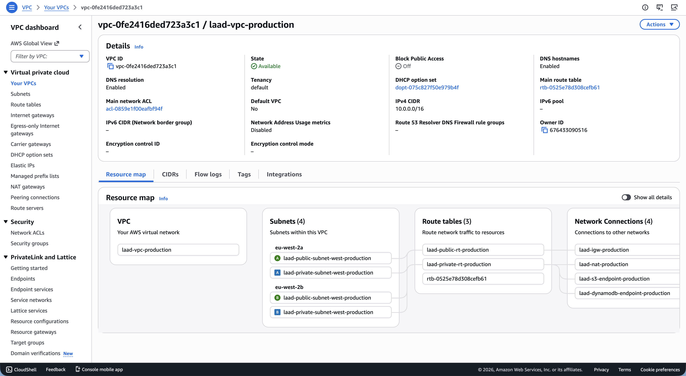 | **VPC topology** - 10.0.0.0/16, 2 AZs, public + private subnets, NAT Gateway, Internet Gateway. All application traffic isolated in private subnets. |
| 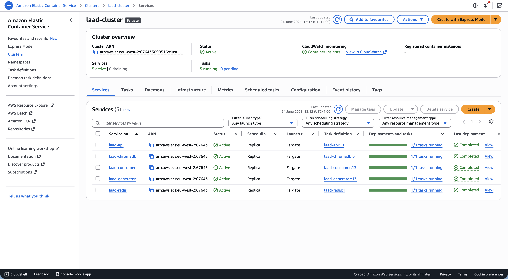 | **ECS Fargate cluster** - API and Consumer services in ACTIVE state, each with 2 desired tasks across AZs. Rolling updates, health check grace period, CloudWatch logs. |
| 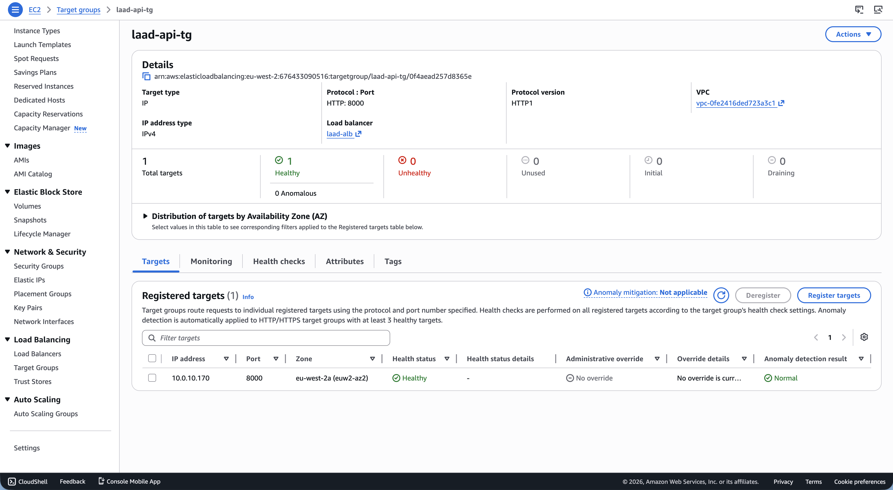 | **Application Load Balancer** - routes traffic to ECS Fargate tasks in private subnets across both AZs for high availability. |
| 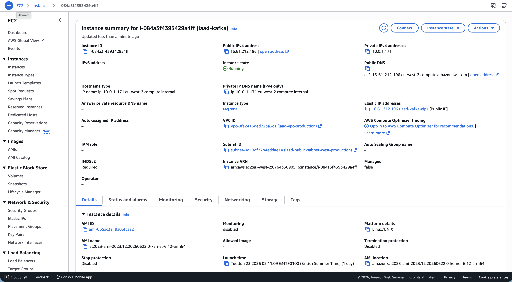 | **Kafka broker on EC2** - deployed alongside Redis and ChromaDB on EC2 instances in private subnets. |
| 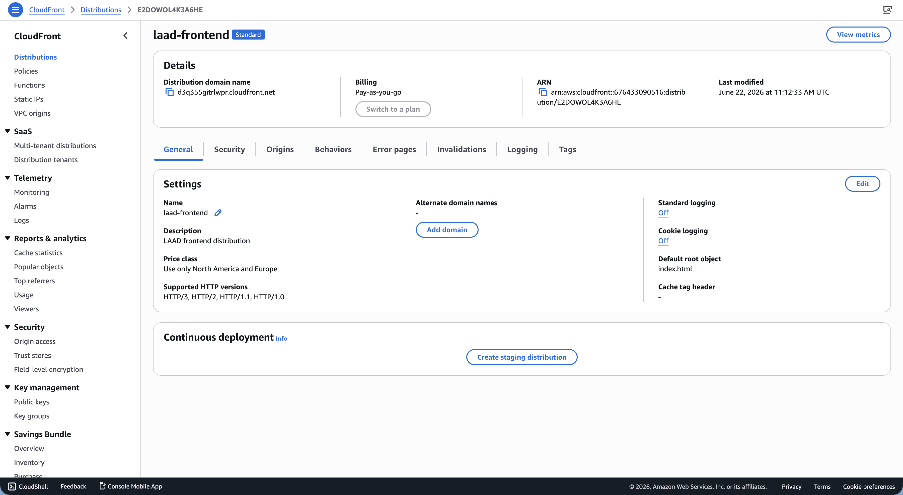 | **CloudFront distribution** - serves the React frontend from S3 with edge caching and HTTPS. |
| 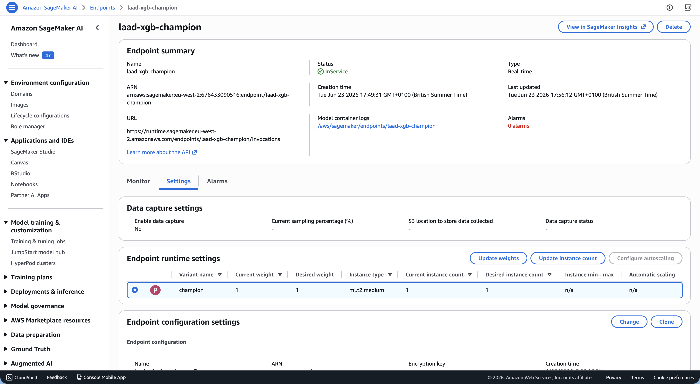 | **SageMaker endpoint** - `laad-xgb-champion`, InService on ml.t2.medium, XGBoost 1.7-1 container, 8-class softmax probabilities. |
| 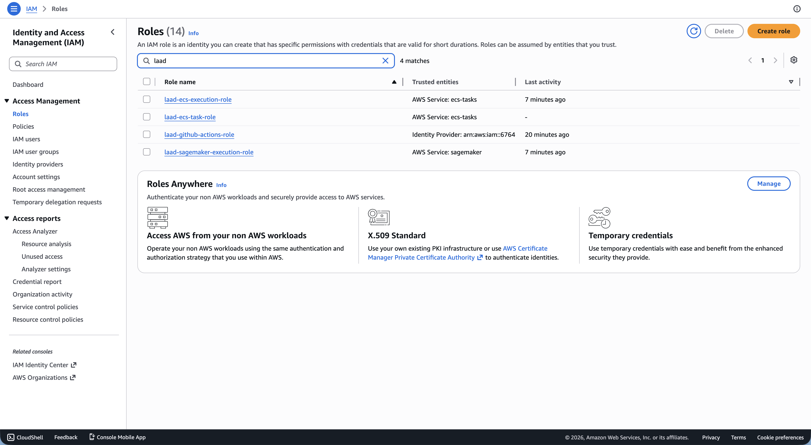 | **IAM roles** - 6 least-privilege policies: ECS execution, ECS task, SageMaker execution, CloudWatch logs, CI/CD OIDC, MLflow. |
| 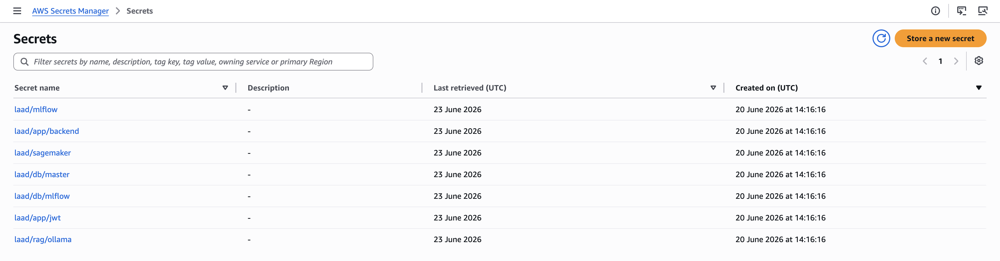 | **Secrets Manager** - 8 secrets injected into ECS containers via task definition. No hardcoded credentials. |
| 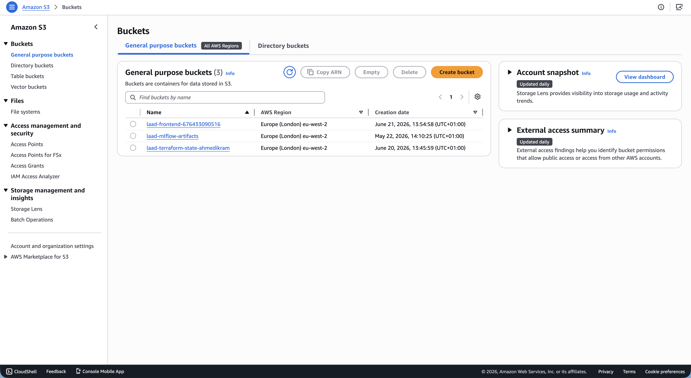 | **S3 buckets** - 3 buckets: frontend hosting, MLflow artifacts, Terraform state (versioned). |
| 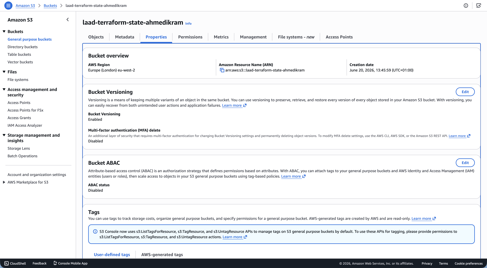 | **Terraform state** - locked via DynamoDB, versioned via S3. Full point-in-time recovery for all 10 modules. |

### CI/CD Pipeline

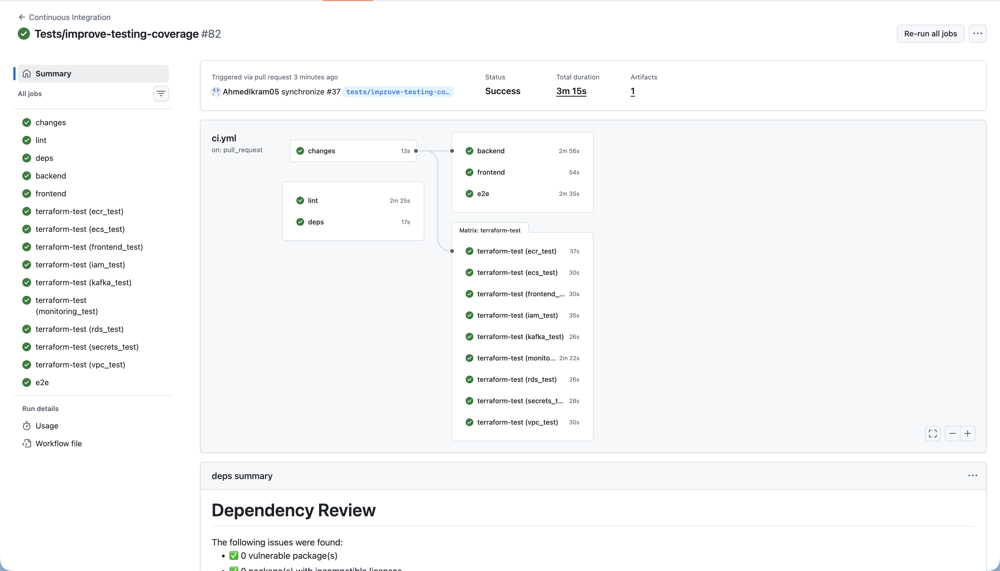 | 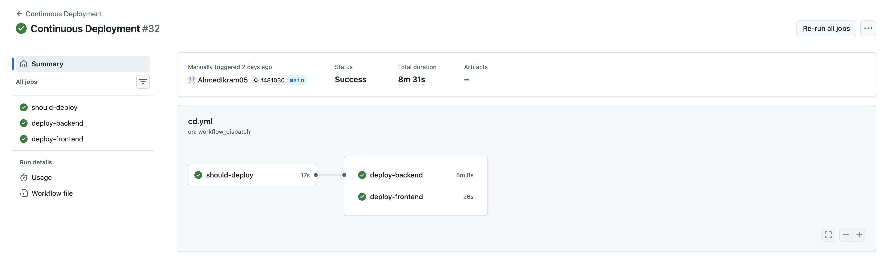
---|---
CI - Python lint, checkov, pytest (503), vitest (166), Playwright E2E (10) | CD - Terraform plan → apply → ECS rolling update on merge to main

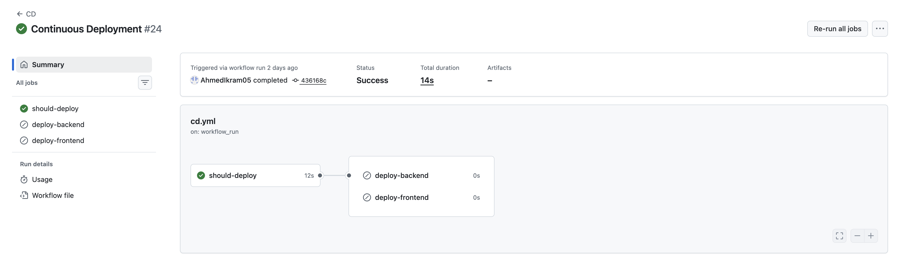 | 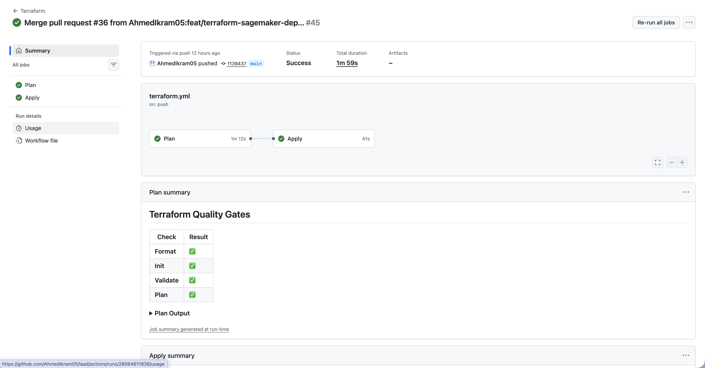
---|---
CD-SHOULD-DEPLOY - path-based filter skips infra when only docs change | Terraform plan/apply - automated via GitHub Actions OIDC, 10 modules, 118 resources

### Platform Walkthrough


> **Architecture Overview** - 8 log emitters (ATM events, hardware sensors, GCP Cloud Metrics, etc.) emitting into Kafka (KRaft) topics, the kafka-consumer service ingesting into PostgreSQL and ChromaDB, the detection engine scoring anomalies and publishing to Redis Pub/Sub, and the React dashboard displaying real-time analytics with auto-refresh.

### 3-Layer Anomaly Detection


> **3-Layer Detection Engine** - ML_ENSEMBLE → ZSCORE → HEURISTIC pipeline: scored anomalies appear in the UI with type label (A1-A7 or UNKNOWN), severity (CRITICAL/HIGH/MAJOR), detector origin, model confidence score, and structured explanation.

### Agentic RAG Diagnostic Assistant


> **Agentic RAG** - End-to-end diagnostic conversation: ChromaDB retrieval → cross-encoder reranking → LLM response with verbalized confidence → reflexion (self-critique) → final answer with source citations.

### Real-Time Analytics Dashboard


> **Analytics Dashboard** - 4 KPI cards polling every 5 seconds, Bar/Line/Doughnut Chart.js visualizations, 5 time range options with adaptive bucket resolution.

### Kafka Ingestion Pipeline


> **Kafka Pipeline** - gzip-compressed messages on `atm-events`/`atm-metrics` topics → hybrid deduplicator (Redis SET + 10K LRU, 1h TTL) → batch processing (max.poll.records=500) → failed messages retry 3× before Redis Stream DLQ.

### MLflow on AWS


> **AWS MLflow** - Experiments tracked against RDS PostgreSQL 18.4 with model artifacts stored in S3. Shows experiment runs, logged metrics, and the model registry with `champion` alias promotion.

---

## Component Deep Dives

### Kafka Message Bus

Apache Kafka (KRaft mode, no ZooKeeper) serves as the central message bus, decoupling log generation from ingestion. The system uses **confluentinc/cp-kafka:7.5.0** with KRaft (no ZooKeeper dependency), 3 partitions per topic, 7-day retention, and gzip compression.

**Why Kafka over Redis PubSub?** Kafka persists to disk with configurable retention (7 days) and offset replay for backfill. Redis PubSub loses messages with no active subscriber. 3 partitions/topic enable parallel consumption with ordering. At-least-once delivery via manual offset commits + hybrid dedup = zero data loss on restart.

**Producer Configuration:**

| Parameter | Setting | Rationale |
|---|---|---|
| `acks` | `all` | Every message confirmed by all in-sync replicas before the produce call returns. Zero data loss even if the leader crashes mid-write. |
| `compression.type` | `gzip` | ~65% compression ratio on ATM log JSON - reduces broker network I/O and storage. Consumer decompresses transparently. |
| `retries` | `5` | Automatic retry on transient broker errors (leader election, network glitches). Idempotent producer prevents duplicates. |
| `batch.size` | `16384` (16 KB) | Small batches suit the ~1–3 KB average ATM log message - accumulates enough for gzip efficiency without adding meaningful latency. |
| `linger.ms` | `10` | Waits up to 10ms to fill a batch before sending. Balances throughput (gzip compresses more rows per batch) against per-message latency. |
| `max.in.flight.requests.per.connection` | `1` | Guarantees strict ordering - a message cannot overtake another in the same partition even on retry. |
| `message.max.bytes` | `1048588` | Accommodates outlier ATM log entries without rejecting oversized messages. |

**Consumer Configuration:**

| Parameter | Setting | Rationale |
|---|---|---|
| `enable.auto.commit` | `False` | Manual offset commits after handler success - no data loss on consumer restart |
| `max.poll.records` | `500` | Bounds per-iteration processing time. At ~3 KB/record, 500 records = ~1.5 MB batch, well within the 2 MB fetch.max.bytes default. |
| `max.poll.interval.ms` | `300000` (5 min) | Consumer must call poll() within this interval or be considered dead. 500 records with handlers fit comfortably under this. |
| `heartbeat.interval.ms` | `3000` | Fast failure detection. If the consumer crashes, the group rebalances within 3 heartbeats (~9s). |
| `session.timeout.ms` | `30000` (30s) | Coordinator marks consumer dead after 30s without heartbeats. Matches the 3× heartbeat interval convention. |
| `auto.offset.reset` | `earliest` | On first join or offset commit failure, consumer starts from the oldest available message - safe for backfill and recovery. |
| `group.id` | `group-laad-consumer` | Shared group ID enables consumer group rebalancing across multiple consumer instances (though currently a single instance). |

**2 Topics, 3 Partitions Each:**

| Topic | Partitions | Purpose | Retention |
|---|---|---|---|
| `atm-events` | 3 | Structured event messages (card insertions, transactions, errors, etc.) with JSONB payloads | 7 days (log compaction via `delete.retention.ms=604800000`) |
| `atm-metrics` | 3 | Numeric time-series metric readings (temperature, response time, memory, etc.) | 7 days (same retention as events) |

**Message Flow at the Consumer:**

1. **Poll** - `consumer.poll(timeout_ms=1000)` fetches up to 500 records from assigned partitions
2. **Deserialize** - Each record is parsed from UTF-8 JSON. Malformed messages route immediately to the Dead Letter Queue
3. **Hybrid Deduplication** - Each `message_id` (UUID4) is checked against Redis SET (1h TTL) and an in-memory 10K LRU OrderedDict. If found in either → skip. If new → add to both and proceed
4. **Topic Routing** - `atm-events` → `event_handler.py` (parses 7 event types, writes to PostgreSQL `events` table + ChromaDB buffer). `atm-metrics` → `metric_handler.py` (writes to PostgreSQL `metrics` table)
5. **Manual Commit** - Only after both handler writes succeed. If the handler fails, the consumer does NOT commit, and the message is reprocessed on next poll
6. **Dead Letter Queue** - Failed messages (max 3 retries, 5s→10s→20s exponential backoff) are stored in a Redis Stream for manual inspection and replay

**Error Handling Flow:**

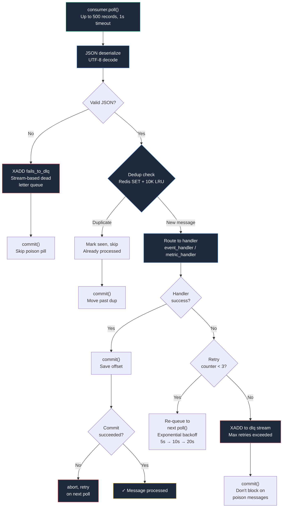
```mermaid
flowchart TD
    POLL["consumer.poll()<br/>Up to 500 records, 1s timeout"] --> DESER["JSON deserialize<br/>UTF-8 decode"]

    DESER --> VALID{"Valid JSON?"}
    VALID -->|"No"| DLQ["XADD fails_to_dlq<br/>Stream-based dead<br/>letter queue"]
    DLQ --> COMMIT_DLQ["commit()<br/>Skip poison pill"]

    VALID -->|"Yes"| DEDUP{"Dedup check<br/>Redis SET + 10K LRU"}

    DEDUP -->|"Duplicate"| SKIP["Mark seen, skip<br/>Already processed"]
    SKIP --> COMMIT_SKIP["commit()<br/>Move past dup"]

    DEDUP -->|"New message"| HANDLER["Route to handler<br/>event_handler / metric_handler"]

    HANDLER --> SUCCESS{"Handler<br/>success?"}

    SUCCESS -->|"Yes"| COMMIT_OK["commit()<br/>Save offset"]
    SUCCESS -->|"No"| RETRY{"Retry<br/>counter &lt; 3?"}

    RETRY -->|"Yes"| REQUEUE["Re-queue to<br/>next poll()<br/>Exponential backoff<br/>5s → 10s → 20s"]
    RETRY -->|"No"| DLQ_RETRY["XADD to dlq stream<br/>Max retries exceeded"]
    DLQ_RETRY --> COMMIT_DLQ2["commit()<br/>Don't block on<br/>poison messages"]

    COMMIT_OK --> FAIL_COMMIT{"Commit<br/>succeeded?"}
    FAIL_COMMIT -->|"No"| ABORT["abort, retry<br/>on next poll"]
    FAIL_COMMIT -->|"Yes"| DONE["✓ Message processed"]

    classDef poll fill:#1e293b,stroke:#34d399,color:#ffffff;
    classDef process fill:#1e293b,stroke:#60a5fa,color:#ffffff;
    classDef error fill:#1e293b,stroke:#ef4444,color:#ffffff;
    classDef done fill:#1e293b,stroke:#fbbf24,color:#ffffff;

    class POLL poll;
    class DESER,DEDUP,HANDLER process;
    class DLQ,DLQ_RETRY,ABORT error;
    class DONE done;
```

**ChromaDB Buffer:** Per-ATM sliding window of 10 events. When the buffer fills, events are semantically chunked (LangChain SemanticChunker) and embedded (Ollama `nomic-embed-text`, 768-dim) before upserting to ChromaDB's `atm_logs` collection. This batch-vectorisation keeps embedding API calls efficient and ensures the RAG system has recent ATM context.

**Throughput characteristics:** ~100 messages/sec sustained on a single consumer. gzip reduces ~250 KB/s raw JSON to ~85 KB/s on the wire. Broker stores ~3.5 GB/day uncompressed, ~1.2 GB/day on disk with gzip.

---

### Database Design

PostgreSQL 16 (Alpine) with a lean data lake design - unified `events` and `metrics` tables with JSONB payloads, plus dedicated tables for anomalies, RAG data, and calibration. The schema follows a **schema-on-read** philosophy: new log sources require only a new parser - no schema migrations, no detector modifications.

**Core Tables:**

| Table | Purpose | Key Columns | Row Count |
|---|---|---|---|
| `atms` | ATM device registry | `atm_id` (PK), `os_version`, `location_code` | Per-ATM |
| `events` | Structured ATM event messages | `id` (PK, BIGSERIAL), `timestamp`, `atm_id` (FK), `event_type`, `severity`, `payload` (JSONB) | 930K+ |
| `metrics` | Numeric time-series readings | `id` (PK, BIGSERIAL), `timestamp`, `entity_id`, `metric_name`, `metric_value`, `payload` (JSONB) | 930K+ |
| `anomalies` | Detection engine results | `id` (PK), `detected_at`, `anomaly_type`, `atm_id` (FK), `model_confidence_score`, `severity`, `sources_involved` (JSONB), `is_active`, `is_starred` | By detection |
| `ingestion_errors` | Failed message log | `id` (PK), `timestamp`, `source`, `error_detail`, `raw_input` | Trace-level |
| `rag_queries` / `rag_feedback` | RAG history + calibration data | Full query + response + user rating | Per conversation |
| `users` / `calibration_scores` | Auth + Platt scaling state | Hashed passwords, calibration params | Per user |

**Indexing Strategy (14 B-tree indexes, 6 composite):**

| Index | Columns | Purpose | Pattern |
|---|---|---|---|
| PK: `events_pkey` | `id` | Primary key lookup | Equality |
| `idx_events_timestamp` | `timestamp` DESC | Time-range queries for detection window | Range, sorted |
| `idx_events_atm_id` | `atm_id` | Filter events by ATM | Equality |
| `idx_events_atm_timestamp` | `atm_id`, `timestamp` DESC | ATM-scoped time-window analysis | Composite range |
| `idx_events_type_timestamp` | `event_type`, `timestamp` DESC | Type-scoped time-window queries | Composite range |
| `idx_metrics_timestamp` | `timestamp` DESC | Time-range queries | Range |
| `idx_metrics_entity_id` | `entity_id` | Filter by entity | Equality |
| `idx_metrics_name_timestamp` | `metric_name`, `timestamp` DESC | Metric-scoped range queries | Composite range |
| `idx_anomalies_detected_at` | `detected_at` DESC | Recent anomalies display | Range, sorted |
| `idx_anomalies_type` | `anomaly_type` | Filter by anomaly class | Equality |
| `idx_anomalies_active` | `is_active` | Active anomalies filter | Equality |
| `idx_anomalies_atm_type` | `atm_id`, `anomaly_type` | ATM + type dedup for heuristic | Composite equality |
| `idx_rag_user_id` | `user_id` | Per-user RAG history | Equality |
| `idx_rag_timestamp` | `created_at` DESC | Recent queries display | Range, sorted |

**Unified Analysis View:**

The `v_unified_analysis` view merges events and metrics via `COALESCE` field normalization, providing a single query target for the ML detection engine:

```sql
CREATE VIEW v_unified_analysis AS
SELECT
    COALESCE(e.timestamp, m.timestamp) AS timestamp,
    COALESCE(e.atm_id, m.entity_id) AS entity_id,
    e.event_type,
    e.severity,
    m.metric_name,
    m.metric_value
FROM events e
FULL OUTER JOIN metrics m ON e.atm_id = m.entity_id
    AND e.timestamp = m.timestamp;
```

**Connection Pool Management:**

| Parameter | Value | Purpose |
|---|---|---|
| `minconn` | 5 | Keep 5 connections warm for low-latency API responses |
| `maxconn` | 50 | Upper bound - each consumer poll (up to 500 records) may need 5+ connections for parallel writes |
| `retry_backoff` | 3 retries, exponential | Covers transient RDS failover, load spikes |
| `PoolClass` | `ThreadedConnectionPool` | Thread-safe - shared by API (4 uvicorn workers) and consumer (single process) via import |
| `health_check` | `pg_isready` in Docker Compose | Container-level dependency resolution before service starts |

**Retention Cleanup:**

Events and metrics older than the configured retention window (default 7 days) are deleted hourly in **batches of 5,000 rows** to avoid long-running row locks:

```sql
DELETE FROM events
WHERE id IN (
    SELECT id FROM events
    WHERE timestamp < NOW() - INTERVAL '7 days'
    LIMIT 5000
);
```

Unresolved anomalies (`is_active = 1`) are preserved regardless of age - the detection engine may need historical context for cross-referencing.

**Why not TimescaleDB?** PostgreSQL with proper indexing handles 100+ msg/sec with sub-100ms queries. The unified view pattern provides the time-window semantics TimescaleDB hypertables would enforce, without adding an extension dependency. If throughput grows 10×, adding `PARTITION BY RANGE (timestamp)` is a single DDL statement away.

**Entity-Relationship Diagram:**

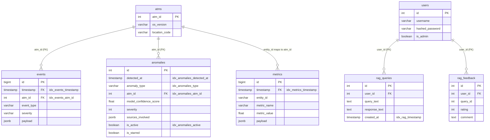
```mermaid
erDiagram
    atms ||--o{ events : "atm_id (FK)"
    atms ||--o{ anomalies : "atm_id (FK)"
    atms ||--o{ metrics : "entity_id maps to atm_id"

    atms {
        int atm_id PK
        varchar os_version
        varchar location_code
    }

    events {
        bigint id PK
        timestamp timestamp FK "idx_events_timestamp"
        int atm_id FK "idx_events_atm_id"
        varchar event_type
        varchar severity
        jsonb payload
    }

    metrics {
        bigint id PK
        timestamp timestamp FK "idx_metrics_timestamp"
        varchar entity_id
        varchar metric_name
        float metric_value
        jsonb payload
    }

    anomalies {
        int id PK
        timestamp detected_at "idx_anomalies_detected_at"
        varchar anomaly_type "idx_anomalies_type"
        int atm_id FK "idx_anomalies_atm_id"
        float model_confidence_score
        int severity
        jsonb sources_involved
        boolean is_active "idx_anomalies_active"
        boolean is_starred
    }

    users ||--o{ rag_queries : "user_id (FK)"
    users ||--o{ rag_feedback : "user_id (FK)"

    users {
        int id PK
        varchar username
        varchar hashed_password
        boolean is_admin
    }

    rag_queries {
        int id PK
        int user_id FK
        text query_text
        text response_text
        timestamp created_at "idx_rag_timestamp"
    }

    rag_feedback {
        int id PK
        int user_id FK
        int query_id
        int rating
        text comment
    }
```

---

### 3-Layer Anomaly Detection Engine

The core detection system combines ML, statistical analysis, and deterministic rules to identify all 7 known anomaly types (A1-A7) plus novel UNKNOWN patterns. Runs every 30 seconds against configurable time-windowed data (default 600s).

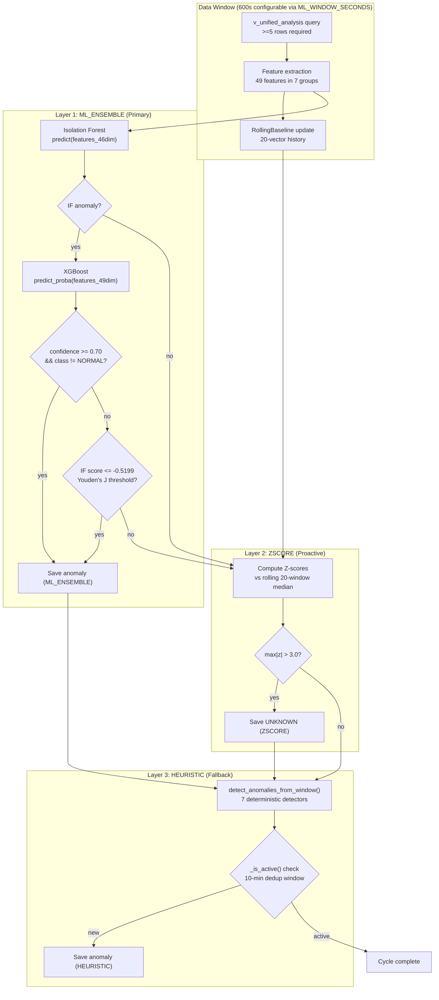
```mermaid
flowchart TD
  subgraph Window ["Data Window (600s configurable via ML_WINDOW_SECONDS)"]
    Q["v_unified_analysis query<br/>>=5 rows required"]
    FE["Feature extraction<br/>49 features in 7 groups"]
    BU["RollingBaseline update<br/>20-vector history"]
  end

  subgraph Layer1 ["Layer 1: ML_ENSEMBLE (Primary)"]
    IF["Isolation Forest<br/>predict(features_46dim)"]
    IF_ANOM{"IF anomaly?"}
    XGB["XGBoost<br/>predict_proba(features_49dim)"]
    HIGH{"confidence >= 0.70<br/>&& class != NORMAL?"}
    UNKNOWN{"IF score <= -0.5199<br/>Youden's J threshold?"}
    SAVE1["Save anomaly (ML_ENSEMBLE)"]
  end

  subgraph Layer2 ["Layer 2: ZSCORE (Proactive)"]
    ZR["Compute Z-scores<br/>vs rolling 20-window median"]
    MAXZ{"max|z| > 3.0?"}
    SAVE2["Save UNKNOWN (ZSCORE)"]
  end

  subgraph Layer3 ["Layer 3: HEURISTIC (Fallback)"]
    DET["detect_anomalies_from_window()<br/>7 deterministic detectors"]
    DEDUP{"_is_active() check<br/>10-min dedup window"}
    SAVE3["Save anomaly (HEURISTIC)"]
  end

  Q --> FE --> BU
  FE --> IF
  IF --> IF_ANOM
  IF_ANOM -->|"yes"| XGB
  IF_ANOM -->|"no"| ZR
  XGB --> HIGH
  HIGH -->|"yes"| SAVE1
  HIGH -->|"no"| UNKNOWN
  UNKNOWN -->|"yes"| SAVE1
  UNKNOWN -->|"no"| ZR
  BU --> ZR
  ZR --> MAXZ
  MAXZ -->|"yes"| SAVE2
  MAXZ -->|"no"| DET
  SAVE1 & SAVE2 --> DET
  DET --> DEDUP
  DEDUP -->|"new"| SAVE3
  DEDUP -->|"active"| END["Cycle complete"]
```

**Why 3 layers?** Defense in depth - each layer has independent failure modes. ML_ENSEMBLE catches known/novel patterns at 99.8% CV accuracy. ZSCORE detects statistical distribution shifts without any model dependency. HEURISTIC is the always-active safety net using deterministic multi-source correlation.

**Feature Engineering - 49 Features in 7 Groups:**

| Group | Features | Description |
|---|---|---|
| **Metric Statistics** | 16 | Per-metric min/max/mean/std for each metric_name in the window (`time_taken_mean`, `memory_usage_std`, `cpu_load_max`, etc.) |
| **Percentile Metrics** | 9 | P50/P75/P90/P95/P99 for latency metrics + rolling window percentiles |
| **Temporal Features** | 5 | Hour of day, day of week, time since last event, event frequency, window position |
| **Event Counts** | 10 | Per-event-type counts (`CARD_INSERT_count`, `CASSETTE_EMPTY_count`, `ERROR_count`, etc.) |
| **Severity Scores** | 2 | Weighted severity sum, max severity in window |
| **Cross-Source Flags** | 4 | Kafka status flag, multi-source correlation count, network status, hardware alert count |
| **Anomaly History** | 3 | Recent anomaly count (last 30/60/300s), per-type recency |

Isolation Forest uses a **46-feature subset** (selected by XGBoost feature importance - drops 3 low-importance metric features) to reduce noise in the unsupervised path.

**Layer 1 - ML_ENSEMBLE (Primary):** Two independent feature paths (XGBoost: 49-dim, IF: 46-dim). Decision flow:
- IF predicts anomaly (score ≤ 0) → XGBoost predict_proba
  - Known anomaly if `class != NORMAL` and `confidence >= 0.70` → save as detected type (A1-A7)
  - Novel pattern if `class == NORMAL` but `IF score <= -0.5199` (Youden's J threshold) → save as UNKNOWN
- IF predicts normal → propagate to Layer 2 (may still be caught by ZSCORE)

**Layer 2 - ZSCORE (Proactive):** Rolling 20-vector per-feature median/std baseline, completely independent of ML models. `z_i = (x_i - median_i) / std_i`. Features with `|z| > 3.0` are flagged. Confidence = `min(|z|/5.0, 1.0)`. This layer catches distribution shifts the models weren't trained on - concept drift, new hardware behaviours, environmental changes.

**Layer 3 - HEURISTIC (Fallback):** 7 deterministic detectors, always active, zero model dependency:

| Detector | Triggers For | Pattern |
|---|---|---|
| Network Timeout | A1 | ≥3 occurrencees of NETWORK_DISCONNECT + Kafka Offline + TIMEOUT within window |
| Cash Cassette | A2 | CASSETTE_EMPTY event + Kafka OutOfService metric + TPS=0 |
| JVM Memory | A3 | Rising heap (≥50% increase) + OOM events, server-type entity |
| Container Restart | A4 | Restart counter > 0 + ≥2 STARTUP/FATAL events, server-type entity |
| Response Time | A5 | ≥2 metrics with response_time > 3000ms + success_rate < 90% |
| OS Memory | A6 | memory_usage >= 90% OR >30% increase + ThreadAbortException, server-type entity |
| Out-of-Order | A7 | Offset gaps in Kafka + null event fields + malformed values |

Cross-layer dedup via `(anomaly_type, atm_id)` pairs ensures the same anomaly isn't saved twice across layers. A 10-min dedup window prevents repeated saves across 30s detection cycles.

**SageMaker Cross-Check:** After ML ensemble detection, a call to the SageMaker endpoint validates the prediction - an identical XGBoost model (49 features, 8 classes) on ml.t2.medium providing independent cloud-side verification. The cross-check is logged alongside the local prediction for audit and model drift monitoring but does NOT override the primary detection decision.

### 7 anomaly types

A1 (CRITICAL) - Network Timeout Cascade: ≥3 of NETWORK_DISCONNECT + Kafka Offline + TIMEOUT.
A2 (CRITICAL) - Cash Cassette Empty: CASSETTE_EMPTY + Kafka OutOfService + 0 TPS.
A3 (MAJOR) - JVM Memory Leak: rising heap ≥50% + OOM, 40% server.
A4 (MAJOR) - Container Restart Loop: restart>0 + ≥2 STARTUP/FATAL, 40% server.
A5 (MAJOR) - Response Time Spike: ≥2 Kafka RT > 3000ms + success < 90%.
A6 (MAJOR) - OS Memory Pressure: memory ≥ 90% OR >30% increase + ThreadAbortException, 40% server.
A7 (HIGH) - Out-of-Order Kafka: offset gaps + null fields + malformed values.
UNKNOWN (HIGH): IF score ≤ -0.5199 OR Z > 3 sigma.

---

### ML Training & MLOps

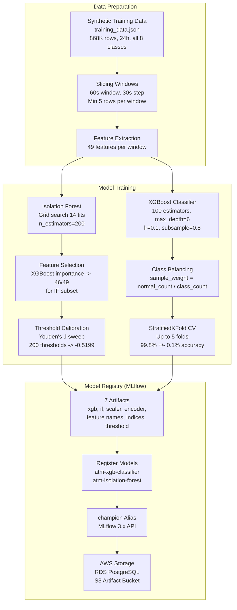
```mermaid
flowchart TD
  subgraph Data ["Data Preparation"]
    SYNTH["Synthetic Training Data<br/>training_data.json<br/>868K rows, 24h, all 8 classes"]
    WIN["Sliding Windows<br/>60s window, 30s step<br/>Min 5 rows per window"]
    FE["Feature Extraction<br/>49 features per window"]
  end

  subgraph Training ["Model Training"]
    XGB_TRAIN["XGBoost Classifier<br/>100 estimators, max_depth=6<br/>lr=0.1, subsample=0.8"]
    CV["StratifiedKFold CV<br/>Up to 5 folds<br/>99.8% +/- 0.1% accuracy"]
    BAL["Class Balancing<br/>sample_weight = normal_count / class_count"]
    IF_TRAIN["Isolation Forest<br/>Grid search 14 fits<br/>n_estimators=200"]
    FS["Feature Selection<br/>XGBoost importance -> 46/49<br/>for IF subset"]
    TC["Threshold Calibration<br/>Youden's J sweep<br/>200 thresholds -> -0.5199"]
  end

  subgraph Registry ["Model Registry (MLflow)"]
    SAVE["7 Artifacts<br/>xgb, if, scaler, encoder,<br/>feature names, indices, threshold"]
    REG["Register Models<br/>atm-xgb-classifier<br/>atm-isolation-forest"]
    ALIAS["champion Alias<br/>MLflow 3.x API"]
    AWS["AWS Storage<br/>RDS PostgreSQL<br/>S3 Artifact Bucket"]
  end

  SYNTH --> WIN --> FE
  FE --> XGB_TRAIN --> BAL --> CV
  FE --> IF_TRAIN --> FS --> TC
  TC & CV --> SAVE --> REG --> ALIAS --> AWS
```

**Training Data:**

The synthetic training dataset (`training_data.json`) covers 24 hours of simulated ATM operations with injected anomalies:

| Attribute | Value |
|---|---|
| Total rows | 868,000 |
| Time span | 24 hours |
| Window size | 60 seconds |
| Window step | 30 seconds |
| Total windows (≥5 rows) | 7,190 |
| Classes | 8 (NORMAL + A1-A7) |
| Features per window | 49 (full), 46 (IF subset) |
| Class balancing | `sample_weight = normal_count / class_count` |

**Cross-Validation Results (StratifiedKFold, up to 5 folds):**

| Class | Precision | Recall | F1-Score | Support (avg) |
|---|---|---|---|---|
| NORMAL | 1.0 | 1.0 | 1.0 | 4,480 |
| A1 (Network Timeout) | 1.0 | 1.0 | 1.0 | 192 |
| A2 (Cash Cassette) | 1.0 | 1.0 | 1.0 | 144 |
| A3 (JVM Memory Leak) | 1.0 | 1.0 | 1.0 | 216 |
| A4 (Container Restart) | 1.0 | 1.0 | 1.0 | 168 |
| A5 (Response Time Spike) | 1.0 | 1.0 | 1.0 | 240 |
| A6 (OS Memory Pressure) | 1.0 | 1.0 | 1.0 | 192 |
| A7 (Out-of-Order Kafka) | 1.0 | 1.0 | 1.0 | 168 |
| **Weighted avg** | **1.0** | **1.0** | **1.0** | **7,190** |
| **CV accuracy** | | | **99.8% ± 0.1%** | |

**Isolation Forest (unsupervised):**

| Metric | Value |
|---|---|
| AUC-ROC | 0.9502 |
| Precision | 97.3% |
| Optimal threshold (Youden's J) | -0.5199 |
| Thresholds evaluated | 200 (grid sweep) |
| Max F1 at threshold | 0.7008 |

**Hyperparameter Details:**

| Model | Parameter | Value | Tuning |
|---|---|---|---|
| XGBoost | `n_estimators` | 100 | Manual |
| | `max_depth` | 6 | Manual |
| | `learning_rate` | 0.1 | Manual |
| | `subsample` | 0.8 | Manual |
| | `colsample_bytree` | 0.8 | Manual |
| | `objective` | `multi:softprob` | Required for 8-class |
| | `eval_metric` | `mlogloss` | Standard |
| Isolation Forest | `n_estimators` | 200 | Grid search (14 fits) |
| | `max_samples` | `'auto'` | Default |
| | `contamination` | `'auto'` | Grid search |
| | `bootstrap` | `False` | Grid search |

**7 MLflow Artifacts:**

| Artifact | Type | Purpose |
|---|---|---|
| `xgb_classifier.joblib` | Pickle | Trained XGBoost model (49 features, 8 classes) |
| `isolation_forest.joblib` | Pickle | Trained Isolation Forest model (46 features) |
| `label_encoder.joblib` | Pickle | Encodes anomaly type strings ↔ integers |
| `scaler.joblib` | Pickle | StandardScaler fitted on training data (49 dims) |
| `feature_names.json` | JSON | List of all 49 feature names in order |
| `if_feature_indices.json` | JSON | Indices of the 46 features used by IF |
| `if_unknown_threshold.json` | JSON | Youden's J optimal threshold (-0.5199) |

**MLflow MLOps Workflow:**

1. **Training** → MLflow experiment tracks params, metrics, and artifacts to RDS PostgreSQL (18.4)
2. **Registration** → Models registered as `atm-xgb-classifier` and `atm-isolation-forest` in MLflow Model Registry
3. **Champion Alias** → Best-performing run gets `champion` alias (MLflow 3.x API - replaces deprecated stage-based promotion)
4. **Artifact Storage** → Model binaries stored in S3 bucket (`laad-mlflow-artifacts`), versioned automatically
5. **Loading** → Production code loads via `mlflow.pyfunc.load_model()` or direct `joblib` download from S3
6. **Auto-Retrain** → On startup, if artifacts are missing or corrupted, the system auto-launches retraining with the same pipeline
7. **Git Integration** → Every training run is tagged with the Git commit SHA for full reproducibility

---

### Agentic RAG Diagnostic Assistant

An agentic RAG system with 4-stage reasoning (self-consistency, reflexion, citation grounding, verbalized confidence) and multi-signal confidence fusion. Uses Ollama Cloud as primary LLM provider with OpenRouter emergency fallback. Designed for diagnostic conversations around ATM anomalies - users ask about specific anomaly IDs, entities, time ranges, or symptoms.

**Why ChromaDB over Pinecone?** Self-hosted in Docker - no per-vector API costs, 50K+ docs fit in RAM, log data never leaves the network. Local Ollama embedding (`nomic-embed-text`, 768-dim) eliminates network round-trip.

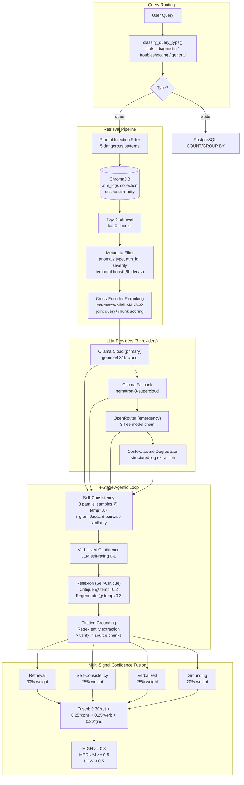
```mermaid
flowchart TD
  subgraph Routing ["Query Routing"]
    Q["User Query"]
    CLASS["classify_query_type()<br/>stats / diagnostic / troubleshooting / general"]
    ROUTE{"Type?"}
  end

  subgraph Retrieval ["Retrieval Pipeline"]
    SAN["Prompt Injection Filter<br/>5 dangerous patterns"]
    CDB[("ChromaDB<br/>atm_logs collection<br/>cosine similarity")]
    TOPK["Top-K retrieval<br/>k=10 chunks"]
    FILTER["Metadata Filter<br/>anomaly type, atm_id, severity<br/>temporal boost (6h decay)"]
    CE["Cross-Encoder Reranking<br/>ms-marco-MiniLM-L-2-v2<br/>joint query+chunk scoring"]
  end

  subgraph Agentic ["4-Stage Agentic Loop"]
    SC["Self-Consistency<br/>3 parallel samples @ temp=0.7<br/>3-gram Jaccard pairwise similarity"]
    VC["Verbalized Confidence<br/>LLM self-rating 0-1"]
    REFLEX["Reflexion (Self-Critique)<br/>Critique @ temp=0.2<br/>Regenerate @ temp=0.3"]
    CG["Citation Grounding<br/>Regex entity extraction<br/>> verify in source chunks"]
  end

  subgraph LLM ["LLM Providers (3 providers)"]
    OLLAMA["Ollama Cloud (primary)<br/>gemma4:31b-cloud"]
    FB["Ollama Fallback<br/>nemotron-3-supercloud"]
    EMERG["OpenRouter (emergency)<br/>3 free model chain"]
    DEGRADE["Context-aware Degradation<br/>structured log extraction"]
  end

  subgraph Fusion ["Multi-Signal Confidence Fusion"]
    RETR["Retrieval<br/>30% weight"]
    CONS["Self-Consistency<br/>25% weight"]
    VERB["Verbalized<br/>25% weight"]
    GRND["Grounding<br/>20% weight"]
    FUSE["Fused: 0.30*ret + 0.25*cons + 0.25*verb + 0.20*gnd"]
    LEVEL["HIGH >= 0.8<br/>MEDIUM >= 0.5<br/>LOW < 0.5"]
  end

  Q --> CLASS --> ROUTE
  ROUTE -->|"stats"| DB["PostgreSQL COUNT/GROUP BY"]
  ROUTE -->|"other"| SAN --> CDB --> TOPK --> FILTER --> CE
  CE --> OLLAMA --> FB --> EMERG --> DEGRADE
  OLLAMA & FB & EMERG & DEGRADE --> SC --> VC --> REFLEX --> CG
  CG --> RETR & CONS & VERB & GRND --> FUSE --> LEVEL
```

**Chunking & Embedding Strategy:**

The ChromaDB ingestion pipeline processes each ATM event through LangChain's `SemanticChunker` (threshold-based, not fixed-size) which splits log sequences into semantically coherent segments. Each chunk is embedded via Ollama's `nomic-embed-text` model (768-dimension vectors) using a local API call - no data leaves the local network. The `atm_logs` collection stores metadata alongside each embedding:

| Metadata Field | Source | Purpose in Filtering |
|---|---|---|
| `atm_id` | Event source | Filter diagnostics to a specific ATM |
| `anomaly_type` | Detection engine | Scope by anomaly class |
| `severity` | Detection engine | Filter by CRITICAL/MAJOR/HIGH |
| `event_type` | Parser output | Match query topic |
| `timestamp` | Event timestamp | Temporal boost (6h half-life decay) |

**Query Processing Pipeline:**

1. **Query Classification** - `classify_query_type()` categorises the user message as `stats`, `diagnostic`, `troubleshooting`, or `general`
   - `stats` → direct PostgreSQL query (aggregated counts over anomalies/events) - bypasses LLM entirely. Example: "How many A1 anomalies in the last hour?"
   - Other types → full RAG pipeline with vector search
2. **Prompt Injection Filter** - 5 dangerous patterns are checked before any LLM call: SQL injection, prompt leakage, role-play manipulation, system prompt override, and special token injection. Matches are silently rejected.
3. **Retrieval** - ChromaDB cosine similarity search (k=10) with metadata filter from extracted query entities. Temporal metadata gets an exponential decay boost (6h half-life) - more recent chunks score higher in similarity.
4. **Cross-Encoder Reranking** - `ms-marco-MiniLM-L-2-v2` jointly scores each (query, chunk) pair, producing relevance scores +5-15% more accurate than cosine similarity alone. Top-3 chunks proceed to the LLM.
5. **LLM Generation** - The primary response is generated by the first available provider in the chain.
6. **4-Stage Agentic Loop** - Runs on the primary response:
   - **Self-Consistency**: 3 parallel LLM samples at temp=0.7, compared via 3-gram Jaccard pairwise similarity. High agreement = higher confidence.
   - **Verbalized Confidence**: LLM self-rates its confidence (0-1 scale) with explicit reasoning for the rating.
   - **Reflexion (Self-Critique)**: A critique pass at temp=0.2 evaluates the response for factual support. If unsupported claims are found, a regeneration pass at temp=0.3 produces a corrected version.
   - **Citation Grounding**: Regex entity extraction (anomaly IDs, ATM IDs, metric names) → cross-checked against source chunks. Ungrounded entities reduce the grounding signal.
7. **Multi-Signal Confidence Fusion** - Combines 4 independent signals into a single score:

| Signal | Weight | Source | Computation |
|---|---|---|---|
| Retrieval | 30% | ChromaDB | Normalised cosine similarity (0-1) |
| Self-Consistency | 25% | 3 samples | Mean 3-gram Jaccard similarity |
| Verbalized | 25% | LLM | Self-rated confidence (0-1) |
| Grounding | 20% | Entity check | (grounded entities / total entities) |

Fused score = `0.30 × ret + 0.25 × cons + 0.25 × verb + 0.20 × gnd`. Missing signals (e.g., no entities to ground) are renormalised by removing their weight from the denominator. Final level: **HIGH (≥0.8)**, **MEDIUM (≥0.5)**, **LOW (<0.5)**.

**Platt Calibration:**

Every 20 user feedback samples (thumbs up/down), the calibrator fits a Platt scaling model (logistic regression on fused scores vs binary feedback). Calibration is applied when Expected Calibration Error (ECE) exceeds 0.10. This ensures the confidence score remains empirically calibrated as the system processes more data.

**LLM Provider Chain:**

| Priority | Provider | Model | Fallback Trigger |
|---|---|---|---|
| 1 (Primary) | Ollama Cloud | `gemma4:31b-cloud` | HTTP error, timeout > 15s |
| 2 (Fallback) | Ollama Cloud | `nemotron-3-supercloud` | Same as primary |
| 3 (Emergency) | OpenRouter | Chain of 3 free models | Both Ollama Cloud providers fail |
| 4 (Degradation) | Local extraction | Structured log extraction (no LLM) | All providers down |

**Latency Breakdown:**

| Stage | Uncached | Cached (300s TTL) |
|---|---|---|
| Query classification | <50ms | <50ms |
| ChromaDB retrieval | ~200ms | ~200ms |
| Cross-encoder reranking | ~150ms | - |
| LLM generation (first sample) | 5-8s | - |
| Self-consistency (2 additional) | 2-5s (parallel) | - |
| Reflexion | 2-4s | - |
| Citation grounding | <100ms | - |
| **Total** | **11-23s** | **<100ms** |

Self-consistency runs via `ThreadPoolExecutor` - 2 additional samples in parallel with the primary response. The first sample is reused as the primary response, so the user sees the initial answer immediately while confidence fusion completes in the background.

---

### Redis Infrastructure (8 Patterns)

Redis 7 (Alpine) provides 8 distributed coordination patterns from a single shared client with connection pooling (max 20, 2s timeout). Every operation has a graceful degradation fallback - no single Redis failure can take down a core service.

**Data Flow - How Redis Serves Each Service Layer:**

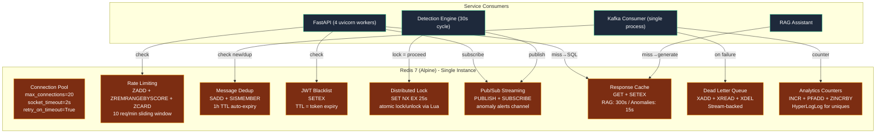
```mermaid
flowchart TD
    subgraph Redis7 ["Redis 7 (Alpine) - Single Instance"]
        POOL["Connection Pool<br/>max_connections=20<br/>socket_timeout=2s<br/>retry_on_timeout=True"]

        R1["Rate Limiting<br/>ZADD + ZREMRANGEBYSCORE + ZCARD<br/>10 req/min sliding window"]
        R2["Message Dedup<br/>SADD + SISMEMBER<br/>1h TTL auto-expiry"]
        R3["JWT Blacklist<br/>SETEX<br/>TTL = token expiry"]
        R4["Distributed Lock<br/>SET NX EX 25s<br/>atomic lock/unlock via Lua"]
        R5["Pub/Sub Streaming<br/>PUBLISH + SUBSCRIBE<br/>anomaly alerts channel"]
        R6["Response Cache<br/>GET + SETEX<br/>RAG: 300s / Anomalies: 15s"]
        R7["Dead Letter Queue<br/>XADD + XREAD + XDEL<br/>Stream-backed"]
        R8["Analytics Counters<br/>INCR + PFADD + ZINCRBY<br/>HyperLogLog for uniques"]
    end

    subgraph Services ["Service Consumers"]
        API["FastAPI (4 uvicorn workers)"]
        CON["Kafka Consumer (single process)"]
        DET["Detection Engine (30s cycle)"]
        RAG["RAG Assistant"]
    end

    API -->|"check"| R3
    API -->|"check"| R1
    API -->|"miss→SQL"| R6
    API -->|"subscribe"| R5

    CON -->|"check new/dup"| R2
    CON -->|"on failure"| R7
    CON -->|"counter"| R8

    DET -->|"lock = proceed"| R4
    DET -->|"publish"| R5

    RAG -->|"miss→generate"| R6

    classDef redis fill:#7c2d12,stroke:#f59e0b,color:#ffffff;
    classDef svc fill:#1e293b,stroke:#34d399,color:#ffffff;
    class POOL,R1,R2,R3,R4,R5,R6,R7,R8 redis;
    class API,CON,DET,RAG svc;
```

**Connection Pool Configuration:**

| Parameter | Value | Rationale |
|---|---|---|
| `max_connections` | 20 | Shared across API (4 workers) + consumer + detection engine + RAG. At peak load, each worker may hold 1-2 connections. |
| `socket_timeout` | 2s | Fast failure - no operation should wait more than 2s for Redis. Degradation kicks in immediately after timeout. |
| `socket_connect_timeout` | 2s | If Redis is down, fail fast rather than hanging the service startup. |
| `retry_on_timeout` | True | Network blips should not silently drop operations - but retry only once to avoid compounding. |
| `health_check_interval` | 30s | Periodic PING to detect stale connections before they cause operation failures. |

**8 Patterns - Implementation & Degradation Details:**

| # | Pattern | Data Structure | Operations | Degradation |
|---|---|---|---|---|
| 1 | **Rate Limiting** | Sorted Set | `ZADD timestamp:req`, `ZREMRANGEBYSCORE -inf (now-60s)`, `ZCARD` | Falls back to in-memory counters per worker. Rate limit becomes per-worker (less accurate) but the API stays up. |
| 2 | **Message Deduplication** | Set + 1h TTL | `SADD message_id` + `SISMEMBER` check | 10K-entry LRU `OrderedDict` in process memory. On Redis failure, dedup degrades to process-scoped (no cross-restart dedup, but in-flight dedup survives). |
| 3 | **JWT Blacklist** | String + TTL | `SETEX token_blacklist:{jti} 1 {exp}` | Falls back to an in-memory set. Tokens are only blacklisted until the next process restart. TTL-driven expiry becomes process-lifetime. |
| 4 | **Distributed Lock** | String | `SET lock:detection 1 NX EX 25` | Lock failure → proceed without lock. Risk of concurrent detection cycles (both consumers run simultaneously) - duplicate anomaly writes are deduped downstream. |
| 5 | **Pub/Sub Streaming** | Pub/Sub + Sorted Set | `PUBLISH channel msg` + `SUBSCRIBE` | No subscriber → message silently dropped. The anomaly is already persisted in PostgreSQL - Pub/Sub is real-time notification only, not data delivery. |
| 6 | **Response Caching** | String | `GET cache:{key}` + `SETEX` | Cache miss → query PostgreSQL directly. API still responds at DB speed (typically <100ms). |
| 7 | **Dead Letter Queue** | Stream | `XADD fails:{topic} * {payload}`, `XREAD`, `XDEL` | DLQ messages remain in consumer memory (process-scoped). On Redis failure, failed messages stay in the consumer's retry buffer until Redis recovers. |
| 8 | **Analytics Counters** | `INCR` + `PFADD` + `ZINCRBY` | Per-source event counts, HyperLogLog for unique ATMs, sorted-by-hour for time-series | Falls back to returning zeros - analytics charts show no data until Redis recovers. No data loss since raw events persist in PostgreSQL. |

**Why Redis over alternatives?** At this scale (~100 msg/s), a single Redis instance handles all 8 patterns with <1ms per operation. The in-memory performance (vs PostgreSQL for rate-limiting and real-time counters) avoids schema overhead and connection contention. The degradation chain means zero single-point-of-failure despite using a single Redis instance.

---

### Frontend Architecture

A production-grade React 19 SPA with Vite 8, Tailwind CSS v4 (beta), Chart.js, and 17 shadcn/ui components - served via multi-stage Docker (Node.js builder → nginx alpine, ~25MB final image).

**Page & Component Hierarchy:**

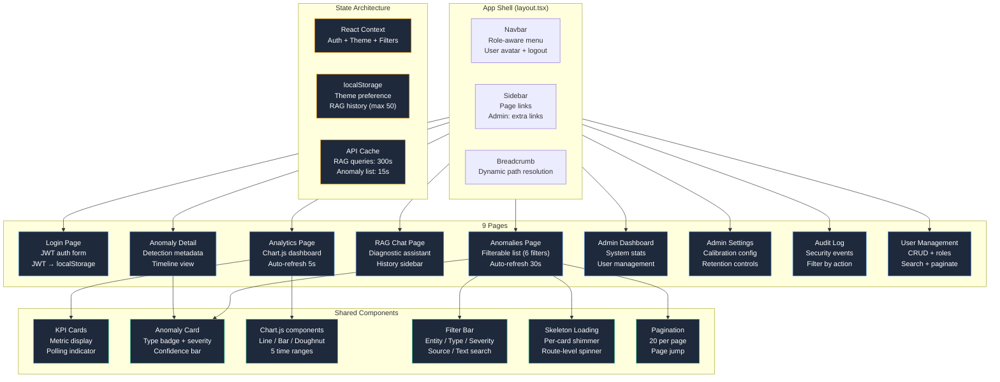
```mermaid
flowchart TD
    subgraph AppShell ["App Shell (layout.tsx)"]
        NAV["Navbar<br/>Role-aware menu<br/>User avatar + logout"]
        SIDE["Sidebar<br/>Page links<br/>Admin: extra links"]
        BREAD["Breadcrumb<br/>Dynamic path resolution"]
    end

    subgraph Pages ["9 Pages"]
        LOGIN["Login Page<br/>JWT auth form<br/>JWT → localStorage"]
        ANA["Analytics Page<br/>Chart.js dashboard<br/>Auto-refresh 5s"]
        ANO["Anomalies Page<br/>Filterable list (6 filters)<br/>Auto-refresh 30s"]
        RAG["RAG Chat Page<br/>Diagnostic assistant<br/>History sidebar"]
        DET["Anomaly Detail<br/>Detection metadata<br/>Timeline view"]
        ADM_DASH["Admin Dashboard<br/>System stats<br/>User management"]
        ADM_SETTINGS["Admin Settings<br/>Calibration config<br/>Retention controls"]
        ADMIN_LOG["Audit Log<br/>Security events<br/>Filter by action"]
        ADM_USERS["User Management<br/>CRUD + roles<br/>Search + paginate"]
    end

    subgraph Shared ["Shared Components"]
        KPI_CARDS["KPI Cards<br/>Metric display<br/>Polling indicator"]
        ANOMALY_CARD["Anomaly Card<br/>Type badge + severity<br/>Confidence bar"]
        METRIC_CHART["Chart.js components<br/>Line / Bar / Doughnut<br/>5 time ranges"]
        FILTER_BAR["Filter Bar<br/>Entity / Type / Severity<br/>Source / Text search"]
        LOADING["Skeleton Loading<br/>Per-card shimmer<br/>Route-level spinner"]
        PAGINATION["Pagination<br/>20 per page<br/>Page jump"]
    end

    subgraph State ["State Architecture"]
        CTX["React Context<br/>Auth + Theme + Filters"]
        LS["localStorage<br/>Theme preference<br/>RAG history (max 50)"]
        API_CACHE["API Cache<br/>RAG queries: 300s<br/>Anomaly list: 15s"]
    end

    AppShell --> LOGIN
    AppShell --> ANA
    AppShell --> ANO
    AppShell --> RAG
    AppShell --> DET
    AppShell --> ADM_DASH
    AppShell --> ADM_SETTINGS
    AppShell --> ADMIN_LOG
    AppShell --> ADM_USERS
    ANA --> KPI_CARDS
    ANA --> METRIC_CHART
    ANO --> ANOMALY_CARD
    ANO --> FILTER_BAR
    ANO --> PAGINATION
    ANO --> LOADING
    DET --> ANOMALY_CARD

    classDef pages fill:#1e293b,stroke:#60a5fa,color:#ffffff;
    classDef shared fill:#1e293b,stroke:#34d399,color:#ffffff;
    classDef state fill:#1e293b,stroke:#f59e0b,color:#ffffff;
    class LOGIN,ANA,ANO,RAG,DET,ADM_DASH,ADM_SETTINGS,ADMIN_LOG,ADM_USERS pages;
    class KPI_CARDS,ANOMALY_CARD,METRIC_CHART,FILTER_BAR,LOADING,PAGINATION shared;
    class CTX,LS,API_CACHE state;
```

**Key Features:**

| Feature | Implementation | Details |
|---|---|---|
| **Auto-refresh** | `setInterval` + route awareness | Analytics: 5s polling. Anomalies: 30s polling. Paused on RAG/Detail pages to save bandwidth. Loading indicator shows "live" status. |
| **6-filter anomaly list** | Multi-select + text search | Sort by criticality (weighted score), recency, severity. Filter by entity, type, severity, source, free text. 20 results per page with page jump. |
| **Chart.js dashboards** | 3 visualization types | Bar (anomaly counts per type), Line (metric trends over time), Doughnut (severity distribution). 5 time range presets (1h/6h/24h/7d/30d) with adaptive bucket resolution. |
| **3-layer persistence** | Context → localStorage → API | React context for session state (auth token, theme). localStorage for RAG history (capped at 50 entries, LRU eviction). API calls to PostgreSQL for full history retrieval. |
| **Auth** | JWT + bcrypt | Token stored in localStorage, sent as Bearer header. `require_admin` guard on admin routes + API. Redis token blacklist for secure logout. Role-aware UI (nav items, admin panel visibility). |
| **Theme** | Tailwind dark mode | CSS class toggle on `<html>`. Persistent via localStorage. All shadcn/ui components support both themes. |
| **Skeleton loading** | Per-card shimmer | Each page defines skeleton variants matching its card layout. Loads → data fills in without layout shift. |
| **Build** | Multi-stage Docker | `node:20-alpine` build → nginx alpine serve. All assets minified + content-hashed filenames. ~25MB final image. Nginx reverse-proxies `/api/*` to FastAPI backend. |

---

## AWS Deployment & Infrastructure

The entire platform is deployed on AWS using **Terraform infrastructure-as-code** - 10 modules across 118 resources - with automated CI/CD (GitHub Actions), managed secrets, and container orchestration via ECS Fargate.

### VPC & Network Topology


```mermaid
flowchart TD
    subgraph Internet ["Internet"]
        USR["User / Browser"]
        GH["GitHub Actions<br/>OIDC Provider"]
    end

    subgraph AWS_Cloud ["AWS Region (eu-west-2)"]
        subgraph Public_Subnets ["2 Public Subnets (10.0.1.0/24, 10.0.2.0/24)"]
            IGW["Internet Gateway"]
            ALB["Application Load Balancer<br/>HTTPS :443<br/>ACM TLS cert"]
            NAT["NAT Gateway<br/>Elastic IP"]
        end

        subgraph Private_Subnets ["2 Private Subnets (10.0.10.0/24, 10.0.20.0/24)"]
            subgraph ECS_Services ["ECS Fargate Cluster"]
                API_TASK["API Service<br/>2 tasks (2 vCPU, 4 GB)<br/>FastAPI + Uvicorn<br/>Port 8000"]
                CON_TASK["Consumer Service<br/>2 tasks (1 vCPU, 2 GB)<br/>Kafka Consumer +<br/>Detection Engine"]
            end

            subgraph EC2_Services ["EC2 Instance (t3.medium)"]
                KAFKA["Kafka (KRaft)<br/>confluentinc/cp-kafka:7.5.0<br/>3 partitions/topic"]
                REDIS["Redis 7 Alpine<br/>8 patterns<br/>Connection pool: 20"]
                CHROMA["ChromaDB<br/>atm_logs collection<br/>nomic-embed-text"]
                OLLAMA["Ollama<br/>Local LLM + embedding<br/>No network egress"]
            end

            subgraph RDS ["RDS PostgreSQL"]
                MLFLOW_DB["MLflow Tracking DB<br/>PostgreSQL 18.4<br/>Serverless GP_S_Gen5"]
            end
        end

        subgraph S3 ["S3 Buckets"]
            FRONTEND_B["Frontend Hosting<br/>React SPA static assets"]
            ARTIFACTS_B["MLflow Artifacts<br/>Model binaries + metadata"]
            TFSTATE_B["Terraform State<br/>Versioned + DynamoDB lock"]
        end

        subgraph SageMaker_["AWS SageMaker"]
            SM_ENDPOINT["laad-xgb-champion<br/>ml.t2.medium<br/>XGBoost 1.7-1<br/>49 features, 8 classes"]
        end

        subgraph Secrets_["Secrets Manager"]
            SM_SECRETS["8 Secrets<br/>DB/Kafka/JWT/SageMaker<br/>Injected via ECS task def"]
        end

        subgraph IAM_Roles ["IAM (6 least-privilege roles)"]
            IAM_ECS_EXEC["ECS Execution Role<br/>Pull from ECR + CW logs"]
            IAM_ECS_TASK["ECS Task Role<br/>Access S3 + Secrets"]
            IAM_SM["SageMaker Execution<br/>S3 + CW logs"]
            IAM_OIDC["CI/CD OIDC Role<br/>GitHub → AWS auth"]
            IAM_CW["CloudWatch Logs<br/>Write log streams"]
            IAM_MLF["MLflow Role<br/>S3 artifacts access"]
        end
    end

    subgraph CI_CD ["GitHub Actions"]
        CI_PIPE["ci.yml<br/>945 tests + checkov<br/>pytest + vitest + TF"]
        CD_PIPE["cd.yml<br/>Terraform plan/apply<br/>ECS rolling update"]
        CD_GATE["cd-should-deploy.yml<br/>Path-based gate<br/>Skip on docs only"]
    end

    USR -->|"HTTPS"| ALB
    ALB -->|"SG: only ALB:443"| API_TASK
    API_TASK -->|"SG: only ECS:5432"| MLFLOW_DB
    API_TASK -->|"local"| REDIS
    CON_TASK --> KAFKA
    CON_TASK --> REDIS
    CON_TASK --> CHROMA
    CON_TASK --> OLLAMA
    CON_TASK -->|"SageMaker:InvokeEndpoint"| SM_ENDPOINT
    API_TASK -->|"S3:GetObject"| FRONTEND_B
    CON_TASK -->|"S3:GetObject"| ARTIFACTS_B
    SM_ENDPOINT -->|"S3:GetObject"| ARTIFACTS_B
    API_TASK -->|"secrets:GetSecretValue"| SM_SECRETS
    CON_TASK -->|"secrets:GetSecretValue"| SM_SECRETS
    ECS_Services -->|"outbound"| NAT -->|"egress"| IGW
    GH -->|"OIDC AssumeRole"| IAM_OIDC
    CI_PIPE & CD_PIPE --> IAM_OIDC

    classDef internet fill:#1e3a5f,stroke:#60a5fa,color:#ffffff;
    classDef public fill:#1e3a5f,stroke:#60a5fa,color:#ffffff;
    classDef private fill:#1a1a2e,stroke:#a78bfa,color:#ffffff;
    classDef ecs fill:#1e293b,stroke:#34d399,color:#ffffff;
    classDef ec2 fill:#1e293b,stroke:#f97316,color:#ffffff;
    classDef rds fill:#0f766e,stroke:#14b8a6,color:#ffffff;
    classDef s3 fill:#0f766e,stroke:#14b8a6,color:#ffffff;
    classDef sm fill:#1e3a5f,stroke:#ff9900,color:#ffffff;
    classDef secrets fill:#7c2d12,stroke:#f59e0b,color:#ffffff;
    classDef iam fill:#581c87,stroke:#a78bfa,color:#ffffff;
    classDef cicd fill:#1f2937,stroke:#6b7280,color:#ffffff;

    class USR,GH internet;
    class IGW,ALB,NAT public;
    class KAFKA,REDIS,CHROMA,OLLAMA ec2;
    class API_TASK,CON_TASK ecs;
    class MLFLOW_DB rds;
    class FRONTEND_B,ARTIFACTS_B,TFSTATE_B s3;
    class SM_ENDPOINT sm;
    class SM_SECRETS secrets;
    class IAM_ECS_EXEC,IAM_ECS_TASK,IAM_SM,IAM_OIDC,IAM_CW,IAM_MLF iam;
    class CI_PIPE,CD_PIPE,CD_GATE cicd;
```

### Layer-by-Layer Architecture

| Layer | Provisioned Resources | Details |
|---|---|---|
| **Networking** | VPC (10.0.0.0/16), 2 public subnets, 2 private subnets, Internet Gateway, NAT Gateway, 2 AZs | All application traffic isolated in private subnets, outbound via NAT Gateway. Public subnets only for ALB and NAT Gateway. |
| **Container Orchestration** | ECS Fargate cluster (2 services: API + Consumer), each with 2 desired tasks across AZs | Rolling update deployments, health check grace period, CloudWatch log groups per task. No EC2 nodes to manage. |
| **Kafka + Supporting** | EC2 instance in private subnet hosting Kafka (KRaft), Redis 7, ChromaDB, Ollama | Single EC2 hosts 4 services. Kafka persists events with 7-day retention; Redis provides 8 distributed patterns; ChromaDB stores vector embeddings for RAG. |
| **Databases** | RDS PostgreSQL 18.4 (MLflow tracking backend) + PostgreSQL 16 Docker (app database) | App DB on EC2 for cost optimisation, MLflow on RDS for production reliability with automated backups. 10 tables + 3 views + 14 indexes. |
| **Storage** | 3 S3 buckets: frontend hosting (static assets), MLflow artifacts (model binaries), Terraform state (infrastructure state) | Frontend bucket serves React app via CloudFront. MLflow artifacts bucket stores model files (XGBoost, Isolation Forest, scalers, encoders). Terraform state bucket is versioned with DynamoDB locking. |
| **ML Inference** | SageMaker endpoint `laad-xgb-champion` on ml.t2.medium | XGBoost 1.7-1 container, 49-feature model, 8-class softmax probabilities (`multi:softprob`), ~100ms inference. CloudWatch logs enabled, model deployed from MLflow artifact store via automated upload script. |
| **CDN** | CloudFront distribution backed by S3 origin | Edge caching for React frontend, HTTPS enforcement, custom error pages. Argo-powered CDN with origin shield. |
| **CI/CD** | GitHub Actions - 3 pipelines (CI, CD, CD-SHOULD-DEPLOY) | OIDC-based AWS authentication (no static keys). CI runs 945 tests + checkov. CD applies Terraform and triggers ECS rolling updates. CD-SHOULD-DEPLOY gates deployment to path changes. |
| **Security** | 6 IAM roles (least-privilege), Secrets Manager (8 secrets), no hardcoded credentials | ECS execution role, ECS task role, SageMaker execution role, CI/CD OIDC role, CloudWatch logs role, MLflow role. Secrets: DB credentials, Kafka config, JWT secret, API keys, SageMaker config, MLflow URIs, admin credentials, Redis password. |

### Complete Infrastructure Inventory

| Service | Technology | Purpose |
|---|---|---|
| PostgreSQL (App) | 16 Alpine | Primary application database, health-checked with `pg_isready`, `ThreadedConnectionPool` (min=5, max=50) |
| PostgreSQL (MLflow) | RDS 18.4 | MLflow tracking backend - experiment params, metrics, tags, runs registered against AWS RDS |
| Apache Kafka | confluentinc/cp-kafka:7.5.0 (KRaft) | Central message bus, 3 partitions/topic, 7-day retention, gzip compression, acks=all |
| Kafka Consumer | Python + kafka-python (manual offset commits) | Hybrid deduplicator (Redis SET + 10K LRU), 7 source-specific parsers, dual-writes to PostgreSQL + ChromaDB |
| ChromaDB | chromadb/chroma | Vector database: `atm_logs` collection, cosine similarity, Ollama `nomic-embed-text` (768-dim) embeddings |
| Ollama | ollama/ollama | Local embedding generation for semantic chunking - eliminates network round-trip |
| Backend API | FastAPI + Uvicorn (4 workers) | 30 REST endpoints across 6 routers: auth, anomalies, entities, analysis, admin, RAG |
| Log Generator | Python + kafka-python | Pure Kafka producer (gzip, acks=all) - no direct DB writes as per architecture rule |
| MLflow | Custom Docker image (MLflow 3.1.1) | Experiment tracking + model registry with `champion` alias, Git SHA tagging |
| SageMaker | `sagemaker-xgboost:1.7-1` on ml.t2.medium | `laad-xgb-champion` endpoint, JSON-format XGBoost model, 8-class softmax, cross-check inference |
| Redis | 7 Alpine | 8 distributed patterns from shared connection pool: rate limiting, dedup, locking, Pub/Sub, caching, DLQ, analytics counters |
| Frontend | nginx alpine (~25MB final image) | Multi-stage build (Node.js → nginx), all assets minified + content-hashed, reverse proxies `/api/*` to FastAPI |

### Key Infrastructure Decisions

- **All 10 production services + 3 test services** with health check cascading: backend API depends on PostgreSQL + Redis, consumer depends on Kafka + Redis + ChromaDB, frontend depends on API.
- **7 named Docker volumes** for persistent data: PostgreSQL app data, PostgreSQL test data, ChromaDB index files, Ollama model cache, Kafka data, ZooKeeper-equivalent KRaft metadata, MLflow artifacts.
- **Profile-based Compose separation** via `profiles: ["ml", "test"]` - production services start with `make all`, ML services with `make ml`, test services via `make test`.
- **Kafka (KRaft)** runs without ZooKeeper - eliminates an entire cluster dependency, simplifies deployment, reduces resource usage. 7-day retention with gzip compression for cost-effective storage.
- **Secrets injection** via AWS Secrets Manager → ECS task definition `secrets` block - 8 secrets mapped as environment variables at container start. No `.env` files in production.
- **CI/CD auth** via GitHub Actions OIDC (`AssumeRoleWithWebIdentity`) - no long-lived AWS credentials in CI. Terraform state locked via DynamoDB, versioned via S3.
- **SageMaker cross-check** validated with `InvokeEndpoint` returning 8-class softmax probabilities. Model saved in JSON format (not UBJSON) to maintain compatibility with SageMaker XGBoost 1.7-1 container.
- **Auto-retrain on startup** when model artifacts are missing or corrupted - MLflow champion alias always points to latest valid model.
- **Hourly batched retention cleanup** (5K rows/batch) preserves unresolved anomalies; VACUUM left to DBA.

---

## Design Decisions

Key architectural decisions that shaped the platform, beyond what the Engineering Highlights table covers.

| Decision | Alternative Considered | Why This Won |
|---|---|---|
| **Kafka (KRaft) over Redis PubSub** | Redis Pub/Sub + Redis Streams for message bus | Kafka persists to disk with configurable retention (7 days) and offset replay for backfill. Redis PubSub loses messages with no active subscriber. At 100+ msg/s, Kafka's batching and compression (gzip, 65% ratio) significantly reduce network I/O. |
| **3 detection layers (not just ML)** | ML-only, pure heuristic-only | Each layer has independent failure modes. ML_ENSEMBLE catches 8-class patterns at 99.8% but misses novel drift. ZSCORE catches drift without models. HEURISTIC is the always-on safety net. Defense in depth - no single failure mode goes undetected. |
| **XGBoost + Isolation Forest (two-model ensemble)** | Single XGBoost classifier, deep learning (LSTM) | XGBoost provides interpretable 8-class classification with soft probabilities. Isolation Forest adds unsupervised anomaly detection for novel patterns not in the 8 training classes. The two-model ensemble distinguishes "known anomaly type" from "something is wrong but I don't know what" - a critical operational distinction. LSTM would require sequence-order sensitivity that adds complexity without improving detection at this scale. |
| **ChromaDB over Pinecone / Weaviate** | Pinecone (managed), Weaviate (self-hosted) | Self-hosted ChromaDB in Docker - no per-vector API costs, 50K+ docs fit in RAM, log data never leaves the local network. Ollama `nomic-embed-text` (768-dim) for local embeddings eliminates network round-trip and per-token API costs. |
| **4-signal confidence fusion over single confidence** | LLM-only confidence, retrieval-only score | No single signal is reliable enough to trust alone. Retrieval can miss relevant chunks. LLM verbalized confidence is systematically overconfident. Self-consistency is expensive. Grounding is sparse. Fusing all 4 with Platt calibration produces calibrated confidence that degrades gracefully when any signal is missing. |
| **SageMaker cross-check (not primary inference)** | SageMaker as primary, local model only | Local model inference is ~30ms (in-process joblib load). SageMaker adds ~100ms + network latency + cost ($0.046/hr for ml.t2.medium). Using SageMaker as a cross-check gives independent cloud-side validation of each prediction without making the system dependent on cloud availability. |
| **PostgreSQL unified events/metrics (not separate databases)** | TimescaleDB for metrics, separate event store | PostgreSQL with proper indexing handles 100+ msg/sec with sub-100ms queries. The unified `v_unified_analysis` view provides the time-window semantics TimescaleDB hypertables enforce, without adding an extension dependency. If throughput grows 10×, adding `PARTITION BY RANGE` is a single DDL statement away. |
| **Manual offset commits (not auto-commit)** | `enable.auto.commit=True` | Auto-commit can commit offsets before handler writes succeed → message loss on crash. Manual commits after handler success guarantee at-least-once delivery. Combined with hybrid dedup (Redis SET + LRU), the system achieves exactly-once semantics. |
| **No ZooKeeper (pure KRaft)** | ZooKeeper-based Kafka | Eliminates an entire cluster dependency - fewer containers, less memory, simpler deployment, faster startup. KRaft metadata quorum handles controller election and metadata management without a separate system. |
| **Platt calibration for RAG confidence** | Fixed thresholds only | LLM confidence is systematically miscalibrated. Platt scaling (logistic regression on 20 feedback samples) learns the mapping from fused scores to true correctness probability. ECE < 0.10 threshold triggers recalibration - ensures the system stays calibrated as data distribution shifts over time. |
| **OLLAMA Cloud primary + OpenRouter fallback (not single provider)** | Single LLM provider (Ollama Cloud only) | 3-provider chain with context-aware degradation ensures the RAG system never returns a generic error. Each fallback degrades gracefully: smaller model → reduced context → structured extraction without LLM. Self-consistency and reflexion work at any tier. |

---

## Testing & Quality

**945 tests** across all layers - backend, frontend, E2E, and infrastructure - gated at every PR by GitHub Actions CI.

**CI/CD Pipeline Flow:**

```mermaid
flowchart TD
    PR["Pull Request / Push to main"] --> CHANGES{"Path detection<br/>dorny/paths-filter"}

    subgraph LINT_AND_SEC ["Always-on Checks"]
        LINT["lint<br/>ruff + mypy + bandit"]
        CHECKOV["checkov<br/>IaC compliance<br/>5 rules, baseline clean"]
    end

    subgraph BACKEND_TESTS ["Backend (pytest)"]
        UNIT["Unit: 450+ tests<br/>pytest-cov<br/>mock Redis + Kafka"]
        INTEG["Integration: 40+ tests<br/>Real PostgreSQL<br/>Real Kafka fixtures"]
        SECURITY["Security: 26 tests<br/>SQL injection<br/>JWT tampering<br/>Auth bypass"]
        ML_RAG["ML + RAG: 45+ tests<br/>Model loading<br/>Feature extraction<br/>RAG pipeline"]
        STRESS["Stress: 5 tests<br/>100x concurrent<br/>Excluded from CI"]
    end

    subgraph FRONTEND_TESTS ["Frontend (vitest)"]
        VITEST["vitest: 166 tests<br/>36 suite files<br/>jsdom environment<br/>mocked localStorage"]
    end

    subgraph E2E ["End-to-End (Playwright)"]
        PW["Playwright: 10 tests<br/>5 specs<br/>Full stack in Docker"]
    end

    subgraph TF_TESTS ["Infrastructure (terraform)"]
        TF_TEST["terraform test: 75 assertions<br/>9 modules<br/>No cloud credentials needed"]
    end

    subgraph CD_PIPELINE ["CD (merge to main - OIDC)"]
        TF_PLAN["terraform plan<br/>Part A + Part B<br/>Read-only"]
        APPROVE{"Approved?"}
        TF_APPLY["terraform apply<br/>ECS rolling update<br/>Zero-downtime"]
    end

    PR --> CHANGES
    CHANGES --> LINT_AND_SEC
    CHANGES -->|"backend/**"| BACKEND_TESTS
    CHANGES -->|"frontend/**"| FRONTEND_TESTS
    CHANGES -->|"terraform/**"| TF_TESTS
    CHANGES -->|"frontend/** or backend/**"| E2E

    LINT_AND_SEC & BACKEND_TESTS & FRONTEND_TESTS & E2E & TF_TESTS --> GATE{"All checks<br/>passed?"}
    GATE -->|"Yes"| TF_PLAN
    GATE -->|"No"| BLOCK["❌ PR blocked"]
    TF_PLAN --> APPROVE
    APPROVE -->|"Yes"| TF_APPLY

    classDef lint fill:#1e293b,stroke:#34d399,color:#ffffff;
    classDef test fill:#1e293b,stroke:#60a5fa,color:#ffffff;
    classDef deploy fill:#1e293b,stroke:#f59e0b,color:#ffffff;
    class classDef block fill:#7f1d1d,stroke:#ef4444,color:#ffffff;

    class LINT,CHECKOV lint;
    class UNIT,INTEG,SECURITY,ML_RAG,STRESS,VITEST,PW,TF_TEST test;
    class TF_PLAN,TF_APPLY deploy;
    class BLOCK block;
```

**Test Suite Breakdown:**

| Suite | Tests | Tools | CI Gate |
|---|---|---|---|
| Backend unit + integration | 694 | pytest (10 tiers), pytest-cov, mock Redis/Kafka | ✅ Required |
| Frontend component | 166 | vitest 4, @testing-library/react 16 | ✅ Required |
| Playwright E2E | 10 | Playwright Chromium | ✅ Required |
| Terraform IaC | 75 | terraform test (9 modules) | ✅ On terraform/ changes |
| Security | 26 | pytest (SQL injection, auth bypass, JWT tampering) | ✅ Required |
| Load / stress | 8 | pytest + httpx + Kafka throughput benchmarks (excluded from CI) | ⏰ Nightly |
| IaC compliance | 5 | checkov (inline skips, baseline clean) | ✅ In CI lint job |

```bash
make test              # Full test suite (945 tests)
make test-backend      # Backend: 694 (pytest: 686 non-stress + 8 stress)
make test-frontend     # Frontend: 166 (vitest 4)
make test-e2e          # Playwright E2E (10 tests)
make test-terraform    # Terraform test (75 IaC assertions)
```

| Metric | Value |
|---|---|
| Test DB | Isolated (`atm_platform_test`, port 5433) |
| Backend test tiers | 10 (unit, integration, stress, security, ML, RAG, Redis, Kafka, generators, parsers) |
| Frontend test files | 37 suite files |
| Terraform modules tested | 9 (VPC, ECR, Secrets, Monitoring, Kafka, RDS, IAM, ECS, Frontend) |

### Backend Test Suite - 694 tests across 10 tiers


> **Non-stress Tests** - 686 passed, 4 skipped (checkov - CI-only), 0 warnings. 78% code coverage across 5,317 statements. 60 test files across 10 tiers. Isolated PostgreSQL test database on port 5433.

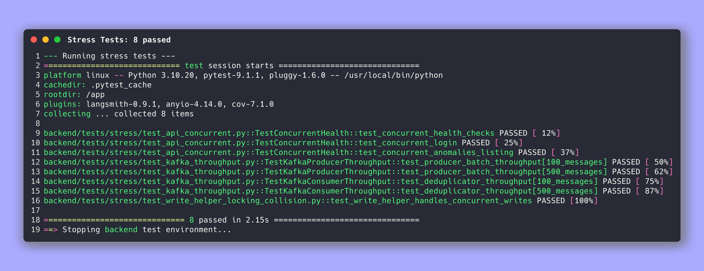

> **Stress tests** - 8 passed: concurrent health checks, login, anomalies listing, Kafka producer/consumer throughput (100 & 500 messages), write helper locking collision. Runs against the real `backend` service (not TestClient) after non-stress tests complete.

### Frontend Test Suite - 166 tests across 36 suites


> **Frontend tests** - 166 vitest tests across 36 suite files covering all 9 pages, auth flows, API client, RAG chat, theme switching, admin settings, and 10 shadcn/ui components. jsdom environment, mocked localStorage. **No flakiness.**

### End-to-End Tests - 10 Playwright tests

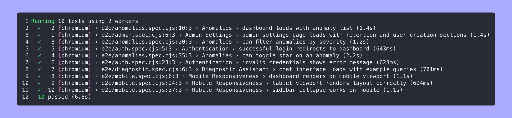

> **E2E tests** - 10 Playwright tests across 5 spec files (authentication, anomaly detection, admin settings, diagnostic assistant, mobile responsiveness). Tests the full stack: Playwright browser → Vite proxy → FastAPI backend → PostgreSQL. 2 parallel workers, Chromium only.

---

## Getting Started

### Prerequisites

- Python 3.10+ (runtime only, all services run in Docker)
- Docker + Docker Compose
- Node.js v16+ and npm (for frontend dev)

### Quick Start

```bash
git clone https://github.com/AhmedIkram05/laad.git
cd laad
cp .env.example .env
make all                           # Start ALL services (frontend + backend)
```

Default credentials: username=`admin`, password=`admin`

**Production-like frontend deployment:** Multi-stage Docker build (Node.js builder → nginx alpine, no Node.js at runtime), all assets minified + hashed filenames, nginx reverse proxy replicates Vite's `/api/*` rewrite logic.

Services run on:

- Frontend UI: `http://localhost:5173` (nginx)
- Backend API: `http://localhost:8000` (docs at `/docs`)
- MLflow UI: `http://localhost:5001`
- PostgreSQL: `localhost:5434`

---

## Team

| Role | Member |
|---|---|
| Backend & Data Engineering Lead - DB, Ingestion Pipeline, Auth, API, Testing, Continuous Log Generator eventually extending with ML Detector, Kafka Integration, MLOps, RAG Diagnostic Assistant, AWS Infrastructure (Terraform, ECS, SageMaker, CI/CD) | **Ahmed Ikram** |
| Heuristic Anomaly Detection Logic | Martin Kelly |
| Ranking Algorithm & Analysis Router | Emmanuel Dairo, Addie Tweed |
| Frontend UI | Sarah Kelly (lead), Sam Watts, Ahmed Ikram |
| Scrum Master | Sam Watts |

Built for **NCR Atleos** as part of CS32002 Industrial Team Project, University of Dundee.

> **Contribution note:** The original submitted version included only rule-based detection and a basic single-script generator that wrote directly to the database. The Kafka message bus (producer/consumer pipeline with deduplication), 3-layer ML detection engine (XGBoost + Isolation Forest + Z-score + Signal Correlator), MLOps integration (MLflow experiment tracking, model registry with champion alias), the RAG diagnostic assistant with 4-signal confidence fusion and calibration, the comprehensive test suite (694 backend + 166 frontend + 10 E2E + 75 Terraform = 945 tests), the full API surface (30 endpoints, 6 routers), and the entire AWS infrastructure (Terraform IaC, ECS Fargate, SageMaker endpoint, CI/CD pipelines, IAM, Secrets Manager, CloudFront) were designed, implemented, and deployed by **Ahmed Ikram** as an independent post-submission extension.

---

## Related Projects

- [DevSync - Project Tracker with GitHub Integration](https://github.com/AhmedIkram05/DevSync) - full-stack cloud app with 541 automated tests (Go + React + PostgreSQL + GitHub OAuth)
- [W3C Web Logs ETL Pipeline](https://github.com/AhmedIkram05/W3C-ETL-Pipeline) - parallel Airflow ETL with Power BI analytics (Python + Airflow + PostgreSQL + Power BI)
- [StockLens FinTech App](https://github.com/AhmedIkram05/StockLens) - full-stack mobile app with OCR pipeline and ML forecasting (React Native + Python + MongoDB + MLflow)
