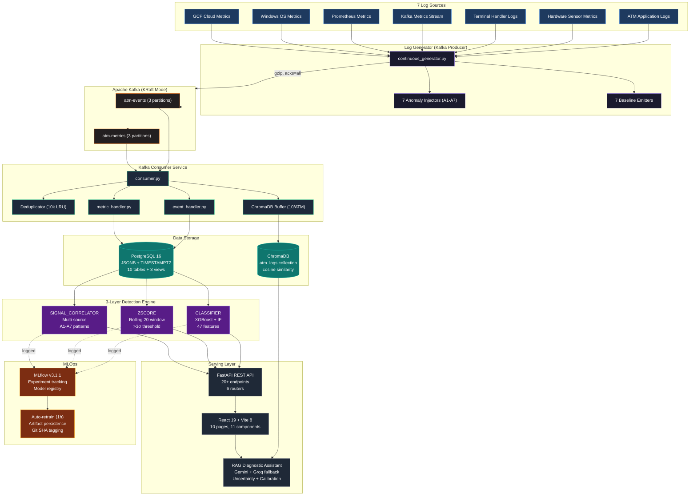
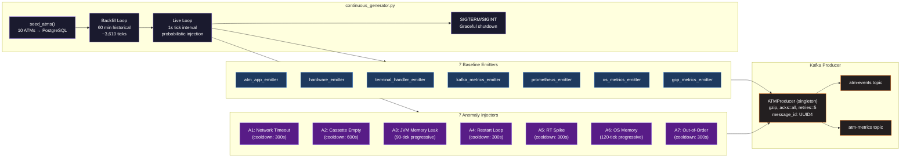
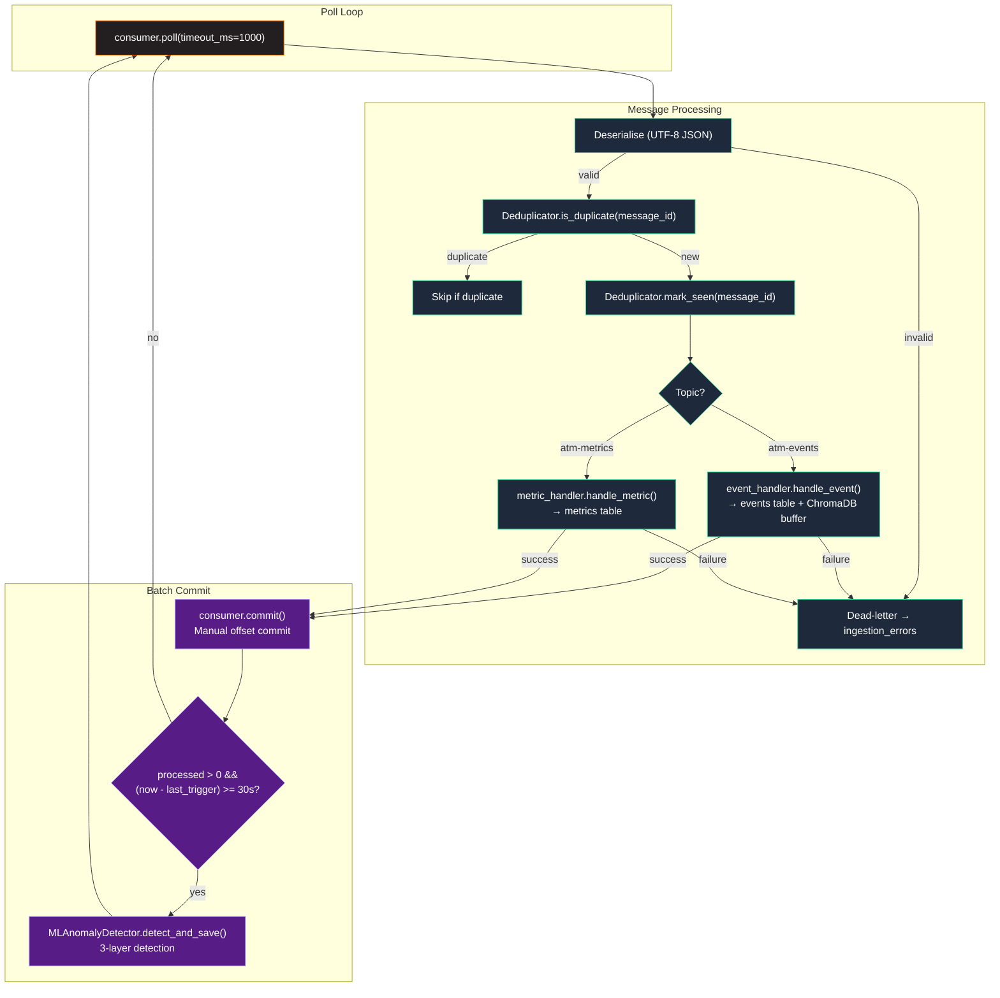
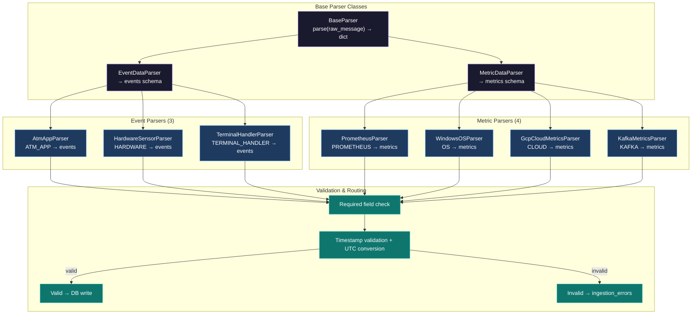
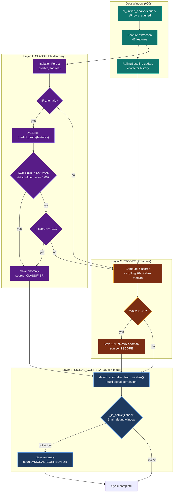
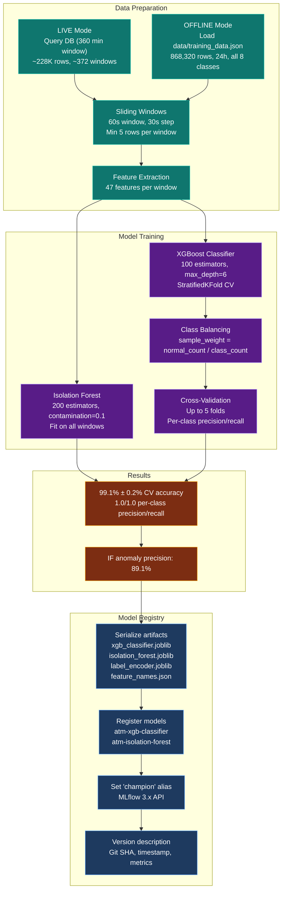
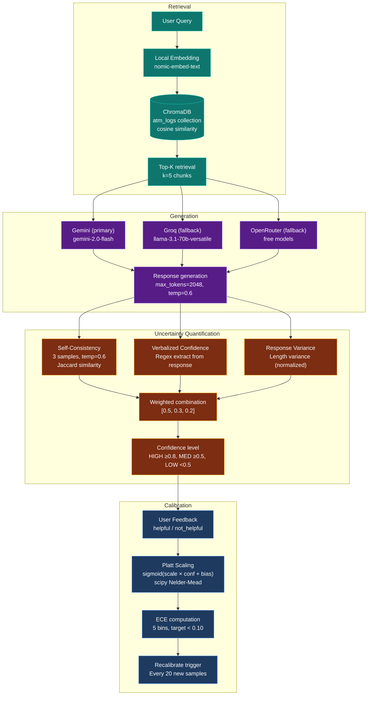
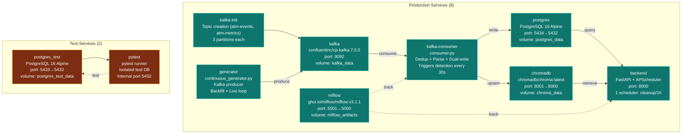

# ATM Log Aggregation, Analysis & Diagnostics Platform (LAAD)

> Production-grade ATM log aggregation, anomaly detection, and AI-assisted diagnostics platform — built for NCR Atleos as a 7-person Agile industry project. Ingests synthetic logs from 7 sources via Apache Kafka, detects 7 anomaly types across 3 detection layers (ML + statistical + heuristic), ranks by weighted criticality, and serves a React dashboard with root cause analysis, operational impact, and recommended remediation. Extended with an uncertainty-aware RAG diagnostic assistant powered by Gemini with confidence scoring and Platt scaling calibration.

<p align="center">
  
  
  
  
  
  
  
  
</p>

---

## Key Metrics at a Glance

| Metric | Value |
|---|---|
| **Log Sources** | 7 simultaneous sources (ATM_APP, HARDWARE, TERMINAL_HANDLER, KAFKA, PROMETHEUS, OS, CLOUD) |
| **ATMs Monitored** | 10 (`ATM-GB-0001` through `ATM-GB-0010`) across 10 locations |
| **Anomaly Types** | 7 known (A1–A7) + UNKNOWN (novel pattern detection) |
| **Detection Layers** | 3 (CLASSIFIER → ZSCORE → SIGNAL_CORRELATOR) |
| **ML Features** | 47 engineered features across 7 groups |
| **CV Accuracy** | **99.1% ± 0.2%** (StratifiedKFold, 8 classes) |
| **Kafka Topics** | 2 (`atm-events`, `atm-metrics`), 3 partitions each, gzip compression |
| **Messages Processed** | 190,000+ per backfill cycle, 100+ messages/sec live |
| **Database Tables** | 10 tables + 3 views + 13 indexes |
| **Connection Pool** | ThreadedConnectionPool (minconn=5, maxconn=50) with exponential backoff |
| **API Endpoints** | 20+ across 6 routers (auth, anomalies, analysis, admin, events, metrics, RAG) |
| **Test Coverage** | 281 tests across 39 files, 9 tiers, isolated test DB |
| **Docker Services** | 8 production + 2 test-only services |
| **RAG Uncertainty** | Hybrid: self-consistency (50%) + verbalized (30%) + variance (20%) |
| **Calibration** | Platt scaling, ECE < 0.10 target, 20-sample minimum |
| **MLflow Tracking** | All training runs + inference cycles logged, 2 registered models with "champion" alias |
| **Frontend Pages** | 10 pages, 11 components (React 19 + Vite 8 + Recharts) |
| **Model Training** | Manual retraining via `make retrain` (live) or `make retrain-offline` (offline dataset) |

---

## Demonstration

**[→ Project Report](https://github.com/AhmedIkram05/laad/docs/README.md/docs/Project%20Report.pdf)**

---

### Main dashboard — anomalies ranked by weighted criticality score, severity badges, and ATM status indicators


### Anomaly detail — root cause explanation, operational impact assessment, and recommended remediation action


### Admin settings — configurable data retention period (1–365 days) and user management


### RAG diagnostic assistant — AI-powered diagnostics with uncertainty quantification


---

## Problem & Solution

**The problem:** Modern ATM networks generate large volumes of operational data across multiple channels — hardware sensors, OS metrics, Kafka event streams, application logs. Banks possess this data but lack the pipeline to turn it into actionable intelligence. Operational teams manually scan logs for anomalies, engineers spend hours finding root causes, and hardware failures go undetected until ATMs go offline.

**The solution:** LAAD ingests, normalises, and analyses logs from 7 sources simultaneously, applies a 3-layer detection engine across 7 defined anomaly types (A1–A7) plus novel pattern detection (UNKNOWN), ranks issues by a weighted criticality algorithm, and presents each anomaly with a structured root cause explanation, operational impact, and recommended remediation action — no manual log analysis required. An AI-powered RAG diagnostic assistant provides natural-language troubleshooting with uncertainty quantification and confidence calibration.

---

## Architecture Overview



**Pipeline flow:** 7 log sources → continuous generator (Kafka producer) → Apache Kafka (KRaft, 2 topics, 6 partitions total, gzip) → kafka-consumer service (deduplication, parsing, dual-write to PostgreSQL + ChromaDB) → 3-layer detection engine → FastAPI REST API → React dashboard + RAG diagnostic assistant. MLOps layer tracks all training runs and inference cycles via MLflow.

---

## Log Generation

The continuous generator (`backend/generator/continuous_generator.py`) is a pure Kafka producer that simulates real-time ATM operations across a fleet of 10 ATMs. It replaced the original single-script direct-DB writer with a production-grade event-driven architecture.

### Configuration

| Parameter | Default | Description |
|---|---|---|
| `TICK_SECONDS` | 1 | Interval between emission cycles |
| `BACKFILL_MINUTES` | 60 | Historical data generated on startup |
| `ANOMALY_PROB` | 0.02 (2%) | Live anomaly injection probability |
| `BACKFILL_ANOMALY_PROB` | 0.01 (1%) | Backfill anomaly probability |
| `ATMS` | 10 | `ATM-GB-0001` through `ATM-GB-0010` |
| `ATM_LOCATIONS` | 10 | `LOC-001` through `LOC-010` |
| `POD_NAME` | `terminal-handler-pod-0` | Kubernetes pod identifier |
| `OS_VERSION` | `Windows-Server-2019` | Simulated OS version |

### Architecture



### Key Design Decisions

- **Pure Kafka producer:** No direct database writes. The generator only produces to Kafka topics. This decouples data generation from ingestion — if the consumer falls behind, data is safely buffered in Kafka (7-day retention).
- **State-based progressive emission:** A3 (JVM Memory Leak) and A6 (OS Memory Pressure) use state machines that emit one message per tick over 90/120 ticks respectively, faithfully simulating real-time progressive degradation rather than unrealistic burst injection.
- **Anomaly cooldowns:** Each anomaly type has a cooldown period (300s–600s) to prevent overlapping injections that would corrupt detection signals.
- **Backfill mode:** On startup, generates 60 minutes of historical data (~3,610 ticks × 7 sources = ~25,000 messages) before entering live mode. Anomaly probability is halved during backfill (0.01 vs 0.02) to avoid flooding the initial window.
- **Graceful shutdown:** Handles SIGTERM/SIGINT with producer flush before exit, ensuring no in-flight messages are lost.

### Anomaly Injector Details

| Injector | Type | Mechanism | Cooldown/Duration | Messages per Injection |
|---|---|---|---|---|
| A1 | Network Timeout Cascade | `NETWORK_DISCONNECT` + Kafka `Offline` + `NETWORK_ERROR` across 3+ sources | 300s | ~6-9 messages |
| A2 | Cash Cassette Empty | `CASSETTE_EMPTY` + Kafka `OutOfService` | 600s | ~4-6 messages |
| A3 | JVM Memory Leak | Progressive `jvm_memory_used_bytes` increase over 90 ticks | 90 ticks (progressive) | 1 message/tick × 90 |
| A4 | Container Restart Loop | GCP `restart_count > 0` + Terminal Handler `STARTUP` × 2 | 300s | ~4-5 messages |
| A5 | High Response Time Spike | Kafka `response_time_ms > 3000ms` + `success_rate < 90%` | 300s | ~4-6 messages |
| A6 | OS Memory Pressure | Progressive `memory_usage_percent >= 90` + ATM_APP `TIMEOUT` over 120 ticks | 120 ticks (progressive) | 1 message/tick × 120 |
| A7 | Out-of-Order Kafka | Malformed messages with `offset = -1` and missing fields | 300s | ~3-5 messages |

---

## Kafka Integration

Apache Kafka (KRaft mode, no ZooKeeper) serves as the central message bus, decoupling log generation from ingestion. This was a major architectural extension post-submission, replacing direct DB writes with an event-driven pipeline.

### Kafka Broker Configuration

| Parameter | Value | Description |
|---|---|---|
| **Image** | `confluentinc/cp-kafka:7.5.0` | Confluent Platform Kafka |
| **Mode** | KRaft (no ZooKeeper) | Simplified deployment |
| **Log retention** | 168 hours (7 days) | Messages retained for 7 days |
| **Auto-create topics** | Enabled | Topics created on first produce |
| **Port** | `localhost:9092` (external), `9092` (internal) | Docker port mapping |

### Topic Configuration

| Topic | Partitions | Replication Factor | Message Types | Sources |
|---|---|---|---|---|
| `atm-events` | 3 | 1 | Event-type messages | ATM_APP, HARDWARE, TERMINAL_HANDLER, KAFKA |
| `atm-metrics` | 3 | 1 | Metric-type messages | PROMETHEUS, OS, CLOUD, KAFKA |

### Producer Configuration (`backend/kafka/producer.py`)

Thread-safe singleton `ATMProducer` wrapping `kafka.KafkaProducer`:

| Parameter | Value | Rationale |
|---|---|---|
| `acks` | `all` | All ISR replicas must acknowledge — zero data loss |
| `retries` | 5 | Retry on transient broker errors |
| `retry_backoff_ms` | 200 | Backoff between retries |
| `compression_type` | `gzip` | Reduce network bandwidth (~60% compression ratio) |
| `linger_ms` | 10 | Batch messages for 10ms before sending — improves throughput |
| `batch_size` | 16384 (16KB) | Default batch size |
| `max_block_ms` | 60000 | Max time to block on full buffer |

**Message format:** Every message includes `message_id` (UUID4) for deduplication, `timestamp` (ISO 8601 UTC), `source`, and source-specific fields. The producer converts `datetime` objects to ISO strings automatically.

### Consumer Configuration (`backend/kafka/consumer.py`)

| Parameter | Value | Rationale |
|---|---|---|
| `group_id` | `atm-platform-consumer` | Single consumer group for at-least-once delivery |
| `auto_offset_reset` | `earliest` | Process all messages from beginning on first start |
| `enable_auto_commit` | `false` | Manual offset commit after successful batch processing |
| `max_poll_records` | 500 | Max records per poll — balances throughput vs memory |
| `session_timeout_ms` | 30,000 | Consumer considered dead after 30s without heartbeat |
| `heartbeat_interval_ms` | 10,000 | Heartbeat every 10s |
| `fetch_min_bytes` | 1 | Fetch even single messages immediately |
| `max_partition_fetch_bytes` | 10,485,760 (10MB) | Max bytes per partition per fetch |
| `poll_timeout_ms` | 1,000 | Poll timeout — responsive shutdown |

### Consumer Pipeline Flow



### Deduplication

In-memory LRU `OrderedDict` (max 10,000 entries) tracks `message_id` values. On redelivery (Kafka's at-least-once guarantee), duplicates are skipped. The LRU eviction ensures bounded memory usage — oldest entries are evicted when the set exceeds 10,000.

### Anomaly Detection Trigger

Rate-limited to every 30 seconds (configurable via `ANOMALY_TRIGGER_INTERVAL_S`). After each successful batch commit, the consumer checks if 30 seconds have elapsed since the last trigger. If so, it calls `MLAnomalyDetector.detect_and_save()` inline — this runs the full 3-layer detection cycle on the current data window.

---

## Ingestion Pipeline

The ingestion pipeline normalises raw Kafka messages into a unified schema and writes to both PostgreSQL and ChromaDB simultaneously.

### Parser Architecture



### Parser Details

| Parser | Source | Output Table | Required Fields | Key Transformations |
|---|---|---|---|---|
| `AtmAppParser` | ATM_APP | `events` | `message_id`, `timestamp`, `source`, `severity` | Log level normalisation, UTC timestamp |
| `HardwareSensorParser` | HARDWARE | `events` | `message_id`, `timestamp`, `source`, `severity` | Component mapping, metric extraction |
| `TerminalHandlerParser` | TERMINAL_HANDLER | `events` | `message_id`, `timestamp`, `source`, `severity` | Pod name, correlation ID |
| `PrometheusParser` | PROMETHEUS | `metrics` | `message_id`, `timestamp`, `source`, `entity_id`, `metric_name`, `metric_value` | Metric name parsing, float conversion |
| `WindowsOSParser` | OS | `metrics` | `message_id`, `timestamp`, `source`, `entity_id`, `metric_name`, `metric_value` | OS metric mapping |
| `GcpCloudMetricsParser` | CLOUD | `metrics` | `message_id`, `timestamp`, `source`, `entity_id`, `metric_name`, `metric_value` | Cloud metric extraction |
| `KafkaMetricsParser` | KAFKA | `metrics` | `message_id`, `timestamp`, `source`, `entity_id`, `metric_name`, `metric_value` | Kafka status mapping |

### Dead-Letter Routing

Malformed records are routed to `ingestion_errors` rather than raising exceptions. All parsers use `.get()` with safe defaults — a missing field never halts ingestion. The Kafka consumer also routes undeserialisable bytes to `ingestion_errors` via `_route_to_ingestion_errors()`.

### ChromaDB Buffer

Per-ATM event buffer (`backend/kafka/chroma_buffer.py`):

| Parameter | Value | Description |
|---|---|---|
| **Window size** | 10 events per ATM | Flushes when buffer reaches 10 |
| **Embedding model** | `nomic-embed-text` (via Ollama) | 384-dimensional embeddings |
| **Chunker** | LangChain `SemanticChunker` | Semantic boundary-based chunking |
| **Collection** | `atm_logs` | Single collection for all ATM logs |
| **Vector space** | Cosine similarity (HNSW) | Default ChromaDB HNSW index |
| **Graceful degradation** | Yes | Silently skips if ChromaDB unavailable |

Events are formatted as structured text (`format_event_text()`) before embedding. Only events with `atm_id` are added to the buffer — metrics are excluded from the vector store.

---

## Database

PostgreSQL 16 (Alpine) serves as the primary data store with a lean data lake design — unified `events` and `metrics` tables with JSONB payloads, plus dedicated tables for anomalies, users, and RAG data.

### Schema Overview

```mermaid
erDiagram
    ATMS {
        text atm_id PK
        text os_version
        text location_code
    }

    EVENTS {
        bigint id PK
        timestamptz timestamp
        text source
        text atm_id FK
        text correlation_id
        text transaction_id
        text event_type
        text severity
        text message
        jsonb payload
    }

    METRICS {
        bigint id PK
        timestamptz timestamp
        text source
        text entity_id
        text metric_name
        double precision metric_value
        jsonb payload
    }

    ANOMALIES {
        bigint id PK
        timestamptz detected_at
        text anomaly_type
        text atm_id FK
        text correlation_id
        text transaction_id
        double precision model_confidence_score
        text severity
        text title
        text explanation
        text recommended_action
        jsonb sources_involved
        int feedback_rating
        int false_positive_count
        int is_active
        int is_starred
    }

    INGESTION_ERRORS {
        bigint id PK
        timestamptz timestamp
        text source
        text error_detail
        text raw_input
    }

    USERS {
        bigint id PK
        text username UK
        text password_hash
        text role
        timestamptz created_at
    }

    RETENTION_CONFIG {
        int id PK
        int retention_days
        timestamptz updated_at
    }

    RAG_QUERIES {
        bigint id PK
        bigint user_id FK
        text query_text
        text answer_text
        double precision uncertainty_score
        timestamptz created_at
    }

    RAG_FEEDBACK {
        bigint id PK
        bigint query_id FK
        text feedback_rating
        timestamptz created_at
    }

    RAG_CALIBRATION {
        bigint id PK
        double precision scale_factor
        double precision bias_term
        double precision ece_score
        int sample_size
        timestamptz created_at
    }

    ATMS ||--o{ EVENTS : has
    ATMS ||--o{ METRICS : has
    ATMS ||--o{ ANOMALIES : has
    USERS ||--o{ RAG_QUERIES : creates
    RAG_QUERIES ||--o{ RAG_FEEDBACK : receives
```

### Tables (10)

| Table | Rows (typical) | Key Columns | Purpose |
|---|---|---|---|
| `atms` | 10 (seeded) | `atm_id` (PK), `os_version`, `location_code` | ATM fleet registry |
| `events` | 50,000+ | `timestamp` (TIMESTAMPTZ), `source`, `atm_id` (FK), `event_type`, `severity`, `payload` (JSONB) | Normalised event records |
| `metrics` | 150,000+ | `timestamp` (TIMESTAMPTZ), `source`, `entity_id`, `metric_name`, `metric_value`, `payload` (JSONB) | Normalised metric records |
| `anomalies` | 10-50 | `detected_at`, `anomaly_type`, `atm_id` (FK), `model_confidence_score`, `severity`, `explanation` (JSONB), `is_active`, `is_starred`, `false_positive_count` | Detected anomalies |
| `ingestion_errors` | 0-100 | `timestamp`, `source`, `error_detail`, `raw_input` | Dead-letter queue |
| `users` | 2+ | `username` (UK), `password_hash` (bcrypt), `role` | Authentication |
| `retention_config` | 1 | `retention_days` (default: 30) | Configurable retention |
| `rag_queries` | Variable | `user_id` (FK), `query_text`, `answer_text`, `uncertainty_score` | RAG query history |
| `rag_feedback` | Variable | `query_id` (FK), `feedback_rating` | User feedback for calibration |
| `rag_calibration` | Variable | `scale_factor`, `bias_term`, `ece_score`, `sample_size` | Platt scaling parameters |

### Views (3)

| View | Purpose | Used By |
|---|---|---|
| `v_events_flat` | JSONB payload flattened to columns | Detection engine, frontend |
| `v_metrics_flat` | JSONB payload flattened to columns | Detection engine, frontend |
| `v_unified_analysis` | `v_events_flat` UNION ALL `v_metrics_flat` | ML detector (single query) |

### Indexes (13)

| Table | Indexed Columns | Type |
|---|---|---|
| `events` | `timestamp`, `atm_id`, `source`, `event_type` | B-tree |
| `metrics` | `timestamp`, `entity_id`, `source`, `metric_name` | B-tree |
| `anomalies` | `detected_at`, `anomaly_type`, `atm_id`, `is_active` | B-tree |
| `ingestion_errors` | `timestamp`, `source` | B-tree |
| `users` | `username` | Unique |

### Connection Pool

| Parameter | Value | Description |
|---|---|---|
| **Pool type** | `ThreadedConnectionPool` | Thread-safe, suitable for FastAPI + Kafka consumer |
| **minconn** | 5 | Minimum persistent connections |
| **maxconn** | 50 | Maximum connections (handles concurrent API requests + ML detector + generator + cleanup) |
| **Retry policy** | 3 attempts, exponential backoff (100ms → 200ms) | Handles pool exhaustion, deadlocks, serialization failures |
| **Cursor type** | `RealDictCursor` | Returns rows as dicts for easy field access |
| **Batch writes** | `psycopg2.extras.execute_values` | Efficient bulk inserts |

---

## Anomaly Detection Engine

A 3-layer hybrid detection engine that combines machine learning, statistical analysis, and deterministic rule-based correlation to identify all 7 known anomaly types (A1–A7) plus novel patterns (UNKNOWN).

### Detection Layer Priority



### Layer 1: CLASSIFIER (Primary)

**Trigger:** Only active when ML models are loaded from `ml/artifacts/`.

| Component | Configuration | Purpose |
|---|---|---|
| **Isolation Forest** | 200 estimators, contamination=0.1 | Anomaly detection — flags windows with unusual feature patterns |
| **XGBoost Classifier** | 100 estimators, max_depth=6, lr=0.1, subsample=0.8, colsample_bytree=0.8 | Classification — predicts anomaly type (A1–A7 + NORMAL) |
| **Label Encoder** | 8 classes (A1–A7 + NORMAL) | Maps class indices to labels |
| **Confidence threshold** | 0.60 | Minimum XGBoost confidence for known anomaly classification |
| **UNKNOWN threshold** | IF score ≤ -0.1 (env: `ML_UNKNOWN_THRESHOLD`) | Isolation Forest score below which UNKNOWN anomaly is created |

**Decision logic:**

1. Isolation Forest flags window as anomalous (`predict == -1`)
2. XGBoost predicts class with probability distribution
3. If `class != NORMAL` and `confidence >= 0.60` → save as known anomaly (A1–A7)
4. If `class == NORMAL` but `IF score <= -0.1` → save as UNKNOWN anomaly (novel pattern)

### Layer 2: ZSCORE (Proactive)

**Trigger:** Always active, independent of ML models.

| Parameter | Value | Description |
|---|---|---|
| **Window size** | 20 feature vectors | Rolling history for baseline computation |
| **Threshold** | 3.0σ | Features deviating >3σ from rolling median are flagged |
| **Ready minimum** | 5 vectors | Baseline requires at least 5 vectors before computing Z-scores |
| **Confidence** | `min(max|z| / 5.0, 1.0)` | Scaled from max Z-score |

**Decision logic:**

1. Compute per-feature Z-scores: `z_i = (x_i - median_i) / std_i`
2. If `max|z| > 3.0` → save UNKNOWN anomaly with confidence based on deviation magnitude
3. Detects distribution shift / data drift even when CLASSIFIER models are not loaded

### Layer 3: SIGNAL_CORRELATOR (Fallback)

**Trigger:** Always active (enabled by default via `ML_SIGNAL_CORRELATOR_ENABLED=true`).

Uses deterministic multi-signal correlation (`detect_anomalies_from_window()`) to detect A1–A7 patterns by cross-referencing signals across all 7 data sources. This is the final safety net — catches anomalies that both ML layers miss.

### Deduplication

| Mechanism | Window | Purpose |
|---|---|---|
| `_is_active()` | 5 minutes | Prevents duplicate writes when the kafka-consumer (30s trigger) fires on the same incident window |
| Query | `SELECT 1 FROM anomalies WHERE anomaly_type = ? AND atm_id = ? AND is_active = 1 AND detected_at >= now() - 5min` | Returns true if active anomaly of same type+atm_id exists |

### Entity Attribution

The `_attribution_for()` method assigns the correct entity per anomaly type:

| Anomaly Types | Attribution Target | Source |
|---|---|---|
| A1, A2, A5, A6 | `atm_id` | Most frequent ATM in window |
| A3, A4 | `pod_name` / `entity_id` | Parsed from JSONB payload |
| A7 | `pod_name` / `entity_id` | Parsed from JSONB payload |
| UNKNOWN | Mode of ATMs in window | Fallback |

### 47 ML Features

| Group | Count | Features |
|---|---|---|
| **Metric statistics** | 14 | JVM memory mean/rate/slope, GC pause, CPU, OS memory, Kafka RT/success rate |
| **Percentiles** | 9 | JVM p75/p95, OS p75/p95, Kafka RT p75/p90/p99, CPU p90/p99 |
| **Temporal slopes** | 5 | Memory trends, Kafka RT/success rate slopes |
| **Event counts** | 10 | ATM errors, FATAL events, STARTUP events, OOM, cassette empty/low, Kafka offline/null status, timeouts, network disconnects |
| **Severity-weighted** | 2 | FATAL-weighted sum, total error count |
| **Cross-source flags** | 7 | Multi-source errors, OOM presence, network disconnect, timeout, Kafka out-of-order, anomaly tag count, unique ATM count |

### Anomaly Detection Trigger

The `kafka-consumer` service triggers anomaly detection every 30 seconds after processing a batch of messages:

| Trigger | Location | Interval | Purpose |
|---|---|---|---|
| Kafka consumer | `consumer.py` `_trigger_anomaly_detection()` | 30s post-batch | Real-time detection as data arrives |

The 5-minute dedup window in `_is_active()` prevents duplicate writes within the same detection cycle.

---

## ML Training & MLOps

### Training Pipeline



### Training Configuration

| Parameter | Value | Description |
|---|---|---|
| **Window size** | 60 seconds | Each training window covers 60s of data |
| **Step size** | 30 seconds | Windows slide by 30s (50% overlap) |
| **Query window** | 360 minutes (6 hours) | LIVE mode queries last 6 hours of data |
| **Min rows per window** | 5 | Windows with fewer rows are skipped |
| **CV folds** | Up to 5 (StratifiedKFold) | Capped by minimum class count |
| **Class balancing** | `sample_weight = normal_count / class_count` | Addresses class imbalance |

### XGBoost Hyperparameters

| Hyperparameter | Value | Rationale |
|---|---|---|
| `n_estimators` | 100 | Balanced between performance and overfitting |
| `max_depth` | 6 | Controls tree complexity — prevents overfitting on 47 features |
| `learning_rate` | 0.1 | Standard learning rate for gradient boosting |
| `subsample` | 0.8 | 80% of samples per tree — adds randomness |
| `colsample_bytree` | 0.8 | 80% of features per tree — feature subsampling |
| `random_state` | 42 | Reproducible training |
| `eval_metric` | `mlogloss` | Multi-class log loss |

### Isolation Forest Hyperparameters

| Hyperparameter | Value | Rationale |
|---|---|---|
| `n_estimators` | 200 | Sufficient trees for stable anomaly scores |
| `contamination` | 0.1 | Expected proportion of anomalies in training data |
| `random_state` | 42 | Reproducible training |

### Training Results

| Metric | Value |
|---|---|
| **Cross-validation accuracy** | **99.1% ± 0.2%** (offline dataset) |
| **Per-class precision** | 1.0 across all 8 classes (A1–A7 + NORMAL) |
| **Per-class recall** | 1.0 across all 8 classes (A1–A7 + NORMAL) |
| **Isolation Forest anomaly precision** | 89.1% |
| **Top features** | `kafka_out_of_order`, `fatal_critical_weighted_sum`, `hardware_cassette_low_count`, `kafka_rt_max/mean`, `terminal_handler_startup_count`, `container_restart_max`, `jvm_mem_rate` |

### MLOps

| Component | Details |
|---|---|
| **MLflow version** | `v3.1.1` (`ghcr.io/mlflow/mlflow:v3.1.1`) |
| **Experiment** | `atm-anomaly-detection` |
| **Backend** | SQLite (persistent on Docker volume) |
| **Port** | `localhost:5001` (external), `5000` (internal) |
| **Registered models** | `atm-xgb-classifier`, `atm-isolation-forest` |
| **Model alias** | `champion` (MLflow 3.x `set_registered_model_alias()`) |
| **Artifact persistence** | Docker bind mount: `./backend/src/anomaly_detection/ml/artifacts:/app/backend/src/anomaly_detection/ml/artifacts` |
| **Git SHA tracking** | Captured via `subprocess.check_output(["git", "rev-parse", "HEAD"])` on every training run |
| **Version descriptions** | Include git SHA, timestamp, accuracy metrics |
| **Inference logging** | All inference cycles logged to MLflow (rows processed, anomalies saved, classifier/correlator counts) |

### Auto-Retrain

| Parameter | Value |
|---|---|
| **Schedule** | On startup (if models missing or corrupted) |
| **Guard** | Skips if models are < 24 hours old |
| **Data source** | Live generator data from DB (360-min window) |
| **Persistence** | Artifacts survive container restarts (bind mount) |
| **Wipe condition** | Only on `make rebuild` (volume removal) |

### Training Commands

```bash
make retrain               # Train on live generator data (production default)
make retrain-offline       # Train on offline dataset (guaranteed all A1-A7 + NORMAL)
make generate-training-data # Generate 24h offline dataset (868,320 rows, ~260MB)
```

---

## RAG Diagnostic Assistant

An uncertainty-aware RAG system that provides AI-powered diagnostics for ATM issues using Retrieval-Augmented Generation with hybrid uncertainty quantification and Platt scaling calibration.

### Architecture



### LLM Providers

| Provider | Model | Role | Rate Limit |
|---|---|---|---|
| **Gemini** | `gemini-2.0-flash` | Primary | ~1,500 req/day (free tier) |
| **Groq** | `groq/llama-3.1-70b-versatile` | Fallback | ~30 RPM, 315 TPS |
| **OpenRouter** | Free models (e.g., `google/gemma-4-26b-a4b-it:free`) | Secondary fallback | Varies by model |

### Uncertainty Quantification

| Signal | Method | Weight | Description |
|---|---|---|---|
| **Self-Consistency** | Jaccard similarity across 3 samples | 50% | Generate 3 responses at temperature=0.6, measure semantic overlap |
| **Verbalized Confidence** | Regex extraction from response | 30% | Model outputs explicit confidence score (0-1) in text |
| **Response Variance** | Length variance (normalized) | 20% | Variance in response lengths across samples |

**Final score:** `0.5 × consistency + 0.3 × verbalized + 0.2 × (1 - normalized_variance)`

### Confidence Levels

| Level | Threshold | Action |
|---|---|---|
| **HIGH** | ≥ 0.8 | Auto-respond — 80%+ confidence in answer quality |
| **MEDIUM** | 0.5–0.8 | Verify — moderate confidence, review before presenting |
| **LOW** | < 0.5 | Escalate — route to human expert |

### Calibration System

| Parameter | Value |
|---|---|
| **Method** | Platt Scaling: `calibrated_conf = sigmoid(scale × raw_conf + bias)` |
| **Optimizer** | `scipy.optimize.minimize` (Nelder-Mead) |
| **Min samples (auto)** | 20 for initial calibration |
| **Min samples (manual)** | 10 for manual recalibration |
| **ECE bins** | 5 |
| **ECE target** | < 0.10 |
| **Recalibration trigger** | Every 20 new feedback samples |
| **Debounce** | `maybe_fit()` prevents refitting on every single feedback |

### RAG API Endpoints

| Method | Endpoint | Auth | Description |
|---|---|---|---|
| POST | `/api/rag/query` | JWT | Query with uncertainty estimation |
| POST | `/api/rag/feedback` | JWT | Submit feedback (helpful/not_helpful) |
| GET | `/api/rag/history` | JWT | Query history (paginated) |
| GET | `/api/rag/stats` | JWT | Collection chunks, calibration status, total queries |
| POST | `/api/rag/recalibrate` | Admin JWT | Manual recalibration trigger |

### Data Privacy

Log data stored in ChromaDB never leaves the network — only generated responses are sent to the LLM API. Embeddings are created locally. The LLM receives only the retrieved log context and user query, not raw ATM data.

---

## API Reference

### Authentication — `/api/auth`

| Method | Endpoint | Auth | Description |
|---|---|---|---|
| POST | `/auth/login` | None | Validate credentials (OAuth2PasswordRequestForm), issue JWT (8h expiry, HS256) |
| GET | `/auth/me` | JWT | Return current user profile |
| POST | `/auth/register` | None | Register new user account |

**Auth details:** bcrypt password hashing, 2 roles (`admin`, `user`), `require_admin` dependency guard for admin endpoints.

### Anomalies — `/api/anomalies`

| Method | Endpoint | Auth | Description |
|---|---|---|---|
| GET | `/anomalies` | JWT | Paginated, filterable list. Supports `group_by`: `atm`, `atm_anomaly`, `title_atm` |
| PATCH | `/{anomalyId}/resolve` | JWT | Toggle active/inactive |
| PATCH | `/{anomalyId}/star` | JWT | Toggle starred/unstarred |
| PATCH | `/{anomalyId}/feedback` | JWT | Submit feedback (LIKE/DISLIKE false positive tracking) |

### Analysis — `/api/analysis`

| Method | Endpoint | Auth | Description |
|---|---|---|---|
| GET | `/analysis/detailed` | JWT | Ranked anomaly list with `root_cause`, `operations`, `recommended_action`. Optional `Anomaly` query param |
| GET | `/analysis/metrics` | JWT | Time-bucketed anomaly counts + summary stats. Params: `hours`, `bucket_minutes`, `anomaly_type`, `severity`, `is_active` |

### Admin — `/api/admin`

| Method | Endpoint | Auth | Description |
|---|---|---|---|
| GET | `/admin/retention` | Admin JWT | Get current retention period |
| PUT | `/admin/retention` | Admin JWT | Set retention period (1–365 days) |
| POST | `/admin/cleanup/run` | Admin JWT | Manually trigger retention cleanup (batched DELETE 5,000/batch + VACUUM) |

### RAG — `/api/rag`

| Method | Endpoint | Auth | Description |
|---|---|---|---|
| POST | `/api/rag/query` | JWT | Query with uncertainty estimation |
| POST | `/api/rag/feedback` | JWT | Submit feedback |
| GET | `/api/rag/history` | JWT | Query history (paginated) |
| GET | `/api/rag/stats` | JWT | System statistics |
| POST | `/api/rag/recalibrate` | Admin JWT | Trigger recalibration |

### Health

| Method | Endpoint | Auth | Description |
|---|---|---|---|
| GET | `/health` | None | Server health check |
| GET | `/health/ready` | None | Readiness probe (DB connectivity) |

---

## Frontend

React 19 + Vite 8 dashboard with 10 pages and 11 components.

### Pages

| Page | Route | Description |
|---|---|---|
| Dashboard | `/dashboard` | Main anomaly list with criticality ranking, severity badges, ATM status |
| Analytics | `/analytics` | Time-series charts, anomaly type distribution, metrics overview |
| Starred | `/starred` | Filtered view of starred anomalies |
| Completed | `/completed` | Filtered view of resolved anomalies |
| Anomaly Data | `/data/:anomaly_type` | Detailed view for specific anomaly type |
| Diagnostic | `/diagnostic` | RAG chat interface with uncertainty badges, stats bar, recalibrate button |
| RAG History | `/rag-history` | Query history with pagination, confidence scores |
| Login | `/login` | Authentication |
| Signup | `/signup` | Registration |
| Admin Settings | `/admin/settings` | Retention config, cleanup trigger, user management (admin only) |

### Components

| Component | Purpose |
|---|---|
| `SideNavbar` | Primary navigation with active state highlighting |
| `AnomalyCard` | Individual anomaly display with severity badge, toggle-complete, star |
| `AnomalyListPage` | Reusable list layout for starred/completed pages |
| `SearchBar` | Filter by title, type, ATM ID, severity |
| `BackButton` | Navigation helper |
| `ProtectedRoute` | Auth guard for protected pages |
| `AdminRoute` | Admin-only route guard |
| `UncertaintyBadge` | RAG confidence level display (HIGH/MEDIUM/LOW with color coding) |
| `SourceList` | Retrieved source chunks display |
| `StarIcon` | Star/unstar toggle |
| `MainLayout` | Layout wrapper with sidebar |

### Libraries

| Library | Version | Purpose |
|---|---|---|
| `react` | 19.2.4 | UI framework |
| `react-router-dom` | 7.13.2 | Client-side routing |
| `recharts` | 3.8.1 | Time-series charts, bar charts |
| `lucide-react` | 1.7.0 | Icon set |
| `react-icons` | 5.6.0 | Additional icons |
| `vite` | 8.0.1 | Build tool, dev server |

---

## Testing

Full test suite running in Docker with an isolated test database (`atm_platform_test` on port 5433).

```bash
make pytest        # runs all tests in Docker with isolated test DB
```

### Test Tiers

| Tier | Coverage |
|---|---|
| **Unit — parsers** | Field mapping, log level normalisation, UTC timestamp conversion for all 7 sources |
| **Unit — database** | Table structure, indexes, FK constraints, WAL, JSONB |
| **Unit — utilities** | Retry/backoff resilience, retention cleanup |
| **Unit — generators** | Kafka producer calls, `_anomaly_tag` presence, correlation ID per cascade, durations, no psycopg2 imports, A3/A6 progressive state across calls |
| **Unit — Kafka** | Deduplicator LRU eviction, producer serialization, event/metric handler validation + dead-letter routing, ChromaDB buffer flush + graceful degradation, consumer deserialisation + routing |
| **Integration** | End-to-end ingestion, API responses, data writes, `_anomaly_tag` round-trip, emit_tick via Kafka producer |
| **Concurrency & stress** | 50 concurrent write threads, lock collision recovery, concurrent emit_tick calls |
| **Security & auth** | Login, JWT, `require_admin` guard, privilege escalation |
| **Anomaly detector** | Rule-based detection across A1–A7 with correct source assignment, 5-min dedup window |
| **ML detector** | Model loading, inference cycle, CLASSIFIER/ZSCORE/SIGNAL_CORRELATOR layers, 47 features, dedup window |
| **RAG** | Config validation, LLM client fallback routing, retriever chunk retrieval, uncertainty scoring, calibration fitting, pipeline end-to-end |

### Test Statistics

| Metric | Value |
|---|---|
| **Total tests** | 281 |
| **Test files** | 39 |
| **Test database** | Isolated (`atm_platform_test`, port 5433) |
| **Test runner** | pytest via `make pytest` |
| **ML tests** | Mock `mlflow` at module level via `pytest.fixture(autouse=True)` |
| **Excluded from CI** | `test_kafka_producer.py` (requires live Kafka) |

### Critical Defects Caught by the Test Suite

| Defect | Test | Resolution |
|---|---|---|
| Silent data loss under concurrent load | `stress/test_write_helper_locking_collision.py` | Exponential backoff added to `write_helper.py` |
| Unresolved anomalies deleted by cleanup | `test_cleanup.py` | Cleanup filtered to `is_active = 1` only |
| JWT privilege escalation (admin endpoint accessible by standard users) | `test_auth_security.py` | `require_admin` dependency guard added |
| Parser crashes on schema drift (strict dict access) | `test_kafka_metrics_parser.py`, `test_prometheus_parser.py` | All parsers migrated to `.get()` with safe defaults |
| Integration test always passed — no real assertions | `test_live_generator_integration.py` | Changed to `count_after > count_before` before/after pattern |
| Connection pool exhausted under ML detector load | (runtime) | Pool bumped to `maxconn=50`, `minconn=5` |
| Analysis endpoint 500 on `None` comparison | (runtime) | Added `or 0` guard on `frac_increase` in `analysis.py` |
| Generator wrote directly to DB (violated Kafka-only pipeline) | `test_live_generator_emitters.py` | Emitters refactored to use Kafka producer; no psycopg2 imports remain |
| Duplicate anomaly writes from concurrent detection | `test_ml_detector.py` | Removed APScheduler; anomaly detection now only via Kafka consumer; 5-minute dedup window in `_is_active()` |
| A3/A6 anomaly injection burst behavior unrealistic | (design decision) | State-based progressive emission: one message per tick over 90/120 ticks |

---

## Design Decisions

**Unified events + metrics schema (lean data lake)**
Rather than source-specific tables, all normalised records land in two unified tables: `events` and `metrics`. Detection queries one consistent schema regardless of source. Adding a new log source requires only a new parser — not schema changes or detector modifications. This directly implements NFR7 (extensibility without core pipeline modification).

**Kafka message bus — producer/consumer pipeline**
The generator is a pure Kafka producer — it no longer writes directly to the database. A `kafka-consumer` service reads from `atm-events` and `atm-metrics` topics and writes to both PostgreSQL and ChromaDB in the same consume loop. This decoupling means the generator is completely decoupled from the database — if the consumer falls behind, no data is lost (it lives in Kafka). The two-topic design (events vs metrics) mirrors the existing `events`/`metrics` table split, making the consumer routing straightforward.

**Dead-letter routing — no silent data loss**
Malformed records are routed to `ingestion_errors` rather than raising exceptions. Parsers use `.get()` with safe defaults throughout — a missing field in a Kafka stream never halts ingestion for that source. The Kafka consumer also routes undeserialisable bytes to `ingestion_errors` via `_route_to_ingestion_errors()`.

**At-least-once delivery with in-process deduplication**
Kafka provides at-least-once delivery by default. The consumer uses an in-memory LRU set (10,000 `message_id` entries) to skip duplicates on redelivery. If the consumer restarts, the LRU set is reset — duplicates are possible immediately after restart, which is acceptable for at-least-once delivery.

**PostgreSQL + ThreadedConnectionPool + retry-with-backoff**
Batch writes use `psycopg2.extras.execute_values` with a `ThreadedConnectionPool` (minconn=5, maxconn=50). The `write_helper.py` implements retry/backoff for transient errors (deadlocks, serialization failures, pool exhaustion). SQL uses `%s` parameter placeholders throughout.

**Data retention preserving unresolved anomalies**
Cleanup filters on `is_active = 1` only, preserving all unresolved alerts regardless of age. APScheduler runs cleanup every 1 hour automatically (only scheduler remaining after removing ML detector). Batched DELETE (5,000 rows/batch) + VACUUM for efficient space reclamation.

**3-layer anomaly detection — reactive + proactive**
CLASSIFIER (XGBoost + Isolation Forest, 47 features) runs first as the primary detector when models are loaded, detecting known A1–A7 patterns and unknown anomalies via IF threshold. ZSCORE (rolling Z-score, >3σ threshold) runs independently of models to detect novel patterns. SIGNAL_CORRELATOR (final fallback) uses deterministic multi-signal correlation for A1–A7. The Kafka consumer triggers detection every 30 seconds after processing messages. A 5-minute dedup window in `_is_active()` prevents duplicate writes within that window. The `explanation` JSONB field embeds `"source": "CLASSIFIER"|"ZSCORE"|"SIGNAL_CORRELATOR"` for frontend display.

**RAG Data Privacy**
Log data stored in ChromaDB never leaves the network — only generated responses are sent to the LLM API. Embeddings are created locally using `nomic-embed-text`. The LLM receives only the retrieved log context and user query, not raw ATM data.

---

## Anomaly Types (A1–A7)

| ID | Type | Description | Detection Logic | Severity |
|---|---|---|---|---|
| A1 | Network Timeout Cascade | ATM offline due to network failure | ATM_APP `NETWORK_DISCONNECT` + Kafka `Offline` + Terminal Handler `NETWORK_ERROR` (≥3 signals) | CRITICAL |
| A2 | Cash Cassette Empty | ATM out of service — cash cassettes exhausted | HARDWARE `CASSETTE_EMPTY` ≥1 + Kafka `OutOfService` | CRITICAL |
| A3 | JVM Memory Leak | Heap usage increasing over 90 min | Prometheus `jvm_memory_used_bytes` monotonically rising ≥50% over window | MAJOR |
| A4 | Container Restart Loop | Pod instability from repeated restarts | GCP `restart_count > 0` + Terminal Handler `STARTUP` ≥ 2 events | MAJOR |
| A5 | High Response Time Spike | Transaction latency and success rate degradation | Kafka `response_time_ms > 3000ms` + `success_rate < 90%` (≥2 spikes) | MAJOR |
| A6 | OS Memory Pressure | OS resource exhaustion causing application timeouts | OS `memory_usage_percent >= 90` + ATM_APP `TIMEOUT` | MAJOR |
| A7 | Out-of-Order Kafka | Malformed or missing fields in event stream | Kafka `offset = -1` or ingestion errors correlated across sources | HIGH |
| UNKNOWN | Novel Pattern | Unrecognised anomaly not matching A1–A7 | Isolation Forest score ≤ threshold OR Z-score >3σ deviation | HIGH |

---

## Requirements

### Functional Requirements

| ID | Requirement | Status |
|---|---|---|
| FR1 | Ingest logs of different formats | ✅ Met |
| FR2 | Support both log-file and event stream sources | ✅ Met |
| FR3 | Normalise different log data into a unified format | ✅ Met |
| FR4 | Save all normalised records to a database | ✅ Met |
| FR5 | Automatically detect anomalies in ingested data | ✅ Met |
| FR6 | Report anomalies via dashboard interface | ✅ Met |
| FR7 | Display which ATMs are non-functional or have warnings | ✅ Met |
| FR8 | Generate probable root cause for detected anomalies | ✅ Met |
| FR9 | Identify anomalous patterns across different channels | ✅ Met |
| FR10 | Use patterns to predict potential future anomalies | ✅ Met |
| FR11 | Display recommended next actions for anomalies | ✅ Met |
| FR12 | Allow filtering by specific ATM-IDs | ✅ Met |
| FR13 | Configurable data retention period | ✅ Met |

### Non-Functional Requirements

| ID | Requirement | Implementation |
|---|---|---|
| NFR1 | Role-based access control (user / admin) | JWT + `require_admin` dependency guard |
| NFR2 | Handle malformed records without crashing | Dead-letter routing to `ingestion_errors` |
| NFR3 | Concurrent ingestion without data loss | WAL + retry-with-backoff in `write_helper.py` |
| NFR4 | Preserve unresolved anomalies regardless of retention | `is_active = 1` filter in cleanup |
| NFR5 | Usable by both technical and non-technical users | Confirmed by user evaluation (3 participants) |
| NFR6 | Well-commented, version-controlled, maintainable code | Full source on GitHub with modular structure |
| NFR7 | Extensible — new log types without core pipeline changes | Unified schema + parser-per-source pattern |

---

## Docker Service Topology



### Service Ports

| Service | External Port | Internal Port | Purpose |
|---|---|---|---|
| PostgreSQL | 5434 | 5432 | Primary database |
| Test PostgreSQL | 5433 | 5432 | Isolated test database |
| Kafka | 9092 | 9092 | Message broker |
| ChromaDB | 8001 | 8000 | Vector database |
| Backend API | 8000 | 8000 | FastAPI server |
| MLflow | 5001 | 5000 | Experiment tracking |

### Docker Volumes (5)

| Volume | Service | Purpose |
|---|---|---|
| `postgres_data` | postgres | Persistent database data |
| `kafka_data` | kafka | Kafka log segments |
| `chroma_data` | chromadb | ChromaDB collection data |
| `mlflow_artifacts` | mlflow | MLflow experiment data + model artifacts |
| `postgres_test_data` | postgres_test | Test database data (wiped on rebuild) |

---

## User Personas

**Steven Smith — Manager (non-technical)**
New to the role, no technical background. Needs high-level visual summaries, plain-language anomaly explanations, and clear operational impact. Drove the decision to surface recommended actions prominently on the detail view.

**Lionel Torvos — Data Analyst**
Experienced with large datasets. Needs structured, consistent log formats and cross-source correlation. Drove the unified schema design.

**John Davis — Software Engineer**
Familiar with logging systems. Needs root cause summaries, automated anomaly flagging, and trend reports. Drove the detailed analysis generation (root cause + operational impact + recommended action per anomaly type).

---

## User Evaluation

Conducted in-person with 3 participants (2 CS students, 1 Business student).

| Finding | Action taken |
|---|---|
| Filtering feature not noticed | Redesigned filter placement — more visible on dashboard |
| No back button | Back buttons added throughout |
| No way to unmark a completed anomaly | Uncheck/unmark completed functionality added |
| Anomaly ranking should incorporate time received | Time weight added to ranking algorithm |
| Logo deemed unnecessary | Logo removed |

All 3 participants rated the **recommended action** feature as most useful. All 3 found navigation intuitive. All 3 completed tasks without confusion.

---

## Getting Started

### Prerequisites

- Python 3.10+
- Node.js v16+ and npm
- Docker + Docker Compose

### 1. Clone and configure

```bash
git clone https://github.com/AhmedIkram05/laad.git
cd laad
cp .env.example .env   # edit POSTGRES_* values as needed
```

### 1a. Configure RAG (Optional - enables AI diagnostic assistant)

To enable the RAG diagnostic assistant, get a free API key from [Google AI Studio](https://aistudio.google.com/app) and add it to your `.env`:

```bash
# Add to .env file
GEMINI_API_KEY=your_google_ai_studio_api_key_here
```

The diagnostic assistant will automatically use Gemini with Groq and OpenRouter fallback for high availability.

### 2. Start all backend services

```bash
make all      # Start everything: postgres, kafka, kafka-consumer, chromadb, backend, generator, test-db, mlflow
```

Services run on:

- **Backend API:** `http://localhost:8000` (API docs at `/docs`)
- **Frontend:** `http://localhost:5173` (starts separately in terminal only, see step 3)
- **PostgreSQL:** `localhost:5434` (internal port 5432 inside containers)
- **Kafka:** `localhost:9092` (KRaft mode, no ZooKeeper)
- **ChromaDB:** `http://localhost:8001` (HTTP client, REST API)
- **Test Database:** `localhost:5433` (internal port 5432 inside containers)
- **MLflow UI:** `http://localhost:5001`

The generator seeds the ATM fleet, backfills 60 minutes of historical data via Kafka, then enters live mode with probabilistic anomaly injection. The `kafka-consumer` service writes to PostgreSQL and ChromaDB, and triggers the ML anomaly detector every 30 seconds.

### 3. Start the frontend

```bash
cd frontend
npm install
npm run dev
```

Frontend at `http://localhost:5173`

### 4. Default credentials

| Field | Value |
| --- | --- |
| Username | `admin` |
| Password | `admin` |

Seeded automatically by `init_db()` on first run.

### Other Makefile commands

```bash
make rebuild          # Clean rebuild: stop all, remove volumes, rebuild images, start all
make retrain          # Retrain ML models on live generator data (default)
make retrain-offline  # Retrain ML models on offline dataset (all A1-A7 guaranteed)
make logs             # Follow logs from all services in real-time
make clean            # Stop all containers and remove volumes (database data erased)
make pytest           # Run full test suite in Docker with isolated test DB

# Kafka-specific commands
docker compose exec kafka-consumer python -m backend.kafka.consumer  # Manually restart consumer
docker compose exec kafka kafka-topics.sh --bootstrap-server kafka:9092 --list  # List Kafka topics
```

### Reset and Restart backend services from scratch

```bash
make rebuild
```

---

## Tech Stack

| Layer | Technology | Notes |
|---|---|---|
| Backend framework | FastAPI | Lifespan context manager, dependency injection for RBAC |
| Message bus | Apache Kafka (`confluentinc/cp-kafka:7.5.0`) | KRaft mode (no ZooKeeper), 2 topics (atm-events, atm-metrics), 3 partitions each, gzip compression, acks=all, at-least-once delivery |
| Database | PostgreSQL 16 (JSONB, TIMESTAMPTZ) | `ThreadedConnectionPool` (minconn=5, maxconn=50), `execute_values` batch inserts, exponential backoff retry |
| Scheduler | APScheduler | Cleanup every 1h, auto-retrain on startup (if models missing/corrupted) |
| Log generator | Python + `kafka-python` | Backfill + live loop, SIGTERM/SIGINT handling, pure Kafka producer (no direct DB writes), 7 emitters + 7 anomaly injectors |
| Kafka consumer | Python + `kafka-python` | Manual offset commit, LRU deduplication (10k IDs), writes to PostgreSQL + ChromaDB, triggers anomaly detector every 30s |
| ChromaDB | ChromaDB HTTP client | Per-ATM 10-event buffer, SemanticChunker with `nomic-embed-text`, `atm_logs` collection on Docker named volume |
| Anomaly detection | 3-layer hybrid (CLASSIFIER + ZSCORE + SIGNAL_CORRELATOR) | XGBoost + Isolation Forest, rolling Z-score, entity-aware attribution, 47 features, git SHA tracking, auto-retrain on startup (if models missing/corrupted), inference logged to MLflow. Detection triggered by Kafka consumer every 30s with 5-min dedup window |
| MLOps | MLflow (`v3.1.1`) | Experiment tracking, run metrics, model registry with "champion" alias + version descriptions, git SHA tagging, artifact storage on Docker named volume |
| Training pipeline | `train.py` | Sliding windows (60s/30s), StratifiedKFold CV, artifact serialization to `ml/artifacts/`. LIVE mode (default, on real generator data) and OFFLINE mode (`USE_OFFLINE_DATA=true`, on `data/training_data.json` with guaranteed A1-A7) |
| Frontend | React 19 + Vite 8 | 10 pages, 11 components, Recharts for visualization, React Router for navigation |
| RAG | Gemini + Groq + OpenRouter + ChromaDB | Uncertainty-aware RAG with self-consistency sampling (50%), verbalized confidence (30%), response variance (20%), Platt scaling calibration. ChromaDB populated by Kafka consumer |
| Testing | Pytest | 281 tests across 39 files, 9 tiers, isolated test DB in Docker |

---

## Team

| Role | Member |
|---|---|
| Backend & Data Engineering Lead, DB, Ingestion Pipeline, Auth, API, Testing, Continuous Generator, ML Detector, Kafka Integration, MLOps, RAG Diagnostic Assistant | **Ahmed Ikram** |
| Anomaly Detection Logic | Martin Kelly |
| Ranking Algorithm & Analysis Router | Emmanuel Dairo, Addie Tweed |
| Frontend UI | Sarah Kelly (lead), Sam Watts, Ahmed Ikram |
| Scrum Master | Sam Watts |
| QA & Documentation | All |

> **Contribution note:** The original submitted version included only rule-based detection and a basic single-script generator that wrote directly to the database. Everything else — the Kafka message bus (producer/consumer pipeline with deduplication), the 3-layer ML detection engine (XGBoost + Isolation Forest + Z-score + Signal Correlator), MLOps integration (MLflow experiment tracking, model registry, auto-retrain), the RAG diagnostic assistant with uncertainty quantification and calibration, the comprehensive test suite (281 tests), the React dashboard extensions, and the full API surface — was designed, implemented, and tested by **Ahmed Ikram** post-submission as an independent extension of the platform.

Built for **NCR Atleos** as part of CS32002 Industrial Team Project, University of Dundee.

---

## Related

- [DevSync — Project Tracker with GitHub Integration](https://github.com/AhmedIkram05/DevSync) — full-stack cloud app with 541 automated tests
- [W3C Web Logs ETL Pipeline](https://github.com/AhmedIkram05/W3C-ETL-Pipeline) — parallel Airflow ETL with Power BI analytics
- [StockLens FinTech App](https://github.com/AhmedIkram05/StockLens) — full-stack mobile app with OCR pipeline and ML forecasting
