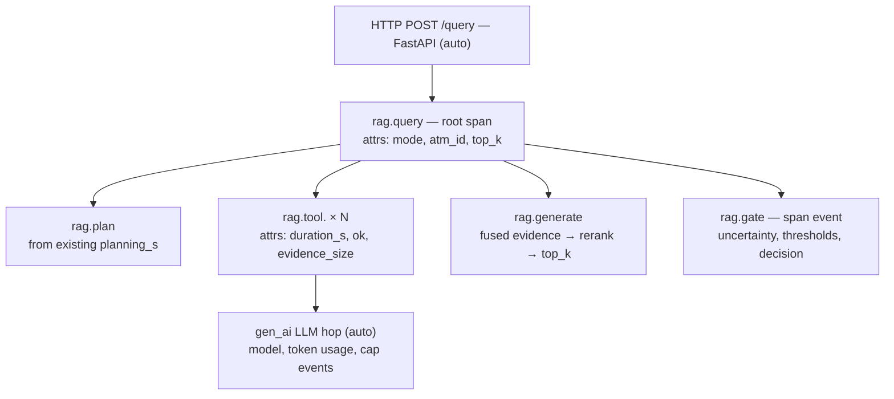
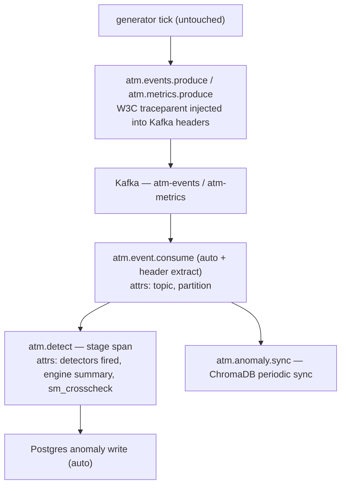

# Observability Plan — OpenTelemetry across the LAAD Platform

**Status**: Draft, decisions final (grilled 2026-09-15). Implementation starts after PR-116 merges, on a branch cut from fresh `main`.
**Scope**: Distributed tracing for all four Python services. Vendor-neutral, local-first, capability-only in claims.
**Related**: [CONTEXT.md](../CONTEXT.md) (glossary) · [ADR-0001](adr/0001-vendor-neutral-otel-collector.md) · [ADR-0002](adr/0002-golden-paths-only.md) · [ADR-0003](adr/0003-agenttrace-promoted-not-replaced.md)

---

## 1. Why

LAAD streams synthetic ATM telemetry through Kafka into a detection engine, and serves an agentic RAG assistant over the results. Today the only self-observability is container logging; the detection engine's "monitoring" metrics are *ingested platform data*, not telemetry *about* the services themselves. When a query is slow or an anomaly is missed, there is no way to see the path a request took across FastAPI → LangGraph tools → OpenAI → Postgres/Redis/ChromaDB, or an event's path across generator → Kafka → consumer → detection → persistence.

OpenTelemetry closes that gap once, with instrumentation that is portable by construction — the export target is configuration, not code. Phase values:

- **Per-query attribution on the RAG path**: latency split (planning / tools / generation), token spend, gate decisions — visible per query, not in aggregate.
- **End-to-end event pipeline visibility**: generator tick → broker → consumer → detection stage span → DB write, with W3C trace context carried through Kafka headers.
- **Debugging aid, honestly framed**: capability claims only, backed by screenshots. No performance or latency-improvement claims.

## 2. Assets already in place ( reused, not rebuilt )

| Asset | Where | Role in this plan |
| --- | --- | --- |
| `AgentTrace` dataclass | `backend/src/rag/agent_types.py` | Source of truth for the Query Trace's tool calls, rounds, retries |
| `run_agent_query()` | `agent.py` (single end-to-end entry) | Root span site for the RAG golden path |
| `_InstrumentedTool` wrapper | `agent.py` | Per-tool child spans at the existing `_record()` point |
| `_CapMiddleware` | `agent.py` | Cap decisions become span events |
| Computed latency split | `_build_result()` (`planning_s`, `tools_s`, `generation_s`) | Ready-made root-span attributes |
| `ATMProducer.send_event` / `send_metric` | `backend/kafka/producer.py` | Single choke point: produce spans + traceparent header injection; **generator needs no code change** |
| Consumer loop + Redis detection lock | `backend/kafka/consumer.py` | Consumption span + detect-stage span; lock ops auto-instrumented |
| MLflow | model/eval side | Boundary owner: stays untouched (see glossary) |
| CloudWatch dashboards/metric filters | ECS era, historical | Untouched; collector can rediscover them if AWS returns |

## 3. Non-goals

- **No eval/RAGAS tracing** — RAGAS judges and provider smoke clients (`run_ragas.py`, stress test) use raw OpenAI SDKs and stay out of the serving path. MLflow owns them.
- **No browser/frontend instrumentation.**
- **No rich spans outside the two golden paths** (ADR-0002). Auto-instrumentation covers everything else.
- **No new APM platforms** — Jaeger in dev; swappable later, never additive.
- **No performance/latency claims anywhere** — capability-only policy applies to CV bullets, README, and docs.
- **No [not yet] cloud exporter** — collector is in compose from day one precisely so the switch is a one-line config change when [GKE module] exists.

## 4. The two golden paths

### 4.1 Query Trace (RAG serving path)

Root span opens in `run_agent_query()` — the single entry point every query mode flows through. AgentTrace fields map 1:1 onto span attributes (ADR-0003): `mode`, `rounds`, `retries`, `retry_trigger`, per-tool `duration_s`/`ok`, the computed latency split. The OpenAI/LangChain hop is covered by an existing GenAI/LLM instrumentation library — no hand-written spans on the model call. The gate (confidence thresholds high/medium, escalation vs answer) is captured as a span event with its decision attributes.

### 4.2 Event Trace (synthetic pipeline path)

Per-message spans from produce through consume; the periodic detection sweep (interval-guarded by the Redis lock) is traced as its own linked trace rather than nested under every message. SageMaker cross-check appears as an attribute on the detect-stage span — not a separate child (stage-level granularity, [ADR-0002](adr/0002-golden-paths-only.md)).

## 5. Design decisions (grilled, final)

| Decision | Choice |
| --- | --- |
| Infra | Local-first, pluggable export: OTel **Collector** service in docker-compose; exporter target flips later (Cloud Trace when GKE lands; ADOT/X-Ray if AWS returns) — [ADR-0001](adr/0001-vendor-neutral-otel-collector.md) |
| Golden paths | **Both** (RAG query + event pipeline) |
| RAG tracing depth | **Serving path only**; RAGAS/eval untouched; the MLflow/serving boundary stays crisp |
| Trace UI (dev) | **Jaeger all-in-one** container — interview-ready view today, swapped by one exporter line later |
| Gate span granularity | **Span the stage, not the rules** — one detection stage span with summary attributes; no per-heuristic spans |
| Span content policy | IDs and counts as attributes; **no prompt/response bodies, no raw events** in spans; `atm_id` bounded and intentional |
| Tests | **Propagation round-trip** (W3C traceparent through Kafka headers via pytest) + **emit smoke** (one dev-mode RAG query → traces present) |
| Claims policy | **Capability-only** — per-query attribution backed by screenshots; no perf claims |
| Branch timing | Branch `observability/otel` cut **after PR-116 merges**, from fresh `main` |
| Timeline | Phase-ordered DoD, no dates; agentic implementation |
| Governance | CONTEXT.md + ADR-0001/0002/0003 |

## 6. Phases (each ends with: tests green, ruff clean, demoable)

### Phase 0 — Preconditions

- [ ] Confirm the DB driver + LangChain versions in `backend/requirements.txt` and pin the matching instrumentation packages (single OTel release family for all `opentelemetry-*` pins — no exporter mismatch drift).

### Phase 1 — Auto-instrumentation + collector (foundation)

- [ ] New `backend/src/observability/` (small): tracing bootstrap, log record processor appending `"trace_id=..." span_id=..."` to every log line, service.name from env.
- [ ] Instrumentors: FastAPI (with `/health` + `/readiness` excluded — probe spans are pure noise), outgoing HTTP, Redis, DB driver, GenAI/LLM hop.
- [ ] `docker-compose.yml`: add `otel-collector` (OTLP in → Jaeger out + debug logs) and `jaeger` all-in-one; wire services with env vars only.
- [ ] Sampling: parent-based always-on in dev; ratio-based reserved, documented, off until a cloud home exists.
- **DoD**: `docker compose up`, any request through FastAPI or the consumer shows a coherent trace in Jaeger, logs carry trace IDs. **Cut line**: nothing golden-path yet — this is pure plumbing.

### Phase 2 — Event Trace (pipeline golden path)

- [ ] Produce side: spans + `traceparent` header injection inside `ATMProducer.send_event`/`send_metric` (single choke point — generator code unchanged).
- [ ] Consume side: extract parent context in `run_consumer()` loop → `atm.event.consume` spans; child detect-stage span with summary attributes (`detectors`, `sm_crosscheck`, decisions); periodic sync (`_trigger_anomaly_sync`) as its own linked trace.
- **DoD**: a synthetic event visible in Jaeger from produce → consume → detection → persistence, with headers propagated end to end. **Cut line**: if stopped here, the pipeline story is complete and shippable on its own.

### Phase 3 — Query Trace (RAG golden path)

- [ ] Root span `rag.query` in `run_agent_query()`; attributes from the existing latency split + mode.
- [ ] Per-tool spans generated at the `_InstrumentedTool` recording point; cap decisions as events from `_CapMiddleware`; gate event from the confidence path.
- [ ] AgentTrace promoted, not replaced (ADR-0003) — the dataclass still feeds the API response; spans add the distributed view.
- **DoD**: one agentic-mode query in Jaeger shows the full tree: router → plan → tools × rounds → LLM hop (token usage) → generation → gate event. **Cut line**: if stopped here, gate decisions and token spend are already per-query attributable.

### Phase 4 — Tests

- [ ] `test_trace_propagation.py`: pytest round-trip — produce a message with traceparent injected, consume, assert header survives the broker and parentage is correct (kills Kafka client upgrades silently breaking propagation).
- [ ] `test_trace_emit_smoke.py`: one dev-mode RAG query against an in-memory span exporter; assert root + tool + gate spans exist and are parented. Zero extra infrastructure.
- **DoD**: both green in the existing pytest profile; no other tests touched.

### Phase 5 — Evidence + delivery

- [ ] `docs/observability.md`: what/why, quickstart commands, span-naming contract, screenshot walkthroughs.
- [ ] `docs/demos/trace-query.png`, `docs/demos/trace-event-flow.png` — real exports from the running stack.
- [ ] README observability line. CV bullets (draft, capability-only) live in §8 below.

## 7. Ops defaults (write these into docs/observability.md)

- `service.name` per service via env (atm-backend, atm-consumer, atm-mcp, atm-generator).
- Never log or span message bodies / prompt text; IDs, counts, durations, and decisions only.
- Exclude `/health`, `/readiness` from tracing.
- Jaeger UI stays dev-only; not exposed beyond the compose network.
- Debug exporter ON in dev, removable in prod config.

## 8. CV bullets (draft v0 — capability-only, targets-agnostic)

- **AI**: "Instrumented the serving path of an agentic RAG platform (planning → tool retrieval → LLM generation → confidence gate) with OpenTelemetry GenAI spans; promoted the agent's in-process execution record into distributed tracing, giving per-query attribution of latency stages, token spend, and gate decisions."
- **SWE**: "Added vendor-neutral distributed tracing across four Python services on [target GKE]: W3C trace context propagated through Kafka message headers, auto-instrumented HTTP/Redis/DB spans, OpenTelemetry Collector exporting to Jaeger, and pytest coverage of trace propagation across the broker."
- **DE** (single clause folded into the existing LAAD bullet): "…with OpenTelemetry trace correlation from synthetic event generation through Kafka consumption to anomaly persistence, for end-to-end pipeline attribution."

**Honesty rails**: no Cherry-picked latency numbers; no GKE/Cloud Trace claims until that module is actually at HEAD; MLflow = models, OTel = serving — stated as a design boundary, not a gap.

## 9. Risks / mitigations

| Risk | Mitigation |
| --- | --- |
| OTel package version churn | Pin one release family across all `opentelemetry-*` deps in Phase 0 |
| Span noise drowning the demo | Stage-level detection span ([ADR-0002](adr/0002-golden-paths-only.md)); excluded health routes |
| Kafka client upgrade silently breaking propagation | `test_trace_propagation.py` is the tripwire |
| Collector down → invisible data loss | Debug exporter + smoke test make failures loudly visible in dev |
| "Two representations of the same truth" confusion | ADR-0003 states AgentTrace is load-bearing, not legacy |
