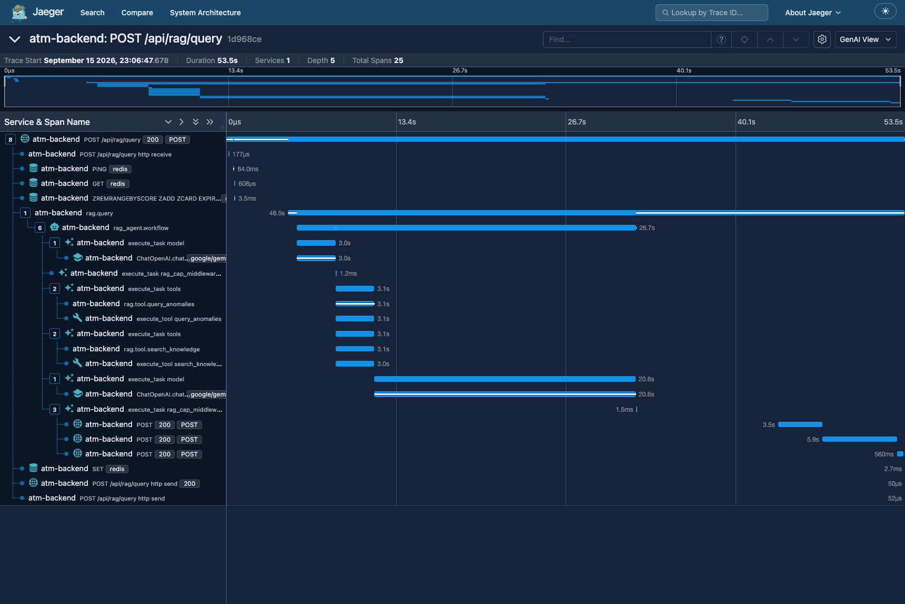
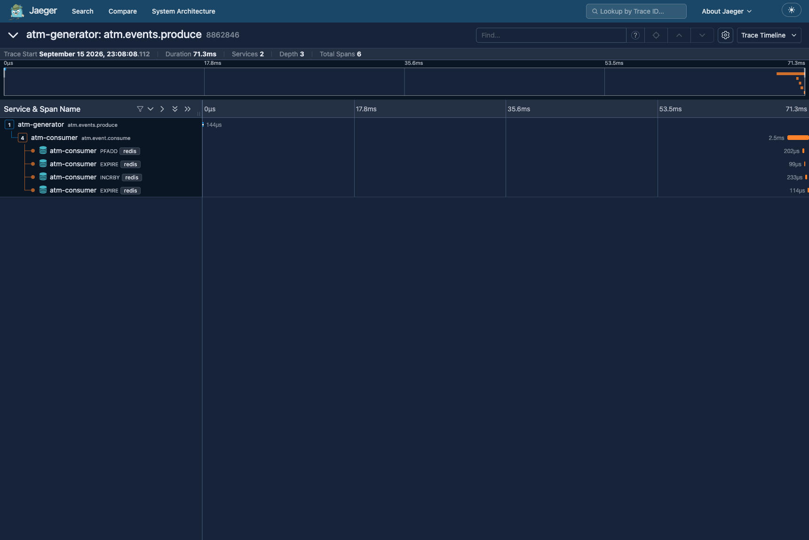
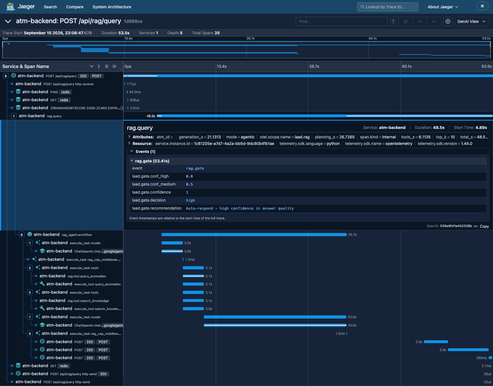

# Observability — Distributed Tracing with OpenTelemetry

LAAD streams synthetic ATM telemetry through Kafka into a detection engine and serves an agentic RAG assistant. Distributed tracing answers one question end to end: **which path did this request (or event) actually take?** — from FastAPI → LangGraph tools → the LLM → Postgres/Redis/ChromaDB on the query side, and from generator → broker → consumer → detection → persistence on the pipeline side.

Design decisions live in the [plan](observability-otel-plan.md) and [ADR-0001](adr/0001-vendor-neutral-otel-collector.md) / [ADR-0002](adr/0002-golden-paths-only.md) / [ADR-0003](adr/0003-agenttrace-promoted-not-replaced.md). In one paragraph: all four Python services emit OTLP into an OpenTelemetry Collector (docker-compose); Jaeger all-in-one consumes it as the dev-only trace UI. Hand-written spans exist on exactly **two golden paths** (RAG query, event pipeline); everything else is auto-instrumented. No prompt/response bodies or raw message payloads are ever placed in spans.

## Quickstart

1. **Boot the stack** (includes `otel-collector` and Jaeger alongside the usual services):

   ```bash
   make all   # or: docker compose up -d
   ```

2. **Mint a dev admin token** (in-container, no secrets on your host):

   ```bash
   JWT=$(docker exec laad-backend-1 python -c \
     "from backend.src.auth.auth_router import create_access_token; print(create_access_token('admin','admin'))")
   ```

3. **Fire one agentic RAG query** (the LLM is W&B Inference; expect 30–120s):

   ```bash
   curl -s -X POST http://localhost:8000/api/rag/query \
     -H "Authorization: Bearer $JWT" \
     -H "Content-Type: application/json" \
     -d '{"query":"Which ATMs are currently in a fault state and why?","mode":"agentic"}'
   ```

4. **Look at the trace**: open <http://localhost:16686> (bound to `127.0.0.1:16686`, dev-only), select service **`atm-backend`** and open the trace whose tree contains `rag.query`. The event pipeline needs no trigger — `atm-generator` produces continuously; pick a recent `atm-generator` trace that spans both `atm.events.produce` and `atm.event.consume`.

> **Jaeger v2 quirks** (2.21.0 all-in-one): the REST surface is **APIv3 only** (`/api/v3/*` — the legacy `/api/*` endpoints return 404). Trace search requires both `query.startTimeMin` and `query.startTimeMax` (400 otherwise), caps at 100 traces, and returns one **merged OTLP batch** — `result.resourceSpans[]` — not a list of trace objects; group spans by their `traceId` to reconstruct individual traces. `/api/v3/traces/{id}` returns the same OTLP shape for a single trace. The in-memory store evicts old traces quickly — look at traces soon after generating traffic.

## Span-naming contract

Treat span names as a contract (ADR-0002): stable names, no renaming without updating this table. Auto-instrumentation (FastAPI HTTP server spans, Redis, psycopg, outgoing `requests`, and the GenAI `ChatOpenAI.chat` span with token usage) covers everything not listed here.

### Golden path 1 — Query Trace (RAG serving path)

| Span / event | Kind | Where | Attributes / notes |
| --- | --- | --- | --- |
| `rag.query` | span (root) | `run_agent_query()` | `mode`, `atm_id`, `top_k`, latency split `planning_s`/`tools_s`/`generation_s`/`total_s` |
| `rag.tool.<name>` | span (child, ×N) | `_InstrumentedTool` wrapper | `duration_s`, `ok`, `chunk_size` (result size — never the text) |
| `rag.gate` | span **event** on `rag.query` | confidence fusion | `laad.gate.conf_high`, `laad.gate.conf_medium`, `laad.gate.decision`, `laad.gate.confidence`, `laad.gate.recommendation` |
| `cap.enforced` | span **event** on `rag.query` | `_CapMiddleware` | `laad.cap.model_calls`, `laad.cap.max_llm_calls`, `laad.cap.rounds` |
| `ChatOpenAI.chat` | auto span | GenAI instrumentation | model name, GenAI token usage |
| HTTP / Redis / DB | auto spans | instrumentors | `rag.query` nests under the FastAPI server span for `POST /api/rag/query` |

Span trees for both paths: [plan §4](observability-otel-plan.md#4-the-two-golden-paths) (kept there, not duplicated here).

### Golden path 2 — Event Trace (synthetic pipeline)

| Span | Kind | Where | Attributes / notes |
| --- | --- | --- | --- |
| `atm.events.produce` / `atm.metrics.produce` | span | `ATMProducer.send_event` / `send_metric` (single choke point) | W3C `traceparent` injected into Kafka headers — generator code untouched |
| `atm.event.consume` | span (child of produce, via header extract) | consumer loop | `topic`, `partition`, `offset`, `message_id` |
| `atm.detect` | span (own root, interval-guarded by the Redis detection lock) | detection sweep | `laad.detect.models_loaded`, `laad.detect.anomalies_saved`, `laad.detect.sources_fired`, `laad.detect.anomaly_types`, `laad.sm_crosscheck.ok` / `.endpoint` / `.latency_ms` |
| `atm.anomaly.sync` | span (own root, periodic) | ChromaDB anomaly sync | `laad.sync.synced`, `laad.sync.status` |
| Postgres anomaly write | auto span | psycopg instrumentation | nested while `atm.detect` is recording |

`atm.detect` and `atm.anomaly.sync` are deliberately **own-root traces**, not nested under every produce→consume chain — the sweep runs on a timer, not per message (stage-level granularity, ADR-0002).

### AgentTrace → spans (ADR-0003)

The `AgentTrace` dataclass (`backend/src/rag/agent_types.py`) is **promoted, not replaced**: it still feeds the API response and the `rag_agent_traces` table, and spans are generated from the same capture points — one representation of the distributed view, no parallel telemetry stream.

| AgentTrace field | Where it lands |
| --- | --- |
| `mode` | `rag.query` attribute `mode` |
| `tool_calls[]` (name, duration, ok) | one `rag.tool.<name>` span per call (`duration_s`, `ok`, `chunk_size`) |
| `latencies{planning_s, tools_s, generation_s, total}` | `rag.query` attributes `planning_s` / `tools_s` / `generation_s` / `total_s` |
| `model_calls` | GenAI auto spans; surfaces as `cap.enforced` event when the cap was actually enforced |
| `rounds` | still AgentTrace/API source of truth; surfaces in the `cap.enforced` event (`laad.cap.rounds`) |
| `retries`, `retry_trigger` (grounding-gated re-retrieval) | still AgentTrace/API; the retry round's time folds into `planning_s`/`tools_s` |
| confidence fusion (Gate Decision) | `rag.gate` span event with the five `laad.gate.*` attributes |

Rationale and the "do not delete AgentTrace" consequence: [ADR-0003](adr/0003-agenttrace-promoted-not-replaced.md).

## Screenshots

**Query Trace** — one agentic-mode query in Jaeger: `rag.query` root with tool children, the GenAI LLM hop (token usage), and the `rag.gate` event beside the latency-split attributes:



**Event Trace** — a cross-service pipeline trace: `atm.events.produce` in `atm-generator` joined by `atm.event.consume` in `atm-consumer` via the propagated Kafka headers:



Bonus — the **Gate Decision projection** close-up: the `rag.gate` span event expanded on the `rag.query` root, showing its five attributes (thresholds, fused confidence, decision, recommendation):



### Reading these traces

**Query Trace** (`POST /api/rag/query`, depth 5, 25 spans in the demo above). Reading top-down in the Jaeger tree:

1. The FastAPI server span `POST /api/rag/query` opens first (rounded, HTTP statuses on the left); a handful of auto spans under it are Redis cache touches (PING/GET/SET) and Postgres work around the query lifecycle.
2. `rag.query` is the hand-written root. Its **Attributes** tab carries the AgentTrace promotion: `mode=agentic`, and the latency split — in the demo, `planning_s=26.7`, `tools_s=6.1`, `generation_s=21.1`, `total_s=48.5` — so planning-vs-generation balance is readable per query without guessing.
3. Under `rag_agent.workflow`, each graph task and model call shows up: `execute_task model` → `ChatOpenAI.chat` (GenAI instrumentation; model name, token usage in attributes) and `execute_task tools` → `rag.tool.<name>` → the tool's own auto spans (HTTP/DB). LLM egress appears as nested outgoing-HTTP `POST` spans to the inference provider.
4. The **Events (1)** row on `rag.query` is the Gate Decision: expand it for the five `laad.gate.*` attributes — thresholds (0.8 high / 0.5 medium), fused confidence, the decision level, and the routing recommendation. When the LLM-call cap bites, a second event `cap.enforced` appears beside it.

**Event Trace** (2 services, 1 trace — the header-round-trip proof). Reading top-down:

1. `atm.events.produce` is the producer-side span inside `ATMProducer.send_event`; its attributes are IDs only — `topic`, `message_id`, `atm_id` — never the message body.
2. `atm.event.consume` in `atm-consumer` is a **child of the produce span by way of the W3C `traceparent` Kafka header** — that parentage in one Jaeger screen is the propagation story the round-trip test guards. Its attributes are `topic`, `partition`, `offset`, `message_id`.
3. Everything under `atm.event.consume` is the consumer's work auto-instrumented: the Redis spans shown in the demo are the dedup filter (`PFADD`), dedup-marker expiry and analytics counters (`INCRBY`, `EXPIRE`).
4. `atm.detect` and `atm.anomaly.sync` are own-root traces of the same service-style — search `atm-consumer` for them; they are interval/timer spans, not children of a message trace.

## Ops defaults & policy

- `service.name` per service via env: `atm-backend`, `atm-consumer`, `atm-mcp`, `atm-generator`.
- **Span content policy** (plan §7): IDs, counts, durations, and decisions only. `TRACELOOP_TRACE_CONTENT=false` is set in compose at the tracer level — no prompt/response bodies, no raw message payloads, ever.
- `/health` and `/health/ready` are excluded from tracing (probe spans are noise).
- Jaeger UI is **dev-only**, bound to `127.0.0.1:16686`; the collector has no host ports (traces enter on the compose network, OTLP `:4317`/`:4318`).
- Sampling: parent-based always-on in dev. Ratio-based sampling is reserved and off until a cloud home exists.
- Debug exporter (`debug`) is on in dev and removable in the production collector config.
- Traces and logs share correlation: the tracing bootstrap appends `trace_id=... span_id=...` to every log line.

## Architecture note — swapping the export target (ADR-0001)

The collector is the single export boundary: services speak OTLP into `otel-collector`, and Jaeger is just **one of its exporter targets** (defined in the collector config, not in any service). When a production home exists — Google Cloud Trace when the GKE module lands, ADOT/X-Ray if AWS returns — the switch is a config change on the collector only; service code and instrumentation never move. MLflow stays the owner of model-side telemetry (training, evaluation); OpenTelemetry owns serving-path telemetry — a design boundary, not a gap.

## Explicitly not traced

- **RAGAS / evaluation runs** (and provider smoke clients): they use raw OpenAI SDKs off the serving path and stay with **MLflow**, per the observability boundary in [CONTEXT.md](../CONTEXT.md).
- **The health server routes** (`/health`, `/health/ready`): excluded by design.
- **The generator tick itself**: hourly/scheduled production of synthetic data is not a golden path; only the produce spans inside `ATMProducer.send_event`/`send_metric` are traced.
- **Browser / frontend**: no browser instrumentation.
- Anything outside the two golden paths gets shallow auto-instrumentation only (ADR-0002) — extend the contract deliberately, via that ADR.

## If traces are missing

- **Jaeger search returns 400**: the v2 search endpoint requires both `query.startTimeMin` and `query.startTimeMax` (see quirks above); the UI's time picker covers this, raw curls don't.
- **A service exists but shows no recent traces**: the in-memory store evicts aggressively under the auto-span flood — regenerate traffic, then look within minutes.
- **Traces for everything are absent**: check `laad-otel-collector-1` logs (`docker logs laad-otel-collector-1`) — the debug exporter in dev makes a dead pipeline loud.
- **Health checks unusable**: `http://localhost:8000/health` and `/health/ready` run in compose but are deliberately untraced.
